# CNN & ResNets——一种更自由的理解

> 原文：<https://towardsdatascience.com/cnn-resnets-a-more-liberal-understanding-a0143a3ddac9?source=collection_archive---------32----------------------->

## *这个博客解释了卷积网络背后发生的事情，以及它们是如何工作的。我将使用 fastai 和 PyTorch 库。如果你想更广泛地了解 fastai cnn 的实现，可以参考文章* [*这里*](https://medium.com/analytics-vidhya/image-classification-using-fastai-5ff5b374d414) *。让我们开始吧。*


Photo by [Sven Read](https://unsplash.com/@starburst1977?utm_source=unsplash&utm_medium=referral&utm_content=creditCopyText) on [Unsplash](https://unsplash.com/s/photos/convolutional-neural-networks?utm_source=unsplash&utm_medium=referral&utm_content=creditCopyText)

## ❓如何创建一个卷积神经网络

如果你熟悉 fastai，特别是 fastai 中的计算机视觉，那么你就知道我们是如何创建卷积神经网络的。我们用来创建网络。如果想了解`create_cnn`背后的语义，可以参考介绍中分享的链接。

现在，我们有了 CNN，我们想知道 CNN 正在发生什么。幕后发生的事情如下:

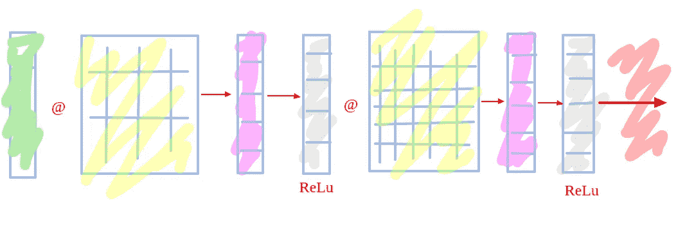

**Basic neural network**

现在，在卷积神经网络中，卷积发生，而不是矩阵乘法。卷积也是一种矩阵乘法，但它也有一些其他的磁性。让我们深入了解卷积神经网络。

*   卷积神经网络由内核组成。内核是另一个任意大小的矩阵，如 2X2、3X3、4X4 或 1X1。这个矩阵有一些数字，它们基本上定义了一个特定的特征。
*   我的意思是，第一层中的核可以滤除输入矩阵(表示图像的像素矩阵)中的顶部边缘，第二层中的核可以滤除左角，第三层中的核可以滤除对角线图案，等等。
*   现在，当输入矩阵与内核相乘时，输出被称为`Channel`。现在，我们想要多少层就有多少层。ResNet34 有 34 层以上操作。
*   因此，大体上，我们可以说，我们有许多层矩阵乘法，在每一层矩阵乘法中，我们将一个内核与输入像素矩阵相乘，在输出中得到一个通道。

> *用新手的语言，想出任何一个图像，把手电筒的光照在图像上。让光线从左上到右下穿过图像的小部分。图像的一小部分变亮的部分实际上是核心，火炬光在整个图像上运行的过程是一种卷积。*

让我们用图解法来理解上面的操作。

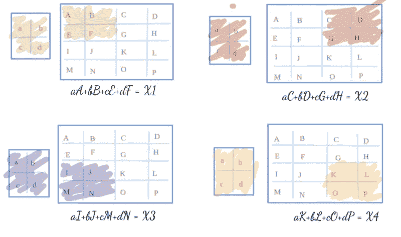

Convolution()

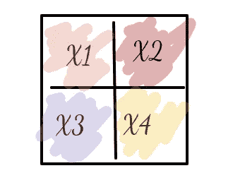

Output of convolution

形成的方程式数量如下:

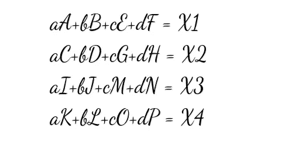

因此，输入图像被简化为一个更小的矩阵，称为表示某个特征的通道。

现在，我们可能以如下的传统神经网络方式理解它:

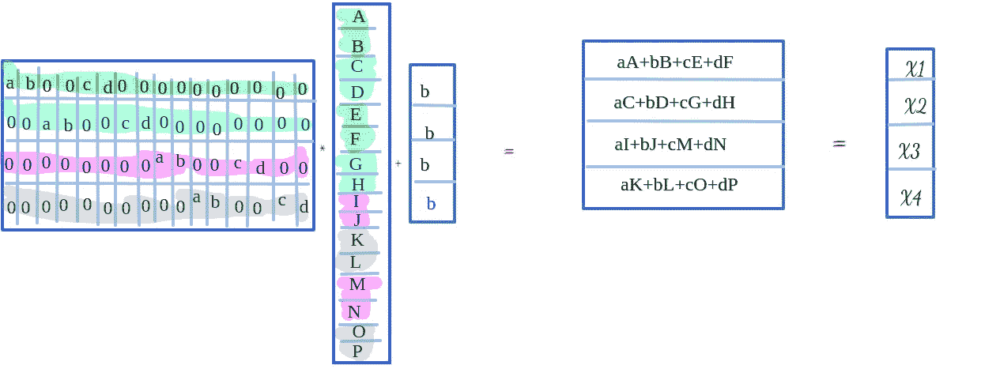

我们可以用传统的神经网络方式进行运算，但这需要大量的内存和时间。相反，我们用上面提到的另一种方式来执行它，这样会花费更少的时间和内存。

现在，让我们考虑卷积神经网络的另一种情况。如果我们的输入矩阵和内核大小相同会怎样？处理这种情况有两种选择:

*   我们可以对完整的输入矩阵进行卷积，得到秩为 1 的张量。
*   否则，我们在输入矩阵周围添加零填充或反射填充，然后卷积输入矩阵，如下所述。Fastai 尽可能频繁地使用反射填充。

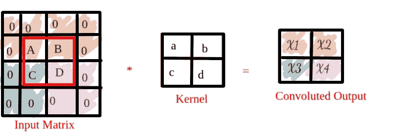

换句话说，卷积就是一个矩阵乘法，其中会发生两件事:

*   一些条目一直被设置为零
*   相同的核权重被相乘以计算不同的通道

所以当你有多个重量相同的东西时，这叫做**重量捆绑**。

这就是对卷积神经网络的大部分理论理解。现在，让我们从实用的角度来理解卷积神经网络。

*   实际上，我们有 3D 输入图像，而不是 2D 图像。每个图像具有不同的红色、绿色和蓝色像素。因此，我们没有秩 2 张量核，而是秩 3 张量核，代表红色、绿色和蓝色的不同值。因此，我们不是对 9 个事物进行逐元素的乘法运算(如果 2D 核有 9 个值)，而是对 27 个事物进行逐元素的乘法运算(3 乘 3 乘 3)，然后我们仍然要将它们相加为一个数字。
*   现在，当我们卷积图像时，我们不仅要找到顶部边缘，还要检测图像中的重复、颜色梯度等。为了涵盖所有不同的特性，我们需要越来越多的内核，这就是实际发生的情况。在每一层中，我们使用许多内核来处理图像。因此，每一层都由大量的通道组成。
*   为了避免我们的内存由于大量通道而失控，我们不时地创建一个卷积，其中我们不跨越每一个 3x3 的集合(考虑到内核的大小)，而是一次跳过两个。我们将从一个以(2，2)为中心的 3x3 开始，然后跳到(2，4)，(2，6)，(2，8)，等等。**那叫一步两回旋**。它的作用是，看起来是一样的，它仍然只是一堆内核，但我们只是一次跳过两个。我们跳过每隔一个输入像素。所以它的输出是 H/2 乘以 W/2。(*我们可以定义步长-n 卷积*

让我们看看步幅-4 卷积。

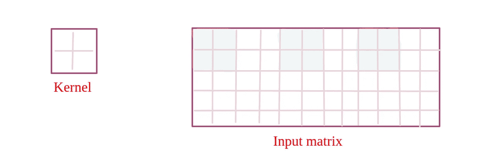

stride-4 convolution as we are shifting by 4 places.

现在，让我们评估 MNIST 数据集，并使用我们的卷积神经网络。我使用 google colab 是出于实际目的。

```
from fastai.vision import *
```

Fastai 提供学术数据集，我们可以解开并使用它。

```
path = untar_data(URLs.MNIST)
path.ls()
```

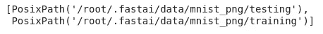

It consists of training and validation data

提取数据后，我们必须创建数据串。让我们来证明这一点。

你首先说的是你有什么样的物品清单。所以，在这种情况下，它是图像列表。那你从哪里得到的文件名列表？在这种情况下，我们有文件夹。

```
imagelist = ImageList.from_folder(path); imagelist
```

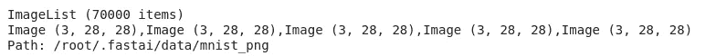

It has a total of 7000 images. Each image has three channels and is 28*28.

所以在一个条目列表里面是一个`items`属性，而`items`属性是你赋予它的那种东西。它将用于创建您的项目。在这种情况下，你给它的是一个文件名列表。这是它从文件夹里得到的。

```
imagelist.items
```

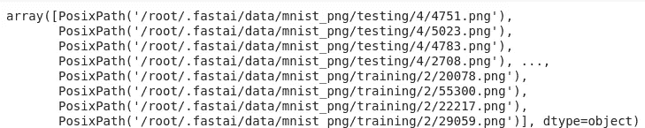

It consists of a list of images from training and testing folder

当你显示图像时，它通常以 RGB 显示。在这种情况下，我们希望使用二进制颜色图。

```
defaults.cmap='binary'
imagelist[22].show()
```

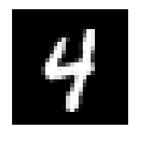

一旦你有了一个图片列表，你就可以把它分成训练和验证两部分。你几乎总是想要被认可。如果没有，可以使用`.no_split`方法创建一个空的验证集。不能完全跳过。所有这些都在 fastai [数据块 API](https://docs.fast.ai/data_block.html) 中定义。

```
splitData = imagelist.split_by_folder(train='training', valid='testing'); splitData
```

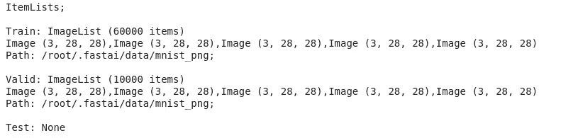

60000 items in training dataset and 10000 items in the validation dataset

顺序总是这样。首先，创建你的物品清单，然后决定如何分割。在这种情况下，我们将基于文件夹进行操作。MNIST 的验证文件夹叫做 `*testing*` *，因此我们在方法中也提到了它。*

现在，我们想要标记我们的数据，并且我们想要使用数据所在的文件夹来标记数据。

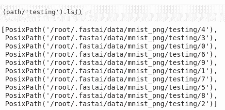

Number 4 images are present in 4 numbered folder and same for others also.

```
labelist = splitData.label_from_folder()
```

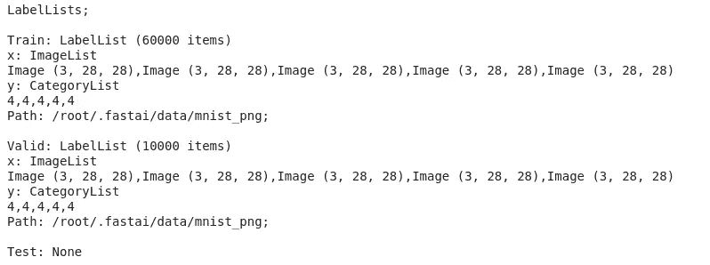

The category list is defined for the sample images in the image.

> 所以首先你要创建一个物品列表，然后分割它，再给它贴上标签。

```
x,y = labelist.train[0] or labelist.valid[0]x.show()
print(x.shape, y)
```

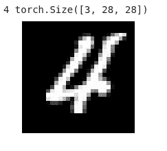

现在，添加变换。转换是数据扩充的一部分。我们为表格数据添加的过程和为图像添加的转换之间有很大的区别。

*   在训练数据上添加一次过程，并且对验证和测试数据进行相同的验证
*   每次我们需要一堆图像时，都会应用变换。

由于我们正在进行数字识别，因此我们不想对数据应用默认值，因为它包含一些我们确实不想要的转换，如垂直/水平翻转数字会改变数字，缩放文本会改变图像的像素，图像会变得模糊。因此，我们将添加我们的转换，他们毫不费力，添加随机填充和少量的裁剪。

```
tfms = ([*rand_pad(padding=3, size=28, mode='zeros')], [])
*(empty array refers to the validaion set transforms)*transformedlist = labelist.transform(tfms)
```

现在是最后一步的时候了，那就是创建数据束。这里我没有使用图像统计数据进行标准化，因为我没有使用预先训练的模型，如 ResNet34、ResNet56 等。另外，我将使用 128 的批量大小。

```
bs = 128
data = transformedlist.databunch(bs=bs).normalize()x,y = data.train_ds[0]
x.show()
print(y)
```

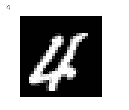

最有趣的是，训练数据集现在有了数据扩充，因为我们添加了转换。`plot_multi`是一个 fast.ai 函数，它将绘制对每个项目调用某个函数的结果。

```
def _plot(i,j,ax): data.train_ds[0][0].show(ax, cmap='gray')
plot_multi(_plot, 3, 3, figsize=(7, 7))
```

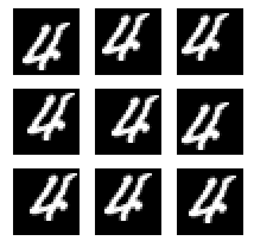

Check different padding and cropping in the images

```
xb,yb = data.one_batch()
xb.shape,yb.shape
```

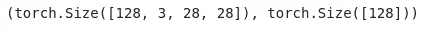

Since we selected the batch size of 128\. Thus there are 128 images.

```
data.show_batch(rows=3, figsize=(5,5))
```

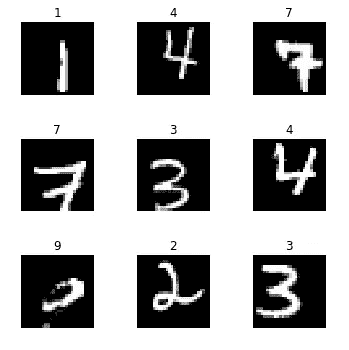

Images with the labels

现在，我们完成了数据束。现在，我们将创建学习者，并通过我们自己的 CNN 对其进行训练。

# 批量归一化的基本 CNN

```
def **conv**(ni,nf): return nn.Conv2d(ni, nf, kernel_size=3, stride=2, padding=1)model = nn.Sequential(
    conv(3, 8), ***# 14***
    nn.BatchNorm2d(8),
    nn.ReLU(),conv(8, 16), ***# 7***
    nn.BatchNorm2d(16),
    nn.ReLU(),conv(16, 32), ***# 4***
    nn.BatchNorm2d(32),
    nn.ReLU(),conv(32, 16), ***# 2***
    nn.BatchNorm2d(16),
    nn.ReLU(),conv(16, 10), ***# 1***
    nn.BatchNorm2d(10),
    Flatten()     ***# remove (1,1) grid***
)
```

让我们来理解一下上面的函数。

*   我们声明内核大小为 3 * 3。
*   我们要执行步长为 2 的卷积。
*   现在，我们想执行顺序操作，这就是为什么我们写了`nn.Sequential`。
*   模型的第一层是 conv(3，8)。`3`暗示要输入的通道数。因为我们的图像有三个输入通道，所以我们声明了这个数字。见下图。

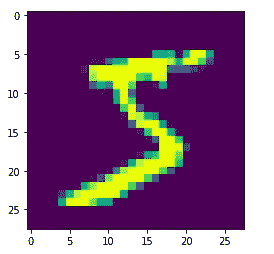

Images with 3 channels

*   `8`是输出的通道总数。正如上一节所讨论的，这个数字意味着过滤器的总数。
*   一层输出的通道数输入到下一层。我们已经提到过使用步长 2 卷积。因此，我们从 28 * 28 的图像尺寸开始。在第二层，它将变成 14 * 14，在下一层变成 7 * 7，然后变成 4 * 4，然后变成 2 * 2，最后变成 1 * 1。
*   输出将采用[128，10，1，1]的形式，这一批 128 个图像中的每个图像在输出中有 10 个 1 * 1 的通道，作为秩 3 张量。我们把它拉平，排列成一个张量。
*   在卷积层之间，我们添加了批量标准化和 ReLu 作为非线性层。

这就是全部(͡ᵔ ͜ʖ ͡ᵔ)，我们已经创建了我们的卷积神经网络。

现在是按照 fastai 中的定义创建学习者的时候了。

```
learn = Learner(data, model, loss_func = nn.CrossEntropyLoss(), metrics=accuracy)learn.summary()
```

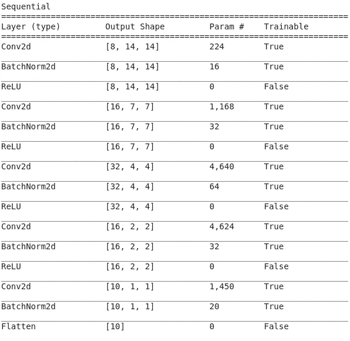

[8, 14, 14] — [channels, dimension, dimention]

```
learn.lr_find(end_lr=100)learn.recorder.plot()
```

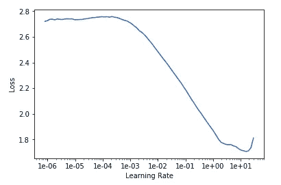

Learning rate plot

```
learn.fit_one_cycle(10, max_lr=0.1)
```

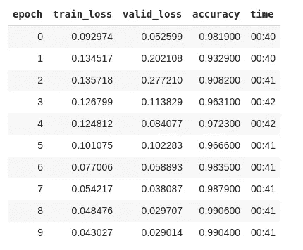

We have reached 99% accuracy

现在，让我们了解 ResNet，然后我会将它包括在我们的模型中，看看精度提高了多少。

## ❓什么是 ResNet

设 X 为输出。根据 ResNet，而不是做喜欢

`Y = conv2(conv1(X))`，

的确如此，

`Y = X + conv2(conv1(X))`——这个东西叫做身份连接或者跳过连接。

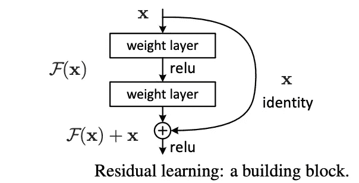

Basics of ResNet — ResBlock

ResNet 极大地改善了损失函数曲面。没有 ResNet，损失函数有很多凸起，而有了 ResNet，它就变得平滑了。

我们可以像下面这样创建 ResBock:

```
class ResBlock(nn.Module):
    def __init__(self, nf):
        super().__init__()
        self.conv1 = conv_layer(nf,nf)
        self.conv2 = conv_layer(nf,nf)

    def forward(self, x): return x + self.conv2(self.conv1(x))
```

让我们更改我们的模型，以包含 ResNet 块。让我们稍微重构一下。fast.ai 已经有了一个名为`conv_layer`的东西，可以让你创建 conv、批处理范数、ReLU 组合，而不是一直说 conv、批处理范数、ReLU。

```
def conv2(ni,nf): return conv_layer(ni,nf,stride=2)model = nn.Sequential(
    conv2(1, 8),
    res_block(8),
    conv2(8, 16),
    res_block(16),
    conv2(16, 32),
    res_block(32),
    conv2(32, 16),
    res_block(16),
    conv2(16, 10),
    Flatten()
)learn = Learner(data, model, loss_func = nn.CrossEntropyLoss(), metrics=accuracy)
learn.fit_one_cycle(12, max_lr=0.05)
```

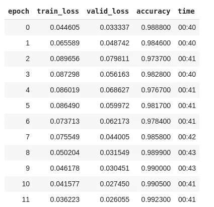

Accuracy is improved a bit to 99.23%.

仅此而已。我希望你可能已经理解了 CNN 和 ResNets 背后的逻辑。