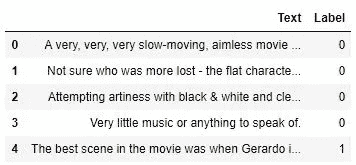
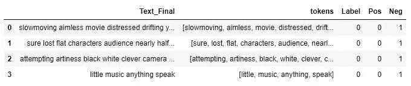
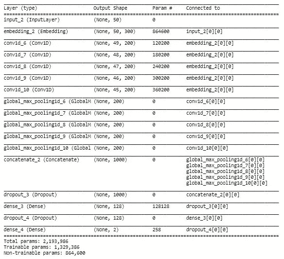

# 使用 CNN(卷积神经网络)的情感分析/文本分类

> 原文：<https://towardsdatascience.com/cnn-sentiment-analysis-1d16b7c5a0e7?source=collection_archive---------3----------------------->


文本分类有很多应用。例如，仇恨言论检测、意图分类和组织新闻文章。本文的重点是情感分析，这是一个文本分类问题。我们将 IMDB 意见分为两类，即正面和负面。

我们使用 [Python](https://www.python.org/) 和 [Jupyter Notebook](http://jupyter.org/) 来开发我们的系统，我们将使用的库包括 [Keras、](https://keras.io/) [Gensim、](https://pypi.org/project/gensim/) [Numpy、](https://numpy.org/) [Pandas](https://pandas.pydata.org/) 、 [Regex](https://docs.python.org/2/library/re.html) (re)和 [NLTK](https://www.nltk.org/) 。我们还将使用 Google News Word2Vec [型号](https://github.com/mmihaltz/word2vec-GoogleNews-vectors)。完整的代码和数据可以从[这里](https://github.com/saadarshad102/Sentiment-Analysis-CNN)下载。

## 数据探索

首先，我们看一下我们的数据。由于数据文件是制表符分隔文件(tsv ),我们将使用 pandas 来读取它，并传递参数来告诉函数分隔符是制表符，并且在我们的数据文件中没有标题。然后，我们设置数据帧的报头。

```
import pandas as pd
data = pd.read_csv('imdb_labelled.tsv', 
                   header = None, 
                   delimiter='\t')
data.columns = ['Text', 'Label']
df.head()
```



然后我们检查数据的形状

```
data.shape
```

现在我们看到了阶级分布。我们有 386 个正面和 362 个负面的例子。

```
data.Label.value_counts()
```

## 数据清理

数据清理的第一步是删除标点符号。我们只需使用正则表达式就可以了。删除标点符号后，数据将保存在同一数据框中。

```
import redef remove_punct(text):
    text_nopunct = ''
    text_nopunct = re.sub('['+string.punctuation+']', '', text)
    return text_nopunctdata['Text_Clean'] = data['Text'].apply(lambda x: remove_punct(x))
```

在下一步中，我们通过使用 NLTK 的 word_tokenize 来标记注释。如果我们传递一个字符串‘Tokenizing is easy’给 word_tokenize。输出是['标记化'，'是'，'简单']

```
from nltk import word_tokenizetokens = [word_tokenize(sen) for sen in data.Text_Clean]
```

然后我们用小写字母表示数据。

```
def lower_token(tokens): 
    return [w.lower() for w in tokens]    

lower_tokens = [lower_token(token) for token in tokens]
```

在对数据进行小写处理后，使用 NLTK 的停止字从数据中删除停止字。

```
from nltk.corpus import stopwordsstoplist = stopwords.words('english')def removeStopWords(tokens): 
    return [word for word in tokens if word not in stoplist]filtered_words = [removeStopWords(sen) for sen in lower_tokens]data['Text_Final'] = [' '.join(sen) for sen in filtered_words]
data['tokens'] = filtered_words
```

因为我们的问题是二元分类。我们需要给我们的模型传递一个二维输出向量。为此，我们在数据框中添加了两个 one hot 编码列。

```
pos = []
neg = []
for l in data.Label:
    if l == 0:
        pos.append(0)
        neg.append(1)
    elif l == 1:
        pos.append(1)
        neg.append(0)data['Pos']= pos
data['Neg']= neg

data = data[['Text_Final', 'tokens', 'Label', 'Pos', 'Neg']]
data.head()
```



## 将数据分为测试和训练

现在，我们将数据集分为训练集和测试集。我们将使用 90 %的数据进行训练，10 %的数据进行测试。我们使用随机状态，所以每次我们都得到相同的训练和测试数据。

```
data_train, data_test = train_test_split(data, 
                                         test_size=0.10, 
                                         random_state=42)
```

然后构建训练词汇，得到最大训练句子长度和总字数的训练数据。

```
all_training_words = [word for tokens in data_train["tokens"] for word in tokens]
training_sentence_lengths = [len(tokens) for tokens in data_train["tokens"]]
TRAINING_VOCAB = sorted(list(set(all_training_words)))
print("%s words total, with a vocabulary size of %s" % (len(all_training_words), len(TRAINING_VOCAB)))
print("Max sentence length is %s" % max(training_sentence_lengths))
```

然后建立测试词汇，得到测试数据中最大的测试句子长度和总字数。

```
all_test_words = [word for tokens in data_test[“tokens”] for word in tokens]
test_sentence_lengths = [len(tokens) for tokens in data_test[“tokens”]]
TEST_VOCAB = sorted(list(set(all_test_words)))
print(“%s words total, with a vocabulary size of %s” % (len(all_test_words), len(TEST_VOCAB)))
print(“Max sentence length is %s” % max(test_sentence_lengths))
```

## 正在加载 Google 新闻 Word2Vec 模型

现在我们将加载 Google News Word2Vec 模型。这一步可能需要一些时间。如果您有足够的数据量，您可以使用任何其他预先训练的单词嵌入或训练您自己的单词嵌入。

```
word2vec_path = 'GoogleNews-vectors-negative300.bin.gz'
word2vec = models.KeyedVectors.load_word2vec_format(word2vec_path, binary=True)
```

## 标记化和填充序列

每个单词被赋予一个整数，这个整数被放在一个列表中。因为所有的训练句子必须具有相同的输入形状，所以我们填充句子。

例如，如果我们有一个句子“文本如何排序和填充”。每个单词都有一个编号。我们假设 how = 1，text = 2，to = 3，sequence =4，and = 5，padding = 6，works = 7。调用 texts_to_sequences 后，我们的句子看起来会像[1，2，3，4，5，6，7 ]。现在我们假设我们的最大序列长度= 10。填充后，我们的句子将看起来像[0，0，0，1，2，3，4，5，6，7 ]

我们对测试数据也做同样的事情。欲了解完整代码[，请访问](https://github.com/saadarshad102/Sentiment-Analysis-CNN)。

```
tokenizer = Tokenizer(num_words=len(TRAINING_VOCAB), lower=True, char_level=False)
tokenizer.fit_on_texts(data_train[“Text_Final”].tolist())
training_sequences = tokenizer.texts_to_sequences(data_train[“Text_Final”].tolist())train_word_index = tokenizer.word_index
print(‘Found %s unique tokens.’ % len(train_word_index))train_cnn_data = pad_sequences(training_sequences, 
                               maxlen=MAX_SEQUENCE_LENGTH)
```

现在，我们将从 Google News Word2Vec 模型中获取嵌入内容，并根据我们分配给每个单词的序列号保存它们。如果我们不能得到嵌入，我们为这个词保存一个随机向量。

```
train_embedding_weights = np.zeros((len(train_word_index)+1, 
 EMBEDDING_DIM))for word,index in train_word_index.items():
 train_embedding_weights[index,:] = word2vec[word] if word in word2vec else np.random.rand(EMBEDDING_DIM)print(train_embedding_weights.shape)
```

## 定义 CNN

文本作为一个序列被传递给 CNN。嵌入矩阵被传递给嵌入层。五种不同的过滤器大小应用于每个评论，GlobalMaxPooling1D 层应用于每个层。所有的输出然后被连接。然后施加脱落层、致密层、脱落层和最终致密层。

model.summary()将打印所有图层的简要摘要以及输出的形状。

```
def ConvNet(embeddings, max_sequence_length, num_words, embedding_dim, labels_index):

    embedding_layer = Embedding(num_words,
                            embedding_dim,
                            weights=[embeddings],
                            input_length=max_sequence_length,
                            trainable=False)

    sequence_input = Input(shape=(max_sequence_length,), dtype='int32')
    embedded_sequences = embedding_layer(sequence_input) convs = []
    filter_sizes = [2,3,4,5,6] for filter_size in filter_sizes:
        l_conv = Conv1D(filters=200, 
                        kernel_size=filter_size, 
                        activation='relu')(embedded_sequences)
        l_pool = GlobalMaxPooling1D()(l_conv)
        convs.append(l_pool) l_merge = concatenate(convs, axis=1) x = Dropout(0.1)(l_merge)  
    x = Dense(128, activation='relu')(x)
    x = Dropout(0.2)(x)
    preds = Dense(labels_index, activation='sigmoid')(x) model = Model(sequence_input, preds)
    model.compile(loss='binary_crossentropy',
                  optimizer='adam',
                  metrics=['acc'])
    model.summary()
    return model
```

现在我们将执行该函数。

```
model = ConvNet(train_embedding_weights, 
                MAX_SEQUENCE_LENGTH, 
                len(train_word_index)+1, 
                EMBEDDING_DIM, 
                len(list(label_names)))
```



## 训练 CNN

历元数是您的模型将循环和学习的数量，批量大小是您的模型在单个时间看到的数据量。因为我们只在几个时期内对小数据集进行训练，所以模型会过度拟合。

```
num_epochs = 3
batch_size = 32
hist = model.fit(x_train, 
                 y_tr, 
                 epochs=num_epochs, 
                 validation_split=0.1, 
                 shuffle=True, 
                 batch_size=batch_size)
```

## 测试模型

哇！仅用三次迭代和一个小数据集，我们就能获得 84 %的准确率。

```
predictions = model.predict(test_cnn_data, 
                            batch_size=1024, 
                            verbose=1)
labels = [1, 0]
prediction_labels=[]
for p in predictions:
    prediction_labels.append(labels[np.argmax(p)])sum(data_test.Label==prediction_labels)/len(prediction_labels)
```