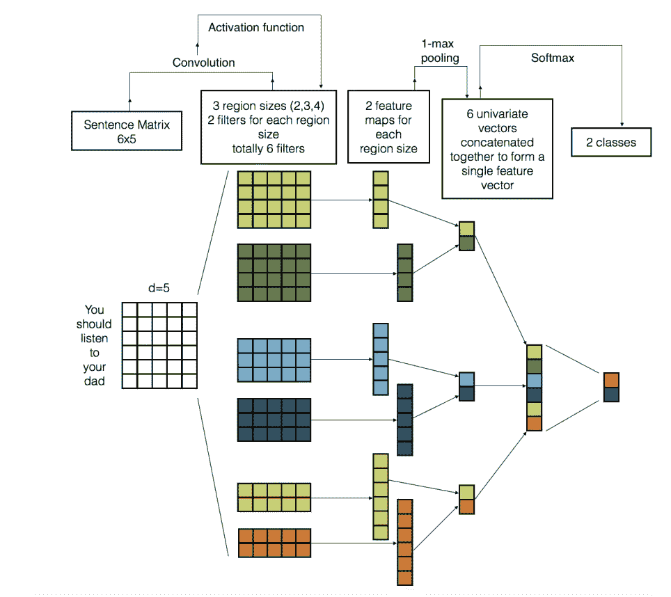
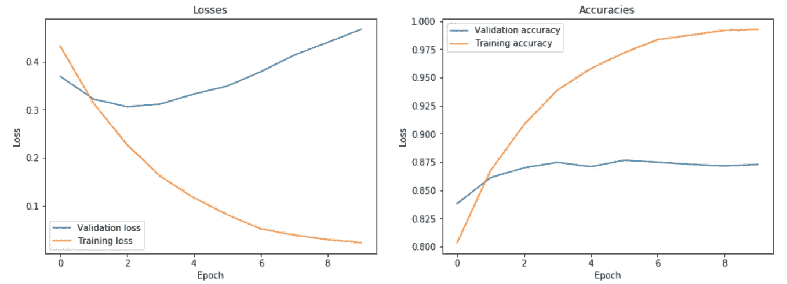
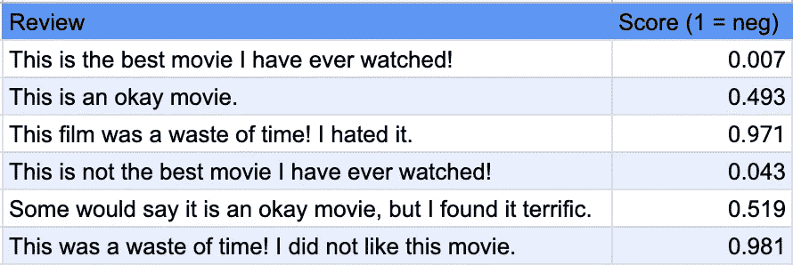

# CNN 情感分析

> 原文：<https://towardsdatascience.com/cnn-sentiment-analysis-9b1771e7cdd6?source=collection_archive---------9----------------------->

## 使用卷积神经网络分析 IMDb 数据集中的情感

卷积神经网络(CNN)构成了多个现代计算机视觉系统的主干。图像分类、目标检测、语义分割——所有这些任务都可以由 CNN 成功完成。乍一看，对自然语言处理这样不同的任务使用相同的技术似乎是违反直觉的。这篇文章是我试图用著名的 IMDb 数据集来解释这种方法背后的直觉。


Source: [https://www.analyticsvidhya.com/blog/2018/07/hands-on-sentiment-analysis-dataset-python/](https://www.analyticsvidhya.com/blog/2018/07/hands-on-sentiment-analysis-dataset-python/)

读完这篇文章后，你会:

1.  了解如何使用 [torchtext](https://torchtext.readthedocs.io/en/latest/index.html) 预处理文本
2.  理解卷积背后的思想
3.  了解如何将文本表示为图像
4.  在 PyTorch 中构建一个基本的 CNN 情感分析模型

我们开始吧！

# 数据

用于二元情感分类的 IMDb 数据集包含一组 25，000 条用于训练的高度极性电影评论和 25，000 条用于测试的高度极性电影评论。幸运的是，它是 torchtext 的一部分，所以在 PyTorch 中加载和预处理它很简单:

```
# Create an instance that turns text into tensors
TEXT = data.Field(tokenize = 'spacy', batch_first = True)
LABEL = data.LabelField(dtype = torch.float)# Load data from torchtext
train_data, test_data = datasets.IMDB.splits(TEXT, LABEL)
train_data, valid_data = train_data.split()# Select only the most important 30000 words
MAX_VOCAB_SIZE = 30_000# Build vocabulary
TEXT.build_vocab(train_data, 
                 max_size = MAX_VOCAB_SIZE, 
                 # Load pretrained embeddings
                 vectors = "glove.6B.100d", 
                 unk_init = torch.Tensor.normal_)LABEL.build_vocab(train_data)
```

`data.Field`类定义了一个数据类型以及将它转换成张量的指令。在这种情况下，我们使用 [SpaCy](https://spacy.io/api/tokenizer) tokenizer 将文本分割成单独的标记(单词)。之后，我们构建一个词汇表，这样我们就可以在以后将令牌转换成整数。词汇表是用训练数据集中的所有单词构建的。此外，我们加载预训练的[手套](https://nlp.stanford.edu/projects/glove/)嵌入，这样我们就不需要从头开始训练我们自己的单词向量。如果你想知道什么是单词嵌入，它们是一种单词表示形式，是人类理解语言和机器理解语言之间的桥梁。要了解更多信息，请阅读本文。由于我们将批量训练我们的模型，我们还将创建数据迭代器，一次输出特定数量的样本:

```
# Create PyTorch iterators to use in training
train_iterator, valid_iterator, test_iterator = data.BucketIterator.splits(
    (train_data, valid_data, test_data), 
    batch_size = BATCH_SIZE, 
    device = device)
```

BucketIterator 是 torchtext 中的一个模块，它经过专门优化，可以在为每个新时段生成新的混洗批次时，最大限度地减少所需的填充量。现在我们已经完成了文本预处理，所以是时候学习更多关于 CNN 的知识了。

# 回旋

卷积是应用于矩阵的滑动窗口函数，其实现特定的结果(例如，图像模糊、边缘检测。)滑动窗口被称为*内核、*T2 滤波器、或*特征检测器。*可视化显示了六个 3×3 核，它们将值与原始矩阵逐元素相乘，然后求和。为了获得完整的卷积，我们通过在整个矩阵上滑动滤波器来对每个元素进行卷积:

CNN 只是几层带有激活函数的卷积，就像 [ReLU](https://en.wikipedia.org/wiki/Rectifier_(neural_networks)) 一样，使得对非线性关系建模成为可能。通过应用这组点积，我们可以从图像中提取相关信息，从较浅层次的边缘开始，到在较深层次的神经网络上识别整个对象。与简单平坦化输入的传统神经网络不同，CNN 可以提取对图像数据特别有用的空间关系。但是文字呢？

# 用于 NLP 的 CNN

还记得我们上面讨论的单词嵌入吗？这就是他们发挥作用的地方。图像只是空间中的一些点，就像单词向量一样。通过用特定长度的数字向量表示每个单词，并将一堆单词堆叠在一起，我们得到了一个“图像”计算机视觉过滤器通常具有相同的宽度和高度，并在图像的局部滑动。在 NLP 中，我们通常使用滑过单词嵌入(矩阵行)的过滤器。因此，过滤器的宽度通常与单词嵌入的长度相同。高度变化，但一般从 1 到 5，对应不同的 n-gram。N-grams 只是一堆后续词。通过分析序列，我们可以更好地理解句子的意思。例如，单词“like”单独与双字组“don't like”相比具有相反的意思；后者让我们更好地理解真正的意义。在某种程度上，通过分析 n 元语法，我们正在捕捉文本中的空间关系，这使得模型更容易理解情感。下面的图像总结了我们刚刚谈到的概念:



Source: Lopez et al. (2017) Link: [https://arxiv.org/pdf/1703.03091.pdf](https://arxiv.org/pdf/1703.03091.pdf)

# PyTorch 模型

现在让我们建立一个二元 CNN 分类器。我们将我们的模型建立在内置 PyTorch nn 的基础上。模块:

```
class CNN_Text(nn.Module):
    ''' Define network architecture and forward path. '''
    def __init__(self, vocab_size, 
                 vector_size, n_filters, 
                 filter_sizes, output_dim, 
                 dropout, pad_idx):

        super().__init__()

        # Create word embeddings from the input words     
        self.embedding = nn.Embedding(vocab_size, vector_size, 
                                      padding_idx = pad_idx)

        # Specify convolutions with filters of different sizes (fs)
        self.convs = nn.ModuleList([nn.Conv2d(in_channels = 1, 
                                  out_channels = n_filters, 
                                  kernel_size = (fs, vector_size)) 
                                    for fs in filter_sizes])

        # Add a fully connected layer for final predicitons
        self.linear = nn.Linear(len(filter_sizes) \
                      * n_filters, output_dim)

        # Drop some of the nodes to increase robustness in training
        self.dropout = nn.Dropout(dropout)

    def forward(self, text):
         '''Forward path of the network.'''       
        # Get word embeddings and formt them for convolutions
        embedded = self.embedding(text).unsqueeze(1)

        # Perform convolutions and apply activation functions
        conved = [F.relu(conv(embedded)).squeeze(3) 
                  for conv in self.convs]

        # Pooling layer to reduce dimensionality    
        pooled = [F.max_pool1d(conv, conv.shape[2]).squeeze(2) 
                  for conv in conved]

        # Dropout layer
        cat = self.dropout(torch.cat(pooled, dim = 1))
        return self.linear(cat)
```

在`init`函数中，我们指定了不同的层类型:嵌入、卷积、下降和线性。所有这些层都集成到 PyTorch 中，非常易于使用。唯一棘手的部分是计算正确的维数。在线性图层的情况下，它将等于您使用的过滤器的数量(我使用 100，但您可以选择任何其他数字)乘以不同过滤器大小的数量(在我的情况下为 5。)我们可以把这个线性层的权重看作是从 500 个 n 元语法中的每一个“加权证据”。`forward`函数指定这些层的应用顺序。请注意，我们也使用最大池层。max-pooling 背后的思想是，最大值是用于确定评论情绪的“最重要”特征，这对应于通过反向传播识别“最重要”的 n 元语法。最大池对于减少网络中的参数和计算的数量也是有用的。

指定网络架构后，让我们加载之前导入的预训练手套嵌入:

```
# Initialize weights with pre-trained embeddings
model.embedding.weight.data.copy_(TEXT.vocab.vectors)# Zero the initial weights of the UNKnown and padding tokens.
UNK_IDX = TEXT.vocab.stoi[TEXT.unk_token]# The string token used as padding. Default: “<pad>”.
PAD_IDX = TEXT.vocab.stoi[TEXT.pad_token]model.embedding.weight.data[UNK_IDX] = torch.zeros(EMBEDDING_DIM)
model.embedding.weight.data[PAD_IDX] = torch.zeros(EMBEDDING_DIM)
model = model.to(device)
```

该代码块的第二部分将未知向量(词汇表中不存在的向量)和填充向量(在输入大小小于最大过滤器的高度的情况下使用)设置为零。我们现在准备训练和评估我们的模型。

您可以在本笔记本中找到完整的培训和评估代码:

Link: [https://gist.github.com/ritakurban/c9ebcbfa0be45952c99ccd199b57af3d](https://gist.github.com/ritakurban/c9ebcbfa0be45952c99ccd199b57af3d)

在训练模型之前，我们需要指定网络优化器和损失函数。Adam 和二元交叉熵是分类问题的常用选择。为了训练我们的模型，我们获得模型预测，使用损失函数计算它们的精确度，并在下一次运行之前通过网络反向传播以优化权重。我们在`model.train()`模式下执行所有这些动作。为了评估模型，不要忘记打开`model.eval()`模式，以确保我们没有用`dropout`丢弃一半的节点(虽然在训练阶段提高了健壮性，但在评估期间会有伤害)。我们也不需要在评估阶段计算梯度，这样我们就可以借助`torch.no_grad()`模式将其关闭。

在对模型进行了几个纪元的训练(使用 GPU 加速)后，我得到了以下损失和精度:



Losses and Accuracies

该图显示了过度拟合的迹象，因为训练损失和精度都在不断提高，而验证损失和精度却越来越差。为了避免使用过度拟合的模型，我们只在验证损失增加的情况下保存模型。在这种情况下，验证损失在第三个时期后最高。在训练循环中，这一部分如下所示:

```
if valid_loss < best_valid_loss:
        best_valid_loss = valid_loss
        torch.save(model.state_dict(), 'CNN-model.pt')
```

该模型在之前未见过的测试集上的表现相当不错:85.43%。最后，让我们使用 CNN-model 来预测一些极地评论的情绪。为此，我们需要编写一个函数，将用户输入符号化，并将其转换为张量。之后，我们使用刚刚训练的模型进行预测:

```
def sentiment(model, sentence, min_len = 5):
    '''Predict user-defined review sentiment.'''
    model.eval()
    tokenized = [tok.text for tok in nlp.tokenizer(sentence)]
    if len(tokenized) < min_len:
        tokenized += ['<pad>'] * (min_len - len(tokenized))
    # Map words to word embeddings
    indexed = [TEXT.vocab.stoi[t] for t in tokenized]
    tensor = torch.LongTensor(indexed).to(device)
    tensor = tensor.unsqueeze(0)
    # Get predicitons
    prediction = torch.sigmoid(model(tensor))
    return prediction.item()
```

在原始数据集中，我们有分别映射到 0 和 1 的标签“pos”和“negs”。让我们看看我们的模型在正面、负面和中性评论中的表现如何:

```
reviews = ['This is the best movie I have ever watched!', 
           'This is an okay movie', 
           'This was a waste of time! I hated this movie.']
scores = [sentiment(model, review) for review in reviews]
```

模型预测分别是 0.007，0.493，0.971，相当不错！让我们尝试一些更复杂的例子:

```
tricky_reviews = ['This is not the best movie I have ever watched!', 
           'Some would say it is an okay movie, but I found it terrific.', 
           'This was a waste of time! I did not like this movie.']
scores = [sentiment(model, review) for review in tricky_reviews]
scores
```

不幸的是，由于该模型已经在极地评论上训练过，它发现很难对棘手的陈述进行分类。例如，第一个棘手的评论得了 0.05 分，这是非常自信的“是”，尽管句子中存在否定。尝试使用不同的 n-gram，看看它们中的一些是否比其他的更重要，也许使用二元和三元模型会比我们使用的不同 n-gram 的组合表现得更好。



Table of reviews and their sentiment scores

# 结论

在这篇文章中，我们回顾了卷积的概念，并讨论了如何使用它们来处理文本。我们还学习了如何预处理来自 PyTorch 的数据集，并为情感分析建立了一个二元分类模型。尽管被狡猾的例子愚弄了，但模型表现得相当好。我希望你喜欢阅读这篇文章，如果你有任何问题，请随时联系我！

# 参考

布里茨博士(2015 年)。理解用于 NLP 的卷积神经网络。检索自:[http://www . wild ml . com/2015/11/understanding-convolutionary-neural-networks-for-NLP/](http://www.wildml.com/2015/11/understanding-convolutional-neural-networks-for-nlp/)

洛佩兹，M. M .，&卡利塔，J. (2017)。深度学习在自然语言处理中的应用。 *arXiv 预印本 arXiv:1703.03091* 。检索自:【https://arxiv.org/pdf/1703.03091.pdf 

Trevett，B. (2019)。卷积情感分析。检索自:[https://github . com/bentrevett/py torch-opinion-analysis/blob/master/4% 20-% 20 convolatile % 20 opinion % 20 analysis . ipynb](https://github.com/bentrevett/pytorch-sentiment-analysis/blob/master/4%20-%20Convolutional%20Sentiment%20Analysis.ipynb)