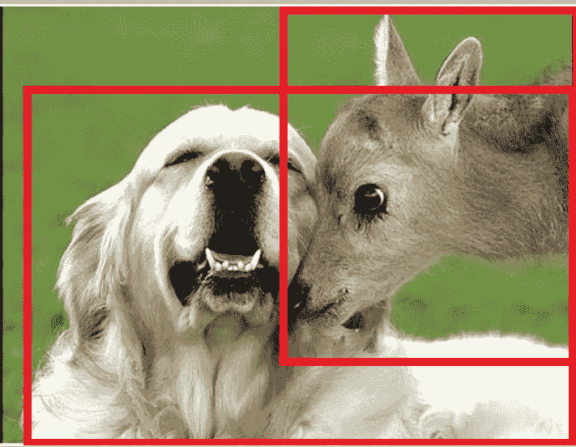
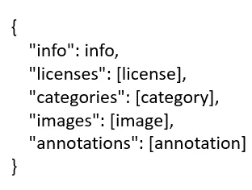
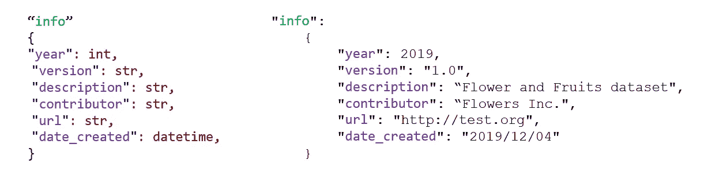
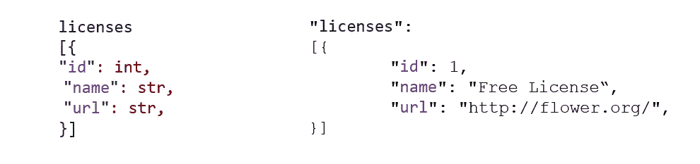
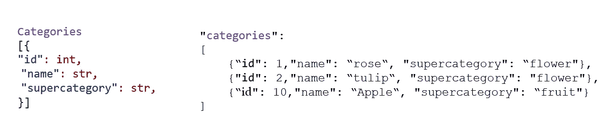
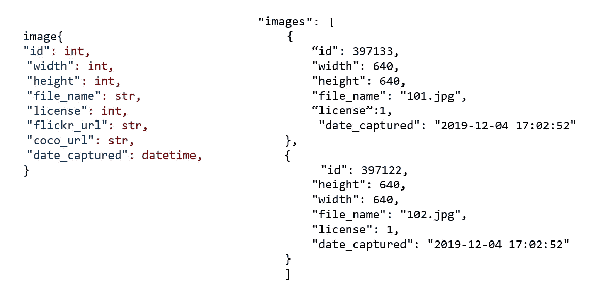
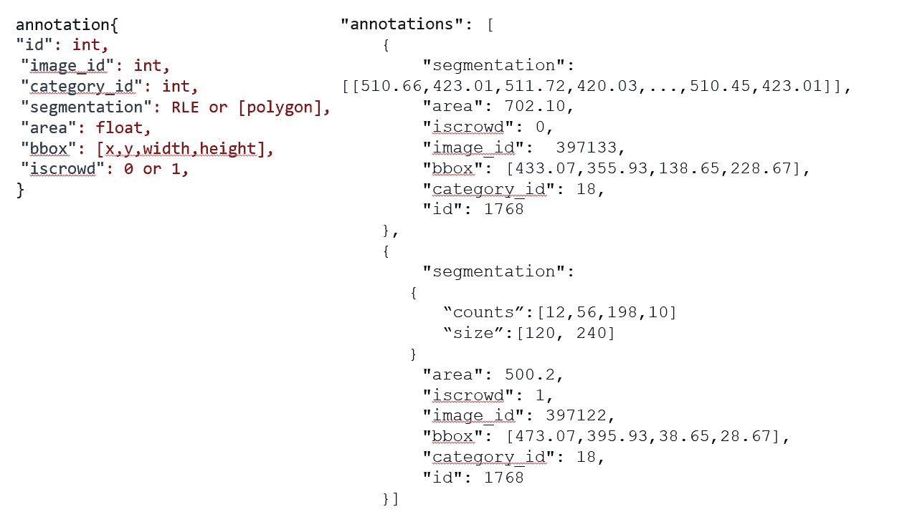
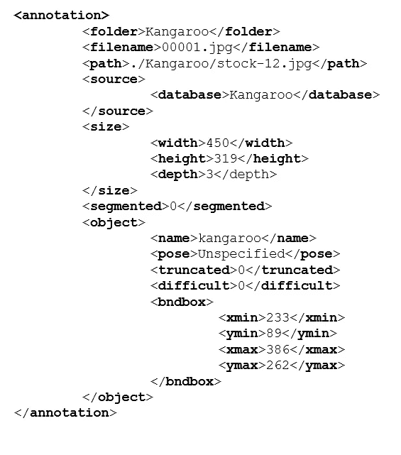

# 用于目标检测的 COCO 和 Pascal VOC 数据格式

> 原文：<https://towardsdatascience.com/coco-data-format-for-object-detection-a4c5eaf518c5?source=collection_archive---------0----------------------->

## 理解计算机视觉的注释数据格式

***在本文中，我们将了解两种流行的数据格式:COCO 数据格式和 Pascal VOC 数据格式。这些数据格式用于注释在用于计算机视觉的数据集中发现的对象。我们将特别关注对象检测的注释***

计算机视觉中最重要的任务之一是标记数据。有几个工具可供您加载图像，使用每个实例的分段来标记对象。这有助于使用边界框进行精确的对象定位，或者使用多边形进行遮罩。该信息存储在注释文件中。

注释文件可以是 COCO 或 Pascal VOC 数据格式。

# COCO 是什么？

COCO 是用于对象检测、分割和字幕数据集的大规模图像与上下文中的公共对象(COCO)。COCO 拥有 80 个对象类别的 150 万个对象实例

COCO 有 5 种注释类型用于

*   [物体检测](http://cocodataset.org/#detection-2019)
*   [关键点检测](http://cocodataset.org/#keypoints-2019)
*   s [凝灰岩分割](http://cocodataset.org/#stuff-2019)
*   [全景分割](http://cocodataset.org/#panoptic-2019)
*   [图像字幕](http://cocodataset.org/#captions-2015)

COCO 将注释存储在 JSON 文件中。让我们看看存储边界框注释细节的 JSON 格式。这将有助于使用 COCO 格式创建您自己的数据集。

JSON 注释文件的基本构建块是

*   **信息**:包含数据集的高级信息。
*   **许可证**:包含适用于数据集中图像的图像许可证列表。
*   **类别**:包含类别列表。类别可以属于一个超级类别
*   **图像**:包含数据集中的所有图像信息，没有边界框或分割信息。图像 id 需要是唯一的
*   **注释**:数据集中每幅图像的单个对象注释列表

Sample COCO JSON format

我们可以为训练、测试和验证数据集创建单独 JSON 文件。

让我们深入了解每一部分

## 信息:

提供有关数据集的信息。

template and example for info section of the JSON for COCO

## 许可证:

我们可以提供数据集中使用的不同图像许可证的列表。

template and example for Licenses section of the JSON for COCO

## 类别:

每个类别 id 必须是唯一的。一个类别可以属于一个超类别。举个例子，如果我们有数据集来识别花和水果。花卉将是超级类别，玫瑰、百合、郁金香将是我们想要检测的花卉的名称。

template and example for Categories section of the JSON for COCO

## 图像:

包含数据集中所有图像的列表。图像 id 应该是唯一的。flickr_url、coco_url 和 date_captured 是可选的

template and example for images section of the json for COCO

## 注释:

包含数据集中每个图像的每个单独对象注释的列表。这是包含用于对象检测的边界框输出或对象分割的部分

如果一幅图像有 4 个我们想要检测的对象，那么我们将有所有 4 个对象的注释。

如果整个数据集由 150 幅图像组成，总共有 200 个对象，那么我们将有 200 个注释。

**分割**包含分割遮罩的每个对象实例周围多边形顶点的 x 和 y 坐标。

**面积**是包围盒的面积。它是一个像素值

**iscrowd** :如果我们有一个单一的对象分割，那么 iscrowd 设置为零。对于图像中出现的对象集合，我们设置 iscrowd=1，在这种情况下使用 RLE。

RLE 是游程编码。当 iscrowd=1 时，我们在分段部分添加属性**计数**和**大小**。这是下例中的第二个分段

如果被遮挡，单个对象(iscrowd=0)可能需要多个多边形。

**imageid** :它是包含我们为其指定注释的对象的图像的 id。imageid 对应于 image 部分中的 imageid

**bbox**:COCO 中的包围盒是左上的 x 和 y 坐标以及高度和宽度。Pascal VOC 边界框是矩形左上角的 x 和 y 坐标以及右下角的 x 和 y 坐标。

**COCO 包围盒:(*x-左上，y-左上，宽度，高度* )**

**Pascal VOC 边界框:(*x-左上，y-左上，x-右下，y-右下* )**

**类别**:这是我们之前在类别部分指定的对象类别

**id** :标注的唯一 id

template and example for annotations section of the JSON for COCO

## 什么是游程编码(RLE)？

RLE 是一种压缩方法，其工作原理是用重复的次数替换重复的值。

例如，0 11 0111 00 将变成 1 2 1 3 2。

COCO 数据格式为每个对象实例提供分段掩码，如上文分段部分所示。这就产生了效率问题

*   紧凑地存放面罩
*   以有效地执行掩码计算。

我们使用游程编码(RLE)方案来解决这两个问题。

RLE 表示的大小与掩模的边界像素的数量成比例。面积、并集或交集等运算将在 RLE 上高效地计算。

# Pascal 可视对象类(VOC)

Pascal VOC 为目标检测提供标准化的图像数据集

COCO 和 Pacal VOC 数据格式之间的差异将有助于快速理解这两种数据格式

*   Pascal VOC 是一个 XML 文件，不像 COCO 有一个 JSON 文件。
*   在 Pascal VOC 中，我们为数据集中的每个图像创建一个文件。在 COCO 中，我们每个人都有一个文件，用于整个数据集的训练、测试和验证。
*   Pascal VOC 和 COCO 数据格式中的边界框是不同的

**COCO 包围盒:(*x-左上，y-左上，宽度，高度* )**

**Pascal VOC 包围盒:(*xmin-左上，ymin-左上，xmax-右下，ymax-右下* )**

Sample Pascal VOC

Pascal VOC 的一些关键标签解释如下

## 文件夹:

包含图像的文件夹

## 文件名:

文件夹中存在的物理文件的名称

## 尺寸:

包含图像的宽度、高度和深度。如果图像是黑白的，那么深度将是 1。对于彩色图像，深度将是 3

## 对象:

包含对象详细信息。如果您有多个注释，那么对象标签及其内容会重复。对象标签的组件包括

*   名字
*   姿态
*   缩短了的
*   困难的
*   bndbox

## 名称:

这是我们试图识别的对象的名称

## 截断的:

指示为对象指定的边界框不符合对象的全图。例如，如果一个对象在图像中部分可见，那么我们将 truncated 设置为 1。如果对象完全可见，则将 truncated 设置为 0

## 困难:

当对象被认为难以识别时，该对象被标记为困难的。如果对象很难识别，那么我们将困难设置为 1，否则设置为 0

## 边界框:

指定图像中可见对象范围的轴对齐矩形。

本文应该有助于理解计算机视觉中使用的两种流行数据格式的细节

# 参考资料:

[http://cocodataset.org/#download](http://cocodataset.org/#download)

 [## COCO -上下文中的常见对象

### 编辑描述

cocodataset.org](http://cocodataset.org/#format-data)  [## 如何在数据集 json 文件中编写对象分段？问题#111 cocodataset/cocoapi

### 此时您不能执行该操作。您已使用另一个标签页或窗口登录。您已在另一个选项卡中注销，或者…

github.com](https://github.com/cocodataset/cocoapi/issues/111) 

[https://pjreddie.com/media/files/VOC2012_doc.pdf](https://pjreddie.com/media/files/VOC2012_doc.pdf)

[https://arxiv.org/pdf/1405.0312.pdf](https://arxiv.org/pdf/1405.0312.pdf)