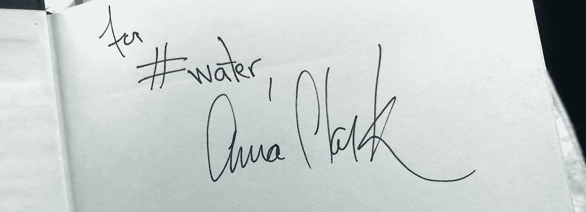
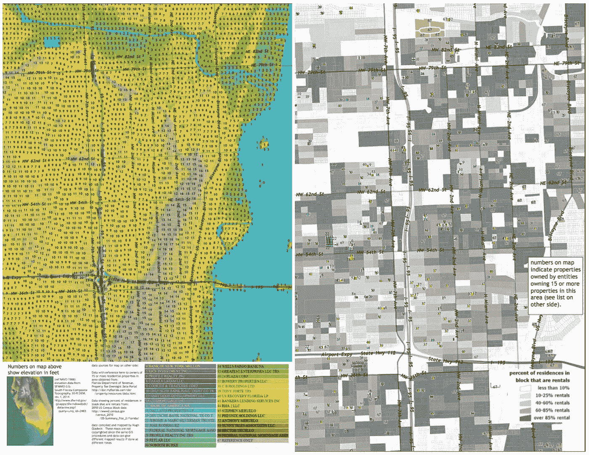
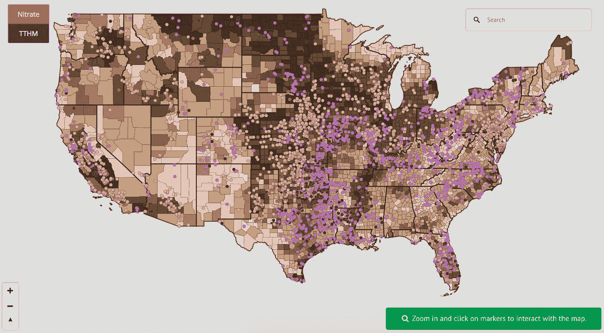

# 波士顿安全饮用水工程规范

> 原文：<https://towardsdatascience.com/code-for-bostons-safe-drinking-water-project-8283989e647f?source=collection_archive---------22----------------------->

## 理解数据意味着从意想不到的地方学习

我第一次参加波士顿黑客之夜是在去年 12 月。当时我正在参加一个密集的数据科学项目。那周我们有多个实验要做(这是常态)，我的几个同学被做任何额外的事情的想法吓了一跳。但是，在看过波士顿项目的一些代码后，我渴望做出贡献，并与其他对使用技术解决公民和社会问题感兴趣的人建立联系。

您可以在波士顿的[当前项目页面](https://www.codeforboston.org/projects/)的代码上看到关于以下项目的附加信息:

*   **波士顿信息语音应用**:回答波士顿市政服务问题的 Alexa 技能。目前支持提供地址和要求垃圾/回收提货日。
*   **Community Connect** :一个健康资源网络应用，收集关于促进健康生活方式选择的企业和组织的信息。
*   MuckRock :归档、跟踪和共享公共记录请求。
*   **安全饮用水项目**:预测安全饮用水违规行为的探索性数据项目。它使用 EPA 的安全饮用水信息系统和 EnviroFacts API。
*   **移民服务地图**:一款网络应用，旨在帮助移民服务提供商创建个人资料，更新信息，并快速与客户分享。
*   **意外收入意识项目:**一种帮助受社会保障意外收入消除计划(WEP)影响的退休人员的工具，该计划可以将某些公务员的社会保障福利减少多达 50%。这个工具将帮助受影响的工人更好地规划退休和自我主张与社会保障管理局。
*   当你步履沉重时，你会在日常生活中捡垃圾……慢跑、徒步旅行或只是在街上散步。Plogalong 帮助您跟踪您的 plogs，与附近的 ploggers 联系，获得徽章，并获得当地折扣。

这是一个艰难的选择，但我最终加入了安全饮用水项目，因为他们专门寻找具有数据科学技能的人。我也觉得和这个问题有关联。

# 一个关于学校的故事

几年前，我参加了当地一所高中同伴领导小组的第一次会议。在我们等待大家入座的时候，我问最近的饮水机在哪里。几个学生扬起了眉毛。

“为什么？”

"这样我就可以装满我的水瓶了."

“就在大厅那头。但你不想那样。”

“你是认真的吗？”

“是啊，我们不喝这里的水。”

房间里的每个人都点头表示同意。

在会议期间，学生们完成了一项活动，他们在活动中确定了他们所关注的学校和社区中的问题。当我们结束一场热烈的讨论时，我不得不抛出最后一个问题:“没人说过水。你们有谁在乎自己学校不能喝水？”

他们都耸耸肩。这是一种常态，不值一提。

同一周，马萨诸塞州州长查理·贝克宣布拨款 200 万美元帮助公立学校检测饮用水中的铅和铜。

仅仅一年多之后，2017 年 5 月，这篇文章出现在我的 feed 中:

 [## 质量测试。学校发现超过一半的饮用水中含有高浓度的铅和铜

### 波士顿(哥伦比亚广播公司)——上周对马萨诸塞州 1000 多所学校的测试发现，超过一半的学校有饮用水…

boston.cbslocal.com](https://boston.cbslocal.com/2017/05/02/school-lead-testing-drinking-water-massachusetts/) 

测试的[总结结果](https://www.mass.gov/files/documents/2017/10/27/10-27-2017-summary.pdf)证实了我合作的两所高中都“领先于行动水平”

# 理解数据

这让我们回到波士顿的安全饮用水项目。目标是预测饮用水中基于健康的违规行为。我们从环保局的[安全饮用水信息系统](https://www.epa.gov/enviro/sdwis-model) (SDWIS)的数据开始。

对我来说，理解数据不仅仅意味着知道 SDWIS 数据库中包含什么信息(尽管我们终于有了一个集中的数据字典！).这也是为了理解这些信息实际上告诉我们什么，并确定数据库中没有包括的其他有助于水安全的因素。

# 惊人的联系

虽然我一直在积极寻找信息，以加深对安全饮用水相关问题的理解，但我的一些知识却来自意想不到的地方。

## 弗林特的艾

1 月初，这篇文章出现在我的收件箱中——不是因为我对水资源问题的跟踪，而是因为我对机器学习的兴趣:

 [## 一个感觉良好的人工智能故事如何在弗林特出错

### 一个机器学习模型显示了有希望的结果，但是城市官员和他们的工程承包商放弃了它…

www.theatlantic.com](https://www.theatlantic.com/technology/archive/2019/01/how-machine-learning-found-flints-lead-pipes/578692/) 

TL；这篇文章的博士版本是，一个团队创建了一个机器学习模型，成功预测了弗林特的哪些家庭可能有铅管。该市与一家国有公司 AECOM 签订了合同，以加快工程进度。然后:

> AECOM 抛弃了指导挖掘的机器学习模型的预测。面对一些居民的政治压力，[弗林特市长卡伦]韦弗要求该公司挖掘整个城市的选区和选定街区的每一所房屋，而不是挑选出可能有铅的房屋，因为年龄、财产类型或其他特征可能与管道相关。
> 
> 在对项目管理进行了数百万美元的投资后，弗林特成千上万的人仍然拥有铅管住宅，而以前的项目可能已经找到并替换了它们。

## 海平面正在上升

弗林特的文章发表后的一周，我在麻省理工学院媒体实验室参加了“黑人生活数据 II”会议。

从那以后，最让我念念不忘的是*“海在上涨，人也在上涨”:数据、灾难&集体力量*。

小组成员 Valencia Gunder、Denice Ross、Lisa Rice 和 Bina Venkataraman 分享了他们的工作并回答了问题:“黑人社区使用社交媒体、数据和技术为下一场灾难做准备的方式是什么？为了预防？在这些快速反应时刻和气候正义运动中，数据科学家和工程师的角色是什么？”

他们谈到气候变化加剧了高房价和流离失所的问题。巴伦西亚·贡德开始了她的故事:

> 当你在南佛罗里达工作时，气候变化和恢复力总是谈话的一部分，即使是以最不正式的方式。小时候，我的祖父告诉我，“他们会偷走我们的社区，因为那里不发洪水。”直到我长大了，我才理解他。

Map created by Hugh Gladman that plots owners with 15 or more pieces of land in Little Haiti to the height above sea level of their parcels. (Source: [The New Tropic](https://thenewtropic.com/climate-change-gentrification/))

其他人也谈到洪水和社区不平等之间的联系。“黑人生活的数据”YouTube 频道有一个完整的小组的[记录，以及会议的其他环节，可供查看。](https://youtu.be/iLBzLY1MEgA)

## 农田径流

在完成数据科学项目后不久，我与一个人进行了交谈，他对一个亲戚进行了离题的评论，这个亲戚使用人工智能来研究奶牛的食物如何影响它们的粪便，从而由于径流而影响水系统。他挥挥手表示拒绝:“但你可能对此不感兴趣。”

我解释说我对这个话题很感兴趣。这是一个促成因素，我们在安全饮水小组中还没有讨论过。我做了一些调查，以了解更多关于粪肥和其他农田径流是如何污染水源的。

2009 年《纽约时报》的一篇文章考虑了威斯康星州的问题，在那里“仅一个镇就有超过 30%的水井违反了基本健康标准”:

> 农场动物的排泄物据说是饮用水中污染物的一个来源。在一次市政厅会议上，愤怒的房主对牛奶场主大喊大叫，其中一些人被认为是镇上最富有和最有权势的人。

它继续解释说，即使当地的环境机构没有被过度征税，“一个强大的农业游说团体已经阻止了以前在 Capital[*sic*Hill 的环境努力。即使州立法机关采取了行动，也经常遇到意想不到的困难。”

Screenshot of EWG’s interactive map of drinking water in rural communities threatened by farm pollution. (Source: [EWG](https://www.ewg.org/interactive-maps/troubleinfarmcountry/fertilizer.php))

不同的政治和经济利益在起作用。虽然 Valencia Gunder 谈到了洪水和气候变化导致的佛罗里达州的流离失所，但像上面这样的地图(也使用了 SDWIS 的数据，以及来自美国农业部[农业普查](https://www.nass.usda.gov/AgCensus/)的数据)表明了额外的担忧。在已经受到农业污染威胁的地区，洪水的增加增加了水系统受到污染的风险。

## 有毒化学场所

在本月早些时候哈佛的下一次数据可视化活动中，[纽约时报*的图形编辑*](https://www.nytimes.com/by/blacki-migliozzi)布莱基·米格里奥齐分享了他的一些气候变化可视化。其中一个特别引起了我的注意:一张地图显示了全国 2500 个位于洪水易发区的化学场所。

 [## 洪水越来越严重，2500 个化学场所位于水的路径上

### 在美国每个州的洪水易发区，有超过 2500 个处理有毒化学物质的场所，纽约…

www.nytimes.com](https://www.nytimes.com/interactive/2018/02/06/climate/flood-toxic-chemicals.html) 

这张地图是利用美国环保署[有毒物质释放清单](https://www.epa.gov/toxics-release-inventory-tri-program/tri-basic-data-files-calendar-years-1987-2017)和美国联邦应急管理局[国家洪水危险层](https://www.fema.gov/national-flood-hazard-layer-nfhl)的数据绘制的。

与农场径流带来的问题类似，海平面上升导致洪水泛滥的地区的化学工厂也面临着污染水系统的更高风险，以及一系列其他问题。

## 被毒害的城市

几天后，我和另一名安全饮水志愿者去见记者[安娜·克拉克](http://annaclark.net/)谈论她的书*被污染的城市:弗林特的水和美国城市悲剧*。当然，在这种情况下，我期望了解更多关于影响饮用水的因素，但仍然觉得值得在这里包括。

在简要介绍了该市从五大湖水转向弗林特河水，以及随之而来的铅、大肠杆菌和军团病问题后，克拉克问道，“首先是什么让一个城市如此脆弱？”

她的回答:“你得往回走几代。”

从那里，她的故事开始于 20 世纪 60 年代，“当时弗林特是北方种族隔离最严重的城市，也是全国第三大种族隔离城市。”它包括通用汽车公司的影响、社区组织的历史、争取公平住房的斗争、去工业化和应急管理法。

关于这方面的图文并茂的文章，请看克拉克与平面艺术家乔希·克莱默的合作:

 [## 弗林特水危机的真实故事可以追溯到几十年前

### 一篇插画的原创文章。关于来源的说明:所有归功于历史人物的东西都直接来自于…

splinternews.com](https://splinternews.com/an-equal-opportunity-lie-how-housing-discrimination-le-1820482045) 

对我来说，克拉克在演讲后的谈话中提出的两个评论很突出:

> 环境问题总是以不承认有罪的和解告终。

和

> 这不仅仅是一个技术问题。这种事发生在弗林特是有原因的，不会发生在安阿伯。

A copy of The Poisoned City, signed “For #water, Anna Clark.”

约翰，另一个参加讲座的安全饮水志愿者，拿到了一本《被污染的城市》。克拉克把它签到了#water(我们组对波士顿 Slack 频道的代号)，它现在正在被读取并通过组传递。

## 巴黎圣母院

与此同时，这个推特时刻今天早上在我的收件箱里等待着:

 [## 白宫对圣母大学的援助重新开启了关于波多黎各和弗林特需求的对话

### 一些人想起了白宫提供的资源，波多黎各和弗林特继续需要这些资源…

twitter.com](https://twitter.com/i/events/1118477687712935936) 

这再次提醒我们不同的利益、价值观、优先事项和资源分配会如何影响饮用水(以及其他许多东西)。

# 邀请函

这些是我在试图理解我们正在使用的数据时建立的一些联系。一如既往，我很高兴听到对此的任何想法。

如果您对安全饮用水项目的其他数据、研究或方法有建议，请分享！您还可以查看[安全饮用水项目 GitHub repo](https://github.com/codeforboston/safe-water) ，并加入# Water channel on[Code for Boston Slack](https://communityinviter.com/apps/cfb-public/code-for-boston)。

如果你在波士顿地区，并且对参与这个或另一个波士顿代码项目感兴趣，在[波士顿代码](https://www.codeforboston.org/)网站上了解更多，并参加[每周一次的黑客之夜](https://www.meetup.com/Code-For-Boston/)。

*感谢阅读！想法、问题和反馈总是很受欢迎。*