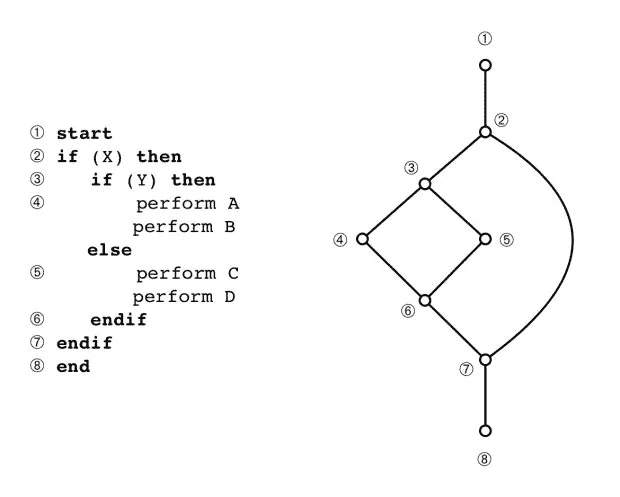

# 减少分支、机器人感知和圈复杂度

> 原文：<https://towardsdatascience.com/code-kata-robot-sensing-reduce-branching-and-cyclomatic-complexity-fe290b3050d1?source=collection_archive---------21----------------------->

## 学习最佳实践的代码形


source: [Steve Johnson](https://www.pexels.com/@steve) via [pexels](https://www.pexels.com/photo/brown-panel-door-near-roll-up-gate-845242/)

这是一个快速代码形来说明“减少分支”原则，并在 5 分钟内激起你对机器人感应的兴趣。

当我们创建一个机器人代理时，天真的解决方案是首先假设机器人有一致的可能性去“任何地方”在数学上，这被建模为机器人将向任何方向移动的等概率。为了简单起见，让我们将其限制在一维的情况下，假设我们的机器人只能在直线 1-D / X 轴上行进并访问 5 个门。

如果有 5 个门，并且所有概率都是均匀分布的，那么机器人位置的初始向量表示是 1 / 5 = 0.2。

所以，假设给你一个向量，代表你的统一的，简单的概率:

```
probs = [0.2, 0.2, 0.2, 0.2, 0.2]
```

现在，机器人**感知**它们的环境，这应该与它们的目标目的地一致。比方说，我们告诉我们的机器人，他只能旅行到一个“粉红色的门”，而不是蓝色的门。"

如果我们的机器人感觉到他在一扇粉色的门旁，他的传感器会说有 0.90 的概率他确实在一扇粉色的门旁。

因此，让我们给自己一些额外的变量，代表一个成功的“击中”失败的“错过”，以及一个变量，代表我们的环境或门。

```
doors = [‘pink’, ‘blue’, ‘blue’, ‘blue’, ‘pink’]T = ‘pink’pHit = 0.90pMiss = 0.10
```

# 你的目标是**为我们的机器人编写一个感知函数，评估我们的目标 T 是否与它所在的门匹配，并根据它的均匀分布乘以它感知目标门的概率。**

下面，我用 Python 3 提供了两个解决方案，一个是简单的解决方案，另一个抓住了上面的“代码形”本质。一个是天真的，另一个可以说是稍微好一点的。

**天真的实现**

```
def sense(probs, T): afterSense=[] for i in range(len(probs)): if doors[i] == T: afterSense.append(probs[i]*pHit) else: afterSense.append(probs[i]*pMiss) return afterSense
```

**更好的实现**

```
def sense(probs, T): afterSense = [] for i in range(len(probs)): hit = (T == doors[i]) afterSense.append(probs[i]*(hit*pHit + (1-hit) *pMiss)) return afterSense
```

在更好的实现中，您将自己从执行庞大的 4 行 if/then 评估中解放出来。相反，您可以在我们的代码中生成一个独立的、线性的路径，它可以被遍历并折叠成一行。

```
afterSense.append(probs[i]*(hit*pHit + (1-hit) *pMiss))
```

这是因为当我们评估:

```
hits = (T == doors[i])
```

存储在 hits 中的值将返回布尔值真(1)或布尔值假(0)。这符合一般的“良好的编码风格”原则，通常被称为**减少或最小化分支**。

## 最终，目标是限制[圈复杂度](https://en.wikipedia.org/wiki/Cyclomatic_complexity)的水平，圈复杂度是另一个度量“分支”或线性独立路径数量的指标。

> 一段[源代码](https://en.wikipedia.org/wiki/Source_code)的圈复杂度是其中线性独立的[路径](https://en.wikipedia.org/wiki/Control_flow)的数量。

如果你是视觉生物，也许这个图会对你有帮助。



Image adopted from [McCabe, T.J., “A complexity measure”, *IEEE Trans. on Software Engineering*, SE-2(4), pp.308–320(1976)](https://ieeexplore.ieee.org/document/1702388)

希望这对其他开发者和好奇的人有所帮助！欢迎给我发信息或在下面评论，我随时欢迎反馈。