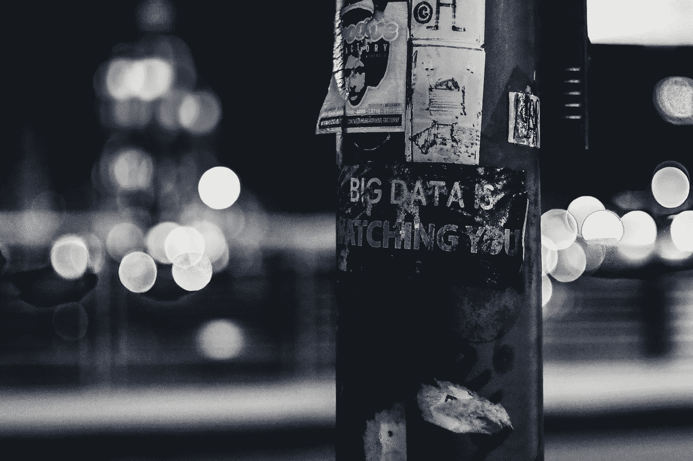

# 道德准则—人工智能和人力资源分析

> 原文：<https://towardsdatascience.com/code-of-ethics-ai-and-analytics-for-hr-569be2efe2e1?source=collection_archive---------20----------------------->

Photo by [ev](https://unsplash.com/@ev?utm_source=unsplash&utm_medium=referral&utm_content=creditCopyText) on [Unsplash](https://unsplash.com/search/photos/data-science?utm_source=unsplash&utm_medium=referral&utm_content=creditCopyText)

昨晚，我看了一部由剑桥分析公司(Cambridge Analytica)发起的关于信息战的纪录片(关于网飞的“大黑客”)。克里斯托弗·怀利(Christopher Wylie)是一名前数据科学家，最终成为告密者，他在收集数百万脸书用户的个人数据方面发挥了作用，这些用户最终成为外国特工政治广告的目标。对于数据科学家来说，没有什么比访问大型数据集更令人兴奋的了。我们都想用这些数据以积极的方式改变世界。但是，如果我们无意中造成伤害，而不是好处呢？对于任何数据科学家来说，这都是一个关键问题，它同样适用于人员分析——人工智能或数据科学在人力资源中的应用。

在最近一次关于员工评估的[会议上，讨论总是转向人员分析的法律和伦理问题。在 Q & A 期间，我在那里做了一个关于人员分析中组织复杂性阶段的演讲，参与者问了一系列问题。一个问题是关于声称匿名的员工调查的道德性，尽管人力资源部门的某些人经常可以访问结果中的识别数据，可以确定单个员工。另一个人问道，如何在法庭上为使用基于人工智能的视频技术的筛选过程辩护？还有一个问题:你能解释一个基于机器学习的预测模型来识别“最佳”候选人吗？另一个问题是:这些声称为工作匹配合适人选的算法背后是什么？](https://www.ipacweb.org/)

# 以道德问题为导向

法律和道德问题交织在一起。法律在某种程度上是社会道德标准的体现。作为一个社会，我们认为公平公正地对待他人是道德的，因此有法律来防止负面影响。作为一个社会，我们认为人们应该被允许在公众视线之外做许多事情，因此我们有隐私法。

然而，法律并不强制每一种道德行为，当道德标准仍有疑问时，法律必然落后。

第七章禁止基于两个理由的就业歧视——**“明显的歧视意图”和“不同的影响”**。但是，法律上有先例允许组织产生不同的影响，如果这种影响来自业务需求，特别是在似乎没有歧视意图的情况下。这是一个漏洞，一旦数据科学和人工智能进入画面，它可能会取消所有的 Title VII。组织可以根据*最终产生不同影响的数据做出人事决策*，甚至不包括种族或性别等明显敏感的变量。算法可能会在有偏见的历史数据中找到群体的统计代理，并基于它们进行歧视——而所有负责的组织都声称业务需求和歧视是无辜的。

目前还不清楚法律将如何对待这种“黑箱”算法，所以我们这些从事人员分析的人有时会处于蛮荒的西部，法律不确定，任何事情都可能发生。当法律模棱两可时，我们需要依靠自己的道德指南针。

## 那么，人物分析结果和产品中最大的道德问题是什么？

*   由于数据中的偏差，决策容易受到**偏差**的影响吗？
*   对更多数据的渴望和个人隐私之间的平衡是什么？
*   我们应该如何对算法造成的潜在**错误**负责(无论它们是否被“正确”编程)？
*   对于部分受算法决策影响的人，**应该传达什么信息？**
*   求职者和员工何时可以只与机器**交互**？什么时候应该联系真实的人？

# 人员分析的道德准则

计算机械协会至少从 1992 年起就有了道德规范，美国图书馆协会从 1939 年起就有了关于信息用户的道德规范，远远早于主流计算。就像医生们宣读希波克拉底誓言一样，这些其他职业也需要一套道德准则，因为他们的工作可能会对真实的人产生潜在的影响。

我相信我们这些从事人员分析的人也需要一套道德准则来指导我们的工作。首先，这是我自己的草稿，它受到了其他职业道德准则的启发:

*   我会时刻注意隐私和安全。
*   我将向我的客户公开我的方法中的假设和限制。
*   我将鼓励组织客户对他们的利益相关者保持透明。
*   *我将*仅出于收集数据的目的使用数据。
*   如果我或我的组织客户希望将数据用于原始目的之外的目的，*我们将*从数据收集对象处获得明确许可。
*   *我将*努力沟通，使我提供的信息更难被滥用。
*   我将努力使用可解释的算法，特别是当它们有可能影响个人的选择、表现和职业发展决策时。
*   *我将*清楚、坦率地说明数据分析和技术能解决什么，不能解决什么。
*   *我将*告知我的客户在使用任何形式的自动化时的权衡。
*   *我将*警惕潜在的不良偏见，即使在法律允许的情况下。

本《道德准则》涵盖五个类别— **数据隐私、目的驱动型使用、透明度、限制可见性、**和**反偏见行动。对我来说，这是一个开始。我将继续改进这些代码，因为我从人员分析领域的其他专业人士那里学到了很多东西。**