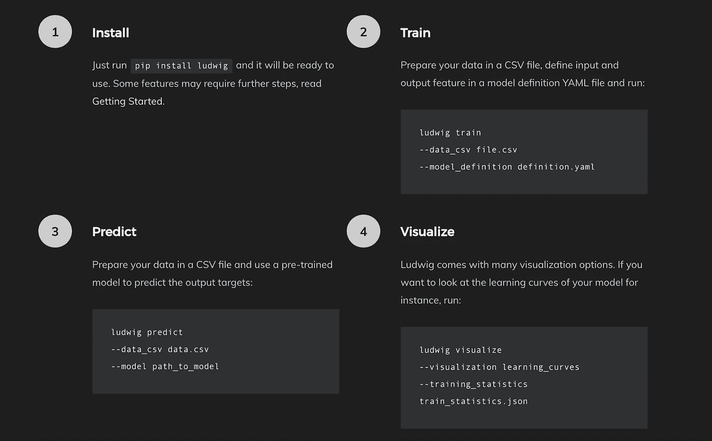
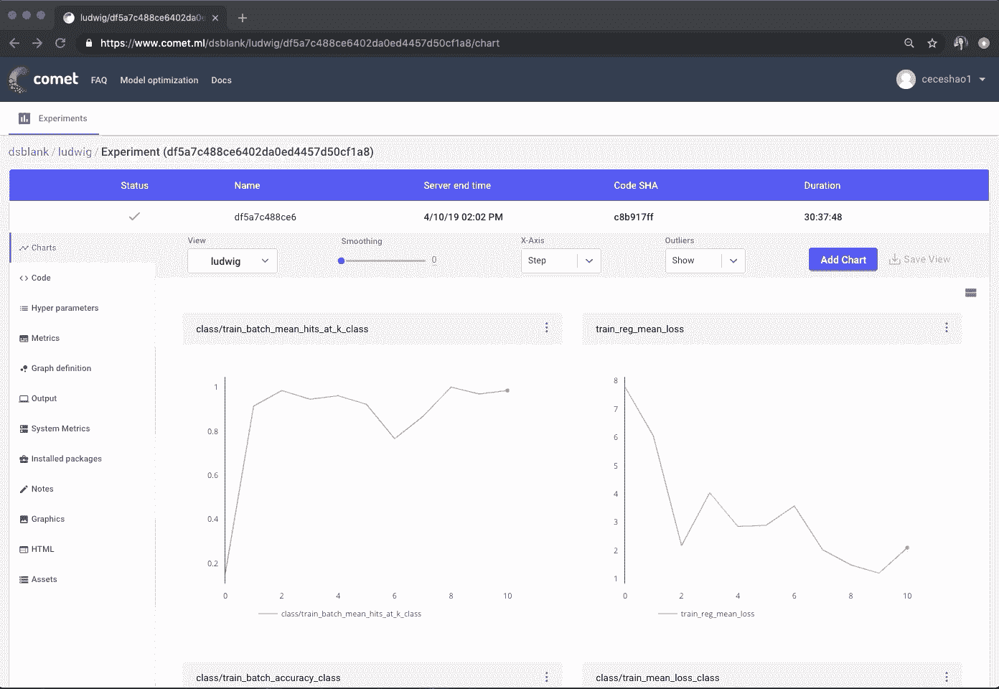

# Ludwig 和 Comet.ml 的无代码深度学习管道

> 原文：<https://towardsdatascience.com/codeless-deep-learning-pipelines-with-ludwig-and-comet-ml-de329bbe254d?source=collection_archive---------21----------------------->


## 如何在命令行中结合使用 Ludwig 和 Comet.ml 来构建强大的深度学习模型——使用示例文本分类模型

[Ludwig](https://uber.github.io/ludwig/?source=post_page---------------------------) 是一个基于 TensorFlow 的工具箱，允许用户在不需要编写代码的情况下训练和测试深度学习模型*。*

通过从头到尾提供一个定义良好的、*无代码*深度学习管道，Ludwig 使从业者和研究人员能够快速训练和测试他们的模型，并获得强大的基线来比较实验。

> *“Ludwig 帮助我们在不编写代码的情况下建立最先进的模型，通过将 Ludwig 与 Comet 集成，我们可以以可重复的方式跟踪我们所有的实验，获得可见性，并更好地了解研究过程。”—* ***Piero Molino，优步人工智能实验室的高级 ML / NLP 研究科学家，Ludwig*** 的创造者

Ludwig 提供了用于预处理数据、训练、发布预测和可视化的 CLI 命令。在本帖中，我们将向您展示如何使用 Ludwig，并使用 [Comet.ml](http://bit.ly/2Jd156C?source=post_page---------------------------) 跟踪您的 Ludwig 实验。

> *参见路德维希 Github 回购* [*此处*](https://github.com/uber/ludwig/?source=post_page---------------------------)



想要一个快速的图像字幕模型或视觉问答模型？[在这 4 个简单的步骤中使用 Ludwig](https://uber.github.io/ludwig/?source=post_page---------------------------)来建立、训练和评估深度学习模型。

在这里的 [Comet.ml](http://bit.ly/2Jd156C?source=post_page---------------------------) ，我们对 Ludwig 填补机器学习生态系统空白的潜力感到兴奋。Ludwig *最后*采用机器学习模型、训练、数据和可视化的抽象表示的想法，并将它们变成一个自始至终无缝、可执行的管道。

# 这意味着我们终于可以花更少的时间:

*   处理不同数据类型的数据预处理☠️
*   将不同的模型架构网格化只是为了得到简单的基线模型
*   编写代码进行预测

# 更多时间:

*   获得透明的结果🚀

# [整合彗星与路德维希](https://medium.com/comet-ml/comet-ml-partners-with-uber-on-ludwig-5adb802bbdfc?source=post_page---------------------------)

我们与 Ludwig 团队合作[整合 Comet.ml](https://medium.com/comet-ml/comet-ml-partners-with-uber-on-ludwig-5adb802bbdfc?source=post_page---------------------------) 以便用户可以在训练时实时跟踪基于 Ludwig 的实验。

[Comet.ml](http://bit.ly/2Jd156C?source=post_page---------------------------) 在三个主要领域对 Ludwig 进行了补充:

1.  **比较多个路德维希实验:**路德维希让你轻松训练，迭代不同的模型和参数集。Comet 提供了一个接口来帮助你跟踪那些不同实验的结果和细节。
2.  **为您的分析组织的商店:** Ludwig 允许您围绕训练过程和结果生成很酷的可视化效果。Comet 允许您跟踪这些可视化效果，并自动将它们与您的实验关联起来，而不是将它们保存在某个地方。
3.  **你的实验的元分析:**你可能会多次重复你的路德维希实验。用 Comet 跟踪它们使您能够分析诸如哪些参数起作用之类的事情，以便构建更好的模型。

通过用 Comet.ml 运行您的 Ludwig 实验，您可以捕获您的实验的:

*   代码(您使用的命令行参数)
*   **实时性能图表，以便您可以实时查看模型指标(而不是等到培训完成之后)**
*   你和路德维希一起创作的可视化作品
*   环境详细信息(例如包版本)
*   运行历史记录(HTML 选项卡)

…以及更多！

# 用彗星运行路德维希

1.  安装 Ludwig for Python(和 spacy for English 作为依赖项，因为我们在这个例子中使用了文本特性)。*这个例子已经用 Python 3.6 测试过了。*

```
$ pip install ludwig
$ python -m spacy download en
```

*如果在安装* `gmpy` *时遇到问题，请安装* `libgmp` *或* `gmp` *。在基于 Debian 的 Linux 发行版上:* `sudo apt-get install libgmp3-dev` *。MacOS 上:* `brew install gmp` *。*

2.安装 Comet:

```
$ pip install comet_ml
```

3.设置您的 Comet 凭据:

*   在 [https://www.comet.ml](http://bit.ly/2Jd156C?source=post_page---------------------------) 获取您的 API 密钥
*   让 Ludwig 可以使用 API 键，并设置 Ludwig 实验细节要报告给哪个 Comet 项目:

```
$ export COMET_API_KEY="..."
$ export COMET_PROJECT_NAME="..."
```

4.我们建议您为每个 Ludwig 实验创建一个新目录。

```
$ mkdir experiment1
$ cd experiment1
```

> ***一些背景:*** *每次你想创建一个新的模型并训练它的时候，你会用到两个命令中的一个——*
> 
> *—训练
> —实验*
> 
> *一旦使用* `*--comet*` *标志运行这些命令，就会创建一个* `*.comet.config*` *文件。这个* `*.comet.config*` *文件从您上面设置的环境变量中提取您的 API 键和 Comet 项目名。*

如果您想运行另一个实验，建议您创建一个新目录。

5.**下载数据集。**对于这个例子，我们将使用 [Reuters-21578](http://archive.ics.uci.edu/ml/datasets/Reuters-21578+Text+Categorization+Collection?source=post_page---------------------------) 这个众所周知的新闻专线数据集来处理文本分类用例。它只包含 21，578 个新闻专线文档，分为 6 个类别。两个是“大”类别(许多正面文档)，两个是“中”类别，两个是“小”类别(很少正面文档)。

*   小类:heat.csv，housing.csv
*   中等类别:coffee.csv、gold.csv
*   大类:acq.csv，earn.csv

```
$ curl [http://boston.lti.cs.cmu.edu/classes/95-865-K/HW/HW2/reuters-allcats-6.zip](http://boston.lti.cs.cmu.edu/classes/95-865-K/HW/HW2/reuters-allcats-6.zip?source=post_page---------------------------) -o reuters-allcats-6.zip
$ unzip reuters-allcats-6.zip
```

6.定义我们希望用我们想要的输入和输出特性构建的模型。用这些内容创建一个名为`model_definition.yaml`的文件:

```
input_features:
    -
        name: text
        type: text
        level: word
        encoder: parallel_cnnoutput_features:
    -
        name: class
        type: category
```

7.用新的`--comet`国旗训练模特

```
$ ludwig experiment --comet --data_csv reuters-allcats.csv \
    --model_definition_file model_definition.yaml
```

一旦你运行这个，一个彗星实验将被创建。检查 Comet 实验 URL 的输出，并点击那个 URL。

8.在彗星上，你可以看到:

*   您在**图表选项卡**上的实时模型指标
*   您运行来训练您的实验的 bash 命令以及**代码选项卡**中的任何运行参数
*   Ludwig 正在使用的超参数(默认)在**超参数选项卡**中

还有更多！看这个样本实验[这里](https://www.comet.ml/dsblank/ludwig/b919068a27014a1b941a1de11c707a0b?source=post_page---------------------------)



使用彗星标志运行我们的示例文本分类 Ludwig 实验。你可以在这里和这个彗星实验[互动](https://www.comet.ml/dsblank/ludwig/b919068a27014a1b941a1de11c707a0b?source=post_page---------------------------)

如果您选择使用 Ludwig 制作任何可视化效果，也可以通过运行以下命令将这些可视化效果上传到 Comet 的**图像选项卡**:

```
$ ludwig visualize --comet \
    --visualization learning_curves \
    --training_statistics \
    ./results/experiment_run_0/training_statistics.json
```

# 现在，您已经准备好一起使用 Ludwig 和 Comet 来构建您的深度学习模型了！在这里报名彗星[。](https://www.comet.ml/pricing?source=post_page---------------------------)