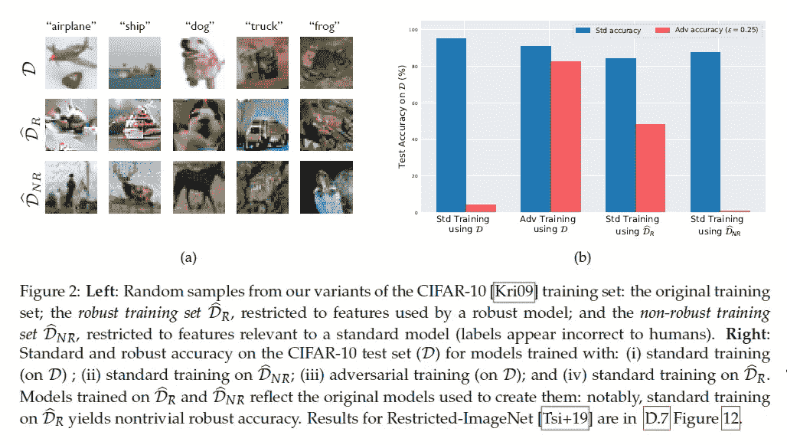
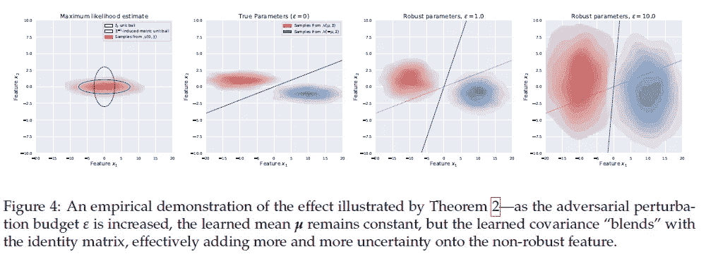

# 将对立的例子编纂为特征

> 原文：<https://towardsdatascience.com/codifying-adversarial-examples-as-features-a886f6b1f7b6?source=collection_archive---------32----------------------->

## 分离健壮和非健壮特征

Photo by [Nahel Abdul Hadi](https://unsplash.com/photos/flha0KwRrRc?utm_source=unsplash&utm_medium=referral&utm_content=creditCopyText) on [Unsplash](https://unsplash.com/search/photos/hacker?utm_source=unsplash&utm_medium=referral&utm_content=creditCopyText)

对立的例子对人工智能从业者来说是一个巨大的麻烦，但在人工智能理论中却是一个巨大的红利，有助于我们理解机器学习模型和算法的内部，并为像甘这样的新兴技术注入活力。

因此，毫不奇怪，我将在这里回顾的这篇新论文在业界引起了轰动。

或者，如果您喜欢使用另一个 PDF 阅读器应用程序阅读，请点击[这里的](https://arxiv.org/pdf/1905.02175.pdf)。

计算机视觉算法的问题之一(详见 Hinton 的 Coursera 课程)是间接推理。这里的数据流可以用下图表示:

计算机视觉算法的困难在于从物体到标签没有直接的联系。取而代之的是，拍摄物体的照片，用像素表示，算法学习从像素而不是物体本身获得标签。算法不确定你说的标签是什么意思。如果你给它一张绵羊在山坡上吃草的图像，算法并不知道绵羊是白色物体，还是下面的绿色物体，或者上面的蓝色物体。因此，你需要向算法提供更多的训练数据，以说服它一只羊与天空或草地不同。然而，它可能会学到错误的东西。例如，它可以学习基于 fir 或其他次要特征来识别猫和狗。这就是漏洞所在，通过操纵像素，你可以让算法错误地识别对象。

为了对抗对抗性学习，建议更新优化算法，以在对抗性失真下最小化成本函数而不是成本函数的最大值:

在本文中，除了使用对抗性损失函数之外，还提出了识别鲁棒性特征，即在对抗性失真下不改变相关性符号的特征。

关于这篇论文，有一点要提一下，就是所谓的特性实际上是指倒数第二层的激活。在这种情况下，我们可以使用简单的皮尔逊相关，因为所有的非线性都是在前面的层中处理的。

本文试图做的第一件事是理清稳健和非稳健特征。首先，我们使用对抗性损失函数来训练模型，然后用仅生成稳健特征的修改数据来替换训练数据:

这里的条件是只有鲁棒特征与标签相关，而非鲁棒特征与标签的相关性为零。这个数据集是通过使用反向传播来发现的，但是更新输入，而不是权重和偏差(很像在白盒对抗学习中)，最小化倒数第二层的激活的平方差:

在获得修改的数据集之后，对其执行另一轮训练，这一次使用标准(非对抗性)训练。最终的模型被发现在标准和敌对的环境下都能很好地工作。这个结果真的是个好消息，因为使用对抗性损失函数训练非常慢，你也不想太频繁。这里我们只做一次，然后生成新的测试数据，然后使用高效的标准训练程序来做我们的训练实验。在我看来，这是论文最好的实用结果。

以类似的方式，您可以生成非稳健数据集，而无需使用对抗性训练。结果如下图所示:

在我看来，作者没有实现健壮和非健壮特征的分离，因为使用了不同的训练程序，所以两者之间不可避免地存在重叠。

在接下来的实验中，作者故意给这些例子贴上随机标签。他们发现，使用鲁棒特征训练的模型会记住原始数据集，并纠正错误标记的数据本身，而标准分类器会学习新的和不正确的分类。这既是好消息，也是坏消息。虽然它表明该模型对错误标记是鲁棒的，但这也意味着降低了迁移学习的泛化能力和有用性。

本文的理论框架在于将数据点表示为两个高斯分布的混合，对应于二分类问题中的两个类别。使用最大似然法找到分布的参数，并且这些参数对应于逻辑回归中的参数。这是统计学习中的一种已知方法，可以追溯到几十年前。对抗性鲁棒学习使用相同的方法，但是扩展了样本以包括所有可能的对抗性例子:

因此，增加对抗性噪声 **ε** 有效地增加了习得的**σ**，混合了组合分布。

# 结论

本文是对抗鲁棒学习的一般框架的发展，在过去几年中一直在积极工作。它不再关注模型，而是将注意力转移到数据上，根据原始数据生成数据集，经过训练后，这些数据集会生成一个健壮的模型。我认为，这是本文的最大贡献，因为你可以节省时间，避免进行缓慢而昂贵的对抗性训练，而不是第一次为了产生稳健的数据集。

# 参考

1.  安德鲁·易勒雅斯、什巴尼·桑图尔卡、迪米特里斯·齐普拉斯、洛根·恩斯特罗姆、布兰登·特兰、亚历山大·马德瑞。*对立的例子不是 bug，它们是特性*。[https://arxiv.org/abs/1905.02175](https://arxiv.org/abs/1905.02175)