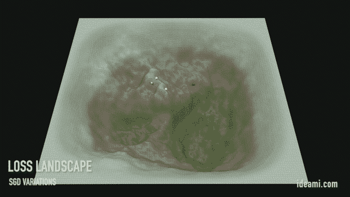

# 用 Python 从头开始编写 2 层神经网络

> 原文：<https://towardsdatascience.com/coding-a-2-layer-neural-network-from-scratch-in-python-4dd022d19fd2?source=collection_archive---------1----------------------->

## 本系列的第二部分:从头开始编写一个神经网络。用它来预测恶性乳腺癌肿瘤


[**在本文的第 1 部分**](/the-keys-of-deep-learning-in-100-lines-of-code-907398c76504) 中，我们了解了我们的 2 层神经网络的架构。**现在是建造它的时候了！**同时，我们将深入探索和理解深度学习、反向传播和梯度下降优化算法的基础。

Navigating the Loss Landscape within deep learning training processes. Variations include: Std SGD, LR annealing, large LR or SGD+momentum. Loss values modified & scaled to facilitate visual contrast. Visuals by Javier Ideami@ideami.com

# 重要的事情先来

首先，如果你想**尝试你自己的编码**以及这篇文章，一个选择是使用 **Jupyter 笔记本。它们极大地促进了在一个对数据探索者和研究人员非常友好的环境中使用 Python 代码进行工作和实验。你可以免费使用 Jupyter 笔记本，比如在**谷歌实验室**:[colab.research.google.com](https://colab.research.google.com)。**

所以，我们开始吧！**首先我们导入一些标准的 Python 库。** **Numpy** 将帮助我们实现线性代数和数组功能。当我们导入和准备数据时，数据框将会非常方便。Matplotlib 将帮助我们做一些很酷的图表。最后， **sklearn** 帮助我们标准化我们的数据并显示有用的图表，例如混淆矩阵。

```
import numpy as np 
import pandas as pd 
import matplotlib.pyplot as plt
from sklearn import preprocessing
from sklearn.preprocessing import MinMaxScaler
from sklearn import metrics
from sklearn.metrics import confusion_matrix
import itertools
```

接下来，我们创建**一个 Python 类来设置和初始化我们的网络**。

```
class dlnet:
    def __init__(self, x, y):
        self.X=x
        self.Y=y
        self.Yh=np.zeros((1,self.Y.shape[1])) self.L=2
        self.dims = [9, 15, 1] self.param = {}
        self.ch = {}
        self.grad = {} self.loss = []
        self.lr=0.003
        self.sam = self.Y.shape[1]
```

我们首先**命名我们的类** (dlnet)，并定义它的 init 方法。第一次实例化该类时， **init 方法**被**执行。它负责创建网络结构和控制网络的方法。**

然后我们**创建一系列保存网络关键数据的类变量。**

这些变量中有很多都是矩阵。请记住，我们将通过使用矩阵合并多个计算来加速我们的计算。正如我之前指出的，如果你想刷新你的线性代数，可以查看 YouTube 上令人惊叹的视频 **3Blue1Brown** ，特别是他的[线性代数系列精华](https://www.youtube.com/watch?v=fNk_zzaMoSs&list=PLZHQObOWTQDPD3MizzM2xVFitgF8hE_ab)。

*   **X** :保存我们的输入层，我们给网络的数据。我们用变量 **x，**的值来初始化它，当我们创建它时，这个变量被传递给网络。 **X** 是一个矩阵，它的行数与特征拥有的数据一样多(稍后将详细介绍)，列数与我们可用来训练网络的样本一样多。
*   Y :保存我们想要的输出，我们将用它来训练网络。我们用变量 **y** 的值初始化它，当我们初始化它时，它被传递给网络。
*   **Yh** :保存我们的网络产生的输出。它应该与我们期望的目标值 **Y** 具有相同的尺寸。我们将其初始化为零。
*   **L** :保存我们网络的层数，2。
*   接下来，我们定义每一层中神经元或单元的数量。我们用 numpy 数组来做这个。数组的第一个组件是我们的输入(它不被算作网络的一层)。我们的输入将有 9 个单元，因为正如我们稍后将看到的，我们的数据集将有 9 个有用的特征。接下来，神经网络的第一层将有 15 个神经元，我们的第二层也是最后一层将有 1 个(网络的输出)。
*   **param** :一个 Python 字典，将保存网络各层的 W 和 b 参数。
*   ch :一个缓存变量，一个 python 字典，它将保存一些我们在梯度下降算法的反向传递中需要的中间计算。

最后，我们声明另外三个参数。

*   **lr** :我们的学习率。这设定了网络学习的速度。
*   山姆:我们拥有的训练样本的数量。
*   **loss** :我们将存储**网络**每 x 次迭代的损耗值的数组。损失值表示我们的网络的预测输出和目标输出之间的差异。

注意最后一个元素，**损失，**因为**它是至关重要的。损失值是多少？这一切都与训练我们的网络学习神秘功能的过程有关。**

我们很快就会谈到这一点，但首先，让我们定义函数 **nInit** ，它将用随机值初始化我们网络的参数。

```
def nInit(self):    
        np.random.seed(1)
        self.param['W1'] = np.random.randn(self.dims[1], self.dims[0]) / np.sqrt(self.dims[0]) 
        self.param['b1'] = np.zeros((self.dims[1], 1))        
        self.param['W2'] = np.random.randn(self.dims[2], self.dims[1]) / np.sqrt(self.dims[1]) 
        self.param['b2'] = np.zeros((self.dims[2], 1))                
        return
```

当我们将矩阵相乘时，就像乘积 **W1 X** 和 **W2 A1** 一样，为了使乘积成为可能，这些矩阵的维数必须正确。这就是为什么我们必须正确设置权重和偏好矩阵的维度。

*   **W1** :行数是该层的隐藏单元数，dims[1]，列数是上一层的特征数/行数(本例中为 X，我们的输入数据)，dims[0]。
    **b1** :行数与 W1 相同，单列。
    **W2** :行数是该层的隐藏单元数，dims[2]，列数也是该层的输入行数，dims[1]。
    **b2:** 行数与 W2 相同，单列。

**现在，**让我们在类**中定义一个函数，它将在我们网络中每一层的每个单元执行计算**。我们称之为 **forward** ，因为它将接受网络的输入，并通过不同的层向前传递，直到产生输出。

我们还需要声明 **Relu** 和 **Sigmoid 函数**，它们将计算每层输出的非线性激活函数。

```
def Sigmoid(Z):
    return 1/(1+np.exp(-Z))def Relu(Z):
    return np.maximum(0,Z)def forward(self):    
        Z1 = self.param['W1'].dot(self.X) + self.param['b1'] 
        A1 = Relu(Z1)
        self.ch['Z1'],self.ch['A1']=Z1,A1

        Z2 = self.param['W2'].dot(A1) + self.param['b2']  
        A2 = Sigmoid(Z2)
        self.ch['Z2'],self.ch['A2']=Z2,A2 self.Yh=A2
        loss=self.nloss(A2)
        return self.Yh, loss
```

**Relu** 和 **Sigmoid** 函数声明激活计算。forward 函数执行我们之前描述的计算。

我们将第一层的权重乘以输入数据，并添加第一个偏置矩阵 **b1** ，以产生 **Z1** 。然后我们将 **Relu** 函数应用于 **Z1** 以产生 **A1** 。

接下来，我们将第二层的权重矩阵乘以其输入 **A1** (第一层的输出，即第二层的输入)，并添加第二个偏置矩阵 **b2** ，以产生 **Z2** 。然后，我们将 Sigmoid 函数应用于 **Z2** 以产生 **A2** ，它实际上是网络的输出 **Yh** 。

就是这样！**我们只是通过网络运行我们的输入数据，并产生 Yh，**一个输出。

合乎逻辑的下一步是找出我们的结果有多好。

为此，我们可以将我们产生的输出与我们应该获得的输出进行比较: **Yh 和 Y** 。为了进行计算，我们将向网络添加最后一个函数**损失函数**。

# 希望没什么损失

损失函数有很多种。损失函数的**目标是**表示我们的结果离预期目标**有多远，并对我们用来训练网络的所有样本的差值进行平均。**

深度学习中使用的最简单的损失函数之一是 **MSE、**或**均方误差**。

```
**squared_errors** = (self.Yh - self.Y) ** 2
**self.Loss=** np.sum(squared_errors)
```

**MSE** loss 函数计算差异，即我们使用的所有样本的预测输出和目标输出之间的距离，然后计算该差异的平方。

最后，它将所有这些操作相加。距离的平方确保我们产生一个总是正的绝对距离值。

**MSE 是一种简单的方法，用于确定我们离目标有多远，**我们的网络计算出的函数在连接输入数据和目标输出方面有多精确。

**MSE 常用于回归挑战**，当网络输出为连续值时，例如:温度值或房屋成本。

然而，在本文中，我们将致力于一种不同的挑战，一种**二元分类挑战**，其中我们的输出将是 0 或 1 (0 表示良性，1 表示恶性)。

在处理分类挑战时，有一个不同的损失函数可以更好地表达我们的预测输出和正确输出之间的差异。它被称为**交叉熵损失函数**，我们将在我们的网络中使用它。

我们选择损失函数的依据是**它们在多大程度上表达了我们的网络性能质量与我们正在应对的特定挑战的关系**。交叉熵对于分类问题来说是一个**巨大的损失函数**(就像我们将要研究的那个一样)，因为**它强烈地惩罚了那些有把握但却是错误的预测**(就像以很高的把握预测一个肿瘤是恶性的，而实际上它是良性的)。

```
def nloss(self,Yh):
        loss = (1./self.sam) * (-np.dot(self.Y,np.log(Yh).T) - np.dot(1-self.Y, np.log(1-Yh).T))    
        return loss
```

正如你在上面看到的，在 **forward** 函数的末尾，我们调用这个 **nloss** 方法(它计算损失)，然后将得到的损失值存储在 **loss** 数组中。这将使我们稍后能够绘制并直观地理解损失值在网络训练期间如何变化。

信不信由你，我们已经创建了几乎一半我们需要的代码。但是现在我们到了关键时刻。

我们已经计算了一个产量 **Yh** ，并且**计算了损失:**我们离预期产量有多远， **Y** 。现在的问题是:**怎样才能提高那个结果 Yh，提高是什么意思？**

为了改善结果，**我们需要得到那个损失值来减少**。我们的损失值越低，我们的目标和预测输出( **Y** 和 **Yh** )之间的距离就越小，我们的网络性能就越好。

让我们回顾一下。我们在网络中产生两种输出:

*   **Yh** ，网络的计算结果。
*   **损耗**，Yh 和 Y 之间的距离**。**

并且正是从那个目标，**从最小化损失的目标，最小化我们的预测和正确输出之间的距离的目标，**网络的训练过程诞生了。****

# 我需要一个健身房

在这个阶段，我们已经执行了一次正向传递，获得了我们的输出 **Yh** ，然后计算我们的损失、我们的误差、我们的预测输出和正确输出之间的距离( **Yh 和 Y** )。

下一个合乎逻辑的步骤是**稍微改变我们网络的参数值、**我们的权重和偏差、**并再次执行前向传递，以查看我们的损失是否有望减少**。因此，培训过程应该是这样的:

*   我们最初**将权重和偏差**设置为随机值。
*   我们通过网络向前运行输入数据，并产生一个结果:Yh。
*   我们**计算预测输出和目标输出之间的损耗，即 Yh 和 Y** 之间的距离。
*   **如果不够好**，我们**稍微改变我们的权重和偏差，并再次通过网络运行**输入数据，看看我们的损失是否有所改善，如果现在足够低。如果没有，**我们不断重复同样的过程**(大概几千年)。

你说对了，**那一点效率都没有**。

现在，想一想，要稍微改变我们的权重和偏差，我们可以做两件事情中的一件:

*   我们可以增加一点
*   我们可以减少一点。

**一定有办法，**以我们的损失为起点，**我们可以**计算我们是否应该增加或减少** **以使**这样的损失最小化。**

****输入微积分，输入强大的导数，梯度**。让我们用非常简单的方法来探索导数是如何工作的。如果你想更深入，我会用 3Blue1Brown E [微积分的本质](https://www.youtube.com/watch?v=WUvTyaaNkzM&list=PLZHQObOWTQDMsr9K-rj53DwVRMYO3t5Yr)系列再给你介绍一遍。**

# **Hello 渐变**

****为了了解我们应该朝哪个方向改变**我们的权重和偏好，最好是**了解这些权重和偏好**的微小变化**会对我们的最终亏损产生什么影响。****

**而**我们可以对这个**使用导数，准确的说是偏导数。因为偏导数**将告诉我们一个特定参数**的微小变化，比如说 **W1** ，对我们的最终损失有什么影响。**

**有了这些信息，**我们将能够决定在什么方向上修改 W1** 以减少损失。**

**先来**刷新一下导数的直觉**。**

**想想函数 x 的 2 次幂:x**2**

****

**在 x=3，y=9 时。让我们把注意力集中在那个点上，求导数，x=3 时的变化率。**

**为了做到这一点，我们将研究当我们把 x 稍微增加一点时，y 会发生什么。这个微小的量最终收敛到 0(极限)，但出于我们的目的，我们将认为它是一个非常小的值，比如 0.001。**

**那么，当 **x=3+0.001** ，**y 的值是多少呢？**y =(3.001)* * 2 =**9.006****

**因此当 x 增加 0.001 时，x=3.001 变成 y=9.006。**

****而变化率(导数)**就是新的 f(x+h)和之前的 f(x)之差，除以那个微小的增量 h:(9.006–9)/0.001 =**6。****

****6 告诉我们什么？****

**6 告诉我们，在这个函数 x**2 中，在 x=3 时，变化率为正，强度为 6。它告诉我们，在这一点上，如果我们增加 x 一点，y 会以一种积极的方式改变，并且强度是“6 倍以上”。基本上是**，输入端的 0.001 增量将变成输出端的 0.006 增量。****

**所以我们看到，我们可以很容易地按照这种方法手动计算导数:**

****导数= (f(x+h) — f(x) ) /h****

**那么**在 x=-2** 时呢？
dx = f(-2+0.001)-f(-2))/0.001
dx = f(-1.999)-f(-2))/0.001
dx = 3.996–4/0.001 =-4**

**在 x=-2 处，变化率为负，函数向下移动，强度为 4。**

**用这种方法计算导数**需要很长时间**，但是感谢数学天才，通过使用微分方程，表达原始函数导数的特殊方程，很容易快速计算它们。因此，不用计算每一点的导数，**一个简单的方程就能自动计算出这个函数的所有地方！****

**大多数，但不是所有的方程，都有一个可以用另一个方程表示的导数。**

****x**2 的导数 i** s 函数 **2x** 。我们用字母 **d** 来表示导数，后面是我们正在研究的变量的变化率。**

****如果 dx =2x:****

*   **当 x 为 3 时，dx 等于 2*3 = 6**
*   **当 x 为-2 时，dx 等于 2*-2 = -4**
*   **两者都符合我们的手工计算。使用微分方程要快得多！**

**好吧，让我们回顾一下。**借助导数，我们可以了解当我们修改某个输入变量(本例中为 x)时，函数的输出在某个点朝哪个方向变化。****

**如果我们能够**使用导数来了解我们的权重和偏差**的微小变化如何影响网络损耗，那就太好了。**

*   **如果我们看到损失相对于重量的**导数为正**，这意味着增加重量会使损失增加。也就是说:反其道而行之，**减少体重**使损失减少。**
*   **而如果我们发现**导数是负的**，就意味着增加重量使得损失减少。这就是我们想要的！。所以我们接着进行**增加权重**的值。**
*   **因此，通过观察损耗相对于网络参数的导数，我们可以了解改变该参数对网络损耗的影响。**
*   **基于此，我们可以修改该参数，使其影响朝着降低损耗的方向移动。**

**不过，还有一个小问题，**最后一个障碍。****

**我们的网络是由层构成的。它可以有 2 层或 200 层。**我们需要了解所有权重和偏差的变化**如何影响网络末端的损耗。**

**记住，我们的网络是一系列连锁在一起的功能。例如，如果我们想在多层网络中计算 W1 的变化如何影响最终输出端的损耗，**,我们需要找到一种方法来连接 W1 和网络末端损耗之间的不同导数**,使它们相互关联。**

****我们能不能，以某种方式，锁住他们？****

# **链式法则**

**是的，确实如此。微积分给了我们一个叫做**的东西，导数的链式法则**，当我们仔细看的时候，这确实是一个非常简单的概念。**

**首先，**偏导数**是研究当我们修改一个变量时，另一个变量发生的变化的导数。**

**要将这一切与即将到来的代码联系起来:**

*   **例如，我将把**损失**相对于输出 **Yh** 的偏导数命名为 **dLoss_Yh****
*   **即:损失函数相对于变量 Yh 的导数。**
*   **也就是说:**当我们稍微修改 Yh，对损失有什么影响？****

****链式法则**告诉我们，为了理解**一个变量的变化对另一个**的影响，当它们彼此远离时，我们可以**通过乘以它们的**将它们之间的偏导数链接起来。**

**是时候谈谈神经网络中的反向传播算法了，在这种情况下，特别是在我们的 2 层网络中。**

****反向传播**利用链式法则找出网络不同参数的变化对其最终损耗值的影响程度。**

****让我们挑选一个参数，了解链式法则的作用。****

**假设我们想了解 **W1** 的微小变化会如何影响损失。好吧，让我们从损失的等式开始:**

****损失= -(Y Log Yh + (1-Y) Log (1-Yh))****

**嗯， **W1** 不在这个等式里，但是 **Yh** 在。让我们继续计算我们的结果 Yh 的变化如何影响损失。让我们看看，在我们这样做之后，我们是否可以继续链接导数，直到我们到达 **W1** 。**

**为了计算这个导数，我们寻找**损失函数的导数方程。**稍微刷新一下微积分，或者上网查一下，就能学会快速找到各类方程的导数。在这种情况下，我们发现:**

****dLoss _ Yh =—(Y/Yh—(1-Y)/(1-Yh))****

**好了，搞定一个。现在，请记住，我们希望**继续链接导数，直到我们到达 W1** 。**

**让我们看看，**我们网络的下一步是什么，我们是如何生产 Yh 的？****

****Yh =乙状结肠(Z2)****

**好吧，很好。W1 仍然不存在，但是我们得到了 Z2。所以我们来看看 Z2 的变化对 Yh 有什么影响。为此，我们需要知道 sigmoid 函数的导数，恰好是:**

****dSigmoid = sigmoid(x)*(1.0—sigmoid(x))。****

**为了简化书写，我们将该微分方程表示为 **dSigmoid** 。因此:**

****dYh _ Z2**=**dSigmoid(Z2)****

**在这一阶段，我们已经可以将这两个导数链接起来(相乘),以找到损失相对于 Z2 的导数。**

****dLoss _ Z2**=**dLoss _ Yh * dSigmoid(Z2)****

**太好了，我们继续吧。**我们是怎么算出 z2 的？****

****Z2 = W2 A1 + b2****

**还是那句话， **W1** 还是没有，但是我们得到了 **A1** 。让我们看看 A1 的变化对 Z2 有什么影响。因此:**

****dZ2_A1 = W2****

****我们可以将该导数链接到之前的 2 个**，以获得 A1 和网络损耗之间的总导数:**

****dLoss _ A1**=**W2*****dLoss _ Z2****

**如你所见，**我们正在一个接一个地链接导数**，直到我们到达 W1，我们的目标。到目前为止，我们已经从损失转移到 Yh，从 Yh 转移到 Z2，从 Z2 转移到 A1。**

**非常好。我们继续。我们是如何产生 A1 的？**

****A1 = Relu (Z1)。****

**W1 仍然不存在，但是我们有了 Z1。我们需要 Relu 的导数。当输入为 0 或小于 0 时，Relu 函数的导数为 0，否则为 1。**

**同样，为了简化写法，我们将它表示为 **dRelu** 。**

****dA1_Z1=dRelu (Z1)****

**很好，让我们再次将这个最新的导数与所有之前的导数链接起来，以获得损失相对于 Z1 的完整导数:**

****dLoss _ Z1**=**dLoss _ A1 * dRelu(Z1)****

**太好了，我们正在接近！我们是如何计算 Z1 的？**

****Z1 = W1 X+ b1****

**是啊！W1 在那里！我们很想你 W1！见到你真是太好了！:)**

**太刺激了！因此这将是最终的导数:**

****dZ1_W1 = X****

**让我们把这个最新的衍生产品和之前的联系起来:**

****dLoss_W1= X * dLoss_Z1****

**仅此而已。我们已经计算了损耗相对于参数 W1 的导数。**也就是我们稍微修改 W1 的时候，损耗变化多少，往哪个方向变化。****

**让我们回顾一下:**

*   **我们已经从网络的末端开始，在损失值处，逐渐链式衍生，直到到达 W1。**
*   **通过**链式法则**，我们开始一个接一个地**将所有这些导数**相乘，以找到最终的变化率**，即 W1 的变化对网络输出损耗的影响。****

**在 Python 代码中，正确排序以说明我们乘矩阵的方式，**这个链接过程的代码是**:**

****dLoss _ Yh**=——(NP . divide(self。y，self。Yh ) — np.divide(1 —自身。y，1 —自我。Yh))
**dLoss _ Z2**=**dLoss _ Yh*** dSigmoid(self . ch[' Z2 '])
**dLoss _ A1**= NP . dot(self . param[" W2 "])。t，**dLoss _ Z2**)
**dLoss _ Z1**=**dLoss _ A1*** dRelu(self . ch[' Z1 '])
**dLoss _ W1**= 1。/自我。x . shape[1]* NP . dot(**dLoss _ Z1**，self。X.T)**

**请注意，在最后一步，**我们将结果除以层的单元数，**，从而使与每个权重 **W** 相关的导数在每个单元上正确缩放。**

**你刚刚看到的是**反向传播**，或者说**几乎是所有深度学习过程的关键成分。****

****

**让我们呼吸吧！这是整篇文章中最难的部分，从现在开始事情变得容易了。**

*   **通过计算 W1 的变化对输出端损耗的影响，我们现在可以决定如何修改 W1 以降低该损耗。**
*   **如果导数为正，这意味着 W1 的变化增加了损失，因此:我们将减少 W1。**
*   **如果导数是负的，这意味着对 W1 的改变减少了损失，这就是我们想要的，所以:我们将增加 W1 的值。**
*   **我们对 W1 所做的，我们将以完全相同的方式对 W2、b1 和 b2 做。**

**通过这种方式，我们产生了反向传递，它成为了我们的 python 类的反向传播函数。我们还声明了 dRelu 和 dSigmoid，它们是 Relu 和 Sigmoid 函数的派生物，在计算反向传播算法时需要用到它们。**

```
def dRelu(x):
    x[x<=0] = 0
    x[x>0] = 1
    return xdef dSigmoid(Z):
    s = 1/(1+np.exp(-Z))
    dZ = s * (1-s)
    return dZdef backward(self):
        dLoss_Yh = - (np.divide(self.Y, self.Yh ) - np.divide(1 - self.Y, 1 - self.Yh))    

        dLoss_Z2 = dLoss_Yh * dSigmoid(self.ch['Z2'])    
        dLoss_A1 = np.dot(self.param["W2"].T,dLoss_Z2)
        dLoss_W2 = 1./self.ch['A1'].shape[1] * np.dot(dLoss_Z2,self.ch['A1'].T)
        dLoss_b2 = 1./self.ch['A1'].shape[1] * np.dot(dLoss_Z2, np.ones([dLoss_Z2.shape[1],1])) 

        dLoss_Z1 = dLoss_A1 * dRelu(self.ch['Z1'])        
        dLoss_A0 = np.dot(self.param["W1"].T,dLoss_Z1)
        dLoss_W1 = 1./self.X.shape[1] * np.dot(dLoss_Z1,self.X.T)
        dLoss_b1 = 1./self.X.shape[1] * np.dot(dLoss_Z1, np.ones([dLoss_Z1.shape[1],1]))  

        self.param["W1"] = self.param["W1"] - self.lr * dLoss_W1
        self.param["b1"] = self.param["b1"] - self.lr * dLoss_b1
        self.param["W2"] = self.param["W2"] - self.lr * dLoss_W2
        self.param["b2"] = self.param["b2"] - self.lr * dLoss_b2 
```

**在后向函数中，在计算完 W1、b1、W2 和 b2 所需的所有导数后，我们在最后一行中通过减去导数并乘以我们的学习速率来更新我们的权重和偏差。**

**请记住，**学习速率**是一个允许我们**设置网络学习速度**的参数。因此，我们通过与学习速度成比例的数量来修改我们的权重和偏差。**

**好的，目前为止我们有:**

*   **向前传球**
*   **计算网络的损耗**
*   **执行了反向传递并更新了我们网络的参数(以便在下一次正向传递中损耗会降低)。**

**事实上，**梯度下降优化算法**，这是训练我们神经网络的另一个迷人的难题。**

**是时候回到本文的第一个动画了。**

# **沿着梯度下降**

**我们再来看看文章的第一个动画。**

****

**Navigating the Loss Landscape. Values have been modified and scaled up to facilitate visual contrast.**

**这就是**梯度下降优化算法**，这是**逐步优化我们网络的权重**的基础和最常用的方法，最终它们将允许我们计算一个函数，该函数将我们的输入数据与我们期望的输出准确有效地联系起来。**

**让我们分析一下动画中发生了什么，它代表了**梯度下降算法的关键方面。****

*   **我们首先用随机值初始化我们的权重和偏差。我们**建立我们训练过程的初始状态**。**

****

*   **然后，我们通过网络馈送输入数据，以执行正向传递，并获得 **Yh** 。有了 **Yh** 我们现在就可以**计算损失:**我们离理想结果 **Y** 还有多远？我们的目标是减少损失，使它尽可能小。**
*   **你在动画中看到的是**我们网络的可能损失值**的一幅风景。**
*   **地貌有**山丘和**山谷。丘陵是损耗高的地方。山谷是我们称之为“极小值”的地方，在那里损失很低。**

****

*   **一个函数可以有多个**局部最小值**和一个**全局最小值**。全局最小值是景观的最低部分，是最低的可能损失值。可能有其他的谷是局部极小值，这些地方的损失很低，但还没有低到可能的程度。**

****

*   ****当我们最初用随机值**设置我们的权重和偏差，并执行我们的第一次向前传球来计算我们的第一次损失值时，就好像我们正在**将球随机定位在该动画中的初始景观部分**。**
*   **我们**在可能损失值**范围内的某个地方随机抛球。**
*   **通常，我们会将它放在该地形的一个山丘上，因为开始时权重是随机的，网络不是很有效，损耗会很高，我们会被定位在该地形的一个高地(高损耗)**

****

*   **我们的目标是从初始点开始，逐渐向高处的一个山谷移动，希望到达全局最小值(最低的山谷)，即损失尽可能小的一部分。**

****

*   **为了做到这一点，我们执行**梯度下降算法**。我们已经在前一节中看到了它的一个迭代。我们现在要做的就是让**不断重复同样的过程，直到我们的损失变得足够小。****
*   **我们执行向前传递，计算损失，然后执行向后传递来更新我们的权重和偏差。**
*   **然后，我们重复相同的过程多次(预先设置)，或者直到损失变得稳定。**

********

**让我们看一下代码:**

```
nn = dlnet(x,y)
nn.gd(x, y, iter = 15000)def gd(self,X, Y, iter = 3000):
        np.random.seed(1)                         

        self.nInit()

        for i in range(0, iter):
            Yh, loss=self.forward()
            self.backward()

            if i % 500 == 0:
                print ("Cost after iteration %i: %f" %(i, loss))
                self.loss.append(loss)

        return
```

**就这样？对，就是这样。**

**我们首先实例化我们的神经网络。然后运行多次迭代，执行向前和向后传递并更新我们的权重。每 x 次迭代，我们打印损失值。**

**经过不到 100 行的 Python 代码，**我们有了一个全功能的 2 层神经网络，它执行反向传播和梯度下降。****

**这是一个基本的网络，现在可以在许多方面进行优化。因为正如我们将很快讨论的，神经网络的性能受到许多关键问题的强烈影响。两个非常重要的是:**

*   **特征工程(Feature engineering):理解我们的输入数据，并以一种使网络工作更容易的方式准备它。**
*   ****超参数优化:**神经网络的超参数是那些对训练过程有关键影响的变量，不包括权重和偏差。它们包括:**学习率，层数，每层单元数**等。**

**关于优化算法，在本文中，我们使用最简单和最纯粹的梯度下降算法。我们的目的是了解反向传播和基本的优化和训练过程。**

**梯度下降有很多种变体，稍后我会列举其中几种。两个非常简单的例子是:**

*   ****批量梯度下降:**我们不是在整个训练集上运行我们的正向和反向通道，而是批量运行它们。假设我们有 1000 行数据。我们将 1000 行分成 10 批，每批 100 行。然后，我们将对第一批(前 100 行)运行训练循环(向前和向后传递),并继续更新我们的权重。然后，我们继续进行其余的批次。当我们完成所有批次(本例中为 10 个)时，这被称为一个**时期**。然后我们继续下一个纪元。处理大型数据集时，批量梯度下降训练比纯梯度下降算法更快，因为您更新权重的频率更高(您不必等到处理完整个数据集后再更新网络参数)。**
*   ****随机梯度下降:**当你的批次的**大小为 1** 时，这叫做随机梯度下降。它甚至更快，因为您在处理每一个样品后都会更新您的重量。但是，由于网络是基于非常少的数据做出决策的，因此它可能会产生不规则的路径(噪声)。有不同的方法来处理这个问题，其中一些将在本文后面提到。**

**现在是时候测试和尝试我们的网络了。只有使用它，我们才能充分了解它的潜力和局限性。**

**[**在本文的最后部分，第 3 部分**](/predict-malignancy-in-breast-cancer-tumors-with-your-own-neural-network-and-the-wisconsin-dataset-76271a05e941) **，**我们将使用威斯康星癌症数据集，学习准备我们的数据，通过 out 网络运行它并分析结果。我们还将讨论一些更高级的话题。我们来看 [**第三部**](/predict-malignancy-in-breast-cancer-tumors-with-your-own-neural-network-and-the-wisconsin-dataset-76271a05e941) 。**

****链接到本文的 3 个部分:**
[**第 1 部分**](/the-keys-of-deep-learning-in-100-lines-of-code-907398c76504) | [**第 2 部分**|](/coding-a-2-layer-neural-network-from-scratch-in-python-4dd022d19fd2)[**第 3 部分**](/predict-malignancy-in-breast-cancer-tumors-with-your-own-neural-network-and-the-wisconsin-dataset-76271a05e941)**