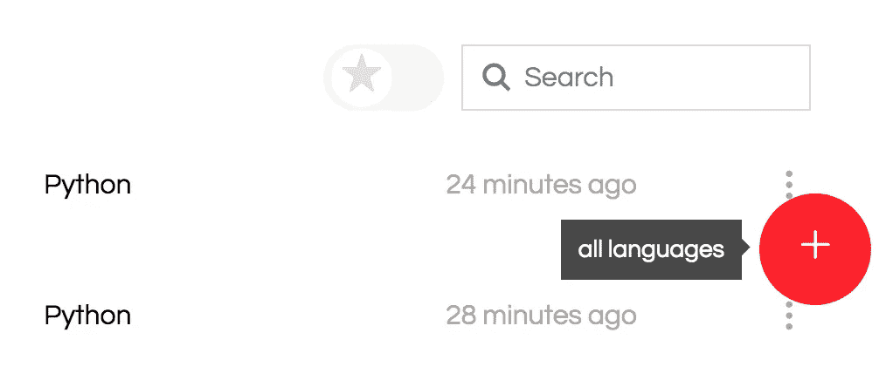
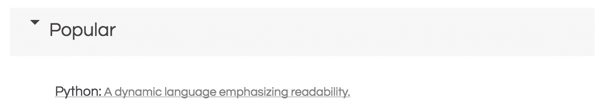
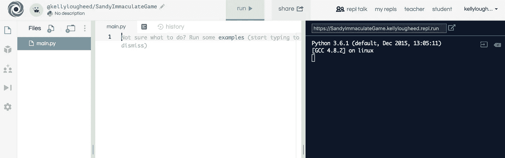
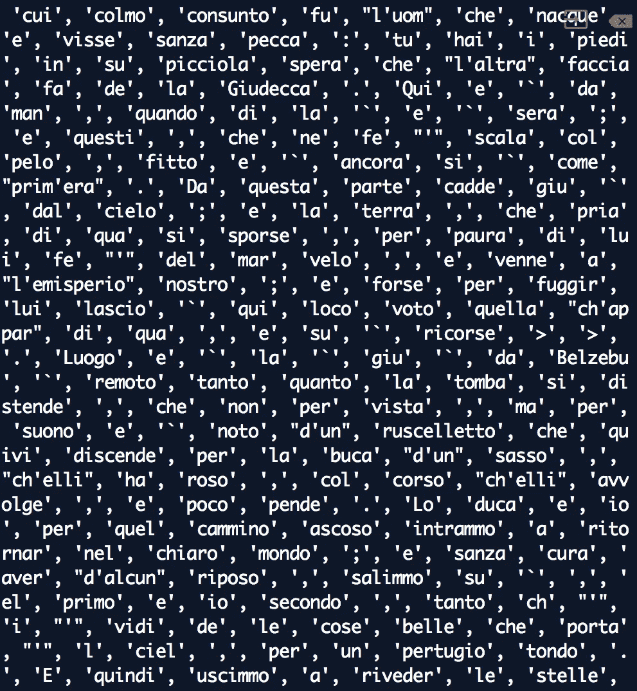
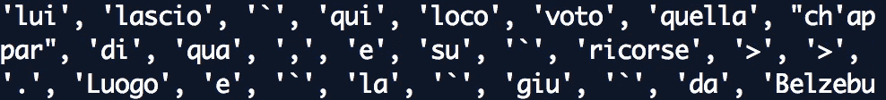
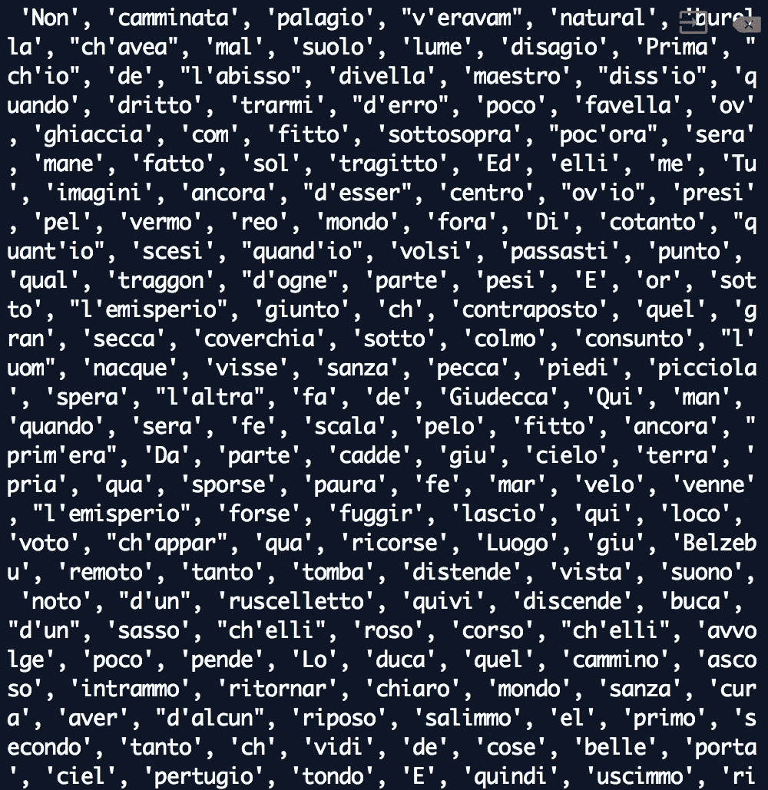
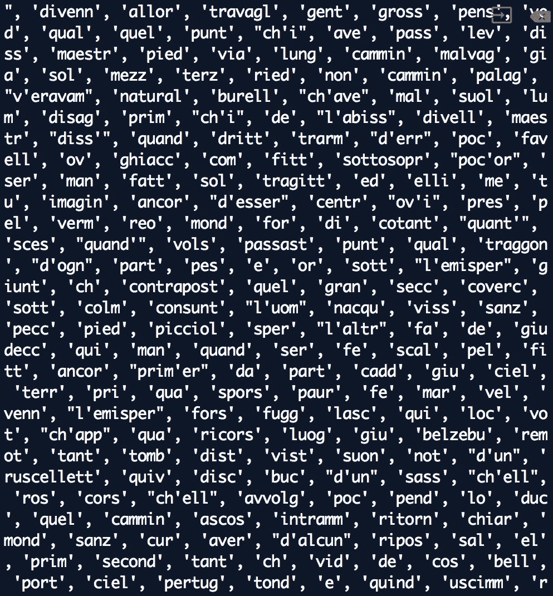
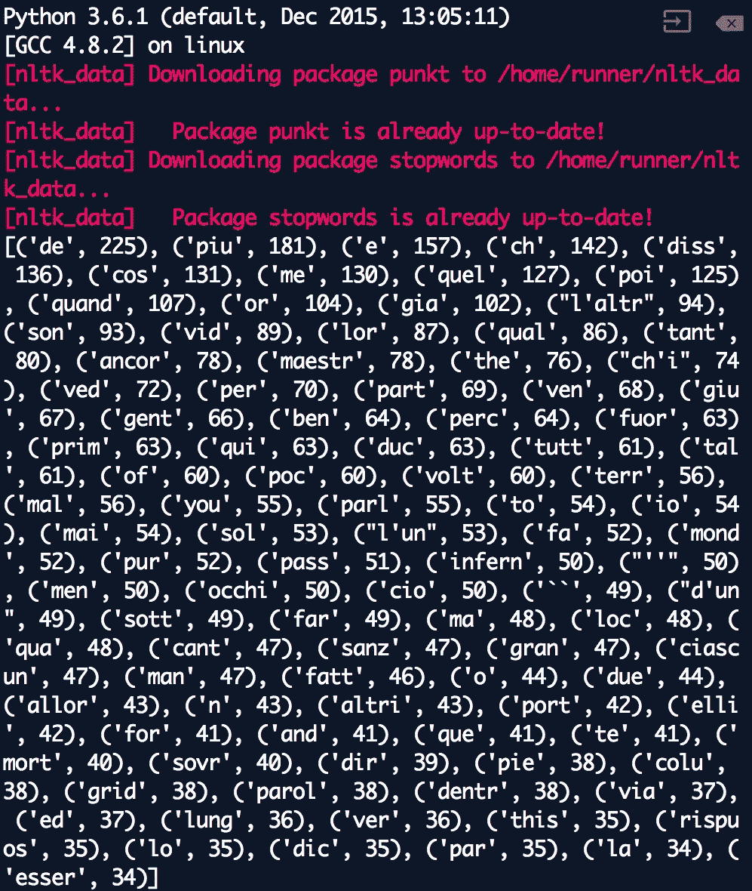

# 编码与世界语言文学:用 Python NLTK 分析但丁的《地狱》

> 原文：<https://towardsdatascience.com/coding-foreign-language-lit-analyzing-dantes-inferno-with-python-nltk-419124c9eb44?source=collection_archive---------14----------------------->


Photo by [DR. Alexandru STAVRICĂ](https://unsplash.com/photos/7W_ZvKSxQcA?utm_source=unsplash&utm_medium=referral&utm_content=creditCopyText) on [Unsplash](https://unsplash.com/search/photos/milan?utm_source=unsplash&utm_medium=referral&utm_content=creditCopyText)

本初级教程向您展示如何使用 Python NLTK(自然语言工具包)分析外语文本，这是一个自然语言处理平台，允许您将单词分解为词干，并确定文本中最常用的单词。

计算机科学可以连接到任何其他学科——所以如果你对编程感兴趣*和*梦想在意大利别墅的生活，这个教程就是为你准备的！

在本教程中，我们将通过词频来分析但丁的*地狱*的文本。《地狱》是一首 14 世纪的意大利诗歌，详细描述了作者虚构的地狱之旅。作者但丁由罗马诗人维吉尔带领，他带他参观了地狱的九层。

虽然这首诗已被翻译成英语，但原诗是用意大利语写的。你能预料到分析一首意大利诗歌的词频会有什么问题吗？

考虑一下罗曼语和英语中的动词变化。在英语中，你可以说“我说”和“你说”，而“说”这个词不会改变。主语(做动作的人)用单独的词“我”和“你”来表示但是在意大利语中——很像西班牙语和其他罗曼语——我不得不说*parl****o***(我说)和*parl****I***(你说)，通过单词的结尾表示主语。

因此，如果我们分析但丁的*地狱*中的词的频率，那么 *parlo* 和 *parli* 会被算作同一个词吗，来自不定式 *parlare* ？不会，因为电脑很笨，不懂意大利语。幸运的是，有一个解决方案！

在我们分析文本之前，我们可以使用一个叫做**标记化**的过程来分离所有的单词。然后我们把每个单词分解成词干。这个过程将把 *parlo* 和 *parli* 转换成它们现在的词干 *parl-* ，允许它们被算作同一个单词。到那时，文本就可以进行分析了。

让我们开始用 Python 编程，这样我们就可以标记但丁的*地狱*！

# Python 入门

总的来说，Python 是一种非常棒的数据分析语言，不管我们更侧重于科学还是人文学科。

要在 web 浏览器中开始使用 Python 编程，请访问 repl.it 并创建一个帐户。之后点击屏幕右下角的红色加号，做一个编码环境:



Click on the red plus sign.

从“流行”类别中选择“Python ”:



然后，您应该会看到一个空白的 Python 编辑器:



You’ll be typing in the white text area.

首先，我们需要从 NLTK 和其他包中导入和下载我们需要的所有东西。将这些导入复制并粘贴到您的 Python 编辑器中，然后阅读下面的解释。

```
import nltk
from nltk.corpus import stopwords
from nltk.probability import FreqDist
from nltk.stem.snowball import SnowballStemmer
from nltk.tokenize import word_tokenize
from urllib import request nltk.download('punkt')
nltk.download('stopwords')
```

我们的进口:

*   Python 附带的自然语言工具包
*   阻止来自 NLTK 的单词。这些是常见的词，比如“a”和“the ”,我们在分析频率时会想过滤掉它们。许多语言都有停用词，包括意大利语。
*   NLTK 的雪球斯特梅尔。这个工具可以让我们将每个单词缩减到它的词干，这样我们就可以准确地计算出它的频率，而不管它的语法上下文。雪球斯特梅尔用外语工作。
*   一个单词标记功能，允许我们将文本分解成单词列表进行处理。
*   一个请求函数，允许 Python 从 URL 中读取文本。

最后，我们从 NLTK 下载了一个名为“punkt”的包，它允许我们使用单词标记化功能，以及另一个名为“stopwords”的包，它允许我们访问上面提到的停用单词。

最后的文体提示:按字母顺序排列你的导入是一个好习惯。

# 从 URL 导入文本

将但丁的*地狱*的整个文本复制粘贴到一个单独的文件中真的很难(我试过了)，所以我们将使用 Python 从一个网站上读取文本！

我找到了。txt 文件(通常最容易处理),所以我要做的第一件事(在我的导入下面)是将该 URL 存储在一个变量中:

```
url = "https://www.gutenberg.org/cache/epub/997/pg997.txt"
```

现在，每当我说`url`，电脑就会知道我指的是 gutenberg.org 的地址。

接下来，我可以使用我导入的请求方法向 gutenberg.org 的服务器发送请求，并在服务器响应时获得文本 *Inferno* :

```
response = request.urlopen(url)
```

服务器将交付 *Inferno* 文本并将其存储在`response`变量中，但是它的格式会比我们需要的稍微复杂一些。我们可以用下面的代码行将 *Inferno* 变成一个易读的文本字符串:

```
text = response.read().decode('utf8')
```

基本上，我只是告诉计算机使用 UTF-8(一种常见的字符编码形式)将过于复杂的变量`response`翻译成简单的文本字符串。现在变量`text`将保存一串简单格式的文本，如下所示:

```
"Nel mezzo del cammin di nostra vita mi ritrovai per una selva oscura che la diritta via era smarrita..."
```

基本上，*地狱*的整篇文字都被引号包围了。在计算机科学中，我们将这种数据类型(由引号包围的一串字符/单词/短语)称为[字符串](https://www.gutenberg.org/cache/epub/997/pg997.txt)。

好了，我已经得到了友好格式的文本。接下来要做什么？如果你说的是“标记文本”，你答对了！

# 对文本进行标记

之前，我提到过标记化会产生“要处理的单词列表”列表实际上是 Python 中的一种数据结构(类似于其他语言中的数组)。而变量看起来像这样:

```
favorite_food = "tiramisu"
```

列表如下所示:

```
grocery_list = ["pasta", "tomato sauce", "pesto", "gelato"]
```

你可以看到，虽然一个变量只包含一个东西，但一个列表包含许多东西，这使得它对于杂货列表和书籍中的单词列表非常有用。当我们标记出 *Inferno* 时，它会变成这样:

```
"Nel mezzo del cammin di nostra vita..."
```

变成这样:

```
["Nel", "mezzo", "del", "cammin", "di", "nostra", "vita"]
```

编写令牌化的源代码可能很复杂，但是幸运的是，NLTK 为我们提供了这个功能！要将 *Inferno* 的原始文本转换成令牌，请编写这行代码:

```
tokens = word_tokenize(text)
```

现在，变量`tokens`应该包含一个单词列表。如果您想看看这个列表是什么样子(或者至少是它的底部，因为 repl.it 只能打印这么多)，您可以像这样打印标记:

```
print(tokens)
```



The tokens!

计算机可能需要一点时间来生成令牌。在你等待电脑的时候，沉浸在你的成就中——电脑通常工作得很快，无论何时你让它们变慢，你都知道你正在做复杂、重要的事情(或者不小心写了一个无限循环)。

作为一种捷径，我喜欢只打印令牌列表的长度，也就是说，列表中的单词数。您可以使用`len`函数来计算列表的长度:

```
print(len(tokens))
```

你应该有 45274 个令牌(或单词)！

如果您打印了令牌，您会注意到还包括了标点符号。什么？！



Some of the tokens are just commas and accents!

幸运的是，我们可以用下面的代码行来摆脱这种疯狂:

```
tokens = [token for token in tokens if token not in '.,:;<>!?[]()`"\'']
```

哇哦。这是怎么回事？！基本上，这是一个很酷的编程策略，我说:“将`tokens`变量设置为与之前相同的东西(之前存在的所有标记)，但过滤掉任何标记，实际上只是我明确列出的任何标点符号！”

如果再次打印令牌的长度，现在应该有 34，836 个令牌。

你可能会注意到，在这些标记中，我们有一些基本的单词，比如“la”(the)和“e”(and)。对于分析词频来说，这些基本单词对我们来说一点也不有趣——谁在乎但丁是否说了 1000 次“the ”?！

这些基本词在 NLTK 里叫做**停用词**，我们可以过滤掉。

# 过滤掉停用词

现在我们准备去掉停用词，那些我们不在乎的超级常用词。首先，让我们将停用词存储在一个变量中:

```
stop_words = stopwords.words("italian")
```

现在，我们可以做一些有趣的编程工作来从我们的列表中过滤出这些步骤。下面是我们如何将`tokens`变量重置为没有停用词的单词列表:

```
tokens = [token for token in tokens if token not in stop_words]
```

基本上，我说:“让`tokens`变量等于所有和以前一样的记号，除了`stop_words`列表中的单词/记号！”

为了再次检查是否所有讨厌的停用词都被删除了，我们可以打印出记号——以及记号的长度，以确保它与以前不同！

```
print(tokens)
print(len(tokens))
```

这个列表现在应该有 21781 个单词，比我们之前的 34k 左右的单词少了很多。

我们还可以看到，我们的新令牌列表很高兴地没有填充词和标点符号:



不错！

# 词干

现在我们准备把我们的话砍进他们的茎！首先，我们需要创建一个词干分析器。您可以像这样创建一个意大利词干分析器:

```
stemmer = SnowballStemmer("italian")
```

如果您使用的是不同的语言，请注意，您可以用这行代码打印雪球斯特梅尔处理的所有语言:

```
print(" ".join(SnowballStemmer.languages))
```

现在，我们可以用更巧妙的编程方法将所有单词转换成词干:

```
stems = [stemmer.stem(word) for word in tokens]
```

上面的代码行基本上解释为，“对于`tokens`列表中的每个单词(或标记)，将其转换为词干，并将这个新的词干列表存储在一个名为`stems`的变量中。”

您也可以用这行代码打印词干:

```
print(stems)
```



现在我们已经得到了茎，我们准备进行一些频率分析！

# 计算词频

现在我们可以尝试基于词频来分析但丁的*地狱*了！我将这一部分命名为“计算词频”，但计算机将是唯一一台进行数学运算的计算机——我们将只编写几行简洁的代码。这就是 NLTK 的妙处！

要在变量中存储频率分布，我们只需说:

```
fdist = FreqDist(stems)
```

在这一点上，一些程序员可能会做数据可视化，但如果我没有弄错的话，repl.it 没有这个功能——如果您想探索数据，您必须将 Python 和适当的包下载到您的计算机上。

但是，我们绝对可以打印出数值！有了这行代码，我可以打印出但丁的*地狱*中最常见的 100 个单词:

```
print(fdist.most_common(100))
```

酷，最常用单词列表！



看词频可以得出什么结论？或者说，检查这些频率引发了哪些问题？

我们可能会注意到，单词 *piu* (更多)，被使用了 181 次，而词干 *tant-* (更多)，被使用了 80 次。这些话表明地狱是一个极端的地方。

我们可能还会注意到词干 *l'altr-* (另一个)被使用了 94 次，这可能会导致对但丁的*地狱*中二元性的研究。

我们可以检查最常见的动词，它们与看和说有关，以及出现 50 次的单词 *occhi* (眼睛)。这些话表明了但丁在冥界的消极态度。

假设你是意大利文学的研究生。你还能想到什么？


Photo by [Willian West](https://unsplash.com/photos/Y5qJKfg0hJ8?utm_source=unsplash&utm_medium=referral&utm_content=creditCopyText) on [Unsplash](https://unsplash.com/search/photos/italy?utm_source=unsplash&utm_medium=referral&utm_content=creditCopyText)

# 进一步阅读

编程是面向所有人的，包括人文主义者！查看下面的参考资料，了解关于 NLTK 和 Python 数据分析的更多信息。

1.  [DataCamp](https://www.datacamp.com/) ，学习自然语言处理和其他 Python 数据分析的绝佳资源
2.  [编程历史学家](https://programminghistorian.org/)，一个数字人文教程的伟大资源
3.  [编码&英语文学:Python 中的自然语言处理，](https://medium.com/@kellylougheed/coding-english-lit-natural-language-processing-in-python-ba8ebae4dde3)关于分析英语文本的教程
4.  [如何使用 NLTK Porter &雪球测径器](http://www.nltk.org/howto/stem.html)
5.  [在 Python 中使用 NLTK 删除停用词](https://www.geeksforgeeks.org/removing-stop-words-nltk-python/)