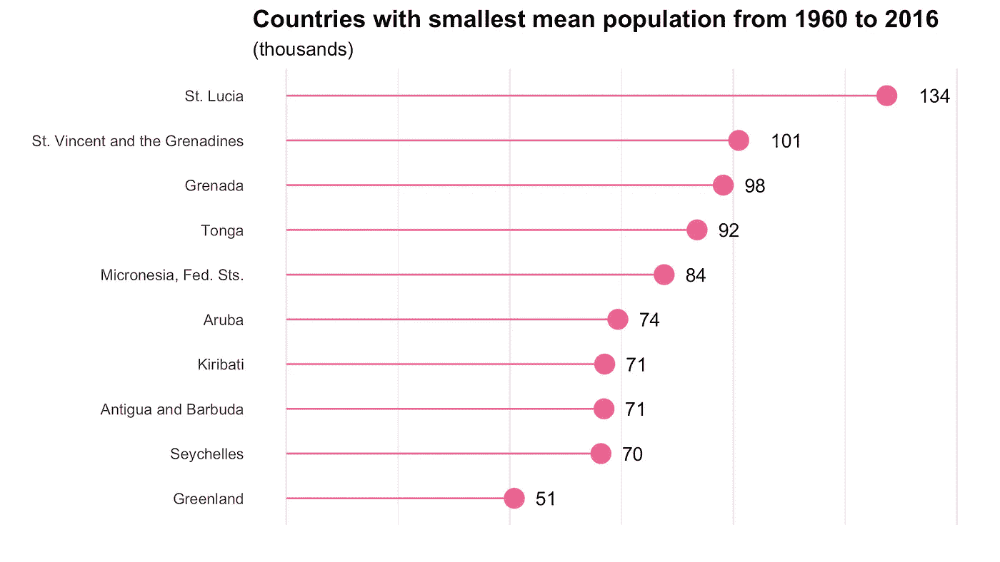

# R 中的编码:嵌套并映射到高效的代码

> 原文：<https://towardsdatascience.com/coding-in-r-nest-and-map-your-way-to-efficient-code-4e44ba58ee4a?source=collection_archive---------10----------------------->


Photo by [Olivia Colacicco](https://unsplash.com/@oliviac_design?utm_source=medium&utm_medium=referral) on [Unsplash](https://unsplash.com?utm_source=medium&utm_medium=referral)

# 嵌套并映射到高效代码

我在 2019 年 3 月写了我的第一行 R 代码，但是最近才发现`nest`和`map`的威力。在此之前，我写了很多效率低下的代码(C & P，C & P，C&P……)。

这是如何使用`nest`和`map`找到 184 个国家在 1960 年到 2016 年间使用`gapminder`数据集(内置于`dslabs`)的平均人口的简短演示。`gapminder`拥有 184 个国家从 1960 年到 2016 年每年的健康和收入数据。数据以整齐的格式呈现，这意味着每个国家有 57 行数据(每年一行)。

```
library(dslab
glimpse(gapminder)
```

`## Observations: 10,545
## Variables: 9
## $ country <fct> Albania, Algeria, Angola, Antigua and Barbuda, …
## $ year <int> 1960, 1960, 1960, 1960, 1960, 1960, 1960, 1960,…
## $ infant_mortality <dbl> 115.40, 148.20, 208.00, NA, 59.87, NA, NA, 20.3…
## $ life_expectancy <dbl> 62.87, 47.50, 35.98, 62.97, 65.39, 66.86, 65.66…
## $ fertility <dbl> 6.19, 7.65, 7.32, 4.43, 3.11, 4.55, 4.82, 3.45,…
## $ population <dbl> 1636054, 11124892, 5270844, 54681, 20619075, 18…
## $ gdp <dbl> NA, 13828152297, NA, NA, 108322326649, NA, NA, …
## $ continent <fct> Europe, Africa, Africa, Americas, Americas, Asi…
## $ region <fct> Southern Europe, Northern Africa, Middle Africa…`

# 嵌套并不可怕，你的数据也没有消失

`nest`仅在通过`group_by`进行操作时有效。在嵌套数据之前，必须对数据进行分组。通过`country`对`gapminder`进行分组，然后调用`nest`，结果如下:

```
gapminder_nest <- gapminder %>% 
  group_by(country) %>% 
  nest()head(gapminder_nest)## # A tibble: 6 x 2
## # Groups:   country [185]
##   country                       data
##   <fct>               <list<df[,8]>>
## 1 Albania                   [57 × 8]
## 2 Algeria                   [57 × 8]
## 3 Angola                    [57 × 8]
## 4 Antigua and Barbuda       [57 × 8]
## 5 Argentina                 [57 × 8]
## 6 Armenia                   [57 × 8]
```

我第一次用`nest`的时候，就被这个吓坏了。我不是来自编码或 IT 背景，看到`<list<df[,8]>>`足以让我删除代码，并恢复到剪切和粘贴来完成工作。

但实际上并不可怕。在这个新创建的名为`data`的列中，你看到的是每个国家整齐排列的健康和收入数据。可以通过调用`gapminder_nest$data[[x]]`来访问它，其中`x`是行。所以要打电话给澳大利亚(我来自的地方)，代码是`gapminder_nest$data[[8]]`。

```
gapminder_nest$data[[8]]## # A tibble: 57 x 8
##     year infant_mortality life_expectancy fertility population     gdp
##    <int>            <dbl>           <dbl>     <dbl>      <dbl>   <dbl>
##  1  1960             20.3            70.9      3.45   10292328 9.67e10
##  2  1961             20              71.1      3.55   10494911 9.90e10
##  3  1962             19.5            70.9      3.43   10691220 1.00e11
##  4  1963             19.2            71.0      3.34   10892700 1.07e11
##  5  1964             18.8            70.6      3.15   11114995 1.14e11
##  6  1965             18.6            71.0      2.97   11368011 1.21e11
##  7  1966             18.3            70.8      2.89   11657281 1.24e11
##  8  1967             18.3            71.1      2.85   11975795 1.31e11
##  9  1968             18.2            70.7      2.89   12305530 1.38e11
## 10  1969             18.1            71.1      2.89   12621240 1.48e11
## # … with 47 more rows, and 2 more variables: continent <fct>, region <fct>
```

# 绘制你的巢穴地图

`map`允许您对数据框中的所有列迭代函数。语法是:`map(.x, .f)`，其中`.x`是要迭代的数据帧，`.f`是函数。嵌套数据的一个小问题是在数据框中有数据框**。在`gapminder_nest$data`列中还有**列数据。****

因此，我们需要将`gapminder_nest$data`用作`.x`，而不是在`map`调用中使用`gapminder_nest`作为`.x`。这意味着`map`将迭代每个国家的**嵌套数据框**。

让我们使用嵌套数据和`map`找出 1960 年至 2016 年间每个国家的平均人口。将`.x`设置为`gapminder_nest$data`。这个功能不是简单的`mean`。如果你只是写代码，你的代码会抛出一个错误。记住，列中还有更多列**`data`。我们想要平均人口，所以`.f`的代码是`~mean(.x$population)`。简单地说，这段代码表示迭代所有嵌套的国家数据集，计算每个国家人口列的平均值。不要忘记`.f`代码中的波浪号`~`！**

(在下面的代码中，我设置了`na.rm = T`以避免数据缺失的国家/年份出现任何错误)

```
pop_mean <- map(.x = gapminder_nest$data, .f = ~mean(.x$population, na.rm = T))
head(pop_mean)## [[1]]
## [1] 2708629
## 
## [[2]]
## [1] 24231378
## 
## [[3]]
## [1] 11909433
## 
## [[4]]
## [1] 71053.36
## 
## [[5]]
## [1] 31638376
## 
## [[6]]
## [1] 2925011
```

# Mutate 是 nest 和 map 的秘方

然而，这个输出是非常无用的，因为我们不知道国家名称是什么。一个更简洁的解决方案是`mutate`现有的`gapminder_nest`并添加一个名为`pop_mean`的列。

```
gapminder_nest <- gapminder_nest %>%
  mutate(pop_mean = map(.x = data, .f = ~mean(.x$population, na.rm = T)))head(gapminder_nest)## # A tibble: 6 x 3
## # Groups:   country [185]
##   country                       data pop_mean 
##   <fct>               <list<df[,8]>> <list>   
## 1 Albania                   [57 × 8] <dbl [1]>
## 2 Algeria                   [57 × 8] <dbl [1]>
## 3 Angola                    [57 × 8] <dbl [1]>
## 4 Antigua and Barbuda       [57 × 8] <dbl [1]>
## 5 Argentina                 [57 × 8] <dbl [1]>
## 6 Armenia                   [57 × 8] <dbl [1]>
```

但这还是不对。我们可以看到国名，但看不到平均人口。这是因为`map`总是返回一个列表，所以平均人口在`gapminder_nest`的嵌套列表中。

# 渴望成功

要查看平均人口，只需在您希望可见的列上调用`unnest`，在本例中为`pop_mean`。

```
gapminder_nest %>% 
  unnest(pop_mean)## # A tibble: 185 x 3
## # Groups:   country [185]
##    country                       data  pop_mean
##    <fct>               <list<df[,8]>>     <dbl>
##  1 Albania                   [57 × 8]  2708629.
##  2 Algeria                   [57 × 8] 24231378.
##  3 Angola                    [57 × 8] 11909433.
##  4 Antigua and Barbuda       [57 × 8]    71053.
##  5 Argentina                 [57 × 8] 31638376.
##  6 Armenia                   [57 × 8]  2925011.
##  7 Aruba                     [57 × 8]    74148.
##  8 Australia                 [57 × 8] 16601155.
##  9 Austria                   [57 × 8]  7800180.
## 10 Azerbaijan                [57 × 8]  6897604.
## # … with 175 more rows
```

瞧啊。为了好玩，这里有一张平均人口最小的 10 个国家的图表。(滚动到代码末尾)



# TLDR；

结合`nest`和`map`创建高效的代码。然而，对于新手来说，有一些陷阱需要避免:

1.  你不能不先打电话给`group_by`就打`nest`。如果不这样做，代码就不知道嵌套基于哪个变量。
2.  你的数据没有消失！要访问嵌套数据框中的任何内容，请调用`nested_df$data[[x]]`，其中`x`是您想要查看的行。
3.  嵌套数据框中的列有自己的列。是俄罗斯娃娃。
4.  `map`允许您使用函数迭代数据框的列。对于嵌套数据框，列中有列，因此可以编写`.x = nested_df$data`和`.f = ~some_function(.x$nested_column_inside_data_column)`。
5.  不要忘记你的地图函数中的波浪符号`~`！不要担心为什么(那是另一个帖子的内容)，去做就是了。

# 绘图代码

```
gapminder_plot <- gapminder_nest %>% 
  unnest(pop_mean) %>% 
  select(country, pop_mean) %>% 
  ungroup() %>% 
  top_n(pop_mean, n = -10) %>% 
  mutate(pop_mean = pop_mean/10^3)gapminder_plot %>% 
  ggplot(aes(x = reorder(country, pop_mean), y = pop_mean)) +
  geom_point(colour = "#FF6699", size = 5) +
  geom_segment(aes(xend = country, yend = 0), colour = "#FF6699") +
  geom_text(aes(label = round(pop_mean, 0)), hjust = -1) +
  theme_minimal() +
  labs(title = "Countries with smallest mean population from 1960 to 2016",
       subtitle = "(thousands)",
       x = "",
       y = "") +
  theme(legend.position = "none",
        axis.text.x = element_blank(),
        plot.title = element_text(size = 14, face = "bold"),
        panel.grid.major.y = element_blank()) +
  coord_flip() +
  scale_y_continuous(limits = c(0, 150))
```