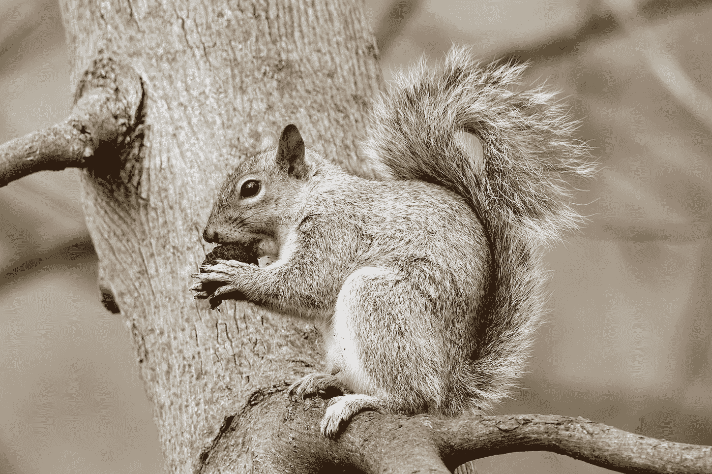
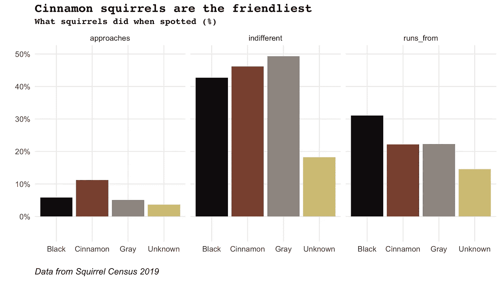

# 用 R: Pivot 轻松编码

> 原文：<https://towardsdatascience.com/coding-in-r-pivot-painlessly-32e40a0b6c3d?source=collection_archive---------14----------------------->

## pivot _ longer 和 pivot _ wider 快速指南

我不能`gather`或者`spread`。我有某种精神障碍，记不清哪个是哪个。我几乎总是用错，以一些奇怪的笔记本结束，沮丧地关上我的笔记本电脑。所以，感谢 R 神们最近发布的`pivot_wider`和`pivot_longer`。我发现它们更加直观，现在可以轻松旋转。

# 转动一些松鼠



Photo by [Mathew Schwartz](https://unsplash.com/@cadop?utm_source=medium&utm_medium=referral) on [Unsplash](https://unsplash.com?utm_source=medium&utm_medium=referral)

为了展示 tidyverse 的新枢纽功能，我使用了来自 R4DS 在线学习社区 2019 年 10 月 29 日#TidyTuesday 挑战赛的 [2019 年纽约松鼠普查](https://www.thesquirrelcensus.com/)数据集。

```
library(tidyverse)
# Load NYC Squirrel Census data set
squirrel <- read_csv("https://raw.githubusercontent.com/rfordatascience/tidytuesday/master/data/2019/2019-10-29/nyc_squirrels.csv")
```

我对松鼠的活动感兴趣，特别是哪种颜色的松鼠最友好。有用的变量有`approaches`、`indifferent`和`runs_from`。这些是逻辑的，所以把它们转换成数字。也让`primary_fur_color`成为一个因素。

```
squirrel_tidy <- squirrel %>% 
  select(primary_fur_color, approaches, indifferent, runs_from) %>% 
  mutate(primary_fur_color = fct_explicit_na(primary_fur_color, "Unknown")) %>% 
  mutate_if(is_logical, ~as.numeric(.))
```

为了找出每种颜色的松鼠接近、冷漠或逃离松鼠观察者的百分比，我用`group_by`和`summarise_if`搭配`mean`。

```
friendly <- squirrel_tidy %>% 
  group_by(primary_fur_color) %>% 
  summarise_if(is.numeric, ~mean(.))## # A tibble: 4 x 4
##   primary_fur_color approaches indifferent runs_from
##   <fct>                  <dbl>       <dbl>     <dbl>
## 1 Black                 0.0583       0.427     0.311
## 2 Cinnamon              0.112        0.462     0.222
## 3 Gray                  0.0510       0.493     0.223
## 4 Unknown               0.0364       0.182     0.145
```

# 将宽数据透视为长格式

现在数据是宽格式的，可以转换为长格式了。使用`pivot_longer`将活动列(`approaches`、`indifferent`和`runs_from`)移动到一列，称为`activity`。这些列中的值将被移动到一个名为`pct_activity`的列中。

```
friendly_long <- friendly %>% 
  pivot_longer(cols = c("approaches", "indifferent", "runs_from"), 
               names_to = "activity", 
               values_to = "pct_activity")## # A tibble: 5 x 3
##   primary_fur_color activity    pct_activity
##   <fct>             <chr>              <dbl>
## 1 Black             approaches        0.0583
## 2 Black             indifferent       0.427 
## 3 Black             runs_from         0.311 
## 4 Cinnamon          approaches        0.112 
## 5 Cinnamon          indifferent       0.462
```

瞧啊。整洁的数据，非常适合用`ggplot`绘图。

# 逆转它

要从长格式转换到宽格式，可能因为你要做一些建模，所以需要专栏中的特性，使用`pivot_wider`。

```
friendly_wide <- friendly_long %>% 
  pivot_wider(names_from = "activity", 
              values_from = "pct_activity")## # A tibble: 4 x 4
##   primary_fur_color approaches indifferent runs_from
##   <fct>                  <dbl>       <dbl>     <dbl>
## 1 Black                 0.0583       0.427     0.311
## 2 Cinnamon              0.112        0.462     0.222
## 3 Gray                  0.0510       0.493     0.223
## 4 Unknown               0.0364       0.182     0.145
```

# 但是哪种颜色的松鼠最友好呢？

由`activity`刻面的`pct_activity`对`primary_fur_color`的绘图显示，肉桂松鼠最有可能接近(滚动到底部查看代码)。



# TLDR；

`pivot_longer`将多列转换成两列，创建一个整洁的数据格式。`pivot_wider`则相反。

`pivot_longer`需要四个输入:

1.  `data`。
2.  `cols =`选中的列要变成两列。
3.  `names_to =`新创建的列的名称，其中观察值将是您选择的所有列的名称。
4.  `values_to =`包含所有值的新创建列的名称

`pivot_wider`需要三个输入:

1.  `data`。
2.  `names_from =`列名谁的观察值将成为新的列名。
3.  `values_from =`列名谁的观测值将成为新的列观测值。

# 绘图代码

```
squirrel_plot_theme <- theme_minimal() +
  theme(axis.title.x = element_text(size = 10),
        axis.title.y = element_text(size = 10),
        plot.title = element_text(size = 14, face = "bold", family = "mono"),
        plot.subtitle = element_text(size = 10, face = "bold", family = "mono"),
        plot.caption = element_text(size = 10, face = "italic", hjust = 0))# Create caption to correctly source all plots
squirrel_caption <- "Data from Squirrel Census 2019"# Create colour palette
squirrel_pal <- wes_palette("IsleofDogs1", 6, type = "continuous")friendly_plot <- friendly_long %>% 
  group_by(primary_fur_color) %>% 
  ggplot()+
  geom_col(aes(x = activity, y = pct_activity, fill = primary_fur_color)) +
  facet_wrap(~primary_fur_color) +
  squirrel_plot_theme +
  scale_fill_manual(values = c(squirrel_pal[4], squirrel_pal[2], 
                                squirrel_pal[6], squirrel_pal[3]), name = "") +
  scale_y_continuous(labels = percent_format(accuracy = 1), limits = c(-0.05, 0.5)) +
  theme(axis.text.x = element_text(angle = 0), 
        panel.grid.minor = element_blank(),
        legend.position = "none") +
  labs(title = "Cinnamon squirrels are the friendliest",
       subtitle = "Percentage of squirrels reported as approaching, being indifferent to or running from their squirrel spotter\n",
       x = "",
       y = "",
       caption = squirrel_caption)
```