# 将 Python 脚本变成漂亮的 ML 工具

> 原文：<https://towardsdatascience.com/coding-ml-tools-like-you-code-ml-models-ddba3357eace?source=collection_archive---------1----------------------->

## 介绍专为 ML 工程师打造的应用框架 Streamlit

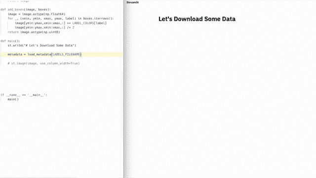

Coding a semantic search engine with real-time neural-net inference in 300 lines of Python.

根据我的经验，每一个重要的机器学习项目最终都是由充满 bug 和不可维护的内部工具拼接而成的。这些工具通常是 Jupyter 笔记本和 Flask 应用程序的拼凑物，难以部署，需要对客户端-服务器架构进行推理，并且不能与 Tensorflow GPU 会话等机器学习结构很好地集成。

我首先在卡内基梅隆大学看到这一点，然后在伯克利，Google X，最后在 Zoox 建造自主机器人。这些工具通常是作为小 Jupyter 笔记本诞生的:传感器校准工具、模拟比较应用程序、激光雷达对准应用程序、场景回放工具等等。

随着工具变得越来越重要，项目经理开始介入。进程萌芽。需求开花了。这些单独的项目孕育成脚本，并发展成瘦长的维护噩梦。

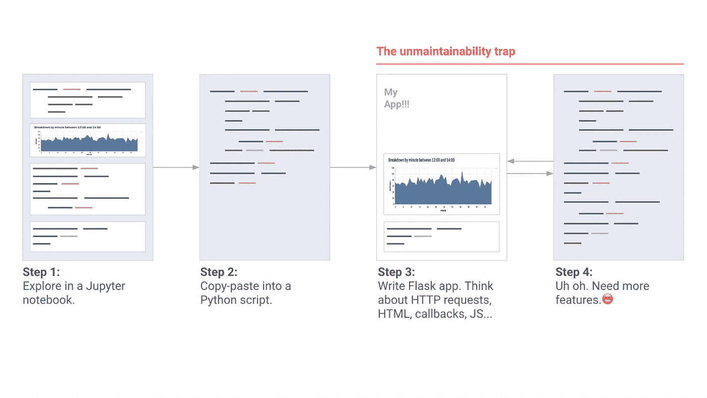

The machine learning engineers’ ad-hoc app building flow.

当一个工具变得至关重要时，我们**召集工具团队**。他们写出了流畅的 Vue 和 React。他们在笔记本电脑上贴上了关于声明性框架的标签。他们有一个*设计流程*:

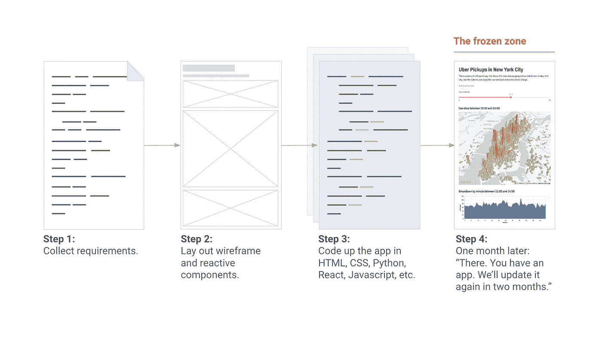

The tools team’s clean-slate app building flow.

太棒了。但是这些工具都需要新的功能，比如周刊。工具团队正在支持另外十个项目。他们会说，“我们会在两个月后再次更新你的工具。”

所以我们回到了构建自己的工具，部署 Flask 应用程序，编写 HTML、CSS 和 JavaScript，并试图对从笔记本到样式表的一切进行版本控制。所以我的 Google X 老朋友 Thiago Teixeira 和我开始思考下面这个问题:**如果我们能让构建工具像编写 Python 脚本一样简单会怎么样？**

我们希望机器学习工程师能够创建漂亮的应用程序，而不需要工具团队。这些内部工具应该是 ML 工作流的自然副产品。编写这样的工具应该*感觉*像是在 Jupyter 中训练一个神经网络或者执行一个特别的分析！同时，我们希望保留强大应用框架的所有灵活性。我们想创造漂亮的、高性能的工具，让工程师们炫耀。基本上，我们想要这个:

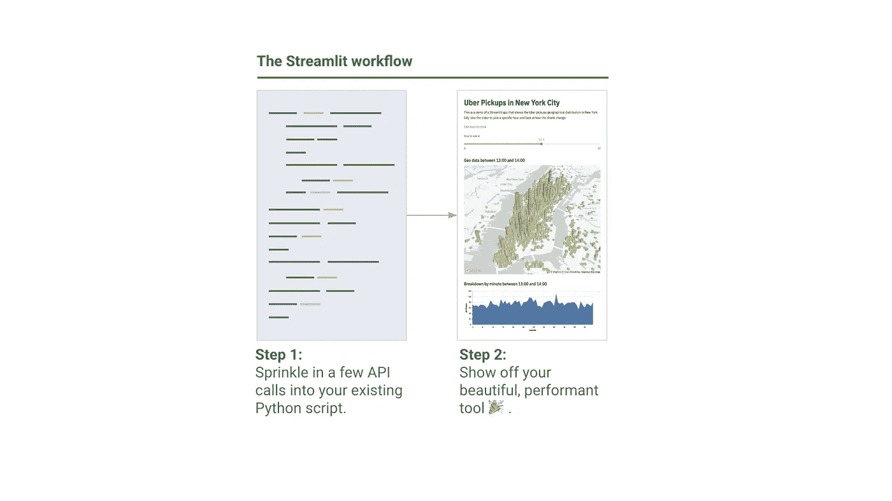

The Streamlit app building flow.

有了一个包括来自优步、Twitter、Stitch Fix 和 Dropbox 的工程师在内的令人惊叹的 beta 社区，我们花了一年时间创建了 [Streamlit](https://streamlit.io/) ，这是一个面向 ML 工程师的[完全免费和开源的](https://github.com/streamlit/streamlit/)应用框架。随着每个原型的出现，Streamlit 的核心原则变得更加简单和纯粹。它们是:

第一:拥抱 Python 脚本。 Streamlit 应用实际上只是自上而下运行的脚本。没有隐藏状态。你可以用函数调用来分解你的代码。如果你知道如何编写 Python 脚本，你可以编写 Streamlit 应用程序。例如，这是您在屏幕上书写的方式:

```
import streamlit as stst.write('Hello, world!')
```

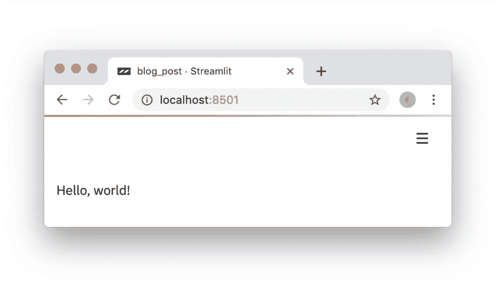

Nice to meet you.

**#2:将小部件视为变量。**Streamlit 中没有*的回调！每次交互只是从头到尾重新运行脚本。这种方法会产生真正干净的代码:*

```
import streamlit as stx = st.slider('x')
st.write(x, 'squared is', x * x)
```

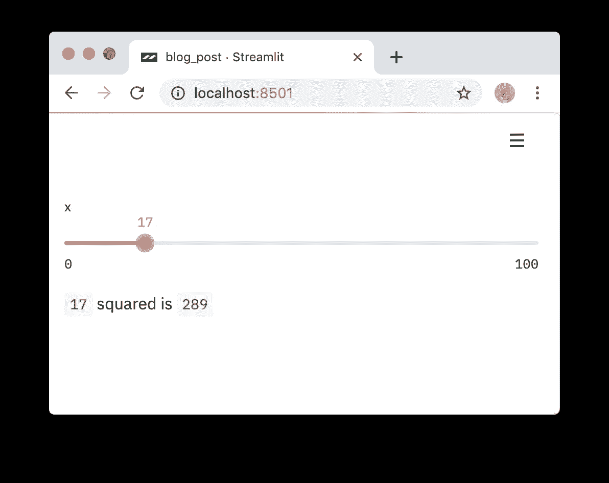

An interactive Streamlit app in three lines of code.

**#3:复用数据和计算。**如果下载大量数据或执行复杂计算会怎样？关键是*跨运行安全地重用*信息。Streamlit 引入了一个缓存原语，其行为类似于一个持久的、默认不变的数据存储，使 Streamlit 应用程序能够安全、轻松地重用信息。例如，这段代码**只从 [Udacity 自动驾驶汽车项目](https://github.com/udacity/self-driving-car)下载一次数据**，从而生成一个简单、快速的应用程序:

Using st.cache to persist data across Streamlit runs. To run this code, please [follow these instructions](https://gist.github.com/treuille/c633dc8bc86efaa98eb8abe76478aa81#gistcomment-3041475).


The output of running the st.cache example above.

简而言之，Streamlit 是这样工作的:

1.  对于每个用户交互，整个脚本都是从头开始运行的。
2.  Streamlit 给每个变量分配一个给定小部件状态的最新值。
3.  缓存允许 Streamlit 跳过冗余的数据获取和计算。

或者在图片中:


User events trigger Streamlit to rerun the script from scratch. Only the cache persists across runs.

如果这听起来很有趣，你现在就可以试试！只需运行:

```
$ pip install --upgrade streamlit 
$ streamlit hello **You can now view your Streamlit app in your browser.** **Local URL:** [http://localhost:8501](http://localhost:8501)
   **Network URL:** [http://10.0.1.29:8501](http://10.0.1.29:8501)
```

这将自动弹出一个指向您的本地 Streamlit 应用程序的 web 浏览器。如果没有，就点击链接。

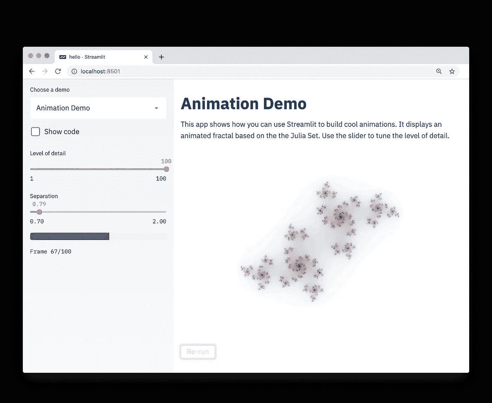

To see more examples like this fractal animation, run **streamlit hello** from the command line.

好的。你从玩分形回来了吗？这些都很迷人。

这些想法的简单性并不妨碍您使用 Streamlit 创建极其丰富和有用的应用程序。在 Zoox 和 Google X 工作期间，我目睹了自动驾驶汽车项目膨胀到数十亿字节的视觉数据，这些数据需要搜索和理解，包括在图像上运行模型以比较性能。我见过的每个自动驾驶汽车项目最终都有整个团队在开发这种工具。

在 Streamlit 中构建这样一个工具很容易。[这个 Streamlit 演示](http://github.com/streamlit/demo-self-driving)可以让你在整个 [Udacity 自动驾驶汽车照片数据集](https://github.com/udacity/self-driving-car)中执行语义搜索，可视化人类注释的地面真相标签，**从应用程序内实时运行完整的神经网络(**[](https://pjreddie.com/darknet/yolo/)****)**[1]。**

**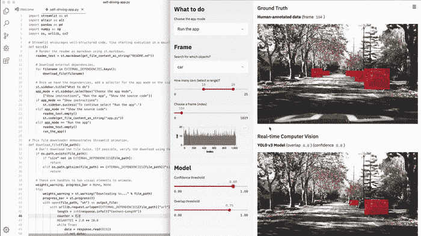**

**This 300-line Streamlit demo combines semantic visual search with interactive neural net inference.**

**整个 app 是一个完全独立的 300 行 Python 脚本，大部分是机器学习代码。其实整个 app 只有[23 个 Streamlit 调用。你现在就可以自己运行了！](https://github.com/streamlit/demo-self-driving/blob/master/app.py)**

```
$ pip install --upgrade streamlit opencv-python
$ streamlit run
[https://raw.githubusercontent.com/streamlit/demo-self-driving/master/app.py](https://raw.githubusercontent.com/streamlit/demo-self-driving/master/app.py)
```

**当我们与机器学习团队在他们自己的项目上合作时，我们逐渐意识到这些简单的想法产生了许多重要的好处:**

****Streamlit 应用是纯 Python 文件。**这样你就可以通过 Streamlit 使用你最喜欢的编辑器和调试器了。**

**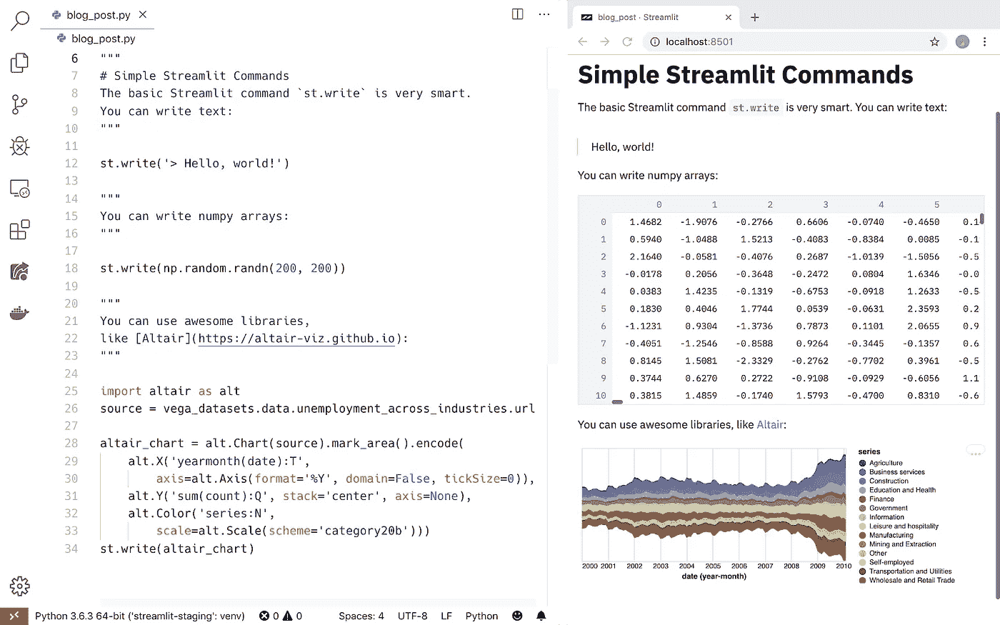**

**My favorite layout for writing Streamlit apps has VSCode on the left and Chrome on the right.**

****纯 Python 脚本与 Git** 和其他源代码控制软件无缝协作，包括提交、拉请求、发布和注释。因为 Streamlit 的底层语言是纯 Python，所以您可以免费获得这些令人惊叹的协作工具的所有好处🎉。**

**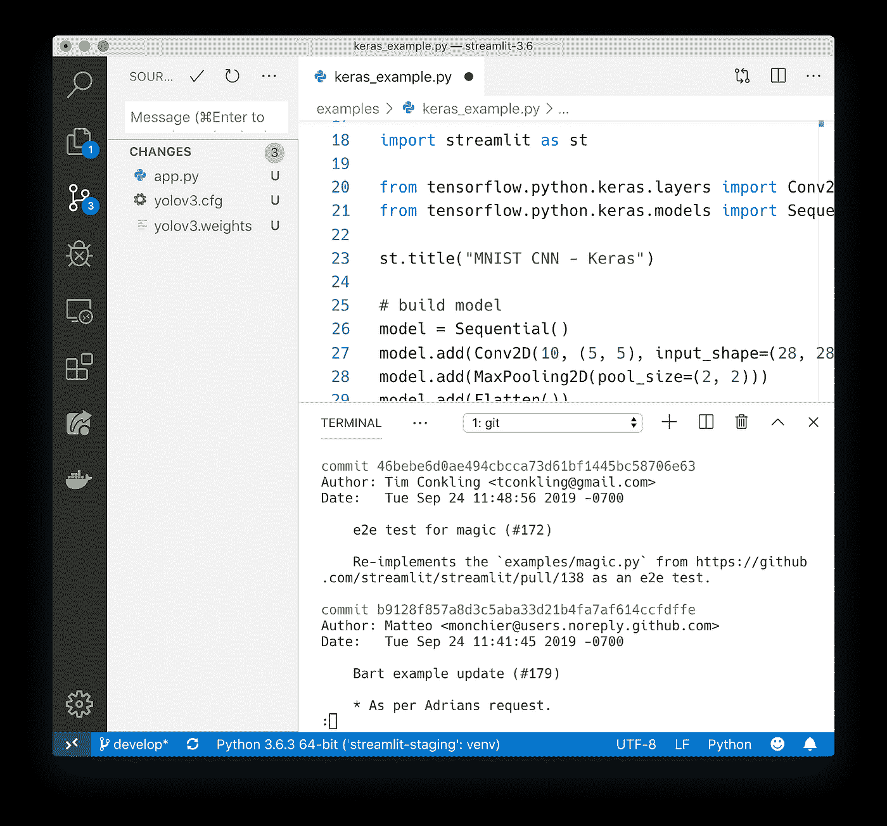**

**Because Streamlit apps are just Python scripts, you can easily version control them with Git.**

**Streamlit 提供了一个即时模式的实时编码环境。只需点击*当 Streamlit 检测到源文件改变时，总是重新运行*。**

**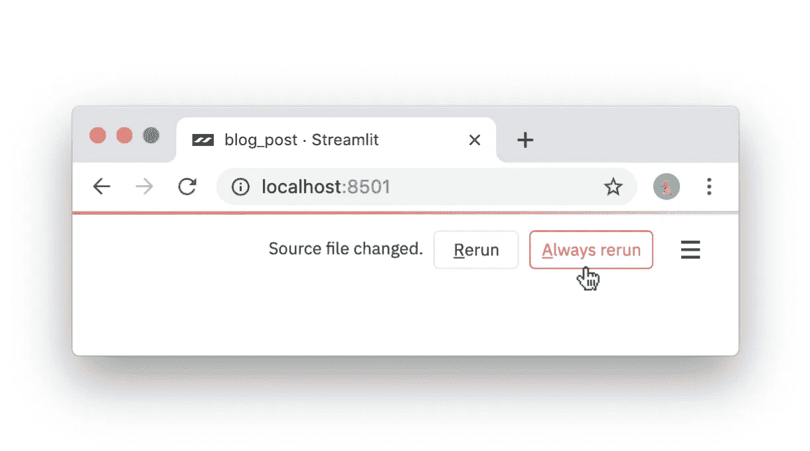**

**Click “Always rerun” to enable live coding.**

****缓存简化了计算管道的设置。**令人惊讶的是，链接缓存函数会自动创建高效的计算管道！考虑[这段代码](https://gist.github.com/treuille/ac7755eb37c63a78fac7dfef89f3517e)改编自我们的 [Udacity 演示](https://github.com/streamlit/demo-self-driving):**

**A simple computation pipeline in Streamlit. To run this code, please [follow these instructions](https://gist.github.com/treuille/ac7755eb37c63a78fac7dfef89f3517e#gistcomment-3041436).**

**基本上管道就是 load_metadata → create_summary。每次运行脚本时 **Streamlit 只重新计算获得正确答案所需的管道子集**。酷！**

**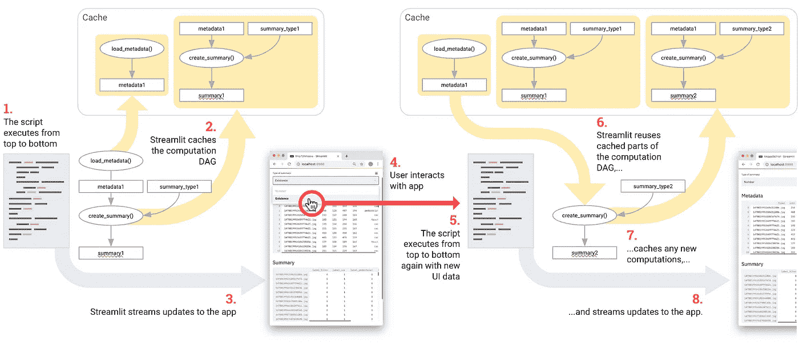**

**To make apps performant, Streamlit only recomputes whatever is necessary to update the UI.**

****Streamlit 是为 GPU 打造的。** Streamlit 允许直接访问机器级原语，如 TensorFlow 和 PyTorch，并补充这些库。例如在这个演示中，Streamlit 的缓存存储了整个 [NVIDIA 名人脸甘](https://research.nvidia.com/publication/2017-10_Progressive-Growing-of)【2】。当用户更新滑块时，这种方法可以实现几乎即时的推断。**

**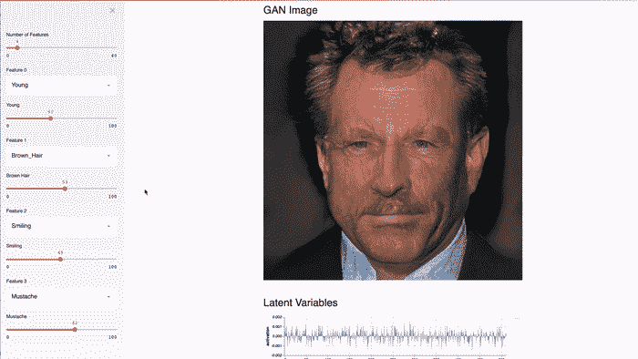**

**This Streamlit app demonstrates [NVIDIA celebrity face GAN](https://research.nvidia.com/publication/2017-10_Progressive-Growing-of) [2] model using [Shaobo Guan’s TL-GAN](https://blog.insightdatascience.com/generating-custom-photo-realistic-faces-using-ai-d170b1b59255) [3].**

**Streamlit 是一个免费的开源库，而不是专有的网络应用。您可以在内部提供 Streamlit 应用程序，无需联系我们。您甚至可以在没有互联网连接的笔记本电脑上本地运行 Streamlit！此外，现有项目可以逐步采用 Streamlit。**

**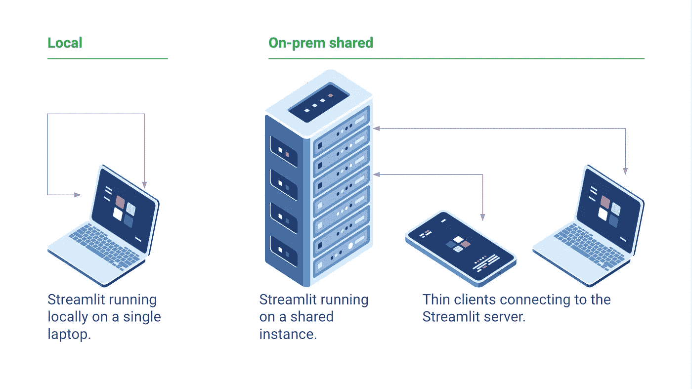**

**Several ways incrementally adopt Streamlit. (Icons courtesy of [fullvector / Freepik](https://www.freepik.com/free-vector/computer-technology-isometric-icon-server-room-digital-device-set-element-design-pc-laptop_4103157.htm).)**

**这只是您可以用 Streamlit 做的事情的皮毛。Streamlit 最令人兴奋的一个方面是如何将这些原语轻松组合成看起来像脚本的复杂应用程序。关于我们的架构如何工作以及我们计划的功能，我们还有很多可以说的，但我们将把这些留到以后的帖子中。**

**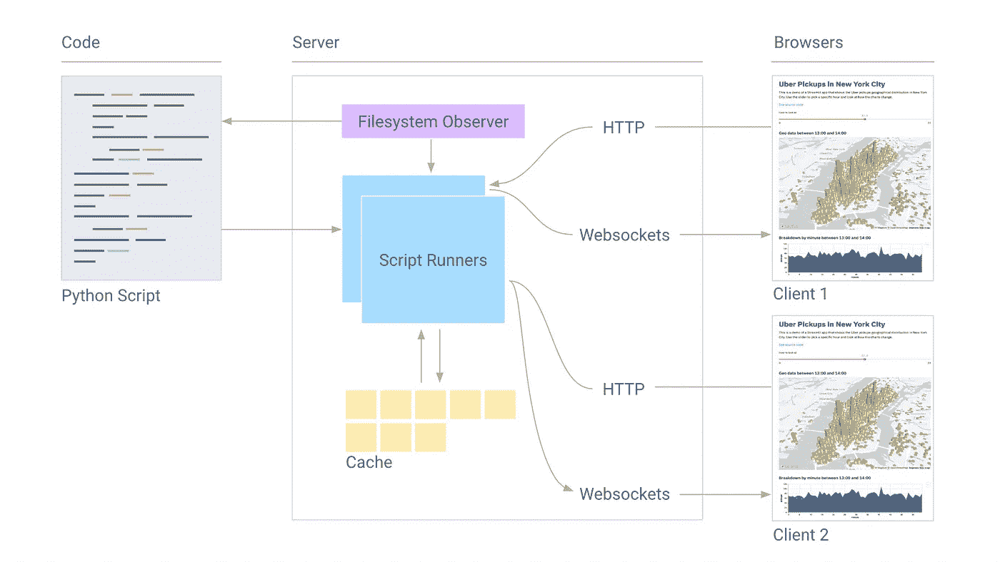**

***Block diagram of Streamlit’s components. More coming soon!***

**我们很高兴今天终于与社区分享了 Streamlit，并看到你们都用它构建了什么。我们希望你会发现把你的 Python 脚本变成漂亮的 ML 应用程序是一件简单而愉快的事情。**

**感谢 Amanda Kelly、Thiago Teixeira、TC Ricks、Seth Weidman、Regan Carey、Beverly Treuille、Geneviève Wachtell 和 Barney Pell 对本文的有益贡献。**

****参考文献:****

**[1] J .雷德蒙和 a .法尔哈迪，*约洛夫 3:一种增量改进* (2018)，arXiv。**

**[2] T. Karras、T. Aila、S. Laine 和 J. Lehtinen，*为提高质量、稳定性和变化而逐步种植甘蔗* (2018)，ICLR。**

**[3] S. Guan，*使用新型 TL-GAN 模型控制图像合成和编辑* (2018)，洞察数据科学博客。**