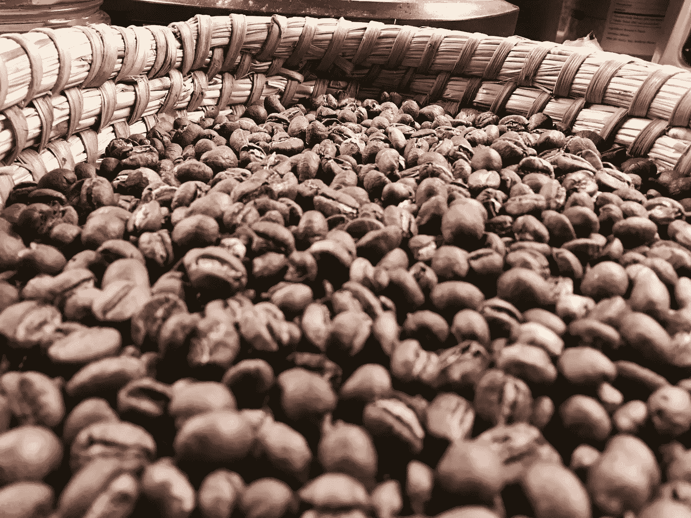
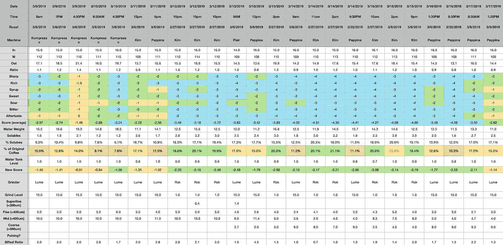
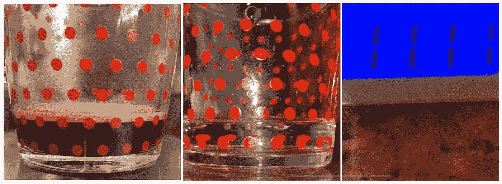
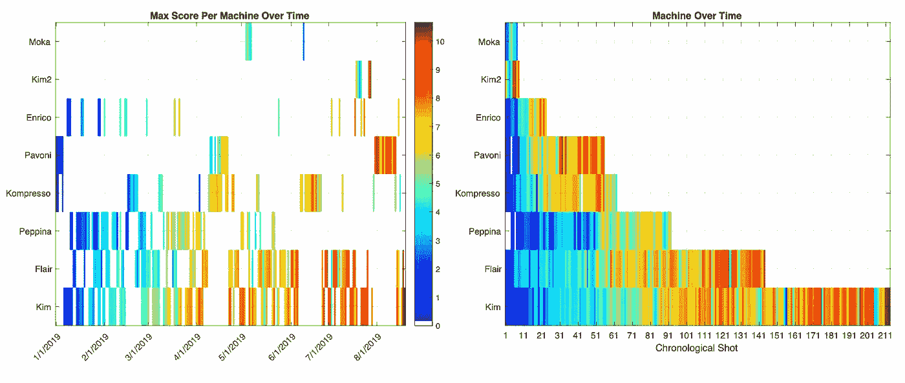
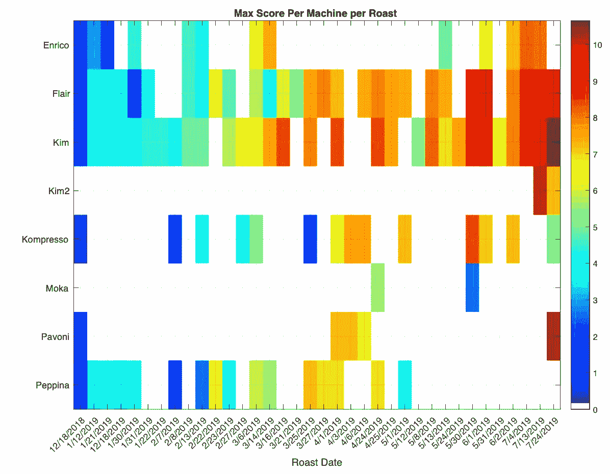
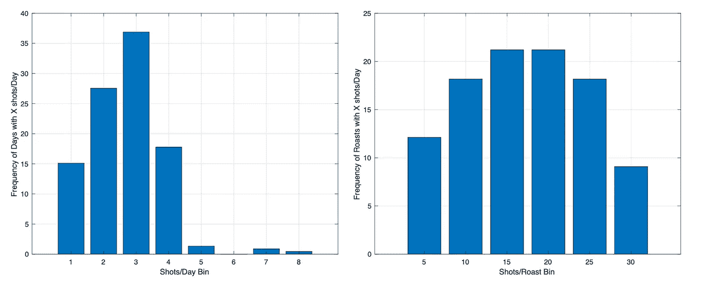
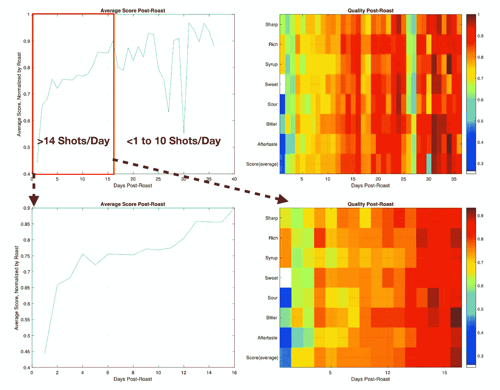
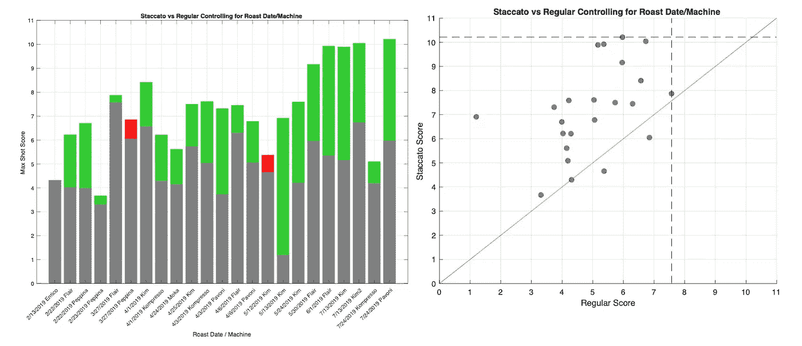
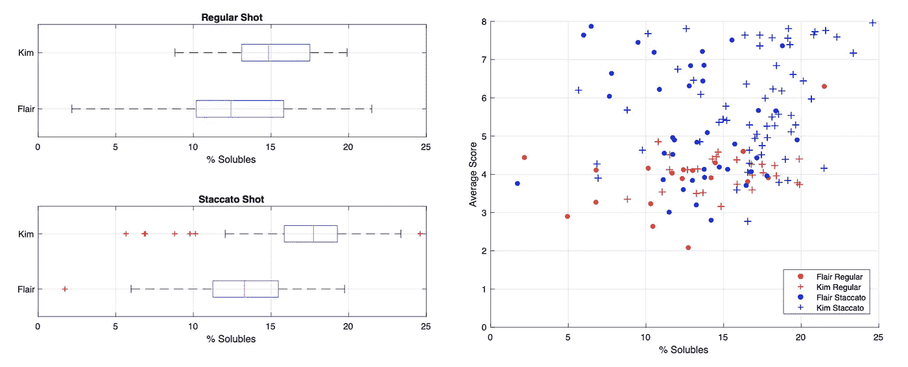

# 咖啡数据表

> 原文：<https://towardsdatascience.com/coffee-data-sheet-d95fd241e7f6?source=collection_archive---------15----------------------->

## 咖啡数据科学

我想要的圣诞礼物就是数据

那是 2018 年的圣诞节，我想要的只是一杯来自 la Pavoni 的浓咖啡。我很少使用这台机器，我遇到了麻烦。在阅读了关于预热的内容后，我决定需要收集我拍摄的数据，以确保我对常规的改变有所帮助。我一点也不知道，数据表将成为最有用的工具，使惊人的浓缩咖啡，并扩大到改善我的咖啡烘焙。

我没有开始跟踪我的镜头，因为我认为这是一些伟大的想法。这更多的是一种好奇心，它变成了我用来改进我的浓缩咖啡的最伟大的工具:**数据**。一个有趣的回顾目标是能够回顾历史数据，因为有些时候，直到数据可用时，价值才完全为人所知。

诚实是数据手册的关键。没有诚信，史料毫无意义。没有诚实，就不可能改进你的浓缩咖啡。有时，我想打得更高，因为我认为应该更高，或者我在考虑平均得分，但我真的想在我的评估中保持诚实，以便随着时间的推移，我可以打出我一生中最好的投篮。

最终，随着时间的推移，关键目标演变为以下五项:

1.  镜头改进
2.  充分利用每台浓缩咖啡机
3.  豆子实验
4.  方法调整中的未来未知发现
5.  腭校准

# 输入变量

输入变量应该是最可控的，并且在各次拍摄中保持一致。咖啡重量最容易用秤控制。

你也可以测量水温，93 摄氏度被广泛认为是最佳温度。我做过一个关于[预热](https://medium.com/@rmckeon/espresso-grouphead-water-temperature-analysis-25cc00556d5c)云台的水温的小研究，但是我没有具体测量过每次拍摄的温度。这是一个可以改进的领域，但我的大多数机器，我知道在它们过热之前什么时候停止射击。

其他输入变量是咖啡烘焙、日期、时间、每层重量(对于[断奏](https://medium.com/overthinking-life/staccato-espresso-leveling-up-espresso-70b68144f94))，我还添加了一些其他可选的比特，如添加的罗布斯塔或水库的水位。

# 过程变量

我已经记录了预输注、开花和提取的时间，但是一旦我调整了我的方法，我经常不计时。我记录了我的许多镜头，以帮助回顾镜头是如何从无底的 portafilter 开始的。这一点数据对我改善咖啡分配、调整研磨以及平衡断奏层次也很重要。

我有几个单元格用来记笔记。我改变了什么细微的变化，或者一些我没有全时间跟踪的变量。最后，还有一个下次做什么的单元格。大多数时候，我能记得下一步要做什么，但仅仅是记录这些笔记的过程就帮助提高了我的记忆能力。一般来说，在课堂上、工作中或家里记笔记对我帮助很大。

# 输出变量

有两种类型的输出变量:定量和定性。对于定量指标，我测量输出重量并计算咖啡中的咖啡渣。有一段时间，我校准了我的咖啡杯，测量了可溶物的百分比，但是我有一段时间没有这样做了。我也拍过相当多的照片，我本可以尝试使用[图像处理分析](/espresso-filters-an-analysis-7672899ce4c0)来调查色差，但我没有。

对于定性指标，我衡量七个品质:尖锐，丰富，糖浆，甜，酸，苦，回味。如果我是一个 Q 级学生，我可以使用这些标准，但是，唉，我不是。前三个测量值需要解释，因为其他四个是不言自明的。

尖锐是指当浓缩咖啡第一次触及你的舌头时的尖锐度，以及它对你的口味有多震撼。我不喜欢因为喝了这么烈的东西而咳嗽，但这是我喜欢的尖锐的标志。这个标准的一个问题是，一个平滑的镜头不会很锐利，但这并不意味着它是一个糟糕的镜头。因此，这让我开始审视我所使用的衡量标准的变化，甚至是通过 Q-gradier 认证。

丰富是指镜头整体的丰富和复杂。我更喜欢 1:1 的比例(输入重量与输出浓缩咖啡的重量)，因为我想重温我喝的第一杯浓缩咖啡。我的第一枪尝起来就像在嘴里融化了一块巧克力；它完全占据了我的舌头。

糖浆指的是质地，我的目标是我记忆中的第一次拍摄。浓咖啡在我的舌头上感觉很浓，像糖浆或融化的巧克力。

当我查看 Q 等级的时候，我发现了一些和我相似的描述。请记住，虽然 Q 级不是在浓缩咖啡上完成的。这是一张与我的 Q 等级最接近的表格。

最后，我得出一个平均分，它包含这七个指标，并将它们与投入产出比的加权值相结合。我考虑过在计算中去掉这个比例，因为我用了一个上面有测量标记的杯子。这个杯子让我每次都能打到 0.8 到 1.1 之间的比率。

[My current cup](https://www.amazon.com/Espresso-EPSHOT3-Basics-Triple-Barista/dp/B07F3GNQSX/ref=asc_df_B07F3GNQSX/?tag=hyprod-20&linkCode=df0&hvadid=309804229189&hvpos=1o3&hvnetw=g&hvrand=821304308627195381&hvpone=&hvptwo=&hvqmt=&hvdev=c&hvdvcmdl=&hvlocint=&hvlocphy=9032131&hvtargid=pla-573751747081&psc=1)

# 校准

我从一个小规模(0，1，2)开始。我不知道我能在多大程度上区分不同的级别，我想我会从小做起，然后根据需要扩展。最初，我开始用 Hario 研磨机给照片评分，因为我在圣诞假期。当我回到家里，使用我的 Rok grinder 和 Kim Express，我必须迅速将我的规模从 0 扩大到 4。

然后是[断奏](https://medium.com/overthinking-life/staccato-espresso-leveling-up-espresso-70b68144f94)。老实说，我没想到一个断奏的镜头会做得这么好。当我开始尝试时，我开始在某些类别中看到 5 和 6。随着我对各层如何相互作用有了更好的理解，我能够让每个分数类别上升。我从两层迁移到三层，我看到平均分从 4 到 7。

最近，我用一些我一直在调整的专业烘焙达到了 9 分甚至更高。用于烘烤的数据需要进一步讨论。

时不时地，我会在咖啡店，喝着劣质咖啡，或者在家里用我的 superautomatic 检查我的校准。虽然糟糕的击球并不总是有趣的，但它肯定了我的底线，并让我看到那些击球做得好的地方。

在意大利的时候，我拍了一些照片，我真的注意到那些照片中我喜欢的东西是我的照片中没有的。我确定我错过了使用 robusta 的机会，这促使我尝试调整 Robusta 的百分比，以获得我想要的平衡。意大利酒有更好的丰富性、酸味和回味，但它们不甜。它们是苦的，但没有烧焦。有区别…

Coffee Shops have the roast highlighted in Red. Noticed how the score patterns are quite different.

# 多台机器

这个数据收集的有趣部分是在多台机器上工作。我在工作中有一个金快车，这是我的底线。我用那台机器拍出了最好的照片，因为我已经用了五年了。根据过去六个月的数据，我在六个月内打了 200 针，所以一年 400 针乘以五年就是 2000 针。

我买了一个意大利的 Enrico，我把它放在我工作的实验室里。这是一台好机器，但我用得不多了。那台机器的[事故率](https://medium.com/@rmckeon/explosions-with-espresso-machines-a72c6353e983?source=your_stories_page---------------------------)比 Kim 高得多(30 分之一对 2000 分之二)。

在家里，我有一个奥利奥 Giro，Flair，La Peppina 和一个新收购的 Kim Express。我买了新的 Kim Express，因为它需要很多爱，我想在工作和家里有同样的体验。

我在家里用 Flair 拍摄的照片比其他任何机器都多。我几乎放弃了这台机器，因为我遇到了一些麻烦，但我最终找到了一些技巧，特别是对于断奏镜头，这使它能够产生与 Kim 一样的镜头。

# 数据

我们来看一些数据。首先，让我们来看一段时间内的镜头对比。通常，潮起潮落取决于一颗咖啡豆。

查看数据的另一种方式是每台机器每次烘烤的最高得分或射击次数。它展示了我如何使用每台机器以及我的照片如何改进它们的有趣旅程。

在更高的水平上，我似乎每天要喝 2 到 4 杯，每次烧烤我要喝接近 20 杯。一份烤肉通常是 350 克到 300 克，所以每份 15 克意味着大约 20 份。

随着时间的推移，烘焙的平均分数会随着咖啡豆的老化而变化。我尤其能从一些一开始就含有大量克莉玛的豆子中分辨出来，这些克莉玛随后逐渐减少。这是另一种方法来观察每次烘烤的次数以及理解每次烘烤的次数。

我甚至可以看烤后的照片。我们可以通过每次烘焙将这些分数标准化，然后将它们结合起来，以更深入地了解何时是煮浓缩咖啡的最佳时间。烘焙后两周似乎是一个很好的峰值，但我没有足够的烘焙后数据来了解这种味道何时开始变味。

在我的断奏实验中，我得到了大量的数据。下面是我截取数据的几种方法，来展示断奏是如何比常规击球提高击球质量的。我已经控制了烘烤和机器。

1\. Green (Staccato > Regular) , Red (Regular > Staccato). 2\. Scatter Plot with red-line to show no difference

我可以把更多的注意力放在两台机器上:Kim Express 和 Flair Espresso。就解决方案而言，它似乎在一定程度上提高了提取率。我开始注意到缺乏相关性，我怀疑萃取可溶物并不是浓缩咖啡质量分级的全部指标。

While percent solubles is an interesting metric, it doesn’t predict taste (i.e. Score) well.

# 上帝开枪了

我曾经认为我可以实现某种“神射”一个如此惊人的镜头，会毁了所有其他镜头。我已经打了很多次这种球，以至于我认为这只是一个梦，一个我会对我的球的味道感到满意的幻想。我没有吹牛的意思；我的意思是说，我已经达到了一些我以前没有达到的浓缩咖啡的水平，然后就变得正常了。

根据我的数据，在 604 次投篮中，我有 40 次是之前所有投篮中最好的，占 6.6%。也就是平均每 18 次注射，或者大约每 4 天注射一次。我还没有完全看到一个高原。

对我来说，真正的上帝拍摄是我的第一次拍摄。你永远不能重复第一次。我甚至不知道我在做什么。我去了一家咖啡馆，点了菜单上最便宜的饮料。碰巧是浓缩咖啡，很棒。上颚知道，第一枪的锋利永远不会重复。

我的希望是，保持数据表或拍摄日志可以帮助你提高你的拍摄；至少让你看到自己喜欢什么，不喜欢什么。我的类别是我正在寻找的东西，但它们不必对你一样。我还收集额外的数据，因为你永远不知道将来什么时候会需要这些数据。

如果你愿意，可以在 Twitter 和 YouTube 上关注我，我会在那里发布不同机器上的浓缩咖啡视频和浓缩咖啡相关的东西。你也可以在 [LinkedIn](https://www.linkedin.com/in/robert-mckeon-aloe-01581595?source=post_page---------------------------) 上找到我。

# 我的进一步阅读:

[我的咖啡设置](https://link.medium.com/NMfeoLVpuT?source=post_page---------------------------)

[断续浓缩咖啡:提升浓缩咖啡](/overthinking-life/staccato-espresso-leveling-up-espresso-70b68144f94?source=post_page---------------------------)

[工匠咖啡价格过高](https://link.medium.com/PJwoAMYpuT?source=post_page---------------------------)

[被盗浓缩咖啡机的故事](https://link.medium.com/pxCY5yrquT?source=post_page---------------------------)

[平价咖啡研磨机:比较](https://link.medium.com/rzGxlDtquT?source=post_page---------------------------)

[浓缩咖啡:机头温度分析](https://link.medium.com/FMxfCmcOCT?source=post_page---------------------------)

[浓缩咖啡过滤器分析](https://link.medium.com/2T2tjpUsgU?source=post_page---------------------------)

便携式浓缩咖啡:指南

克鲁夫筛:一项分析