# 浓缩咖啡中咖啡溶解度的初步研究

> 原文：<https://towardsdatascience.com/coffee-solubility-in-espresso-an-initial-study-88f78a432e2c?source=collection_archive---------14----------------------->

大约一年前，我开始收集我的浓缩咖啡的数据，但是我不太喜欢收集的一个指标是溶解度。我在早期进行了一些测量，但我无法证明花几百美元买一个高科技 TDS 测量工具是合理的。最后，我买了一个折射计，我开始收集一些有趣的数据。它改变了我对浓缩咖啡的看法，比我想象的要大得多。

溶解度是溶解在杯中的咖啡量，它也告诉你你从咖啡杯中提取了多少咖啡。通常，这是用 TDS 或[总溶解固体](https://fellowproducts.com/blogs/learn/the-beginner-s-guide-to-total-dissolved-solids-and-coffee)来衡量的。人们可以通过知道浓缩咖啡的重量来推算出提取的咖啡量。

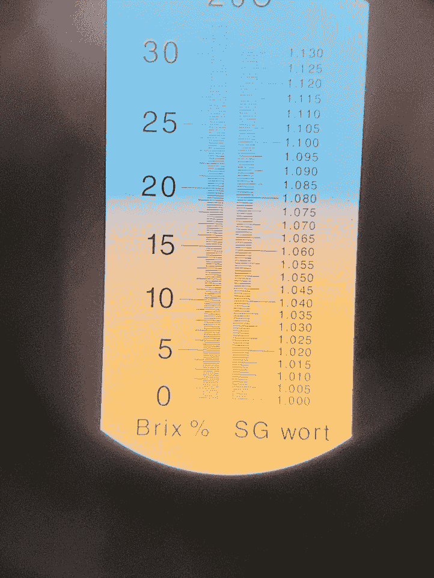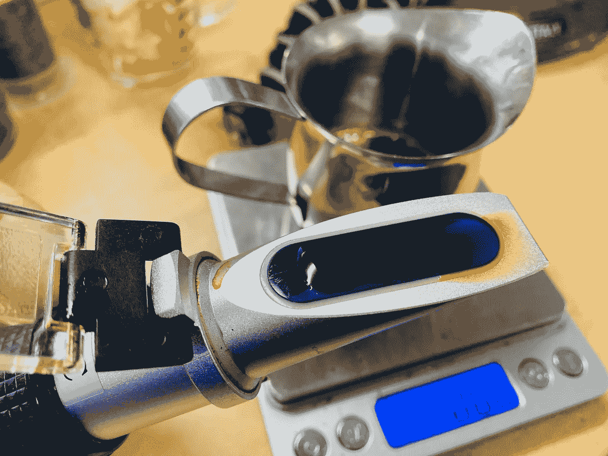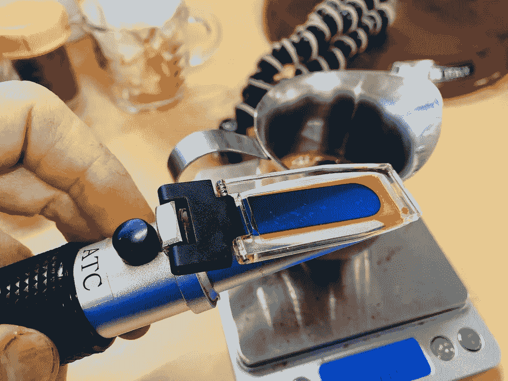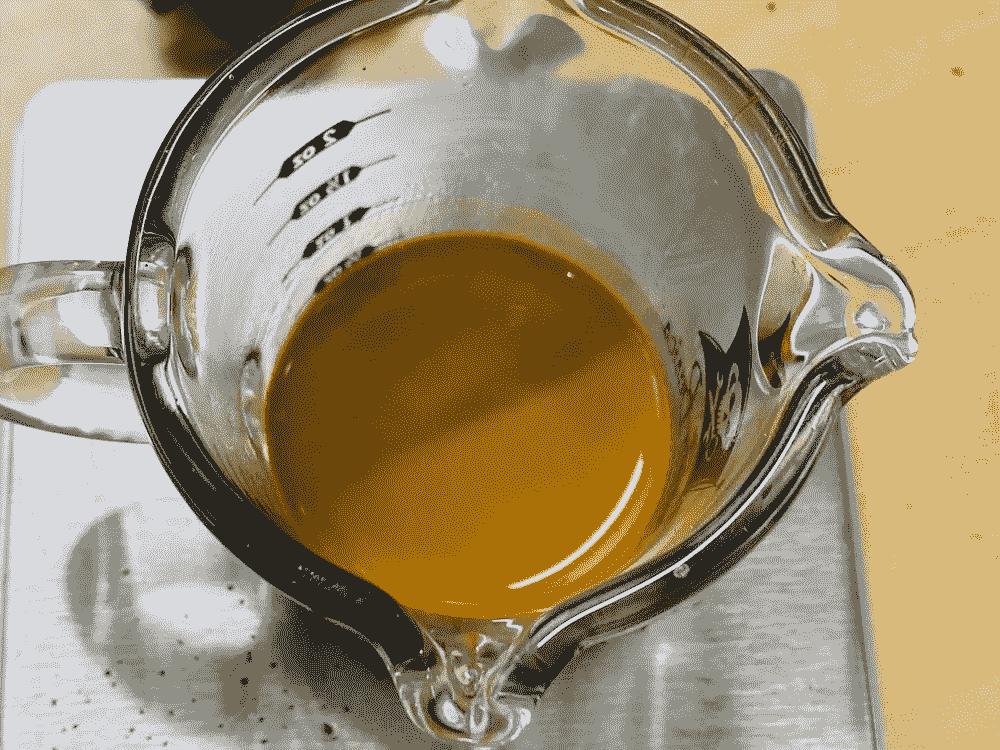

Typical views during espresso and collecting data.

要测量溶解度，最好的是一台[数字折光仪](https://store.vstapps.com)。它们很贵。有更便宜的折射计，但是它们需要更多的努力来进行测量。我还用校准过的杯子做了试验。我拍了一个玻璃杯子慢慢装满水的视频。然后当我拍摄的时候，我会把拍摄的地方和视频进行比较。水印处的重量差就是溶解的咖啡量。这种方法是最不精确的。

我选择了一个便宜的折射仪来测量白利糖度。然后用一些等式得出有趣的数据:

1.  TDS = 0.85 *白利糖度/ 100
2.  咖啡提取= TDS *输出压力
3.  提取的咖啡百分比=提取的咖啡/输入咖啡重量

从[浓缩咖啡的常识](https://clivecoffee.com/blogs/learn/how-coffee-extraction-works)来看，一杯好的咖啡会提取出 18%到 22%的咖啡。一颗咖啡豆大约有 30%是可溶的，你不会想要所有能溶解的东西。同样的豆子，不同的冲泡，无论好坏，味道都会不一样。这就是为什么许多人煮浓缩咖啡时非常小心地控制研磨粒度、温度、压力、提取次数和提取量。

然而，那里的信息只使用单点数据，即在拍摄结束时测量的 TDS。典型地，该镜头是 3:1 的镜头。作为一名数据科学家，我想超越这一点。我想知道镜头里发生了什么。

我决定进行两个初步实验:

1.  在提取过程中在多个点测量 TDS，以观察其如何发展。
2.  对于我拉的每一杆，定期测量 1:1 和 3:1 杆的 TDS。我称之为第一部分(1:1)和测量第二部分，如果与第一部分相结合，将给出一个 3:1 镜头。

# 实验 1:整个拍摄过程中的可解性

如何收集溶解度随时间的变化？一个冰块托盘或许多杯子。我最初的几次尝试是用冰块托盘。困难在于测量每个立方体中液体的重量。

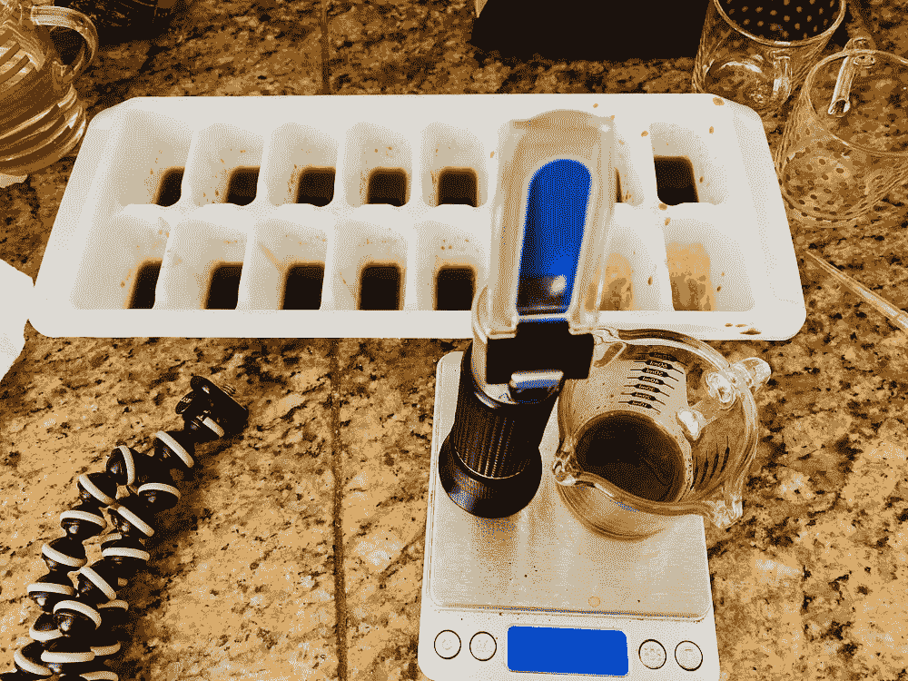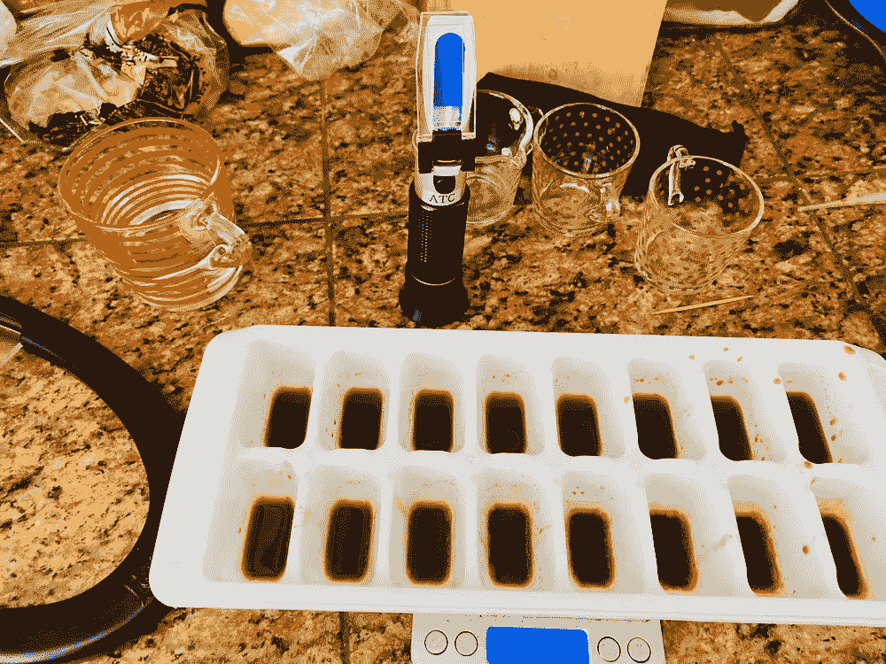

所以我做了一些实验。前两次尝试很有趣；我看了看镜头最后提取的咖啡总量。

第二个镜头有点呛，但超过一半的咖啡提取发生在镜头的第一个 1:1 体积。

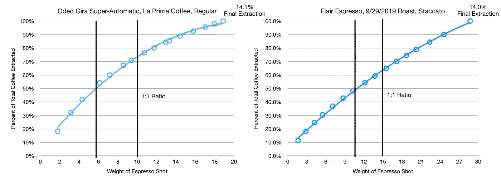

让我们再试一次。利用金快递和 7 cups，我重新收集了数据。

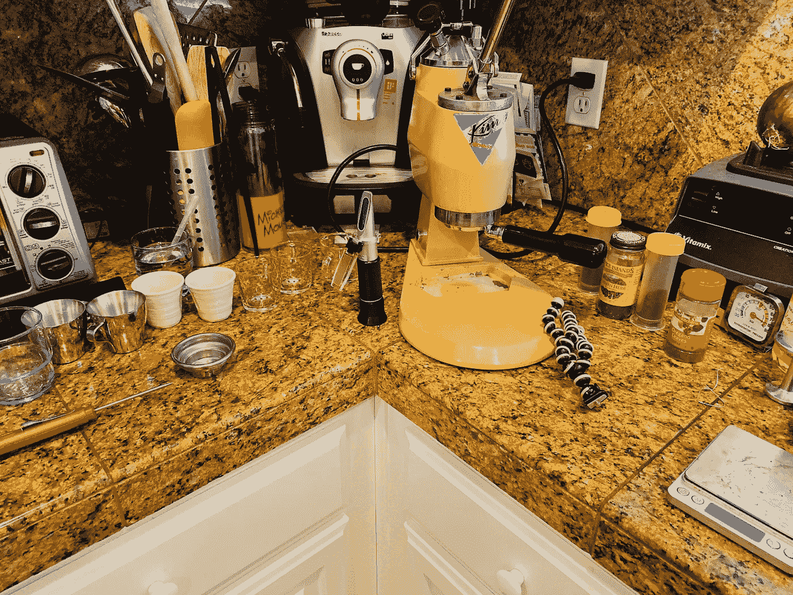

结果告诉我们同样的故事，大多数提取发生在最短的位。你能打出的最短的 ristretto 球。ristretto 镜头通常被定义为 1:1 的比例和 2:1 的比例之间。

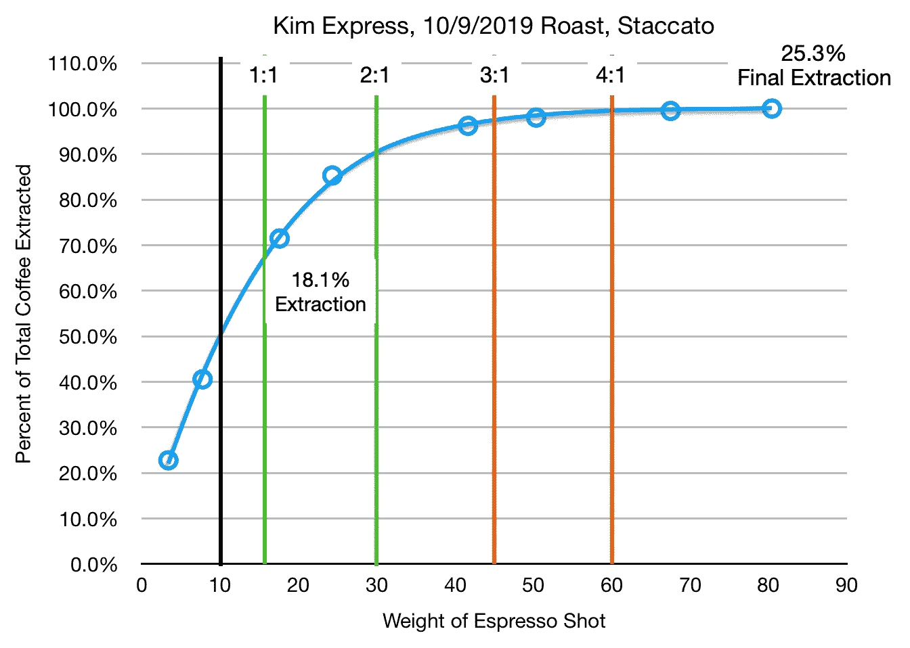

# 实验 2:多次拍摄的可解性

仔细看看镜头的第一和第二部分，很明显大部分提取都在第一部分。第一部分是 1:1 输出，第二部分是第一次拍摄后发生的 2:1 输出。将第一部分和第二部分组合起来，得到一个接近 3:1 比例的镜头(被认为是短镜头)。

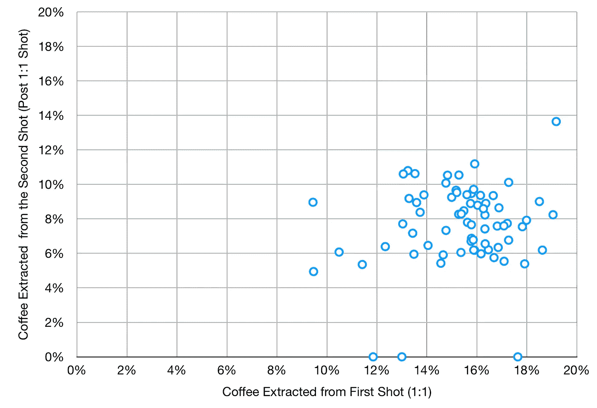

为了进一步探索这个概念，我绘制了上个月的 78 张照片。我绘制了[断奏镜头](https://medium.com/overthinking-life/staccato-espresso-leveling-up-espresso-70b68144f94)和常规镜头，尽管我画的大多是断奏。我把第一部分和最后的摘录放在同一个图上。虽然每次拍摄只有两个数据点，但是数据的趋势很明显。然后我画出了镜头第一部分最终提取的百分比。

The Red circles are regular shots, and the green and blue ones are staccato shots.

人们可能希望考虑溶解度随时间的变化。为了了解这一点，我在 Kim Express 上使用了一个或多或少保持一致的断续镜头，观察了一次烘焙(2019 年 11 月 9 日)的溶解度和我的主观口味评分。结果是不确定的，但是似乎咖啡的质量并没有随着时间的推移而下降(10/18 到 11/8 或 3 周)。

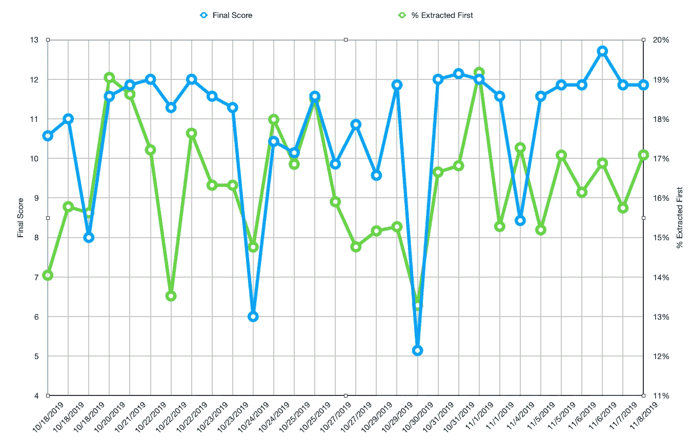

至于主观分数，让我们看看最终的主观分数是否会随着提取咖啡的百分比而变化。这似乎是松散相关的，我的经验是，在温度或压力方面提取的微小变化可以提供相同的咖啡提取，但不同的味道(更甜或更苦)。

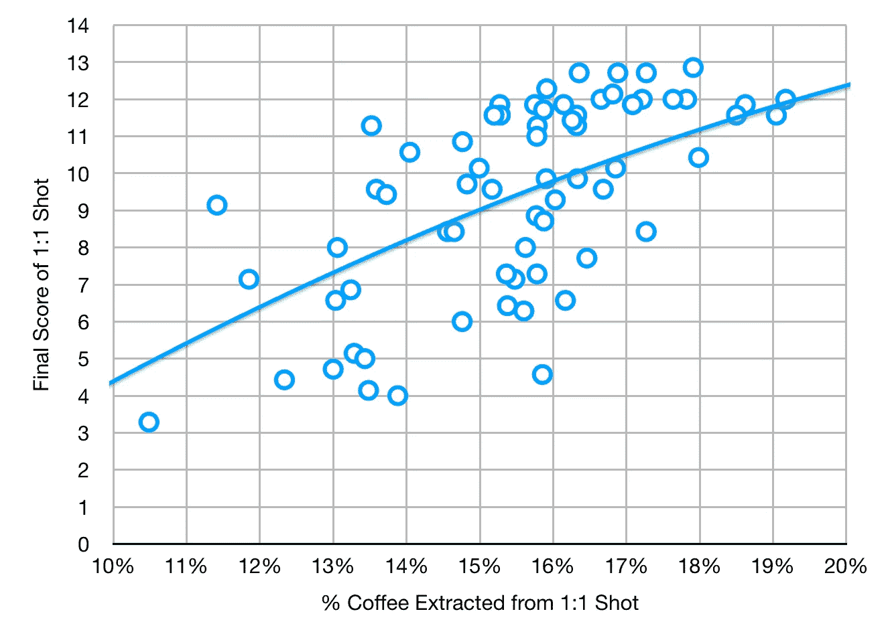

这些结果对我来说只是个开始。我喜欢[实验](https://medium.com/overthinking-life/a-blade-grinder-for-great-espresso-cf4f5a561ba6)，我会继续追踪溶解度。有时，很难看出跟踪多个变量将如何帮助改善我的浓缩咖啡体验，但即使是这样大量的数据也清楚地表明了一些事情:

1.  提取超过 1:1 的比例可能是过度提取的咖啡，因此应该避免。如果你想要更多的液体，你最好进行 1:1 的提取，然后加入你想要的水量以获得正确的体积，而不是继续提取。
2.  断续镜头的提取比常规镜头高。这些实验已经用主观味觉评分验证了我的经验。我会注意到我把第二部分和牛奶混合在一起了，但是味道不一样。有时它是有用的。
3.  使用溶解度和提取的咖啡来比较浓缩咖啡的方法应该在提取过程中的多个点小心进行。单一溶解度指标可能会遗漏镜头中发生的事情。这在断奏镜头中特别有趣，它们有相似的最终提取百分比，但在 1:1 的比例点，它们的值要高得多。
4.  高萃取并不意味着你有合适的口味。获得正确的风味提取可能很棘手。

如果你愿意，可以在 [Twitter](https://mobile.twitter.com/espressofun?source=post_page---------------------------) 和 [YouTube](https://m.youtube.com/channel/UClgcmAtBMTmVVGANjtntXTw?source=post_page---------------------------) 上关注我，我会在那里发布不同机器上的浓缩咖啡照片和浓缩咖啡相关的视频。你也可以在 [LinkedIn](https://www.linkedin.com/in/robert-mckeon-aloe-01581595?source=post_page---------------------------) 上找到我。

# 我的进一步阅读:

[我的咖啡设置](https://link.medium.com/NMfeoLVpuT?source=post_page---------------------------)

[断续浓缩咖啡:提升浓缩咖啡](https://link.medium.com/lLG8uIyF41)

[咖啡数据表](/@rmckeon/coffee-data-sheet-d95fd241e7f6)

[一台用于制作优质浓缩咖啡的叶片研磨机](https://medium.com/overthinking-life/a-blade-grinder-for-great-espresso-cf4f5a561ba6)

[工匠咖啡价格过高](https://link.medium.com/PJwoAMYpuT?source=post_page---------------------------)

[被盗浓缩咖啡机的故事](https://link.medium.com/pxCY5yrquT?source=post_page---------------------------)

[买得起的咖啡研磨机:比较](https://link.medium.com/rzGxlDtquT?source=post_page---------------------------)

[浓缩咖啡:群头温度分析](https://link.medium.com/FMxfCmcOCT?source=post_page---------------------------)

[浓缩咖啡过滤分析](https://link.medium.com/2T2tjpUsgU?source=post_page---------------------------)

[便携式浓缩咖啡:指南](https://link.medium.com/zhCu9HbK6U?source=post_page---------------------------)

克鲁夫筛:一项分析