# 纽约的咖啡趋势

> 原文：<https://towardsdatascience.com/coffee-trends-in-nyc-b6f44a516e96?source=collection_archive---------20----------------------->

## 建立一个模拟器来分析枫糖浆咖啡的趋势

[Photo](https://pixabay.com/illustrations/sunset-couple-coffee-sitting-table-3753738/) by Mohamed Hassan

谁不喜欢枫糖浆？大多数人，其实是因为他们从来没有机会去品尝。加拿大魁北克省生产了全球 70%的枫糖浆[。在我住在蒙特利尔的这段时间里，我遇到过许多外国游客，他们带着尝枫糖浆的愿望来到这里。他们不只是想要枫糖浆，他们想要他们能找到的最好的纯加拿大枫糖浆。这让我想知道加拿大以外对加拿大枫糖浆的需求会是什么样的。*其他国家想要更多吗？*我通读了 Reddit 上关于枫糖浆的对话，作为发展我对这个问题的直觉的第一步。几种模式很快显现出来:](https://en.wikipedia.org/wiki/Maple_syrup)

*   在欧洲和澳大利亚，有许多人要么不容易获得枫糖浆，要么没有意识到他们有。尽管他们中的许多人很好奇想尝试一下。
*   大多数尝过枫糖浆的人都以积极的热情谈论它。
*   许多尝过枫糖浆的人对使用玉米糖浆的枫糖浆仿制品不以为然，比如杰迈玛阿姨和巴特沃斯夫人的。
*   如果许多美国人知道枫糖浆产自加拿大，他们会更加珍惜它。
*   大多数尝过用枫糖浆代替糖搅拌的咖啡的人对此赞不绝口。

最让我感兴趣的是最后两个观察结果。如果我是一个繁荣的、热爱咖啡的美国城市的加拿大枫糖浆咖啡潮流的幕后推手，会怎么样？纽约市完全符合这个描述，因此这个项目诞生了。

# 想法:蝴蝶效应

我一直在构建一个模拟器，让我能够分析纽约市咖啡店中可能出现的潜在趋势，特别是在加拿大枫糖浆咖啡的背景下。潜在的想法是，当一家咖啡店决定采用一种趋势时，它会对附近的竞争对手产生理论上的影响，让他们也这样做，这种影响会波及整个咖啡店网络。我使用概率论来模拟这个项目数据集中每个商店的趋势采用概率，并使用图论来模拟商店网络。网络可以被看作一个简单的图，其中每个商店是一个节点，两个节点之间有一条边当且仅当它们在地理上足够近。每个节点的趋势采用概率不仅取决于与其自身直接相关的特征，还取决于网络中其他节点的特征和采用概率。到目前为止，我已经完成了模拟器的第一个版本，我将在本文的最后讨论它。计划是在迭代中建立模拟器，从简单的开始，逐渐增加到决定网络如何随时间更新的条件列表中。

# 数据准备

我收集的数据是关于纽约的咖啡店的。为了获得这些数据，我使用了一个流行的餐馆评论网站的 API 来搜索 9 个与咖啡相关的词(“咖啡”、“咖啡馆”、“浓缩咖啡”、“拿铁”、“卡布奇诺”、“玛奇朵”、“美式咖啡”、“摩卡咖啡”、“无咖啡因咖啡”)，搜索了 6 个地点(“纽约市”及其 5 个区，“斯塔滕岛”、“布鲁克林”、“曼哈顿”、“皇后区”、“布朗克斯”)，总共进行了 54 次搜索。返回的数据是 JSON 格式的，所以我用 Python 构建了一些函数，允许我将它转换成我可以探索的熊猫数据帧。

# 探索性数据分析

## 咖啡店位置

当我最终在表格中准备好数据后，我首先好奇的是咖啡店是如何分布在纽约市的。通过创建一张纽约市地图，在每个商店的位置都标上一个点，我可以更好地了解网络是如何组织的，特别是，哪些区域有密集的咖啡店，哪些没有。

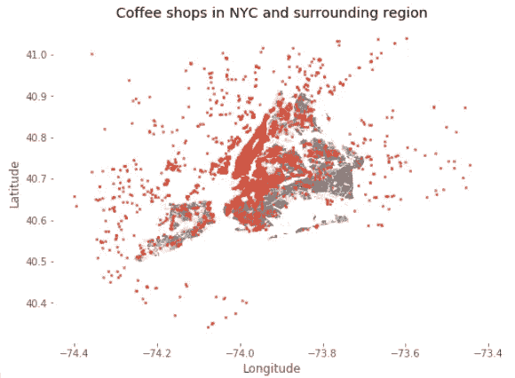

地图会立即显示许多不属于数据集中的点。至少满足以下三个要点之一的任何点都需要删除:

*   经度超出了纽约市的经度范围。
*   纬度超出了纽约市的纬度范围。
*   坐标在纽约市的经度和纬度范围内，但点不在纽约市本身。

移除满足前两个要点中任何一个的点相当于在谷歌地图上点击纽约市最西、最东、最南、最北点附近的地图，以估计其经度和纬度范围，然后过滤掉不在这些范围内的点。位于经度和纬度范围内但在纽约市之外的点要移除就有点棘手了。我构建了三个函数来过滤掉这些点，一个移除输入点西北方向的所有点，一个移除输入点东北方向的所有点，一个移除输入点东南方向的所有点。

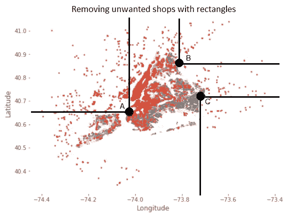

All points north-west of A, north-east of B or south-east of C will be removed by the functions.

这些函数迭代地应用于具有各种输入点的数据集，这些输入点是从谷歌地图中精心选择的，不会删除来自纽约市的任何点。这产生了一个数据集，该数据集根据需要仅捕获纽约市的咖啡店。

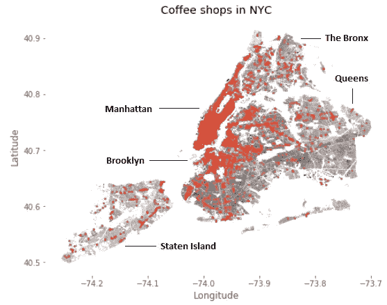

更新后的地图显示，曼哈顿和布鲁克林北部的咖啡店密度很高。另一方面，相对而言，斯塔滕岛、皇后区和布朗克斯区似乎缺少咖啡店。在构建模拟器时了解这一点很有用；据推测，更有可能的是，一种趋势会在一个咖啡店密集的地区传播开来。

## 咖啡店特色

此时，数据集包含 4036 行，每行对应于纽约的一家咖啡店。我研究了三个特别感兴趣的特性，因为它们是构建模拟器的关键:

*   **评论**:评论数；代表*评级*的样本量
*   **评级**:以 0 到 10(含)的整数值为级别的分类
*   **价格**:等级分类 *x* 、 *xx* 、 *xxx* 、*xxxx*；更多的 x 意味着更贵的商店

因为*评级*依赖于*评论*，分析*评论*显然是单变量分析的首选。

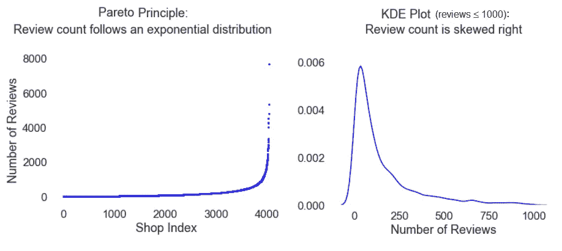

你可能以前听过:一个公司 80%的销售额来自 20%的产品；一个学生 80%的生产力是由他或她的 20%的任务产生的；80%的犯罪是由 20%的罪犯犯下的；20%的啤酒饮用者饮用了 80%的啤酒。这就是[80–20 法则](https://en.wikipedia.org/wiki/Pareto_principle)，或者帕累托原理，它观察到在各种各样的因果自然现象中，绝大多数的影响(通常在 80%左右)是由一小部分原因(通常在 20%左右)产生的。在这个项目的数据集中，69%的评论是由评论数量排名前 20%的咖啡店产生的，这足以表明帕累托原则在这里正在暴露自己。每当我有一个可以被描述为自然现象的连续变量时，我喜欢进行这种验证，以此来证明我的数据集没有偏差。如果*的评论*不遵循指数分布，我会怀疑我的数据集对纽约所有咖啡店的代表性。

核密度估计图(直方图的连续模拟)显示大多数商店的评论少于 250 条。进一步检查*评论*的汇总统计数据显示，该特性的范围从 1 到 7693(表明可能有许多异常值)，中位数为 86，平均值为 207。平均值远高于中值，因为*评论*向右倾斜。更好地熟悉这个功能是必要的，因为模拟器将以这样一种方式构建，即评论越多的商店在网络中就越有影响力。

接下来，我想分析两个分类特征，*价格*和*评级*。我决定将*等级*视为分类等级，因为它只有 11 个可能的整数值，可以认为是类。

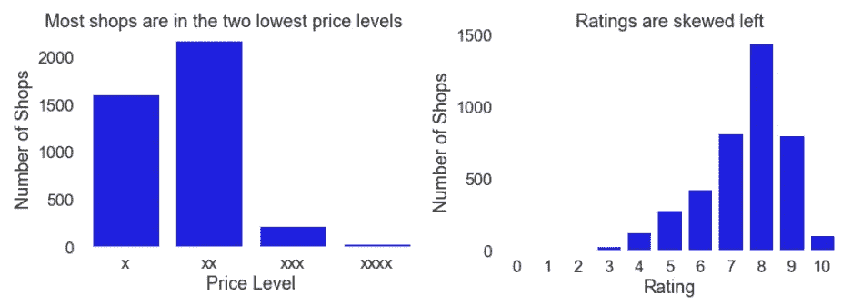

在涉及*价格的双变量分析中，观察到最高价格水平的商店如此之少是很重要的。*这表明 *xxxx* 商店的样本量很小，因此我们在分析它们时应该犹豫不决，不要轻易下结论。尽管如此，这些商店对模拟器来说还是很重要的，因为它的建造方式是昂贵的商店比便宜的商店对他们的竞争对手有更大的影响。

同样值得注意的是，*的评分*偏左，在三个最低评分(0，1，2)中的任何一个中，都有不可见数量的商店。模拟器会将较高的影响力分配给具有较高评级的咖啡店。我将使用各种评级的相对计数来帮助校准*评级*对一家商店在网络中对其邻居的影响有多强。因为条形图显示高评分的商店并不少见，所以如果条形图向右倾斜，我会给这些商店分配较少的影响。

现在我对这三个特性的分布有了更好的了解，是时候成对比较这些特性了，从*评级*和*价格*开始。

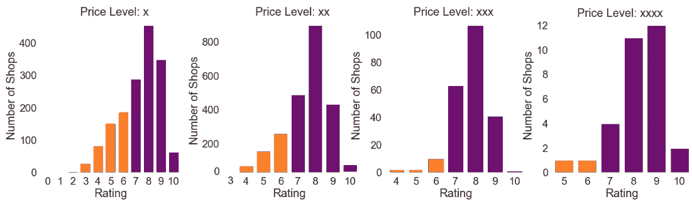

单变量分析显示，不同水平的*价格*的样本量差异很大，因此在*价格*上涨时比较*评级*的相对计数比绝对计数更有意义。随着*价格*增加，*等级*增加。通过观察发现，最低评级商店的评级随着*价格*的增加而增加。此外，评分低于 7 的商店比例——也就是橙色区域占条形总面积的比例——随着价格的增加而减少。第二种模式在最高价格水平下有些失效，但这可以解释为由 *xxxx* 商店的小样本量引起的差异。因为更贵的商店往往获得更高的评分，他们似乎更成功，因此更愿意尝试新的趋势。这种洞察力将用于模拟器的初始化步骤，随机选择的商店采用枫糖浆趋势；更昂贵的商店将被分配更高的初始化概率。

接下来我比较了*价格*和*评论*。

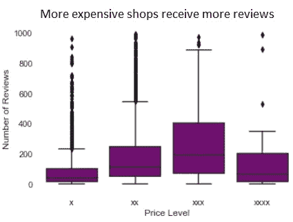

Because reviews has an extreme outlier at 7693, I decided to restrict this feature for the left graph so as to avoid vertically compressing the boxplots. By imposing the restriction that reviews≤1000, the resulting boxplots are legible at the cost of only 3.3% of the data that was ultimately filtered out.

对于前三个水平，随着*价格*的增加，*评论*的第一个四分位数、中间值和第三个四分位数也增加。 *xxxx* 类中的商店不遵守这种模式，但同样，这种商店的样本量很小，所以我们不应该过于相信数据告诉我们的关于它们的信息。*价格*和*评论*正相关，这一点令人放心，因为已经确定它们都将积极推动模拟器中的趋势采用概率。

为了总结双变量分析，我比较了*评级*和*评论*。

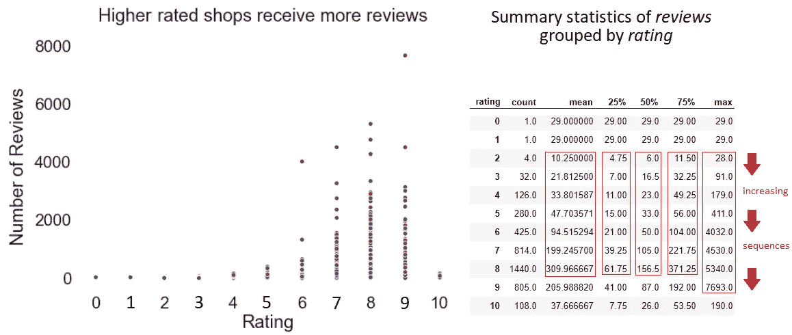

散点图显示，*评论*随着*评分*的增加而增加，但是因为有太多评分为 7、8 或 9 的点不明显可见，所以我决定查阅*评论*的汇总统计。从表中我们可以看到，随着*评级*从 2 增加到 8，平均值和前三个四分位数都在增加；从 2 到 9，最大值在增加。对于评分为 9 的商店，中间值和前三个四分位数也相对较大，只是没有评分为 8 的商店那么大。

因为*评级*与*评论*正相关，而*评论*代表*评级*的样本量，评级越高的店铺，其评级越可信。了解这一点对模拟器很有用，因为它告诉我应该将较高的方差分配给与较低评级商店的影响相关联的概率分布。

在这一点上，随着*评级*和*价格*同时上涨，*评论*也在上涨，这并不奇怪:

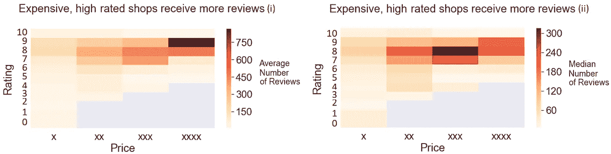

Heatmaps for reviews≤1000\. Grey rectangles correspond to (price, rating) pairs that do not occur in the data.

这有助于进一步巩固从*价格*对*评论*和*评级*对*评论*的双变量分析中得出的结论。

# 咖啡店作为一个网络

## 用图论对网络建模

数据集中的咖啡店网络可视为一个简单的图表。每个咖啡店是图中的一个节点，当且仅当一对节点在地理上足够接近时，这一对节点之间存在边。

This graph represents a network of 8 coffee shop nodes (in red) with 9 edges (in black). Only nearby node pairs have edges between them. The full network of 4036 coffee shops would be too large to display here.

为了构建完整网络图的边，我首先定义了一个函数，该函数使用一对点的地理坐标来计算它们之间的欧几里德距离。然后，我创建了一个函数，它将 *max_distance* 作为输入，并输出一个 Python 字典，其中的键是咖啡店 id，与键相关联的值是所有其他咖啡店 id 的列表，这些 id 与键的距离最多为 *max_distance* 。换句话说，键是节点，与键相关联的值是与键有边的所有节点的列表。

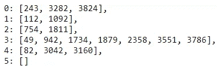

This is a sample from the dictionary when max_distance = 0.001\. The sample consists of 6 keys and their corresponding neighbor lists . For example, coffee shop 4 has an edge with coffee shops 82, 3042 and 3160.

无法预先知道*最大距离*参数的合适选择。如果 *max_distance* 太小，则图中的边太少，连通性低；影响力会被低估。如果 *max_distance* 太大，那么图中将有太多的边和高连通性；影响力会被高估。作为找到该参数的合适值的第一步，我计算了对于不同的 *max_distance 值，网络中节点间邻居的最大和平均数量。*

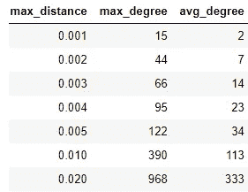

The degree of a node is the number of other shops that are no further than max_distance away from the node. Distance scale: two nearby adjacent streets in NYC are typically a distance of 0.0007 to 0.0010 apart.

趋势在模拟中传播的速度主要取决于 *avg_degree* 。如果这个值太大，那么模拟将高估趋势传播的速度；更多的邻居意味着更多的外来影响。因此，我决定在版本 1 的任何未来分析中只测试*最大距离* ≤ 0.004 的值，这样*平均程度≤* 23，这似乎是一个合理的上限。距离 0.004 对应于通常从给定咖啡店延伸不超过 6 条纽约市街道的半径。

## 趋势模拟器:版本 1

在任何给定时刻，网络中的每个节点都有一个与之相关联的布尔状态，其中 *True* 意味着商店在那个时刻正在跟随潮流。初始状态使用二项式分布随机化，并且网络在迭代中更新，其中第一次迭代之后的每次迭代的状态由前一次迭代的状态和以下两个规则确定:

*   如果一个节点在迭代 I 为真*，那么在所有迭代 j > i 为真*
*   **如果一个节点在迭代 I 时为*假*，但是在迭代 I 时至少有一个邻居为*真*，并且如果迭代 I 不是最后一次迭代，则对于迭代 i+1，该节点更新为*真*。**

**一次迭代可以被认为是一个时间单位，例如一个月或者一年。我构建了一个函数，以表格的形式输出模拟结果，其中行对应于节点，列对应于每次迭代中节点的布尔状态。**

**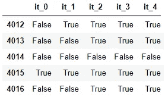**

**This is a sample of the simulation output which shows the states of shops 4012 to 4016 for the random initialization step and the first 4 iterations.**

**作为输入，模拟器要求:**

*   ****adj_dict** :包含节点和邻居列表的字典，由 *max_distance* 决定(如图论部分所述)**
*   ****迭代次数**:网络更新迭代次数**
*   ****p_x** ， **p_xx** ， **p_xxx** ， **p_xxxx** :与二项分布相关的状态初始化概率；四个价格级别各有一个值**
*   ****种子**:二项式分布的随机种子**

**在这一点上，仍然不清楚什么是对最大距离的好选择；我只是凭直觉猜测 0.004 的上限似乎是合理的，所以我用 0.001、0.002、0.003 和 0.004 的 *max_distance* 值进行了实验。也不清楚 *p_x* 、 *p_xx* 、 *p_xxx* 和 *p_xxxx* 的合适选择可能是什么。为了最小化不断增长的选项的复杂性，我决定在模拟器的版本 1 中使这些初始化概率相等，但是用不同的值进行实验。我认为，在一个包含 4036 家商店的数据集中，说服 10 家商店最初采纳一个想法似乎并不太牵强。这相当于初始化概率为 10/4036，或者大约为 0.0025，所以我试验了每个 *max_distance* 值的初始化概率为 0.0005、0.0010、0.0015、0.0020 和 0.0025。对于每个( *max_distance* ， *init_prob* )对，模拟器使用 100 个不同的随机种子运行，以生成具有这些特定参数值的模拟样本。然后，对所有种子的*真*商店的数量进行平均，按照*最大距离*、*初始* _ *概率*和迭代进行分组。**

**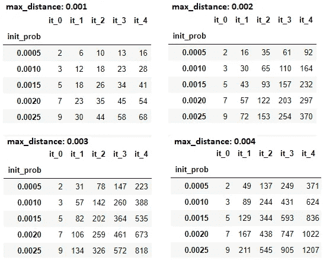**

**Each table entry is an average over 100 simulations.**

**极端情况:**

*   **当 *max_distance* 和 *init_prob* 分别最小化为 0.001 和 0.0005 时，趋势传播非常缓慢。到第四次迭代结束时，平均仍只有 16 家咖啡店采用了这一趋势，这一增长率太低，不足以被视为病毒式增长。**
*   **当 *max_distance* 和 *init_prob* 分别最大化到 0.004 和 0.0025 时，趋势传播非常快。在第一次网络更新后，趋势采纳者的平均数量从初始化阶段的 9 个跃升至 211 个，这一增长率似乎非常高。**

**本着实事求是的精神，我决定分析这两个极端之间的模拟。我已经计算出 *init_prob* = 0.0025 似乎是一个合理的起点，但是即使 *max_distance* 低至 0.002，平均模拟从 *it_0 到 it_1* 增长得不合理地快。因此我用 *max_distance* = 0.001 解决了这个问题，并生成了下面的模拟。**

**This is the random initialization and first ten iterations of an example simulation when init_prob=0.0025 and max_distance=0.001\. The red points represent the shops in NYC that are using the trend at each iteration.**

**这一趋势主要始于曼哈顿和布鲁克林北部，并从那里蔓延开来。这不足为奇，因为这些地区遍布咖啡店。在推动枫糖浆咖啡潮流的过程中，一个合理的策略可能是将这个想法集中卖给这些地区一些有影响力的商店，然后看着它有机地传播。**

**第一个版本的主要缺点是，这种趋势不太可能在咖啡店不密集的地区蔓延。下一个版本将致力于解决这个问题。**

# **后续步骤**

**在模拟器的第一个版本中，一直隐含地假设任何商店对其邻居的影响权重是固定的。在下一个版本中，我将通过使用*评分*、*评论*和*价格*特征来量化每对相邻商店之间的影响，从而改进这种方法。我还将包括一些特征工程变量，如 *is_starbucks* 和 *is_starbucks_neighbor* ，它们为数据集最常去的咖啡店提供特殊待遇。商店是否在随机初始化阶段之外的任何迭代中采用该趋势将由其邻居的影响以及引入到网络中以解释人的不可预测性的一些随机噪声来确定。这将产生一个更真实的模拟器，特别是允许这种趋势在曼哈顿和布鲁克林北部以外的地区传播。**

****代码:**这个项目的代码和模拟器的所有未来版本都可以在[我的 GitHub 页面](https://github.com/nateofspades)找到。**

****联系人:**如有任何问题、意见或建议，请随时联系 nathanburnsds@gmail.com 或 [LinkedIn](https://www.linkedin.com/in/nathanburns-datascientist/) 。**

***最后，我要感谢* [*苏珊·霍尔科姆*](https://medium.com/@h0lc0mb) *在整个项目中提供的及时而全面的反馈。***