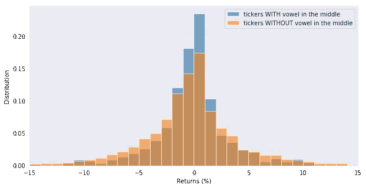
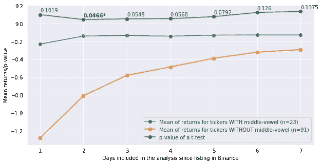
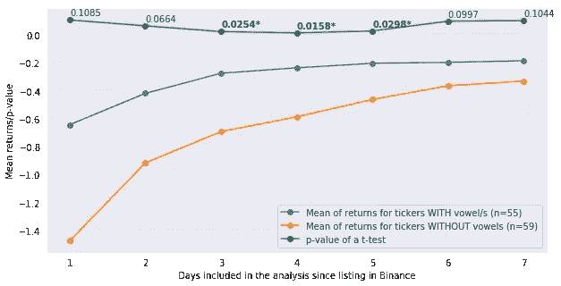

# 加密货币命名中的认知偏差

> 原文：<https://towardsdatascience.com/cognitive-bias-in-cryptocurrency-naming-74c5d6a7990f?source=collection_archive---------25----------------------->

## 为什么将一种加密货币命名为“NAS”而不是“XZC ”,会在交易所上市后的第一周产生熟悉感并提高购买兴趣


Photo by [meo](https://www.pexels.com/@xespri) on [Pexels](https://www.pexels.com)

在畅销书*思考快与慢*、*中，丹尼尔·卡内曼用了整整一章来探讨概念、想法、图片或文本呈现给我们的方式，以及我们理解它们所付出的努力对我们对它们的态度和情绪的影响。因此，与清晰、轮廓分明的图像或字体相比，难以看清的图像或文本字体通常与消极态度或不快有关。他称这种现象为认知放松带来的快乐。*

同样，他解释说

> 容易发音的单词唤起一种有利的态度。名字容易发音的公司在股票发行后的第一周比其他公司表现更好，尽管这种效应会随着时间的推移而消失。具有可发音交易代码的股票(如 KAR 或 LUNMOO)表现优于那些具有绕口令代码的股票，如 PXG 或 RDO——它们似乎在一段时间内保持了一点优势。在瑞士进行的一项研究发现，投资者认为 Emmi、Swissfirst 和 Comet 等名字流利的股票比 Geberit 和 Ypsomed 等名字笨拙的股票收益更高。

这一假设背后的主要思想是，市场工具名称的可读性与我们记住它的程度有因果关系。与此同时，记住一些东西会导致熟悉感，除非记忆表达了相反的意思，否则我们经常喜欢或偏爱我们记住的东西。这反过来又会导致购买兴趣的增加，或者在有购买选择的情况下更倾向于购买资产。

> 可读性→记忆性→熟悉度→喜欢度→购买兴趣

> Zajonc 称这种现象为*单纯暴露效应*。[……][他]认为重复对喜欢的影响是一个极其重要的生物学事实。为了在一个经常充满危险的世界中生存，一个有机体应该对一个新的刺激做出谨慎的反应，退缩和恐惧。对于一种不怀疑新奇事物的动物来说，生存前景是暗淡的。然而，如果刺激实际上是安全的，最初的谨慎消退也是适应性的。纯粹的暴露效应之所以会出现，是因为重复暴露于刺激之后不会有任何不良反应。这样的刺激最终会**成为安全信号，安全性好**。

我认为广告和营销也是从曝光效应中培养出来的，这或许可以解释“没有坏的宣传”这句话。这是，他们如何评价我们的产品并不重要，重要的是人们会谈论它，从而产生熟悉感，进而产生好感等等，直到引起更大的购买兴趣。

为了测试股票代码的可读性是否会影响对加密货币的购买兴趣，我进行了一个小型研究项目，以确定事实是否如此。你可以在文章的最后找到 Jupyter 笔记本。

## 数据

这个研究项目背后的主要假设是，加密货币的可读和易记的名称应该在发行或在交易所上市的第一周影响资产的价格。

在我们的案例中，我们将与在币安交易所上市的或多或少同质的一组加密货币合作，这些加密货币满足以下要求:

1.  加密货币的股票名称(简称)应该是 3 个字母长。例如，瑞士联邦理工学院、TRX、ZEC…
2.  加密货币应该与比特币进行交易。例如，BTC 理工学院、TRX BTC 学院等。

114 种加密货币符合这些标准。

现在我们将每种加密货币分为“可读”或“不可读”。我们将使用两条规则:

*   在一种情况下，我们将认为具有至少一个元音的 3 个字母的跑马灯的加密货币是可读的，而如果加密货币跑马灯仅由辅音组成，则是不可读的。例如，ETH 是可读的，而 ZRX 是不可读的。
*   在第二种情况下，我们将把所有中间位置有一个元音的加密货币视为可读的，而其余的则视为不可读的。例如:英美烟草公司是可读的，但 BSV 不是。

然后，我们将检索加密货币在币安交易所上市后第一周的所有 1 小时烛台。

第一个规则分类的标记:

```
**WITH VOWEL:**
ADA, ADX, AGI, AMB, ARK, ARN, AST, BAT, EDO, ELF, ENG, ENJ, EOS, ETC, ETH, EVX, FET, FUN, GAS, GTO, HOT, ICN, ICX, INS, KEY, LUN, MCO, MDA, MOD, NAS, NAV, NEO, OAX, OMG, ONG, ONT, OST, PAX, POA, POE, REN, REP, REQ, SKY, SUB, SYS, VEN, VET, VIA, VIB, WAN, XEM, ZEC, ZEN, ZIL
 **WITHOUT VOWEL:**
BCC, BCD, BCH, BCN, BLZ, BNB, BNT, BQX, BRD, BSV, BTG, BTS, BTT, CDT, CMT, CND, CVC, DCR, DGD, DLT, DNT, GNT, GRS, GVT, GXS, HSR, KMD, KNC, LRC, LSK, LTC, MFT, MTH, MTL, NXS, PHB, PHX, PPT, QKC, QLC, QSP, RCN, RDN, RLC, RPX, RVN, SNM, SNT, TNB, TNT, TRX, WPR, WTC, XLM, XMR, XRP, XVG, XZC, ZRX
```

## 分析

为了进行分析，我们将计算每种加密货币的百分比回报，并汇总上述每种类别的所有回报。最后，我们将比较这些分布，并执行 t 检验，以统计评估这两个样本是否可以被视为来自不同的分布。理想情况下，我们预计可读密码将比不可读密码有更高的回报，这是由于所描述的*纯粹暴露效应*。

## 结果

首先让我们看看中间有/没有元音的分笔成交点的回报分布:



**Figure 1**. Distribution of 1-h returns for cryptocurrencies with tickers that contain a vowel in the middle vs tickers without a vowel in the middle for the first 2 days after exchange listing.

看似有一些差异，但这些差异有统计学意义吗？让我们对交易所上市后 1 天到 7 天的所有数据进行 t 检验:



**Figure 2**. Mean returns and t-test p-value for tickers with vowel in the middle position vs tickers without the middle vowel. The reported “n” represents the number of cryptocurrencies included in each class.

令人惊讶的是，可读类别(带中元音)的平均回报率实际上高于不可读类别。这种差异在开始时似乎更大，但似乎随着时间的推移而衰减。有趣的是，p 值都很低，在α= 0.05(5%)时有一个点具有统计学意义。

现在让我们看看元音与非元音标记分类的结果:



**Figure 3**. Mean returns and t-test p-value for tickers with any vowel vs tickers without any vowel. The reported “n” represents the number of cryptocurrencies included in each class.

乍一看，平均差异似乎更小，但我们至少可以看到三点具有统计意义！毕竟，该假设至少在一定程度上似乎是正确的。

## 带回家的信息

虽然相关性并不总是意味着因果关系，但我们可以看到，在交易所上市后的第一天，具有可读符号或股票名称的加密货币实际上显示出更高的平均回报(在 alpha=0.05 的不同点上显著)。这表明，当人们可以选择购买一项资产时(特别是在 2017 年发生的 altcoin 热潮期间，当时这里分析的大多数加密货币都已上市)，人们可能会倾向于购买更多具有最可读和最难忘名称的加密货币。

## Jupyter 笔记本

*这个项目是我们在*[*cryptodatum . io*](https://cryptodatum.io)*研究的一部分，这是一个加密货币数据 API，旨在提供即插即用的数据集来训练机器学习算法。如果你是机器学习从业者，在*[*https://cryptodatum . io*](https://cryptodatum.io.)获取你的免费 API 密匙，自己玩吧

[](https://cryptodatum.io)