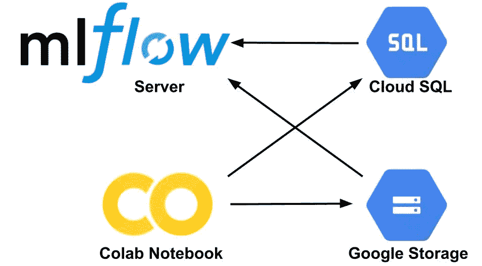
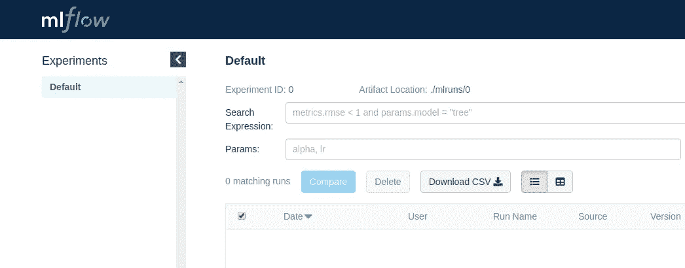

# Colab 与 MLflow 的协同:如何监控进度和存储模型

> 原文：<https://towardsdatascience.com/colab-synergy-with-mlflow-how-to-monitor-progress-and-store-models-fbfdf7bb0d7d?source=collection_archive---------24----------------------->

深度学习中越来越多的模型依赖于 GPU 的使用。作为一名深度学习实践者，我甚至想过买一台来加速我的辅助项目的开发。但是每年发布的新型号的 GPU 使得旧的 GPU 显得有些陈旧、缓慢、不酷。酷的东西是新的云技术，允许租用一个具有上一代 GPU 的虚拟机(VM ),并在云中训练你的模型(high)。然而，从设置云虚拟机的金钱和时间来看，这可能仍然很昂贵。

如果我告诉(或提醒)了呢？)您了解解决所有这些问题的云解决方案吗？谷歌的 Colab 笔记本提供了一个长达 12 小时的免费 GPU。然而，12 小时后一切都变成了南瓜:所有存储的数据都不见了。


Photo by [Dan Gold](https://unsplash.com/@danielcgold?utm_source=medium&utm_medium=referral) on [Unsplash](https://unsplash.com?utm_source=medium&utm_medium=referral)

收敛到南瓜不是唯一的选择。为了保存训练过的模型，需要将[谷歌存储](https://colab.research.google.com/notebooks/io.ipynb)或[谷歌驱动](https://colab.research.google.com/notebooks/io.ipynb)与 Colab 笔记本连接。为了监控训练进度，必须使用额外的工具，如 [Colab Tensorboard](https://medium.com/@tommytao_54597/use-tensorboard-in-google-colab-16b4bb9812a6) 。或者，MLflow 提供了存储模型和监控训练进度的解决方案。在这篇博文中，我介绍了如何在 Google Cloud 上设置 MLflow 的指南。

MLflow 存储两种类型的数据:

*   结构化数据:训练进度的度量和模型参数(浮点数和整数)
*   非结构化数据:训练工件(图像、模型等。)

我们可以将这些类型的数据存储在数据库中，也可以本地存储在虚拟机上。让我们从数据库选项开始。对于培训的指标，可以使用 SQL 或 Databricks 数据库。对于训练工件，数据库是 S3，谷歌存储或 Azure 存储。为了观察训练进度，需要部署 MLflow 服务器(管理存储数据的 GUI)并将其连接到数据库。另一种选择是在虚拟机上部署 MLflow 服务器，并将所有内容本地存储在其上。

我决定采用第一种方法，将 MLflow 服务器连接到数据库。在我看来，这种设置更加健壮，因为我们不需要依赖 MLflow 服务器，而只需要依赖云数据库。此外，数据库选项允许在您的笔记本电脑上本地部署 MLflow 服务器，这样更安全。对于云提供商，我选择了谷歌云，因为我还剩下一些免费积分:)。这是一个建筑的草图:



现在，让我们按照 5 个实际操作步骤，在本地部署服务器，该服务器将连接到 SQL 数据库以获取指标，并连接到 Google storage 以获取工件。

**1。在 IAM 控件中设置服务帐户。**我现在的设置不是最安全的(最后看关于安全的评论)。但是，有一件事绝对值得做，那就是在 Google Cloud 的 IAM 控件中创建一个服务 app。要创建服务 IAM，请遵循以下步骤:

IAM→服务帐户→选择项目→创建服务帐户→…

应向 app Cloud SQL Editor，Storage Object Admin 授予以下权限。创建 IAM 服务帐户的原因是，如果有人偶尔发现了您的应用凭据，最大的损害仅限于 SQL 和存储。对于到 SQL 和存储的连接，我们将使用服务 IAM 密码。要使用密码创建 JSON:

服务帐户详细信息→授予此服务帐户对项目的访问权限(选择角色)→授予用户对此服务帐户的访问权限→创建 JSON 格式的密钥并保存此文件。

现在您有了一个带有 JSON 密钥的服务应用程序。

**2。创建和配置 Google SQL server。**[ml flow 支持的 Google cloud 中现有的解决方案](https://cloud.google.com/sql/docs/)是 MySQL 和 PostgreSQL。设置 PostgreSQL 要简单得多。ml flow 1 . 0 . 0 版本中的 MySQL 有几个问题，这些问题肯定会在下一个版本中得到解决。在这篇文章中，我描述了 PostgreSQL 的设置。

2a。启动 PostgreSQL server 后，使用规则 0.0.0.0/0 为您的 SQL 服务设置公共 IP(在这里，您将您的 SQL 暴露给 Internet，知道您的 SQL 数据库密码的每个人都可以访问您的 SQL)。记下您的公共 IP 号码，因为您以后会需要它。

2b。在 SQL 中创建一个表，用于存储 MLflow 中的数据。

2c。为 SQL 数据库设置用户名和密码。

**3。配置 Google 存储帐户。**

3a。在 Google Storage 中创建一个存储桶。

3b。将角色:“传统存储桶所有者”和“传统存储桶读者”添加到您在步骤 1 中创建的 IAM app-user。为此，请遵循:

选择桶→权限→选择服务帐户→添加相应的角色

**4。启动本地 MLflow 服务器。**

MLflow 提供了一个很好的 GUI，叫做 MLflow Server。您可以通过这个 GUI 管理存储在数据库中的模型。一种选择是在您的笔记本电脑上本地启动 MLflow 服务器。

4a。首先，安装 MLflow 和以下必需的软件包:

```
pip install google-cloud-storage mlflow psycopg2
```

4b。还记得步骤 1 中的 JSON 文件吗？现在我们需要它！类型:

```
export GOOGLE_APPLICATION_CREDENTIALS=”path/to/jsonfile”
```

4c。就是这个！使用以下命令启动 MLflow 服务器:

```
mlflow server \
--backend-store-uri 'postgresql://<username>:<password>@<sql ip>/<name of table>'\
--default-artifact-root gs://<name of bucket in gs>/
```

这里的‘postgresql://<username>:<password>@<sql ip="">/<name of="" table="">是一个连接到您的 PostgreSQL 数据库的 SQL Alchemy 字符串。在此插入步骤 2 中的相应凭据。</name></sql></password></username>

之后，您的 MLflow 服务器应该可以工作了。在浏览器地址栏输入 [http://127.0.0.1:5000 即可查看。](http://127.0.0.1:5000.)您希望看到 MLflow 服务器的起始页:



MLflow Server first start.

**5。使用 Colab 测试 MLflow 设置。**

要测试连接，您应该首先设置您的凭据。比如，像这样:

然后用 Colab 的其他包安装 MLflow，并将一些度量和工件保存到数据库中:

[全笔记本](https://github.com/azarnyx/MLflowColab/blob/master/Colab_MLflow_test.ipynb)在 GitHub 有售。

请注意，我使用了所展示的设置来在可公开访问的数据集上训练模型，安全性不是主要关注的问题。有几个漏洞，如将 SQL server 暴露在互联网上，以及将密码从服务帐户直接写入 Colab 笔记本。在这种设置中，服务帐户权限的限制非常重要。设置 MLflow 的一个更安全的方法是通过 gcloud 工具建立到 Google cloud 的连接，并使用 [Google Storage SQL proxy](https://cloud.google.com/sql/docs/mysql/sql-proxy) 而不将 SQL 服务暴露给互联网。要知道，简单性和安全性之间总是有取舍的:)

快乐模型管理和培训与 Colab！