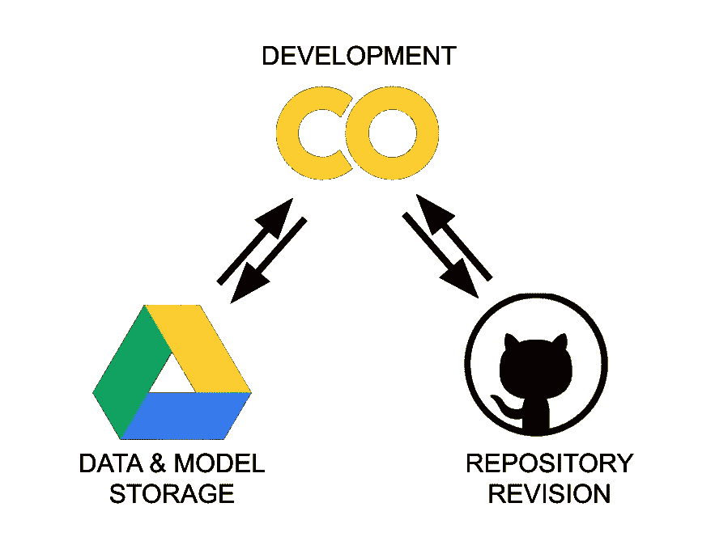
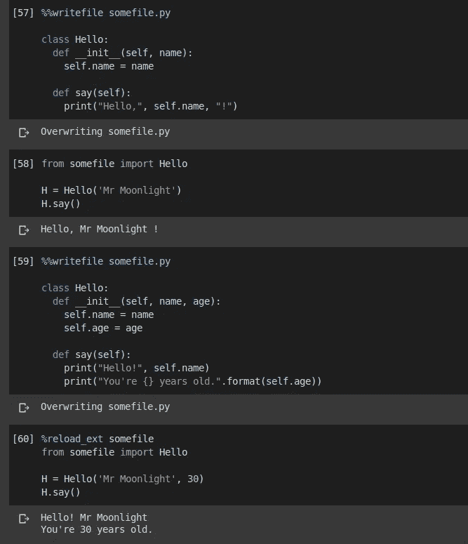
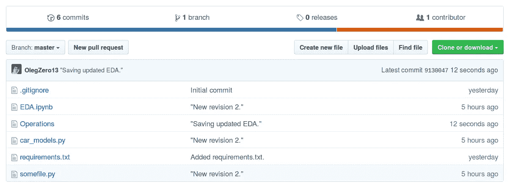

# 协作室+驱动器+ Github ->工作流程更加简单

> 原文：<https://towardsdatascience.com/colaboratory-drive-github-the-workflow-made-simpler-bde89fba8a39?source=collection_archive---------17----------------------->

# 介绍

这篇文章是我们之前尝试充分利用两个世界的延续，即 T2 谷歌实验室和 T4 Github T5。简而言之，我们试图在典型的数据科学工作流程中映射这些工具的使用。虽然我们成功了，但是这个过程也有缺点:

*   它依赖于*动态导入*，这使得我们的代码变得不必要的麻烦。
*   我们没有让 Github 部分正常工作。工作空间必须脱机保存。

在本帖中，我们将向您展示一种更简单的方法来组织工作空间，而不会有这些缺陷。你需要的只是一个 Gmail 和 Github 账户。我们开始工作吧。

# 什么去哪里？



Figure 1\. Three parts of our simple “ecosystem”.

通常，我们的工作区中有四种基本的文件类别:

*   笔记本*(。ipynb)* —对于交互式开发工作，
*   库*(。py)* —对于我们使用和重用的代码，
*   模型——我们试图建造的东西，
*   数据——我们构建数据的原料。

由于 Colab 后端不是持久的，我们需要一个永久的存储解决方案。除此之外，我们还需要一个版本控制系统，这样我们就可以跟踪变化。最后，如果我们不需要考虑这个机器，我们会很感激。

Colab 很容易与 Google Drive 集成，这使它成为存储空间的自然选择。我们将使用它来存储我们的*数据*和*模型*。同时，Github 更适合代码，因此我们将把它用于*笔记本*和*库*。现在，问题出现了，我们如何从笔记本的位置将两者接口，这将使我们的工作流尽可能地无痛？

# 开源代码库

我们假设您已经有了一个 Github 帐户，并为您的项目创建了一个存储库。除非您的存储库是 *public* ，否则您将需要*生成一个* ***令牌*** 来通过命令行与之交互。这里有一个简短的[指南](https://help.github.com/en/enterprise/2.15/user/articles/creating-a-personal-access-token-for-the-command-line)告诉你如何创建一个。

# Google Drive

接下来的事情是为模型和数据组织我们的非易失性存储空间。如果你有一个 Gmail 账户，你就成功了一半。你需要做的就是在驱动器中创建一个空目录，就这样。

# 合作实验室——操作笔记本

为了让事情井井有条，我们定义了一个单独的笔记本作为我们的*操作*工具。我们将专门使用它的单元来操纵我们的空间，让其他笔记本来处理更有趣的事情，如*探索性数据分析*、*特征工程*或*培训*。所有笔记本，包括这个，都将被修改，但是命令存储在*操作*笔记本中。

# 工作流程

工作流程是一个简单的**三步流程**:

1.  首先，在连接到 Colab 运行时之后，我们需要*挂载* Google Drive 并且*使用 Github 更新*我们的空间。
2.  我们使用笔记本和其余的文件(我们的模块、库等)。).在这种背景下，我们干脆称之为*剪辑*。
3.  我们*保存*我们的工作，通过使用*操作*笔记本将我们的驱动器与 Github 同步。

# 连接、安装和更新

```
from google.colab import drive
from os.path import join

ROOT = '/content/drive'     # default for the drive
PROJ = 'My Drive/...'       # path to your project on Drive

GIT_USERNAME = "OlegZero13" # replace with yours
GIT_TOKEN = "XXX"           # definitely replace with yours
GIT_REPOSITORY = "yyy"      # ...nah

drive.mount(ROOT)           # we mount the drive at /content/drive

PROJECT_PATH = join(ROOT, PROJ)
!mkdir "{PROJECT_PATH}"I    # in case we haven't created it already   

GIT_PATH = "https://{GIT_TOKEN}@github.com/{GIT_USERNAME}/{GIT_REPOSITORY}.git"
!mkdir ./temp
!git clone "{GIT_PATH}"
!mv ./temp/* "{PROJECT_PATH}"
!rm -rf ./temp
!rsync -aP --exclude=data/ "{PROJECT_PATH}"/*  ./
```

上面的代码片段在`/content/drive`安装 Google Drive 并创建我们项目的目录。然后，它从 Github 中取出所有文件，并将它们复制到那个目录中。最后，它收集属于驱动器目录的所有内容，并将其复制到我们的本地运行时。

这个解决方案的一个好处是，如果多次执行，它不会崩溃。无论何时执行，它只会更新新的东西。此外，使用`rsync`，我们可以选择*排除*一些内容，这可能需要很长时间才能复制(...数据？).

# 编辑、编辑和编辑

开发，尤其是在数据科学中，意味着在我们最终把事情做好之前要尝试多次。在此阶段，可以通过以下方式编辑外部文件/库:

1.  替换或更改驱动器上的文件，然后使用`rsync`将它们传输到每个笔记本的本地运行时，或者
2.  使用所谓的 IPython [魔法](https://ipython.readthedocs.io/en/stable/interactive/magics.html)命令。

假设您想要快速更改`somefile.py`，这是您的库文件之一。您可以为该文件编写代码，并使用`%%writefile`命令告诉 Colab 保存它。由于文件驻留在本地，您可以简单地使用`import`语句再次加载它的新内容。唯一的事情是记住首先执行`%reload_ext somefile`命令，以确保 Colab 知道更新。

这里有一个例子:



Figure 2\. Importing, editing and importing again. All done through the cells.

# 储蓄，收工

一旦你想备份你所有的工作，你需要做的就是把所有的文件复制到存储器里，然后推送到 Github。

可以使用笔记本单元中执行的`!cp -r ./* "{PROJECT_PATH}"`进行复制，这将更新驱动器存储。然后，推送到 Github 需要创建一个临时工作目录和**配置本地 git repo** 只是暂时的。下面是要执行的命令:

```
!mkdir ./temp
!git clone "https://{GIT_TOKEN}@github.com/{GIT_USERNAME}/{GIT_REPOSITORY}.git" ./temp
!rsync -aP --exclude=data/ "{PROJECT_PATH}"/* ./temp

%cd ./temp
!git add .
!git commit -m '"{GIT_COMMIT_MESSAGE}"'
!git config --global user.email "{GIT_EMAIL}"
!git config --global user.name "{GIT_NAME}"
!git push origin "{GIT_BRANCH_NAME}"
%cd /content
!rm -rf ./temp
```

显然，您需要自己定义`"{...}"`中的字符串。



Figure 3\. Successful upload of the content to Github. Calling it a day.

# 结论

在这篇文章中，我们展示了如何在使用 Google Colab 时有效地将 Google Drive 和 Github **结合起来**。改进后的工作流程比之前介绍的流程简单得多。

如果你想分享任何有用的技巧或提出一些改进建议，请在评论中提出。你的反馈很有帮助。

# 还会有更多…

我计划把文章带到下一个层次，并提供简短的视频教程。

如果您想获得关于视频和未来文章的更新，**订阅我的** [**简讯**](https://landing.mailerlite.com/webforms/landing/j5y2q1) **。你也可以通过填写[表格](https://forms.gle/bNpf9aqZJGLgaU589)让我知道你的期望。回头见！**

*原载于*[](https://zerowithdot.com/colab-github-workflow/)**。**