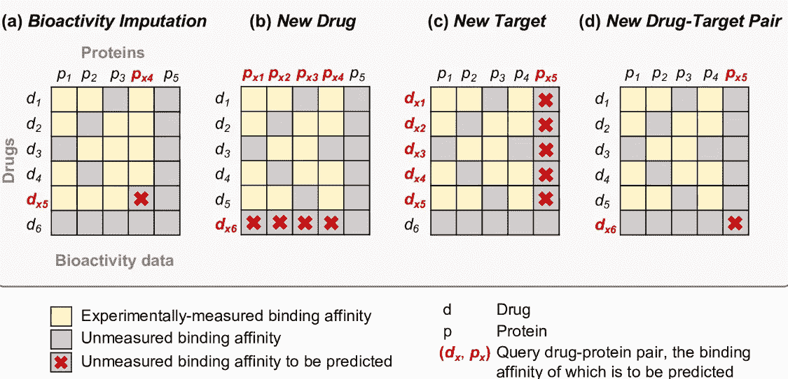
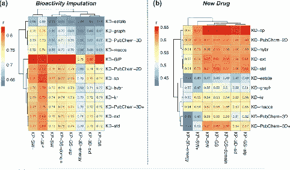
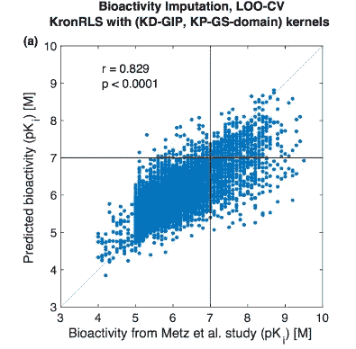
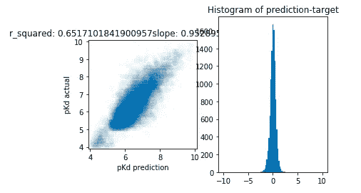
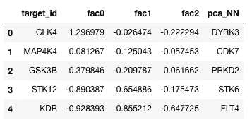
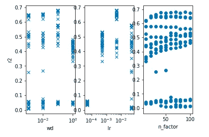

# 协同过滤来“预测”药物的疗效(2)

> 原文：<https://towardsdatascience.com/collaborative-filtering-to-predict-the-efficacy-of-a-drug-2-f151956315b7?source=collection_archive---------21----------------------->

## 另一个案例研究和对领域知识的一些思考

在本系列的第一篇博文中，我展示了使用协同过滤来预测药物与其靶标之间的相互作用强度的结果。在这个续集中，我将尝试处理另一个数据集，并讨论领域知识在生物化学中的重要性。

该数据集来自 T2 在一份著名杂志上发表的论文。这个数据集后来被另一个小组用来开发一种“预测”药物和激酶相互作用强度的方法(见 [Cichonska 论文](https://journals.plos.org/ploscompbiol/article?id=10.1371/journal.pcbi.1005678))。还记得第一篇帖子开头提到的四种场景吗？该图是从 Cichonska paper 复制的，并在下面复制，再次作为我们的起点。

Reference: [Cichonska paper](https://journals.plos.org/ploscompbiol/article?id=10.1371/journal.pcbi.1005678)

我们处理场景(a)仅仅是因为协同过滤的基本限制。然而，cihon ska paper 试图做的不止这些。他们的诀窍是依靠药物和蛋白质的内在分子特性来进行预测。虽然分子的性质是由其分子结构决定的，但确切的关系还远未确定。事实上，Cichonska 论文的作者不得不筛选相当多的方法来描述一种分子，以便找到一种可以提供最佳预测的方法。下图总结了他们的努力。

他们试图找到药物和激酶的最佳模型。每行对应一个药物模型，每列对应一个蛋白质模型。每个单元格中的数字是预测和测量结果之间的皮尔逊相关系数，其平方相当于两者之间线性拟合的 R。通常，药物模型的想法与激酶模型有很大的不同。理解所有这些描述药物和蛋白质的不同方式需要大量的领域知识，因此评估所有可能的组合不是一件容易的事。在不深入细节的情况下，我们寻找那些具有较高 r 值或红细胞的细胞。对于称为生物活性插补的问题(上图左侧)，这是前面提到的四种情况中的第一种，最佳药物模型称为 KD-GIP。令人惊讶的是，这是唯一不基于分子结构或任何其他内在性质的模型；相反，它是基于测量的药物和蛋白质之间的相互作用强度。对于激酶，较好的型号是 KP-SW 或 KP-SW+。它们是基于蛋白质的结构。另一个蛋白质模型 KP-GIP 也表现相当好，这不是基于结构。因此，事实证明，他们还没有发现一种药物或蛋白质的内在模型比基于测量数据的经验模型好得多。

KP-GIP 和 KD-GIP 是协同模式吗？答案是否定的。它们基于内核技巧。可能需要一整本书来描述这个内核技巧。在我们的特定模型中，我们需要知道所考虑的药物和激酶之间的所有相互作用强度，包括那些尚未测量的，以实现这个核心技巧。但这不正是模型最初应该帮助我们的吗？为了让这些模型起作用，作者必须“猜测”缺失的相互作用值。如第一篇博文所示，协同过滤不需要对插补问题进行任何猜测。

对于称为“新药”的问题或者开头提到的四个场景中的第二个，最好的模型是药物的 KD-sp 和蛋白质的 KP-GS。由于手头问题的“冷启动”性质，它们必须是内在模型，所以作者甚至没有奢侈去尝试 KP-GIP 或 KD-GIP。有趣的是，KD-sp 和 KP-GS 不是插补问题中的最佳内在模型。换句话说，本质上相同问题的不同味道——预测相互作用强度——需要使用不同的模型。如果同一个模型对两种情况都是最好的，那就更让人放心了。

公平地说，论文中评估的许多内在模型都有类似的表现。r 值的差异只体现在第二或第三位小数上。我个人认为 r 值相差 0.01 在实践中并不显著。但是，追求 r 值非常小的提升，至少在机器学习比赛中还是非常重要的。r 值的小幅增加可能会导致排行榜大幅上升。更重要的是，这激励人们寻找新的技巧，从根本上把他们带到一个全新的水平。

现在让我们看看来自 Cichonska 论文的一些结果。

在模型预测和测量结果之间有明显的相关性，但是我们也看到了相当多的异常点。特别地，绘制了 Ki 的负对数(10 为底)。在这里，需要一些领域知识来理解 pKi。Ki，粗略地说，就是药物“有效”所需的浓度，它的范围从微摩尔到纳摩尔。人们通常寻找对其靶激酶具有较低 Ki 而对其他非靶激酶具有较高 Ki 的药物。取其对数并翻转其符号后，我们得到的 pKi 范围为~5 到~9。pKi 越高，药物对目标的作用越强。注意 pKi 不应该有单位。我在本系列的第一个帖子中没有提到为什么取对数(自然对数，但那并不重要)，现在是时候讨论一下以显示领域知识的意义了。我们想要处理对数(pKi)而不是 Ki 至少有三个原因:

*   Ki 的跨度很大。由于模型是通过最小化其预测误差来优化或训练的，所以对纳摩尔范围 Ki 和微摩尔范围 Ki 中的误差给予相同的权重是没有意义的。使用对数意味着我们试图最小化 Ki 的相对误差，消除绝对幅度引起的偏差。
*   当药物与激酶结合时，Ki 的对数与自由能变化成正比。自由能变化是药物激酶复合物形成的基本驱动力。
*   研究人员明白，他们需要研究一个跨越多个数量级的变量。当他们设计实验来测量 Ki 时，通常会进行一系列稀释。换句话说，他们在相差一个常数因子的几个浓度下进行实验，比如 0.1、1、10 和 100 纳摩尔。有些人会称这些浓度为“对数”单位。换句话说，10 和 100 的区别不是 90 而是 1 log。

如上图所示，pKi 的测量值和计算值之间存在显著的相关性。是否足够准确？我没有答案，但请记住，对数单位中 1 的差异是 10 倍的差异。最终我们想知道药物的有效浓度范围，因此 pKi 或对数单位的小误差将意味着浓度的大误差。理想情况下，药物不应该只在非常窄的浓度范围内起作用，因此我们在浓度测量中可能会有一些公差。为了回答这个预测是否足够好的问题，我们需要更多的领域知识。

这是他们在调查了相当多的内在模型和一个基于测量结果的模型后得到的结果。正确实现该模型需要大量的领域知识。如果我们使用协同过滤呢？正如本系列的第一篇博文所示，不需要任何领域知识。基于 [fastai](http://fast.ai) 的相同方法用于该数据集，结果如下所示。

用约 93k 的药物激酶 pKi 值训练协同模型后，用于预测约 10k 的 pKi 值，并与实验结果进行比较。这种相关性是显著的。

将潜在因素转换为三个主成分，并在缩减的 PCA 空间中分析激酶的邻居，下表总结了它们之间的接近程度。

比如 [CLK4](https://www.uniprot.org/uniprot/Q9HAZ1) 和 [DYRK3](https://www.uniprot.org/uniprot/O43781) 就差不多。事实上，它们都是双特异性激酶。 [MAP4K4](https://www.uniprot.org/uniprot/O95819) 和 [CDK7](https://www.uniprot.org/uniprot/P50613) 分别是由有丝分裂原和细胞周期蛋白激活的激酶，都参与细胞分裂过程。当然，在对蛋白质的生物学功能没有更深入了解的情况下，这种讨论仍然是肤浅的。询问以前未知的激酶之间的关系是否可以通过分析大量的相互作用数据来揭示仍然是有趣的。我们只了解细胞中生化反应网络的一小部分，协同过滤揭示的新关系可能是未知水的指针。

这里有一个自然的问题，我们可以从哪里得到这些数据集。正如我在上一篇文章的结尾提到的，有很多工具，包括计算的和实验的，用于评估药物激酶的相互作用。没有适用于所有蛋白质和药物的通用测量方法。当人们进行实验时，条件是为适应他们独特的环境和目的而定制的。一些具有机器学习背景的人跳到这个领域，却发现现有的数据很难协调。数据监管和清理需要生物学和机器学习方面的专业知识，即使这是可行的。事实上，他们中的一些人决定重新收集数据，以便用于模型训练。总之，这个领域需要一个 [ImageNet](http://www.image-net.org/) 。正如 ImageNet 有助于开发可以击败人类专家的图像识别算法一样，“激酶网络”应该早于具有真正预测能力的药物激酶相互作用模型。

最后一点，学习率是模型正常工作最重要的参数，最佳学习率大约是 5e-3。这与第一篇文章的结论基本相同，证实了杰里米对模型稳健性的信念。

对那些感兴趣的人来说，Jupyter 笔记本可以在这里找到。请注意，这项工作是初步的。