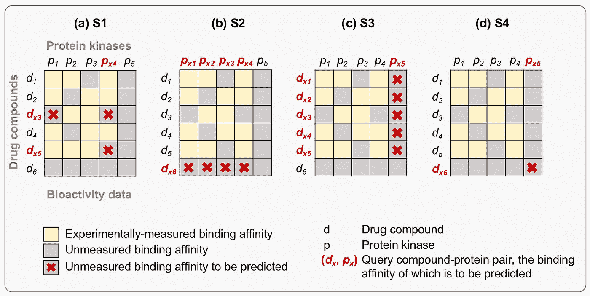
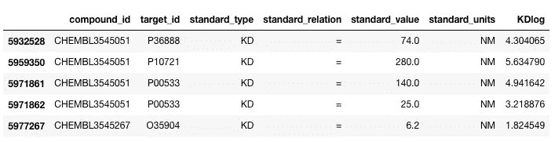
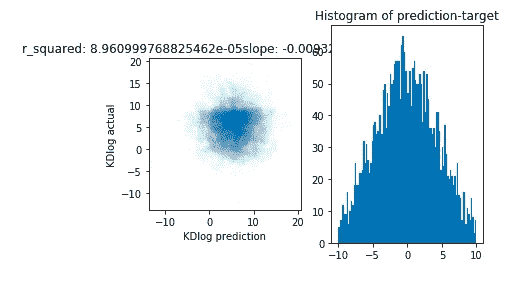
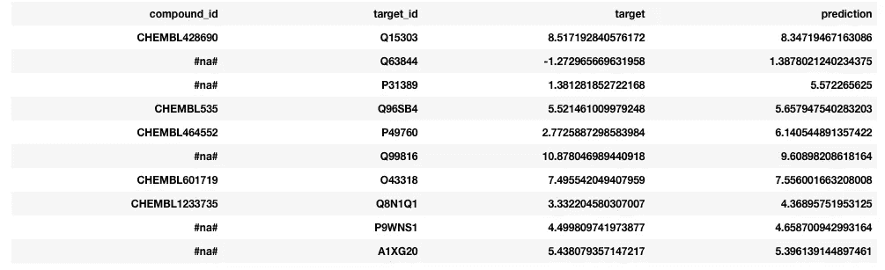
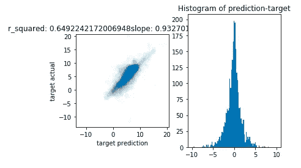
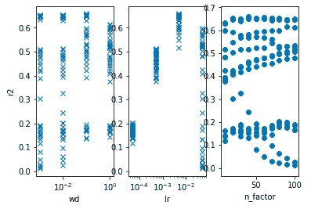
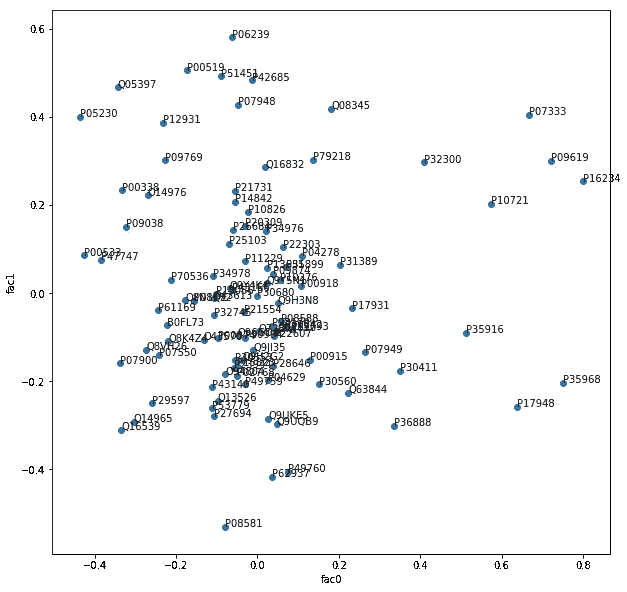
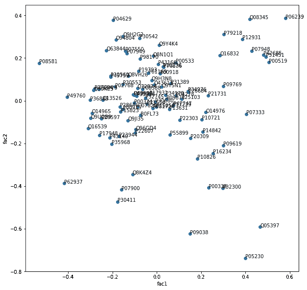
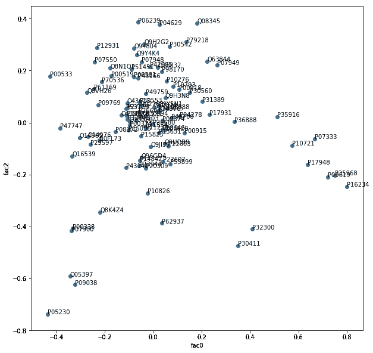
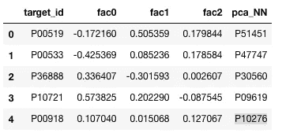

# 协同过滤来“预测”药物的疗效(1)

> 原文：<https://towardsdatascience.com/collaborative-filtering-to-predict-the-efficacy-of-a-drug-c863ba21eddc?source=collection_archive---------27----------------------->

## 无领域知识学习的案例研究。

# 动机

在药物开发中，筛选是早期发现过程的重要组成部分。这种筛选的目的是发现与靶结合足够强和特异性的分子，以具有临床益处。科学家们在实验室里努力合成各种分子，希望提高它们的结合强度。这一过程通常由对药物-靶标相互作用的经验理解来指导。因此，人们很自然地会问，是否有可能明智地“设计”一种药物，就像智能手机是如何设计来实现一组预定义的性能目标一样。

随着量子力学和分子动力学的出现，科学家已经能够在计算机上预测分子之间的相互作用。然而，它需要先进的领域知识和昂贵的计算资源。高通量筛选的进步也有助于在过去几十年中积累大量实验确定的结合强度。人们仍然希望有一种更快、更准确的方法来获得结合强度。

我们能否利用所有先前工作的累积效应，并利用另一个领域的工具向前推进？这就是最近一个名为 [IDG 的机器学习挑战的目的——梦想药物激酶结合预测挑战](https://www.synapse.org/#!Synapse:syn15667962/wiki/)。这个项目是关于药物和激酶之间的相互作用。激酶是一类对恶性细胞(又称癌症)不受控制的增殖至关重要的蛋白质。科学家们已经成功地开发出能够粘附某些激酶的药物，从而阻止这种可怕疾病的发展。非常需要更多具有强结合特性的药物来对抗各种癌症。

药物激酶结合的预测本质上是一个没有提示的跨词难题，如下图所示:



Copied from this [reference](https://journals.plos.org/ploscompbiol/article?id=10.1371/journal.pcbi.1005678#sec009).

挑战在于根据已知数据(黄色)预测缺失的结合强度(交叉)。根据待预测的结合对是否涉及零个、一个或两个从未被已知数据覆盖的药物或激酶，存在如上所示的四种不同情况。

以这种方式提出问题类似于机器学习中一个众所周知的任务——协同过滤。在网飞的百万美元大奖颁奖典礼上，它第一次成为聚光灯下的焦点。我们可以把药物和激酶的结合强度想象成药物和激酶的相似程度。网飞奖提出了完全相同的问题:根据用户对其他电影的评价以及其他用户对这部电影的评价，预测用户对这部电影的评价。这是上图中的第一个场景。

# Fastai 文库及其在药物激酶结合问题中的简单应用

[Fastai](http://fast.ai) ，努力让神经网络再次变得不酷，让软件工程训练相对较少的人实现最先进的神经网络，包括协同过滤模型。本库的主要作者认为，神经网络已经发展到这样一个地步，即通过遵循一组非常小的最佳实践，可以为大量数据集开发出一个像样的模型。因此，限制其应用的不再是一个人能多好地编码，以及一个人能多有经验地微调一个模型。相反，如何根据自己对领域知识的独特理解恰当地铸造一个模型才是关键。在药物激酶结合的问题上，至少从表面上看，将它用于协同过滤并不困难。

药物激酶结合的数据可以在[这里](https://drugtargetcommons.fimm.fi/static/Excell_files/DTC_data.csv)下载。它提供了一大套药物和激酶之间的亲和力测量。为简单起见，我从 Kd 开始，即离解常数。结合越强，Kd 越低。有 32536 个测量值可用。下面显示了一个小集合:



注意，Kd 的对数将用于建模。

培训过程包括以下几个步骤:

*   生成数据—批量重新组织数据以供 GPU 处理。
*   设置学习者—选择合适的培训模型。
*   找到学习率—选择学习者探索参数空间以找到最佳点的“积极性”。
*   训练-使用数据优化模型。

多亏了 fastai 库，每一步都只需要一(1)行代码。当然，这是一个香草模型。高级用户可以通过修改库的内部机制来制作更复杂的模型。

下面是实现上述步骤的代码快照:

```
Kd_data = CollabDataBunch.from_df(df_Kd, user_name=’compound_id’,
                                         item_name=’target_id’,
                                         rating_name=’KDLog’, 
                                         pct_val=0.1,
                                         seed=40)
Kd_learn = collab_learner(Kd_data, n_factors=20, 
                                   y_range=[-15, 25], 
                                   wd=1e-2)Kd_learn.lr_find()
Kd_learn.fit_one_cycle(5, lr=5e-3)
```

让我们首先检查一下，如果没有协同过滤，我们可以“猜测”到什么程度？如果我们通过生成一个高斯随机数来“猜测”未知的 Kd，该高斯随机数的平均值和标准偏差是根据已知的 Kd 计算的，则预测值和实际 Kd 之间没有明显的相关性，如下所示。预测误差的分布看起来像非常宽的高斯分布。



使用我们训练的模型，结果要好得多。


回想一下第一幅图中显示的四个场景，这个模型只适用于第一个场景。事实上，如果我们检查模型的预测，一些神秘的化合物 id 显示为#na#。这些化合物是那些没有被训练数据集覆盖的化合物。这同样适用于激酶(列“目标 id”)。



如果我们简单地忽略这些项目，预测的质量会如预期的那样提高。



对于此模型，微调包括调整以下三个参数:

*   wd 或权重衰减:该参数控制正则化。简单地说，较大的 wd 对过度拟合的惩罚更大。
*   n 因子或因子数:协同过滤的本质是假设有特定数量的因子表征药物和激酶。在这些“潜在”因素定义的空间中，药物或激酶用一个点来表示。如果药物点和激酶点或多或少地从原点指向相同的方向，它们的相互作用会更强。
*   lr 或学习率:这控制了学习者在探索“粗糙”参数空间期间寻找全局最小值时所采取的步长。

人们过去认为，通过调整这些参数来优化模型需要经验。事实上，它决定了模型是否有效。fastai 的贡献在于它提供了对这些重要参数的简单访问。主要作者 Jeremy 进一步认为，存在一组“好的”参数，它们对不同的数据集都非常有效。在我们特定的药物激酶模式中，参数的网格搜索显示学习率是最重要的超参数。学习率的最佳值与杰里米为 MovieLens 模型发现的值大致相同，即预测用户对电影的评级。



R² as a function of wd, lr or n_factor. Data points are from a grid search by keeping one of the parameters constant and varying the other two over a certain range.

对于 wd 或 n_factors，总是有好的参数组合，但是对于差的 lr，很难得到好的结果。

# 我们能预测什么？

如上所述，这里只讨论第一种情况。另外三个问题通常被称为“冷启动”问题。由于我们的潜在因素是通过经验模型拟合过程获得的，因此从概念上讲，首先很难为那些没有任何经验数据的人找到一组潜在因素。如果预测是基于分子的固有特征或它们的组合，冷启动问题就不再是一个问题。这种基于元数据的方法涉及到重要的特征工程和广泛的领域知识。尽管如此，协作过滤可能有助于特征工程，正如杰里米在罗斯曼数据集中所阐述的那样。在药物激酶问题中，如果我们相信来自协作模型的一组潜在因素是合理的，就有可能提出另一个模型，该模型可以利用分子的结构特性很好地预测潜在因素。然后，该模型可以用于冷启动问题。关联元数据和潜在因素的模型可能受益于迁移学习方法。

为了说明潜在因素的重要性，我们可以进行主成分分析，将潜在因素归纳为三个“主要”因素。下图显示了一些激酶在由两个主要因素定义的 2D 空间中的位置。那些相邻的激酶应该具有相似的特性。



更严格的方法是找到每个激酶在它们的主成分空间甚至潜在因子空间中的邻居。Scikit-learn 实现了各种邻居查找方法。生物化学家可能会检查结果，看它是否有意义



比如[p 00519](http://www.ebi.ac.uk/interpro/protein/P00519)(0 线)和它最近的邻居 [P51451](http://www.ebi.ac.uk/interpro/protein/P51451) 都是酪氨酸蛋白激酶。这并不奇怪，因为它是一个非常常见的药物靶点，而且这个数据集有很多激酶。再比如， [P00533](http://www.ebi.ac.uk/interpro/protein/P00533) (线 1)是表皮生长因子受体，它最近的邻居 [P47747](http://www.ebi.ac.uk/interpro/protein/P47747) 是组胺 H2 受体。作为最后一个例子， [P00918](http://www.ebi.ac.uk/interpro/protein/P00918) (第 4 行)是视黄酸受体α，它最近的邻居 [P10276](http://www.ebi.ac.uk/interpro/protein/P10276) 是碳酸酐酶 II。这些配对真的在功能上相关吗？记住，你根本不需要理解生物化学来达到这一点。

从根本上说，我们想知道这种方法是否有助于药物发现。还有很多工作要做，以使模型足够精确，使科学家免于在工作台上劳动。

*   该模型可以使用更多的微调。
*   众所周知，测量结果具有较大的误差线和各种格式/惯例。

因此，实验人员和建模人员之间的进一步合作对于使协同过滤以及其他机器学习方法更加智能至关重要。

感兴趣的人可以在这里找到 Jupyter 笔记本。请注意，这项工作是初步的。

参见[第 2 部分](/collaborative-filtering-to-predict-the-efficacy-of-a-drug-2-f151956315b7)了解领域知识和另一个数据集的进一步讨论。

***来自《走向数据科学》编辑的提示:*** *虽然我们允许独立作者根据我们的* [*规则和指导方针*](/questions-96667b06af5) *发表文章，但我们并不认可每个作者的贡献。你不应该在没有寻求专业建议的情况下依赖一个作者的作品。详见我们的* [*读者术语*](/readers-terms-b5d780a700a4) *。*