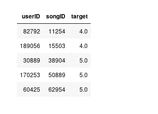
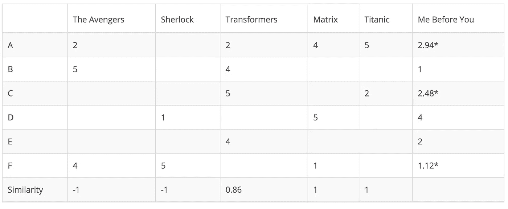
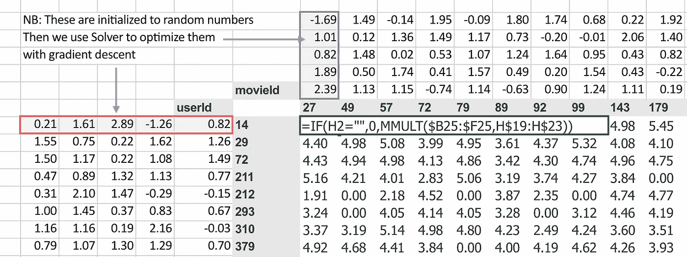
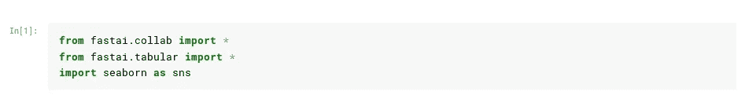
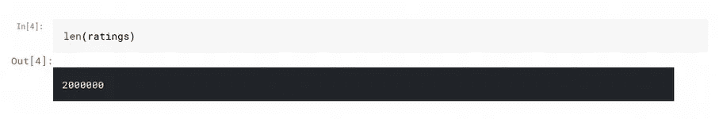
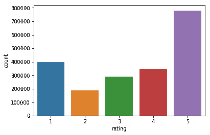
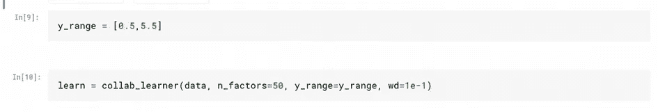
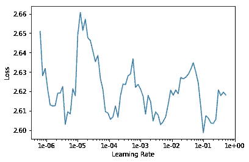
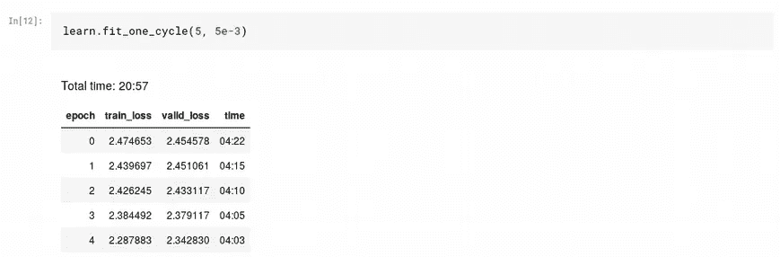
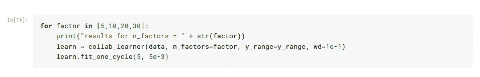

# 使用 fastai 的协同过滤

> 原文：<https://towardsdatascience.com/collaborative-filtering-using-fastai-a2ec5a2a4049?source=collection_archive---------18----------------------->

## 了解如何使用 fastai 库构建推荐引擎

## 介绍

协同过滤是机器学习的一种应用，我们试图预测用户是否会喜欢特定的电影或产品。我们通过查看用户以前的购买习惯来做到这一点。在其最简单的形式中，协同过滤只涉及 3 列，用户 ID、歌曲 ID 和用户对该歌曲的评价。这正是我们将在本文中使用的。

[*全朱庇特笔记本。*](https://www.kaggle.com/dipam7/collaborative-filtering-with-fastai?scriptVersionId=13121727)

## 数据存储

有两种方法可以存储协同过滤的数据。我们可以将它存储在如上所示的`.csv`中，也可以使用`matrix.`矩阵的行代表用户，列代表项目，特定单元格的值代表用户对特定项目的评分。

然而，如果我们以这种方式存储它，我们将最终得到一个非常稀疏的矩阵，因为大多数用户不会观看大多数电影或购买大多数产品。此外，矩阵将是巨大的，浪费了大量的存储空间。因此，我们将仅将其存储为`.csv`。

## 嵌入

我们处理协同过滤问题的方法是，我们给每个用户分配一组权重，给每个项目分配一组权重，这些权重的点积就是用户对该项目的评分。

image source: fast.ai

对于每个用户，我们查找相应的权重，这个东西被称为*嵌入，将代表宋立科流派或用户口味的特征。*

*但是这些还不够。也许有一些用户喜欢很多歌曲或者大多数人喜欢的歌曲。因此，我们不是只取点积，而是将用户偏差和歌曲偏差添加到我们的预测中，以说明这一点。然后，我们使用梯度下降来更新我们的权重，直到我们得到足够好的结果。*

*让我们看看如何在代码中做到这一点。*

## *解决办法*

*和往常一样，我们从导入 fast.ai 库开始。*

**

*我们检查数据集的长度和收视率的分布。*

****

*然后，我们创建一个数据集群，并使用 20%的数据作为验证集的一部分。*

**

*请注意 DataBunch 创建步骤中的种子参数。*

*当我们希望我们的结果可重复时，我们使用种子。这意味着我们随机抽取 20%的数据作为验证集的一部分，但是，我们希望确保下次运行代码时，我们得到相同的(随机)分割。*

**

*一旦我们创建了一个数据束，我们就初始化一个 ***学习器*** 。点积和偏差会给我们一些分数。这些分数可以是负数，也可以是正数。我们希望确保这些预测在我们期望的 0-5 范围内。经过大量的训练后，模型可以自己学习，但是我们希望节省一些工作，并告诉它我们希望预测的范围。因此我们把参数`y_range`传递给它。这将在最后添加一个 s 形层。*

*我们选择稍微高于和低于最小值和最大值的值，以保持预测在范围内。*

*`n_factors`参数决定了我们嵌入的大小。我们也传递了一点重量衰减。*

*最后，我们找到学习率并训练我们的模型。*

**

## *结果*

**

*数据集是一个相对简单的数据集，我们得到了很好的结果。此外，由于我们的嵌入大小只是一个参数，我们可以运行一个`for loop`并传递不同大小的嵌入来检查哪一个给出最好的结果。*

**

*这就是我们解决协同过滤问题的方法。我们可以解释模型，找到最有偏见的歌曲或最没有偏见的用户。然而，为此，我们需要另一个`csv`来告诉我们哪个 id 对应于哪个歌曲或用户。*

**根据歌曲偏好对歌曲进行评级会很有趣，因为如果我们仔细想想，当我们去掉用户偏好和我们的嵌入时，歌曲偏好仍然存在。这意味着它代表了歌曲的无偏见的观点，去除了可能影响它的所有其他因素(基于歌曲和用户)。**

*我们还可以看看嵌入。然而，我们可能有很多(在这个例子中是 50 个)，看 50 个影响我们选择歌曲的因素是不直观的。因此，我们可以做的是应用类似 PCA(主成分分析)的东西，将其降低到一个合理的数字，然后可以进行分析。*

## *协同过滤的问题:冷启动*

*当我们有足够的关于用户或歌曲的数据时，我们可以很好地预测结果。但是，我们真正想给用户推荐歌曲的时候，是有新用户加入我们平台的时候。或者某个艺人发布新歌的时候。在这种情况下，我们没有以前的数据可以依赖，因此推荐是困难的。公司采取各种方法来解决这个问题，比如让用户选择他喜欢的电影类型，但目前还没有明确的解决方案。*

## *结论*

*最后，我想敦促我的读者真正提高他们的数据准备技能。当我们参加 Kaggle 比赛或在线下载数据集时，所有的数据清洗和预处理步骤都已经为我们完成了。然而在现实世界中，你将不得不处理原始数据，你将不得不处理多个数据源。你如何处理这些资源将决定你是否会成为一名优秀的数据科学家。*

*所以努力学习这些技能，因为建模只是过程的一部分(而且是很小的一部分。)*

*这就是本文的全部内容。*

*如果你想了解更多关于深度学习的知识，可以看看我在这方面的系列文章:*

* [## 深度学习系列

### 我所有关于深度学习的文章的系统列表

medium.com](https://medium.com/@dipam44/deep-learning-series-30ad108fbe2b) 

~快乐学习*