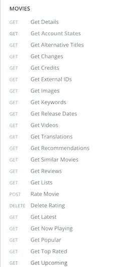
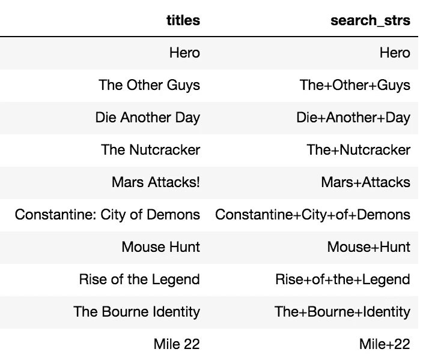
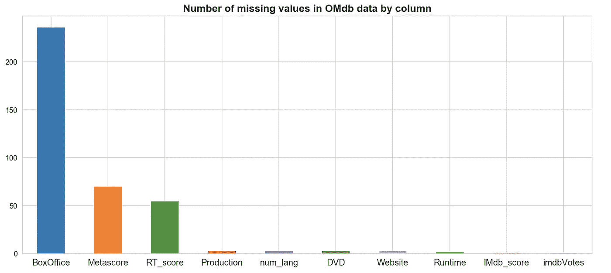
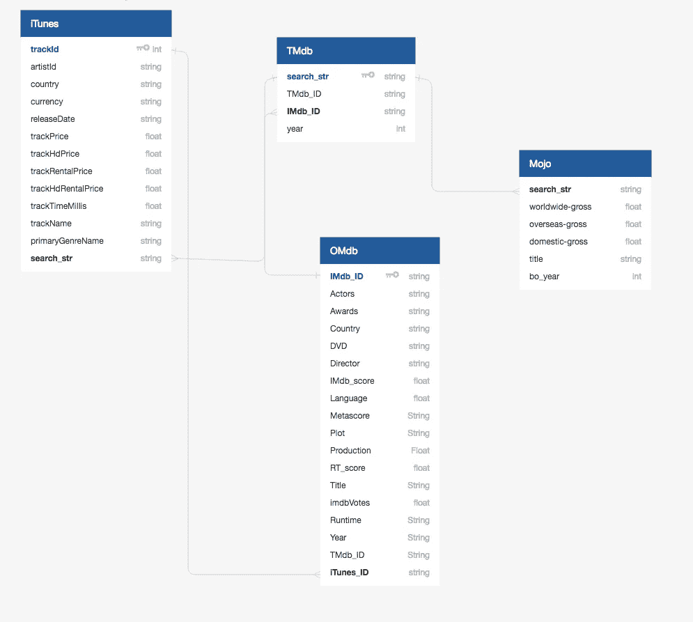

# 收集电影数据

> 原文：<https://towardsdatascience.com/collecting-movie-data-445ca1ead8e5?source=collection_archive---------12----------------------->


## 使用一堆 API 来组装一个非常简洁的数据集

我最初的前提是，我可以试着**根据 iTunes 电影**的特点预测它的价格。我知道我们可以通过一个记录良好的公共 API 在 iTunes 中获得电影信息，所以让我们来看看。

# iTunes 数据商店中的数据

您可以通过两种主要方式在 iTunes API 上从 iTunes store 获取影片信息，即通过关键词调用或按 ID 查找。显然，使用关键字来提取特定的电影通常不是一个好主意。有些关键词会给你多达 50 个匹配项(试试搜索“哈利波特”)。


With an average response time of 2s, 10 billion lookups is gonna take…

按 ID 查找也没有太大的改进。iTunes ID `trackId`字符串**至少有** 10 位数长，这意味着可能有多达 100 亿个可能的 ID，我必须一次查找一个。不是一个好主意。

所以我使用了 iTunes RSS 提要来缩小我的搜索范围。下面的代码片段定义了一个函数`collect_rss_movies()`来 ping iTunes RSS 提要。我决定依靠 RSS iTunes feed 来获取更多最新的电影和完整的价格信息。从 iTunes RSS 提要获得 iTunes IDs 后，我转向 iTunes API，使用`get_info_by_id()`功能从 iTunes store 获得电影信息。

我还定义了一个`settings.py`文件，它定义了集合参数。在这里，我指示该函数收集来自 9 个国家和 2 个主要流派的数据。

我最终放弃了纪录片的片名，因为相对于主流电影，它们看起来有点模糊[](https://itunes.apple.com/us/movie/bill-murray-stories-life-lessons-learned-from-mythical/id1435996525)**，但这里有一个电影记录的片段:**

```
**{'artistName': 'Christopher McQuarrie',
 'contentAdvisoryRating': 'PG-13',
 'country': 'USA',
 'currency': 'USD', 'primaryGenreName': 'Action & Adventure',
 'releaseDate': '2018-07-27T07:00:00Z',
 'shortDescription': 'On a dangerous assignment to recover stolen plutonium, Ethan Hunt (Tom Cruise) chooses to save his',
 'trackHdPrice': 19.99,
 'trackHdRentalPrice': 5.99,
 'trackId': 1406515547,
 'trackName': 'Mission: Impossible - Fallout',
 'trackNumber': 6,
 'trackPrice': 14.99,
 'trackRentalPrice': 5.99,
 'trackTimeMillis': 8873322,
 'wrapperType': 'track'}**
```

**这就是它的要点——有一些特性我没有包括在这里，但是数据描述可以在官方的 i [Tunes API 文档](https://developer.apple.com/library/archive/documentation/AudioVideo/Conceptual/iTuneSearchAPI/index.html)中找到，或者你可以在我的 [Github](https://github.com/zacharyang/movies-project/tree/master/data) 查看数据描述。**

**太好了！我们都准备做一个新的令人兴奋的机器学习项目。对吗？但是电影不仅仅是这些，不是吗？所以我做了更多的调查，想知道如何补充这个数据集。**

# **打开电影数据库和电影数据库**

**虽然 IMdb 是所有电影信息的权威来源，但他们没有公共 API，即使我依靠网络搜集，我也很难找到我应该收集的电影。我求助于两个关于电影的开放数据库，即[开放电影数据库](http://www.omdbapi.com/) (OMdb)和[电影数据库](https://developers.themoviedb.org/3/movies/get-movie-details) (TMdb)。**

> **电影数据库(TMDb)是一个社区建立的电影和电视数据库。从 2008 年开始，每一条数据都是由我们这个了不起的社区添加的。TMDb 强大的国际关注度和数据广度在很大程度上是无与伦比的，这是我们难以置信的骄傲。**

**所以这就是 TMdb 的出处。来自 OMdb 网站:**

> **T4:OMDb API 是一个 RESTful web 服务，用于获取电影信息，网站上的所有内容和图片都是由我们的用户贡献和维护的。**

## **为什么有两个电影数据库？**

**虽然它们分别得到了很好的维护，但它们各有利弊，我意识到我可能必须利用它们来为我的特性集提取正确的信息。两个数据库都没有在数据库中记录每部电影的 iTunes ID，所以我不得不依靠标题搜索来匹配 iTunes 数据和电影数据库中的每部电影。**

****

**Methods available to get information on a movie in the TMdb API**

*   ****特色。OMdb 有比我在 TMdb 数据集中找不到的更多的有用信息。例如，OMdb 包含关于电影评级的信息，例如烂番茄评级、Metacritic 评分和 IMdb 评级。OMdb 数据还记录了这部电影的票房表现，我觉得这将是预测一部 iTunes 电影能卖多少钱的一个关键特征。****
*   ****API 能力**。总的来说，TMdb API 功能更强，提供了更多的方法来查找信息。在 OMdb 中，你只能通过关键字搜索或 IMdb ID 来查找电影。此外，在 TMdb API 上进行关键字搜索通常会产生比 OMdb API 更好的结果。**
*   ****API 比率限值。** OMdb 有一个非常严格的 API 速率限制，每天 1，000 个调用，而 TMdb API 有一个更高的速率限制，每秒 4 个请求(或每天约 340，000 个调用)。**

**所以**OMdb API 有**更多我需要的信息，**但是 TMdb API **通常更好使用。**我最终决定，我需要对 OMdb API 进行非常有针对性和具体的调用，通过 ID 查找来获取电影信息。OMdb 使用 IMdb ID 索引他们的电影记录，所以我必须通过关键字搜索找到 iTunes 数据集中每部电影的 IMdb ID，正如我提到的，通过 TMdb API 更好。****

****尽管有些复杂，我还是决定采用以下策略:****

1.  ****将电影标题解析为一个搜索字符串，通过 TMdb API 传递，寻找精确匹配。包括生产年份，以进一步缩小搜索范围。****

********

****Parsed movie titles, transformed into search strings for the TMdb API.****

****2.为了精确匹配，使用 TMdb ID 查找来查找 IMdb ID。对于没有匹配的结果，通过删除生产年份来放宽搜索标准。对于有多个匹配或结果的电影标题，从 Google 搜索的第一个结果中提取 IMdb，格式为“电影标题+制作年份+ IMdb”****

****3.将每部电影与一个 IMdb ID 进行匹配，并在 OMdb API 中查找每部电影的电影信息。****

****按照这个过程，我设法从 OMdb API 中唯一地识别出一个看起来相当健康的 603 部电影的数据集，其中**与我在 iTunes store 上收集的 1800 部电影**中的大约 1500 部相匹配，因此总体来说回报不错，而没有深入到[实体解析](https://medium.com/district-data-labs/basics-of-entity-resolution-with-python-and-dedupe-bc87440b64d4)的混乱世界中。这里有相当长的一段代码，但是你也可以在我的 [Github repo](https://github.com/zacharyang/movies-project/blob/master/collect_data.py) 上查看。****

# ****票房 Mojo 数据****

****在我对 OMdb 数据做了一些初步探索之前，我对我拥有的数据非常满意。我注意到我的数据中有一大块票房信息缺失。****

********

****Over 40% of the movies in the OMdb data had missing box office receipt information.****

****我可以忍受缺失的评分，但票房表现将是纳入我的模型的一个很好的特征。****

********

****Dat feeling when you see so many missing values****

****很明显，我可以很容易地通过公共数据源获得信息。所以我求助于[票房魔咒](https://www.boxofficemojo.com/alltime/)，使用曾经可靠的`requests`和`BeautifulSoup`组合。****

****我找到了大约 7000 部电影，填补了我所有缺失的价值，并补充了全球票房总收入与美国票房总收入的对比。现在的问题是把它们放在一起。****

********

****Merging data: Easy as Pen Pineapple Apple Pen****

# ****我的数据现在是什么样子****

****在所有这些争论之后，我有一个大约 1500 部电影的数据集，数据来自 4 个不同的来源，通过不同的键和方法连接。它们主要存在于我的存储库中的[两个 csv 文件中，我已经为下面的数据库包含了一个广泛的模式。](https://github.com/zacharyang/movies-project/tree/master/data/clean)****

********

****这就结束了我关于收集电影数据的帖子。在接下来的一周左右，我会在这里发布关于建模和数据探索的更新。同时，如果您对我的数据收集过程有任何反馈、建议或改进，请联系我！****