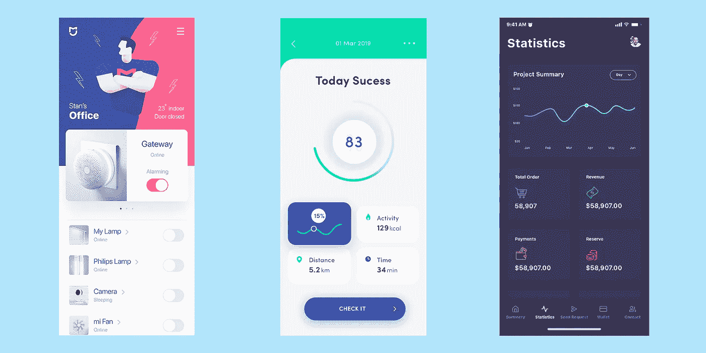
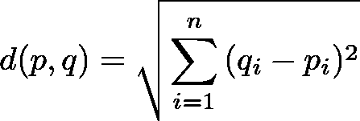
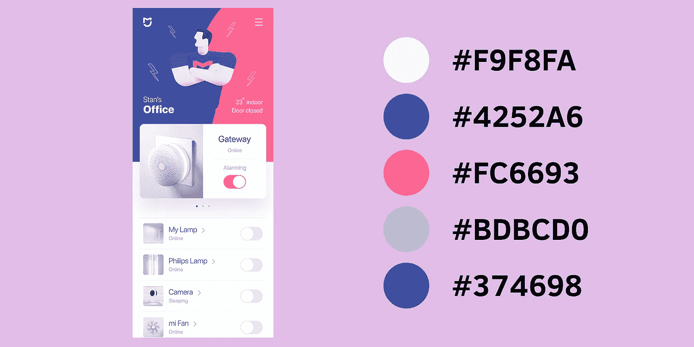
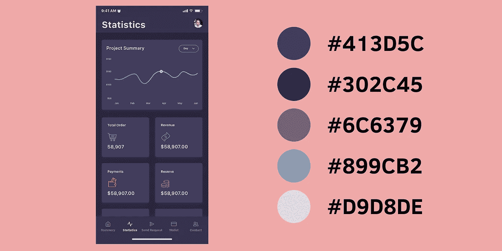
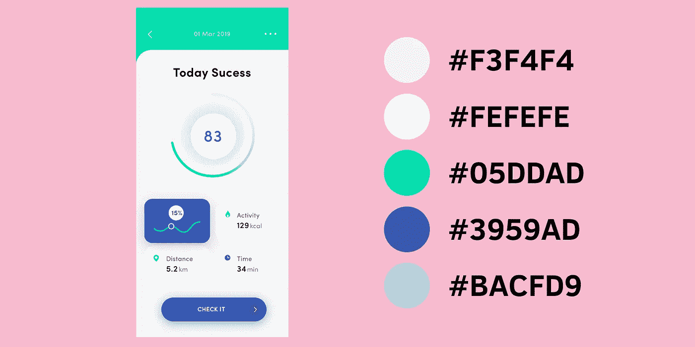

# 利用 K-均值聚类的调色板提取|从零开始的机器学习(第四部分)

> 原文：<https://towardsdatascience.com/color-palette-extraction-with-k-means-clustering-machine-learning-from-scratch-part-iv-55e807407e53?source=collection_archive---------13----------------------->

## 使用 Python 中的 K-Means 聚类在移动 UI 截图中查找主色

> *TL；DR 使用 Python 从头开始构建 K-Means 聚类模型。使用你的模型从 UI 移动设计截图中寻找主色。*

为你的下一个大型移动应用程序(重新)设计选择调色板可能是一项艰巨的任务，尤其是当你不知道自己在做什么的时候。你如何能使它变得更容易(请求一个朋友)？

一种方法是去一个地方，在那里*专家*分享他们的工作。像 [Dribbble](https://dribbble.com/) 、 [uplabs](https://www.uplabs.com/) 和 [Behance](https://www.behance.net/) 这样的页面都有货。

找到您喜欢的模型后，您可能想要从中提取颜色并使用它们。这可能需要打开专门的软件，用一些工具和其他非处方工具手动选择颜色。让我们用机器学习让你的生活更简单。

[](https://colab.research.google.com/drive/1_p1nptDfvJhcSvprmi1WtoIugsCI40Xa) [## 源代码

colab.research.google.com](https://colab.research.google.com/drive/1_p1nptDfvJhcSvprmi1WtoIugsCI40Xa) 

# 无监督学习

到目前为止，我们只研究了需要特征和标签形式的训练数据的模型。换句话说，对于每个例子，我们也需要有正确的答案。

通常，这样的训练数据很难获得，并且需要人工完成许多小时的工作(是的，我们已经在为“终结者”服务)。我们能跳过这些吗？

是的，至少对于某些问题，我们可以在不知道正确答案的情况下使用示例数据。一个这样的问题是*集群*。

## 什么是集群？

给定一些数据点的向量 *X* ，聚类方法允许您将每个点放在一个组中。换句话说，您可以根据一组实体的属性自动对它们进行分类。

是的，这在实践中非常有用。通常，你在一堆数据点上运行算法，并指定你想要多少组。例如，您的收件箱包含两组主要的电子邮件:垃圾邮件和非垃圾邮件(您是否在等待其他邮件？).你可以让聚类算法从你的电子邮件中创建两个组，并使用你美丽的大脑来分类哪个是哪个。

聚类算法的更多应用:

*   *客户细分* —寻找消费/行为方式相同的用户群
*   *欺诈交易* —查找属于不同分类的银行交易，并将它们识别为欺诈交易
*   *文档分析* —对相似的文档进行分组



*source: various authors on* [*https://www.uplabs.com/*](https://www.uplabs.com/)

这一次，我们的数据不是来自一些预定义的或众所周知的数据集。由于无监督学习不需要标记数据，互联网可以是你的牡蛎。

在这里，我们将使用来自不同作者的 3 个移动用户界面设计。我们的模型将在每个镜头上运行，并尝试提取每个镜头的调色板。

# 什么是 K-Means 聚类？

K-Means 聚类被[维基百科](https://en.wikipedia.org/wiki/K-means_clustering)定义为:

> *k-means 聚类是一种矢量量化的方法，起源于信号处理，常用于数据挖掘中的聚类分析。k-means 聚类旨在将 n 个观察值划分为 k 个聚类，其中每个观察值属于具有最近均值的聚类，作为该聚类的原型。这导致将数据空间划分成 Voronoi 单元。*

维基百科还告诉我们，解决 K-Means 聚类是困难的(事实上， [NP-hard](https://en.wikipedia.org/wiki/NP-hardness) )，但我们可以使用一些启发式算法找到局部最优解。

但是 K 均值聚类是如何工作的呢？

假设你有一个包含数据点的向量 *X* 。运行我们的算法包括以下步骤:

1.  从 *X* 中随机选取 *k 个*点(称为*形心*
2.  将每个点分配到最近的质心。新形成的一簇点被称为*簇*。
3.  对于每个聚类，通过从这些点计算新的中心来找到新的质心
4.  重复步骤 2–3，直到质心停止变化

让我们看看如何使用它从移动 UI 截图中提取调色板。

## 数据预处理

假设我们的数据存储在原始像素(称为图像)中，我们需要一种方法将其转换为我们的聚类算法可以使用的点。

让我们首先定义两个表示点和簇的类:

我们的`Point`只是我们空间中每个维度坐标的持有者。

`Cluster`由它的中心和它包含的所有其他点定义。

给定图像文件的路径，我们可以如下创建点:

这里发生了几件事:

*   将图像载入内存
*   将其调整为较小的图像(移动 UX 需要屏幕上的大元素，所以我们不会丢失太多的颜色信息)
*   删除 alpha(透明度)信息

注意，我们正在为图像中的每个像素创建一个`Point`。

好吧！现在，您可以从图像中提取点。但是，我们如何计算我们的集群中各点之间的距离呢？

## 距离函数

类似于我们的监督算法示例中的成本函数，我们需要一个函数来告诉我们做得有多好。我们算法的目标是最小化每个质心中的点之间的距离。

我们可以使用的最简单的距离函数之一是欧几里德距离，定义如下:



其中和是我们空间的两点。

请注意，虽然欧几里德距离实现起来很简单，但它可能不是计算[色差](https://en.wikipedia.org/wiki/Color_difference)的最佳方式。

以下是 Python 实现:

## 实现 K 均值聚类

现在你已经有了所有的拼图，你可以实现 K-Means 聚类算法。让我们从寻找一组点的中心的方法开始:

为了找到一组点的中心，我们将每个维度的值相加，然后除以点数。

现在，为了找到实际的集群:

实现遵循上面给出的算法描述。请注意，当色差低于我们设置的值时，我们将退出训练循环。

# 估价

现在您已经实现了 K-Means 聚类，您可以在 UI 截图上使用它。我们需要更多一点的粘合代码，以便更容易提取调色板:

`get_colors`函数获取一个图像文件的路径和您想要从图像中提取的颜色数量。我们根据每个聚类中的点对从我们的算法中获得的聚类进行排序(降序)。最后，我们将 RGB 颜色转换为十六进制值。

让我们从数据中提取第一个 UI 截图的调色板:

这是十六进制的颜色值:

```
#f9f8fa, #4252a6, #fc6693, #bdbcd0, #374698
```

为了直观地展示我们的结果:



在接下来的两个图像上运行聚类，我们得到以下结果:



最后一张截图:



嗯，看起来很酷，对吧？继续在你自己的图像上试试吧！

[](https://colab.research.google.com/drive/1_p1nptDfvJhcSvprmi1WtoIugsCI40Xa) [## 源代码

colab.research.google.com](https://colab.research.google.com/drive/1_p1nptDfvJhcSvprmi1WtoIugsCI40Xa) 

# 结论

恭喜你，你刚刚实现了你的第一个无监督算法！当试图从图像中提取调色板时，它似乎也获得了良好的结果。

接下来，我们将对短语进行情感分析，并学习如何处理文本数据。

*最初发表于*[](https://www.curiousily.com/posts/color-palette-extraction-with-k-means-clustering/)**。**

*喜欢你读的吗？你想了解更多关于机器学习的知识吗？提升你对 ML 的理解:*

*[](https://leanpub.com/hmls) [## 从零开始实践机器学习

### “我不能创造的东西，我不理解”——理查德·费曼这本书将引导你走向更深的…

leanpub.com](https://leanpub.com/hmls)*