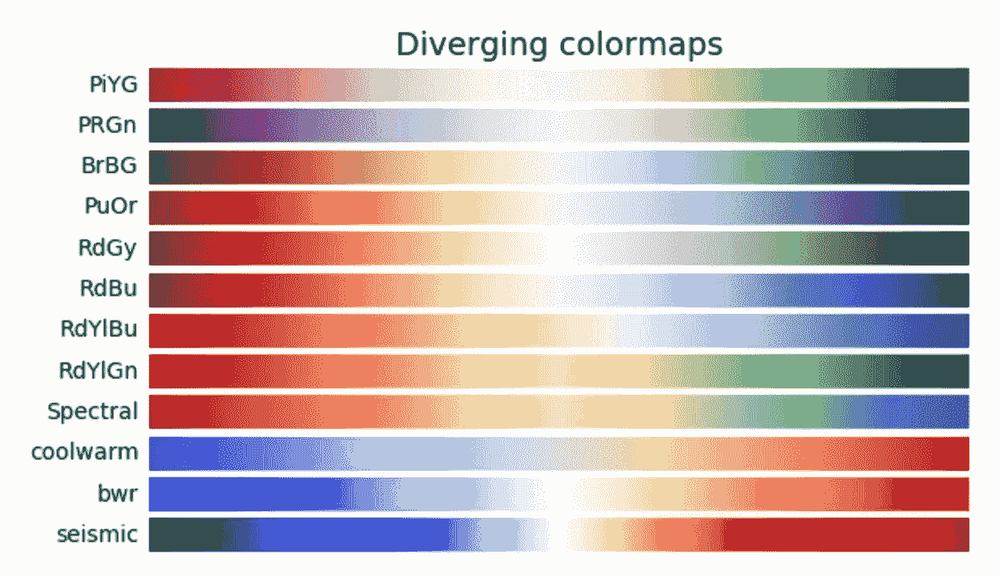
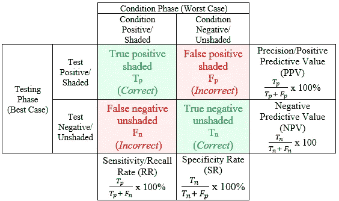

# 数据科学家的着色规则

> 原文：<https://towardsdatascience.com/coloring-rules-for-data-scientists-d946ccc1f823?source=collection_archive---------30----------------------->

## 讲述真实故事的视觉效果

作为数据科学家，我们希望确保清楚地传达我们的发现。无论我们的目标是技术或非技术受众，我们都想让我们的视觉效果“漂亮”。然而，我们真正应该考虑的是在我们的数据中讲述这个故事。不幸的是，我们所认为的好的设计和我们的数据的适当可视化并不总是一致的——但这里有一些规则来避免常见的错误，并确保你的视觉效果与你的故事相符。

## 1.配色方案:使用为您的数据设计的配色方案

Image from MatplotLib Documentation

永远不要根据什么看起来最好来选择视觉效果的配色方案—使用为您的数据类型开发的配色方案。比如 *bone* 是为 x 光数据开发的，不要因为它好看的中性色就用它，用它做 x 光。有时，配色方案不会如此特定于领域，但您仍然应该使用一些反映数据本质的东西。例如，对于从-1 到 1 的值，如相关性，使用*发散色图*(例如: *RdBu* ， *coolwarm* )，对于分类数据使用*定性色图*(例如: *Set1* )。这些颜色类别是专门为这些目的开发的，应该按照最初的意图使用，几乎没有例外。

## 2.混乱矩阵:这些应该总是表格

Image from ResearchGate

这个很简单——不要绘制你的困惑矩阵。这种方式可能看起来很好，也更容易阅读，但它旨在成为一个表格。如果你不相信，想想其他的热图:为什么它们使用不同的配色方案？答案是它们有负值，混淆矩阵没有。

## 3.标签:标记你的颜色

在你制作的每张图表上标注你使用的所有颜色(除非只有一种颜色)。

## 4.对你的观众和内容保持敏感

首先，并不是所有的配色方案都能被色盲的人清楚地理解，所以如果你要制作广泛传播的图形，或者你的团队中有人是色盲，确保你使用的东西对每个人都清晰可辨。

其他关于敏感性的话题可能更有争议，比如使用分类的粉红色和蓝色调来表示性别，假设是二进制的。

Image from OUPBlog

在绘制图表之前，请确保您考虑是否将性别分析为二元，以及为什么。如果你的数据没有反映一个光谱，并迫使你有 2 个类别，你可以选择澄清这一点。无论是哪种选择和原因，确保你有意识地考虑这一点，并选择你认为负责任的配色方案。

最后一点，这些规则是很好的参考，但要始终批判性地思考你试图想象什么，为谁，以及如何去做！

如果你对如何解决某件事有疑问，请在下面评论，我会给每个人留下答案！