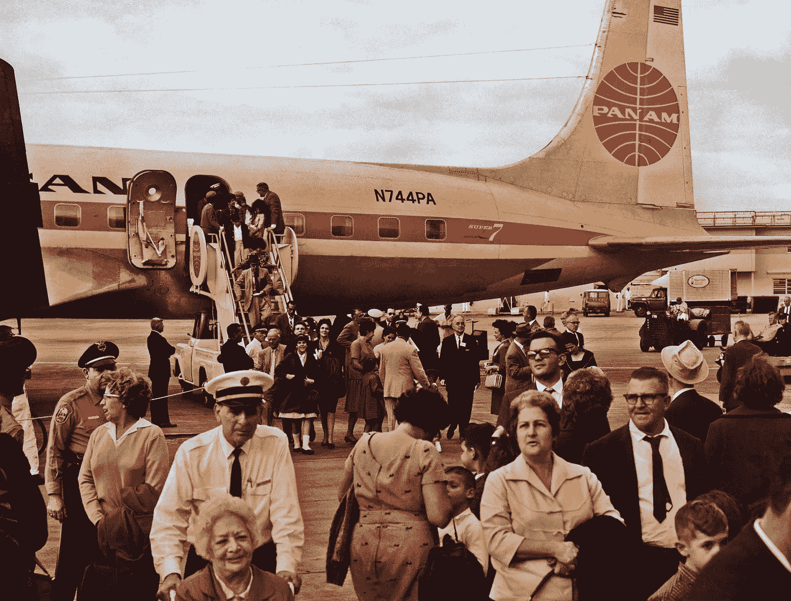
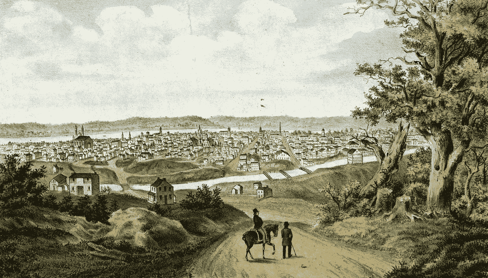
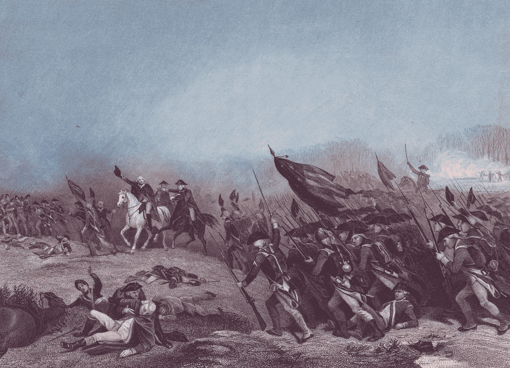
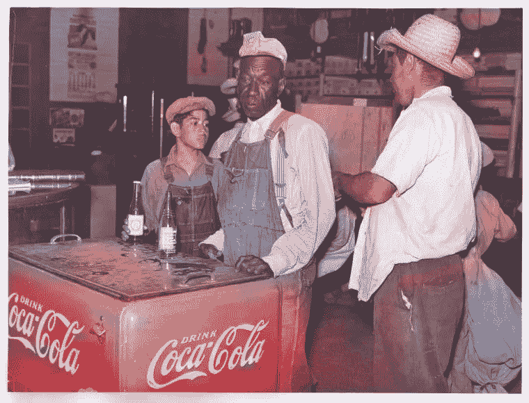
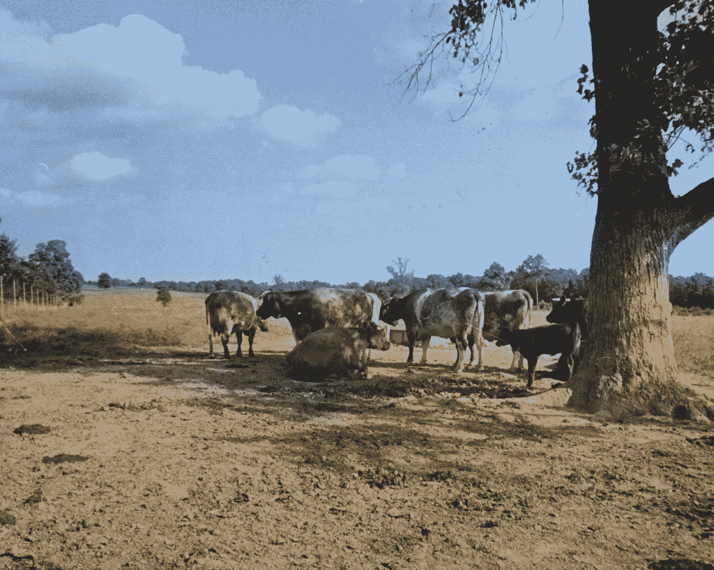
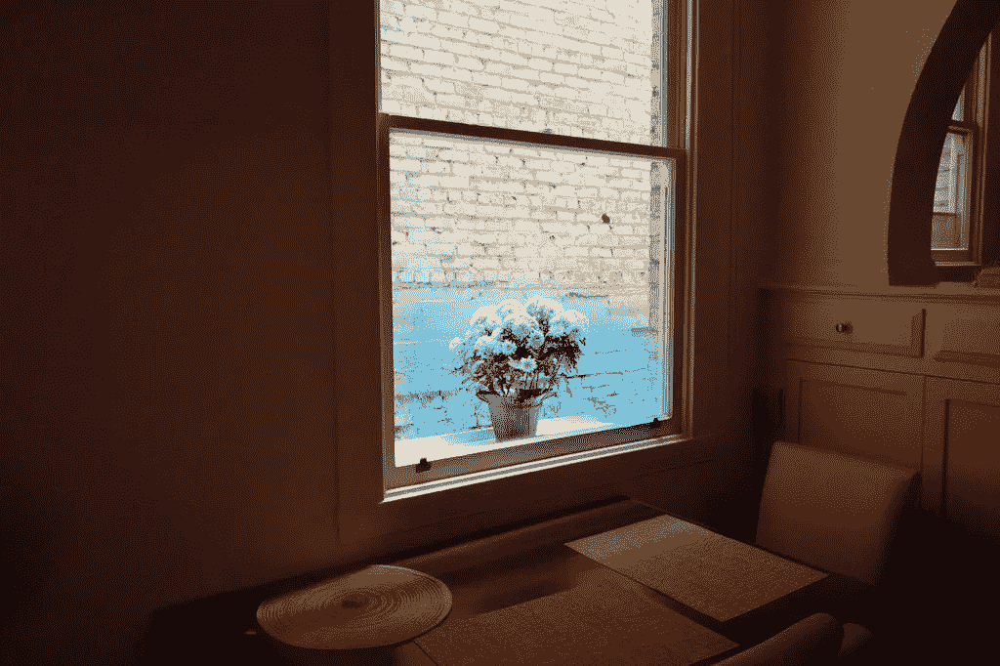
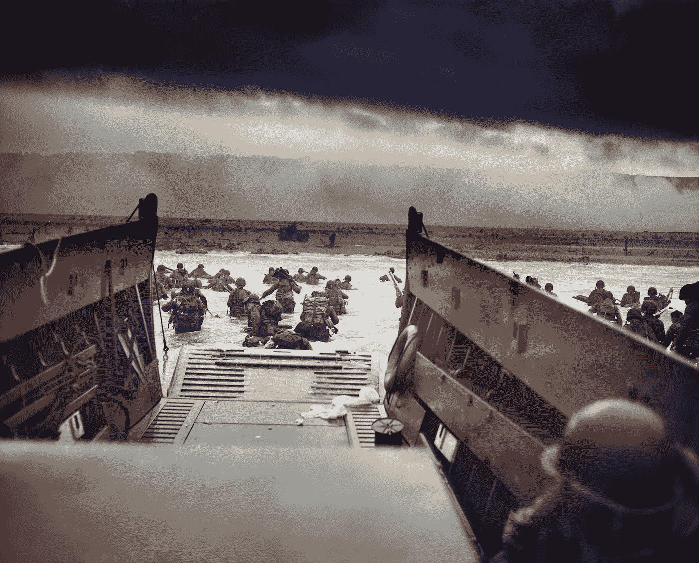

# 基于卷积神经网络的图像彩色化

> 原文：<https://towardsdatascience.com/colorizing-images-with-a-convolutional-neural-network-3692d71956e2?source=collection_archive---------5----------------------->

## 深度学习算法对构图、风格以及机器学习和艺术之间的关系有什么看法

Cuban immigrants arrive in Florida ca. 1965\. Original image credit CDC, color version using Colorful Image Colorization algorithm credit Gado Images.

见过手绘历史照片吗？它们是艺术作品，由一个熟练的人在黑白照片的每个部分煞费苦心地着色，添加肤色、背景等等。自从摄影出现以来，它们就一直很受欢迎，直到今天仍在制作——唯一的区别是今天的艺术家使用 Photoshop 而不是画笔。

Hand colored images, like this lithograph of Cincinnati ca 1840s, were works of art. Credit: New York Public Library/Gado

手绘照片很美，但是制作起来很慢。你必须决定要添加的颜色，有绘画技巧将它们放到原始照片中，等等。即使使用现代工具，雇佣一名艺术家给一张历史照片上色也要花费 300 到 500 美元。

## 深度学习方法

进入卷积神经网络。在许多情况下，图像中的颜色是独一无二的——一个人衣服的确切颜色，一棵树完美的绿色阴影，等等。在拍下黑白照片的那一刻就永远消失了。然而，在其他情况下，颜色是可以预测的——令人惊讶的是。天空通常是蓝色的(或者很可能是蓝色的)，绿色植物是绿色的，人的皮肤是肤色，水是蓝色的，衣服通常不是花哨或疯狂的颜色，等等。

因为颜色比你想象的更容易预测，使用机器学习比你最初想象的更容易控制。这意味着你实际上可以使用卷积神经网络来给历史黑白照片着色。

[彩色图像彩色化](https://richzhang.github.io/colorization/)是一种算法，它使用 CNN 来分析一组彩色图像及其黑白版本的颜色。这里很容易获得训练数据—任何彩色图像都可以转换为灰度，然后与其彩色版本配对，以制作一个简单的训练示例。该算法使用几个前馈通道来最终获取灰度图像，用该算法的创造者的话说，就是“幻觉”一组似乎合理(但不一定正确)的颜色来填充图像。

The Colorful Image Colorization algorithm can add plausible colors to black and white photographs. Original photo credit New York Public Library, colorization by Gado via Colorful Image Colorization

彩色图像着色在超过 100 万幅图像上进行训练。它的创造者报告说，当在“彩色图灵测试”中向人类展示结果时，人们在 32%的时间里相信颜色是真实的。这听起来没什么，但是请记住，这个任务甚至比给历史图像着色更难。图灵测试中的人们不仅仅相信他们看到的图像是一个执行良好的手工着色——相反，他们相信图像*真的是*彩色图像。这是一台灰度原始的机器——甚至 32%的时间——完成的相当成功。

在算法的结果中出现了一些非常显著的突现性质。例如，给定一个带有可口可乐标志的灰度历史图像，它会正确地将标志 Coca Cola 涂成红色，这可能是因为看到了数千个带有红色可口可乐标志的训练图像。重要的是，该算法从未被教会可口可乐的标志是什么——通过 CNN 的魔力，它从大量的训练数据中找到了这一点。

The algorithm correctly colored the drink car in this image Coca Cola red, presumably from seeing lots of red Coca Cola logos in its training data. Original image credit New York Public Library, colorization by Gado with Colorful Image Colorization.

## 那么颜色是不是一文不值？

当我第一次开始在灰度图像上测试彩色图像着色时，我的第一反应是不安，近乎厌恶。作为一名专业摄影师，颜色非常重要，我工作的很大一部分是让图像中的颜色完全正确，根据它们鲜明的颜色选择主题，等等。如此多的颜色是预先确定的——足以让机器能够猜测场景中的颜色并大致正确地得到它——这种想法令人不安，也有点令人沮丧。色彩真的是构图中一个有趣的元素吗，或者它是一种可以在以后由产生幻觉的计算机程序补充的东西吗？

这种观点当然有很多历史先例。著名纪实摄影师亨利·卡蒂埃·布列松以拍摄甘地的照片和世界各地人们的私密街头肖像而闻名，他对他同时代的威廉·埃格尔斯顿做了非常简洁的总结:“威廉，颜色是狗屁。”安塞尔·亚当斯——也许是 20 世纪最著名的美国摄影师——在他的职业生涯中，对色彩深表怀疑。具有讽刺意味的是，彩色图像着色的创造者们选择了[在他们关于算法的第一篇论文中通过给一些 Adams 的图像着色来展示他们的过程。](https://richzhang.github.io/colorization/resources/images/exs_sel_aa.jpg)

那么所有的颜色都是预先决定的吗？我们能否发布一个出色的新压缩算法，让相机以灰度拍摄照片，然后像 CNN 一样的彩色图像着色技术在稍后的云中填充颜色？历史黑白摄影死了吗？我们是不是应该扔掉亚当斯的玻璃盘子，换上由机器创作的色彩鲜艳的风景画？

## 令人惊讶的算法

没那么快。像许多建立在卷积神经网络上的系统一样，彩色图像彩色化产生了一些显著的结果，但它与边缘情况作斗争。谢天谢地，视觉艺术的世界充满了边缘案例。

彩色图像着色做得最好的图像是那些具有可预测成分的图像——上面是蓝天，中间是一些风景，可能是一棵很明显的树，前景是一些水，它可以使之变成蓝色。有了这个算法，很多度假快照都变得很棒。从某种意义上说，它在“平均”图像上表现最好——这些图像的成分和颜色与它训练的 100 万张图像的平均成分和平均颜色没有太大差异。

The algorithm does best on images with a predictable composition. Original image credit New York Public Library, colorization by Gado with Colorful Image Colorization.

然而，对于具有不同构图、新颖物体和非常规颜色的图像，算法却很难处理。城市、壁画、色彩丰富的市场、有大量非天空负空间的图像——在这些图像上，色彩丰富的图像色彩表现平平。

The algorithm yields weird results on this unconventional composition of flowers shot through a window, splashing some random blue over the center of the image and totally missing the brick wall outside. Credit Gado Images.

在某种意义上，算法实际上是一个很好的图像唯一性的指示器。如果你的图像在通过算法着色后看起来非常好，那么它在组成和颜色方面可能是一个相当“普通”的图像——它与系统训练的数百万张图像没有太大差异。这并不一定意味着图像不好——许多构图一般的图像是商业金矿或描绘了一个重要的人或地方。有时一张普通的图像是好的，特别是当你想让你的构图和颜色选择不碍事，并且不干扰图像的纪录片内容的时候。

但是如果你创建了一个让彩色图像色彩“惊喜”的图像——产生奇怪或不准确的结果——拍拍你自己的背。你创造了一些偏离平均值的东西，足以骗过算法。简而言之，你创造了艺术上独一无二的东西。

对我来说，这弥补了围绕色彩的艺术过程。如果你想要一个符合视觉标准的图像，最好对它进行彩色化处理，看看电脑能不能猜出它的颜色。但令人欣慰的是，独特或视觉上不同的作品可以骗过算法——这证明了并非所有的颜色都是预先确定的，人类艺术家有能力让人感到惊讶。

## 实践中的算法

因此，除了一个整洁的机器学习聚会技巧或验证您的艺术选择的工具之外，彩色图像着色有价值吗？

绝对的。在某些历史照片上——尤其是肖像——该算法产生的结果非常可信，并赋予图像深度和活力，否则这些图像会变得更加平坦和缺乏活力。对于许多这样的肖像，如果有彩色胶卷的话，摄影师可能会使用它，所以给图像着色实际上相当于填充他们可能会包括的细节。

在某些情况下，算法的幻觉本身就是艺术。运行经典图像，如*进入死亡之口(*显示在诺曼底登陆的 D 日入侵期间，美国士兵在枪林弹雨中下船)，产生令人难忘的梦境，其中颜色建立在原始构图的基础上，并增强了原始构图。

Running Colorful Image Colorization on the classic image Into the Jaws of Death yields a result which is artistic in its own right. Original image credit Signal Corps, colorization by Gado with Colorful Image Colorization.

尽管它的力量，彩色图像彩色化确实有盲点。虽然它产生幻觉的颜色看似可信，但它们并不总是历史上准确的——例如，本文顶部图像中的泛美标志看起来很红，但它实际上是蓝色的。

此外，很可能是由于在大量具有棕褐色而非真实颜色的历史照片上接受训练的结果，它倾向于以柔和的黄色和褐色色调渲染历史照片。一个有趣的实验是在一组真实拍摄的彩色历史图像上训练算法——就像一个大型的柯达彩色幻灯片档案——然后看看这个新版本在彩色历史图像上的表现。一个可以填充类似柯达彩色的 CNN 将非常适合处理历史图像，并可以在今天拍摄的图像上产生一些真正迷人的结果。

## 机器学习和艺术

最终，彩色图像彩色化是两个非常不同的领域——机器学习和艺术——走到一起时可能发生的有趣协同作用的一个令人信服的例子。你不会想到一个猜测颜色的神经网络会引发关于构图、主题选择和摄影作品独特性的存在性问题。你也不会想到它能重新点燃与艺术史观点的对话——就像卡蒂埃-布列松和亚当斯的观点——这些观点已经有半个多世纪的历史了。但是看看彩色图像彩色化的结果，这些问题就来了。

随着机器学习影响更多的行业，我希望视觉艺术家——实际上是所有的艺术家——开始关注这些技术提出的问题，包括关于社会和艺术过程本身的问题。如果机器学习要继续发展，它需要来自整个社会的艺术家、创意者和其他思想家的观点。但与此同时，机器学习可以回馈一些东西，展示看待艺术作品的新方法，甚至是创造艺术作品的新方法。像彩色图像着色这样的系统表明，当涉及到机器学习和艺术时，对话是双向的。

附注:首先，你应该收到我的邮件。 [***做到这里***](https://tomsmith585.medium.com/subscribe) *！其次，如果你自己喜欢体验媒介，可以考虑通过注册会员* *来支持我和其他成千上万的作家* [***。每月只需 5 美元，你可以阅读我所有最受欢迎的文章***](https://tomsmith585.medium.com/membership)****等等。我在这个平台上已经收到了超过 1200 万的* ***浏览量*** *的文字！通过注册* [***与此链接***](https://tomsmith585.medium.com/membership) *，你将直接用你的一部分媒介费支持我，并获得我的文章，这不会花费你更多。如果你这样做了，万分感谢！****