# 在人工智能的帮助下给老 B&W 的照片和视频上色

> 原文：<https://towardsdatascience.com/colorizing-old-b-w-photos-and-videos-with-the-help-of-ai-76ba086f15ec?source=collection_archive---------2----------------------->

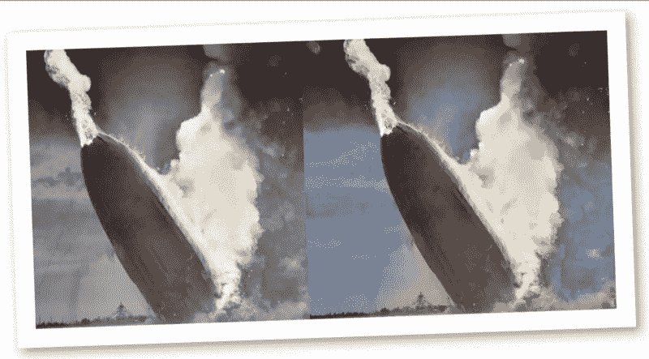

该项目基于加州大学伯克利分校张曦轲、菲利普·伊索拉和阿列克谢·埃夫罗斯的研究工作。[彩色图像彩色化](https://arxiv.org/pdf/1603.08511.pdf)。

本教程背后的想法是开发一个全自动的方法，将产生真实的黑白(B&W)照片和视频的彩色化。正如在原始论文中解释的那样，作者通过在训练时使用类别再平衡来增加结果中颜色的多样性，将问题作为一个分类任务，从而接受了潜在的不确定性。人工智能(AI)方法在测试时被实现为 CNN(“[卷积神经网络](https://en.wikipedia.org/wiki/Convolutional_neural_network)”)中的前馈通道，并在超过一百万幅彩色图像上进行训练。

这张照片拍摄于 1906 年，展示了桑托斯·杜蒙的飞机“14-bis”在巴黎的首次测试:

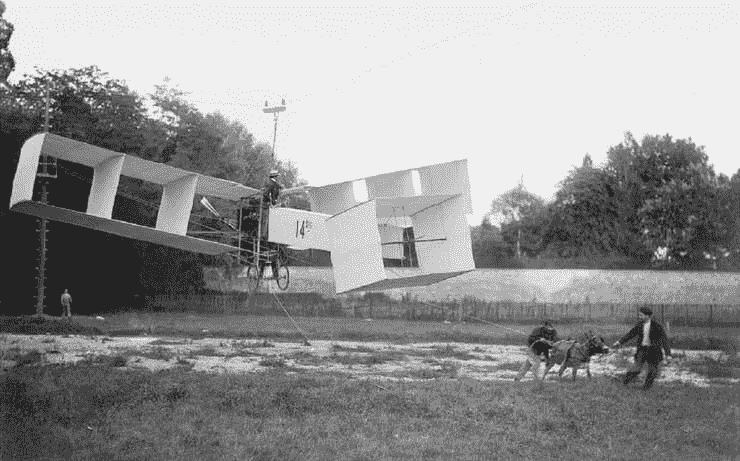

和它的彩色版本使用这些人工智能技术开发的模型:

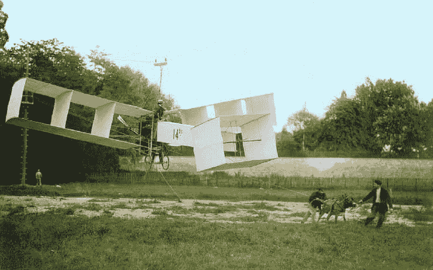

同样的技术也可以应用于老视频。这是 1932 年 B&W 拍摄的巴西里约热内卢的镜头:

彩色版本:

# 1.Lab 颜色空间

通常，我们习惯于使用 [RGB 模型](https://en.wikipedia.org/wiki/RGB_color_model)对彩色照片进行编码。RGB 颜色模型是一种加色模型，其中红色、绿色和蓝色光以各种方式相加在一起，以再现各种颜色。该型号的名称来自三种加色原色的首字母，即红、绿和蓝。

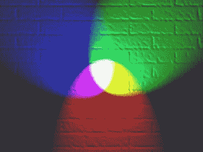

但是，这个项目将使用的模型是“实验室”。

[CIELAB](https://en.wikipedia.org/wiki/CIELAB_color_space) 色彩空间(也称为 CIE L*a*b*或有时简称为“LAB”色彩空间)是由国际照明委员会(CIE)在 1976 年定义的色彩空间。它将颜色表示为三个数值，L*表示亮度，a*和 b*表示绿-红和蓝-黄颜色分量。

颜色空间 L * a * b *是在对立颜色理论之后创建的，其中两种颜色不能同时是绿色和红色，或者同时是黄色和蓝色。CIELAB 被设计为在人类色觉上是一致的，这意味着这些值的相同数量的数值变化对应于大约相同数量的视觉感知变化。

与 RGB 颜色模型不同，Lab 颜色旨在近似人类视觉。它渴望感知一致性，其 L 分量与人类对亮度的感知非常匹配。L 分量正是用作人工智能模型的输入，它被训练来估计剩余的分量“a”和“b”。

# 2.人工智能(深度学习)过程

正如引言中所评论的，人工智能(AI)方法在测试时作为 CNN(“卷积神经网络”)中的前馈传递来实现，并在超过一百万幅彩色图像上进行训练。换句话说，使用 Lab 模型分解了数百万张彩色照片，并将其用作输入特征(“L”)和分类标签(“a”和“b”)。为简单起见，让我们分成两部分:“L”和“a+b”，如框图所示:

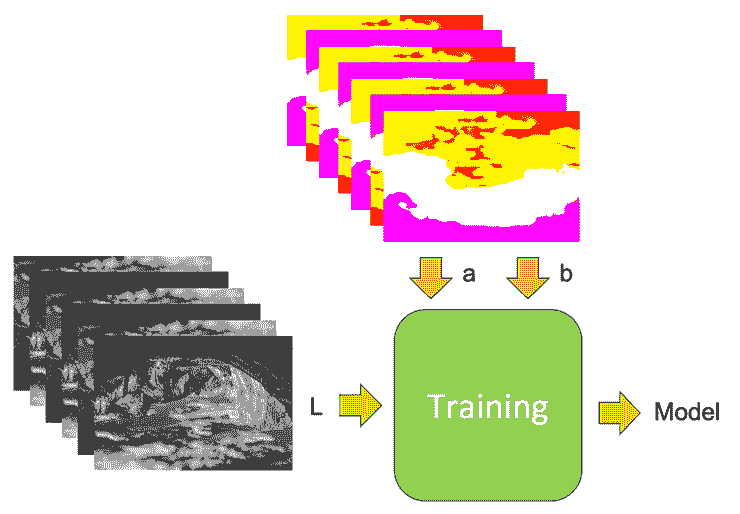

有了训练好的模型(可以公开获得)，我们可以用它来给一张新的 B&W 照片着色，这张照片将作为模型或组件“L”的输入。模型的输出将是其他组件“a”和“b ”,一旦添加到原始的“L ”,将返回一张完整的彩色照片，如下所示:

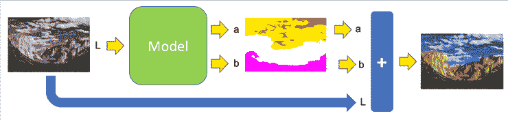

简而言之，使用来自 ImageNet 的 130 万张照片的一组广泛而多样的对象和场景数据集，并应用深度学习算法(前馈 CNN)，生成了最终模型，可在以下位置获得:

[张等—彩色图像彩色化—模型](https://github.com/richzhang/colorization/blob/master/models/fetch_release_models.sh)

# 3.工作环境


首先要做的是组织一个我们将要工作的环境。让我们创建一个文件夹并命名为:

*   照片 _ 视频 _ 彩色化

在这个创建的主目录下，让我们创建子文件夹:

*   模型
*   输入 _ 图像
*   输入 _ 视频
*   彩色图像
*   彩色 _ 框架
*   彩色 _ 视频

进入[张等人-彩色图像着色-模型](https://github.com/richzhang/colorization/blob/master/models/fetch_release_models.sh)下载 3 个文件并加载到创建的子文件夹“/model”下。这些文件是:

*   colorization _ release _ v2 . caffemodel
*   colorization _ release _ v2 _ nore bal . caffe model
*   colorization _ release _ v1 . caffemodel

我假设您的机器上安装了 Python(3.6 版)和 OpenCV (4.0 版)。我们将使用 Jupyter 笔记本一步一步地描述着色的所有过程。我建议您遵循我的解释，但是如果您愿意，您可以从我的 GitHub 下载笔记本和测试照片:

[照片 _ 视频 _ 彩色化](https://github.com/Mjrovai/Python4DS/tree/master/Photo_Video_Colorization)

我还建议您阅读 Adrian Rosebrok 博士的伟大教程“[OpenCV 和深度学习的黑白图像着色](https://www.pyimagesearch.com/2019/02/25/black-and-white-image-colorization-with-opencv-and-deep-learning/)”，这是这个项目的灵感和指南。

# 4.黑白照片彩色化

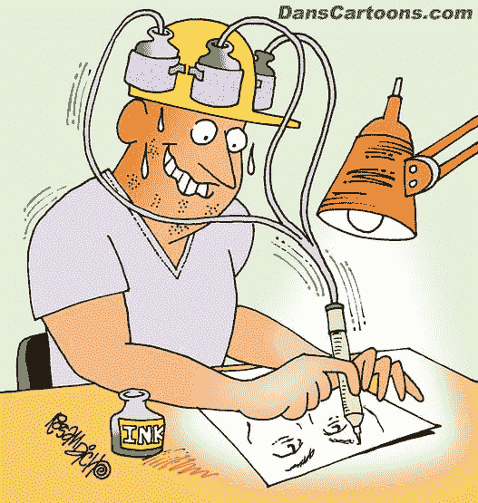

让我们按照以下步骤给 BT&W 照片上色:

**导入重要库:**

```
import numpy as np
import matplotlib.pyplot as plt
import cv2
```

**定义要着色的图像:**

```
IMAGE = "soldiers_1941"
```

注意:你可以在这里使用任何照片。在这个例子中，我使用了一张 1941 年 B&W 二战士兵的照片。我的 GitHub 上有这张照片。

**定义模型路径:**

```
prototxt = "./model/colorization_deploy_v2.prototxt"
model = "./model/colorization_release_v2.caffemodel"
points = "./model/pts_in_hull.npy"
image =  "./input_images/"+IMAGE
```

**加载序列化的黑白彩色模型和集群:**

```
net = cv2.dnn.readNetFromCaffe(prototxt, model)
pts = np.load(points)
```

**将聚类中心作为 1x1 卷积添加到模型:**

```
class8 = net.getLayerId("class8_ab")
conv8 = net.getLayerId("conv8_313_rh")
pts = pts.transpose().reshape(2, 313, 1, 1)
net.getLayer(class8).blobs = [pts.astype("float32")]
net.getLayer(conv8).blobs = [np.full([1, 313], 2.606, dtype="float32")]
```

**加载输入图像，缩放并转换到 Lab:**

请注意，我们首先将图像转换为灰度。这一步并不是真的必要，但我意识到一些 B&W 的照片，尤其是旧的，可能会在岁月中有一些处理，所以，最好清理一下。

```
image = cv2.imread(image)
image = cv2.cvtColor(image, cv2.COLOR_BGR2GRAY)
image = cv2.cvtColor(image, cv2.COLOR_GRAY2RGB)
```

此时，我们有了原始图像，但是为了在 Jupyter 单元格上直接显示它，我们应该使用 pyplot 库:

```
plt.imshow(image)
plt.axis('off');
```

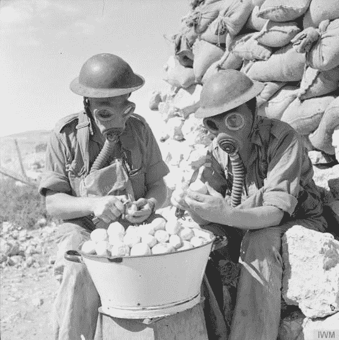

**提取“L”:**

现在，让我们的“图像”继续进行着色过程，首先应该重新缩放，转换到 Lab，以提取组件“L”并使其居中:

```
scaled = image.astype("float32") / 255.0
lab = cv2.cvtColor(scaled, cv2.COLOR_RGB2LAB)
resized = cv2.resize(lab, (224, 224))
L = cv2.split(resized)[0]
L -= 50
```

**预测“a”和“b”:**

```
net.setInput(cv2.dnn.blobFromImage(L))
ab = net.forward()[0, :, :, :].transpose((1, 2, 0))
ab = cv2.resize(ab, (image.shape[1], image.shape[0]))
```

**创建彩色实验室照片(L + a + b):**

```
L = cv2.split(lab)[0]
colorized = np.concatenate((L[:, :, np.newaxis], ab), axis=2)
```

和我们处理灰度图像一样，让我们看看彩色图像是什么样子的:

```
plt.imshow(colorized)
plt.axis('off');
plt.title('colorized LAB image');
```

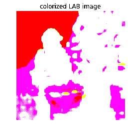

Ops，似乎实验室图像不能告诉我们太多，让我们将其转换为 RGB，看看结果:

**转换为 RGB:**

```
colorized = cv2.cvtColor(colorized, cv2.COLOR_LAB2RGB)
colorized = np.clip(colorized, 0, 1)
colorized = (255 * colorized).astype("uint8")
plt.imshow(colorized)
plt.axis('off');
```

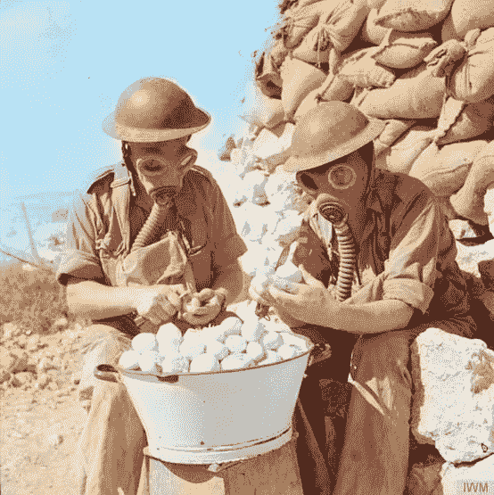

Uau！相当惊人！！！！！这是一张 1941 年的照片，看起来真的是全彩拍摄的！还是省省吧:

**保存最终的 RGB 照片:**

```
cv2.imwrite("./colorized_images/Color_"+IMAGE, cv2.cvtColor(colorized, cv2.COLOR_RGB2BGR))
```

再来一个:查尔斯·达尔文 1832 年访问巴西里约热内卢:

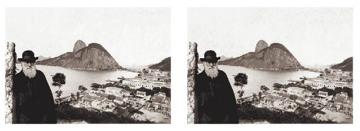

太好了！！！！试试其他 B&W 的照片，看看人工智能有多神奇！

# 5.给视频着色

一旦我们给照片上色，给视频上色就不是一件复杂的事情了。我们必须遵循以下一般步骤:

*   获取 B&W 素材并加载到 **input_video** 子目录中
*   阅读视频，一次一帧
*   有一个单一的框架，适用于我们所做的照片
*   有了彩色帧后，保存到另一个子文件夹: **colorized_video_frames**
*   关闭 OpenCv 窗口。

我们来做一个真实的案例:

可以从我的 GitHub 下载笔记本[B _ W _ Video _ colorization . ipynb](https://github.com/Mjrovai/Python4DS/blob/master/Photo_Video_Colorization/B_W_Video_Colorization.ipynb)，或者按照步骤操作。

我做的第一件事，是从 YouTube 上下载一部 B&W 的电影，在这个例子中:

为此，我使用了一个免费工具: [VidPaw](https://www.vidpaw.com/) 来下载它。我给它命名为:“rio_32.mp4”，保存在 **input_video** 子文件夹。

应用上面描述的步骤，最后我们将所有彩色帧存储在子文件夹**的彩色视频帧**中。让我们开始吧:

1.开始定义应该着色的文件:

```
VIDEO = "rio_32.mp4"
```

2.定义路径、常量和视频变量:

```
prototxt = "./model/colorization_deploy_v2.prototxt"
model = "./model/colorization_release_v2.caffemodel"
points = "./model/pts_in_hull.npy"
video =  "./input_video/"+VIDEO
width = 500
vs = cv2.VideoCapture(video)
```

3.加载和准备模型:

```
net = cv2.dnn.readNetFromCaffe(prototxt,model)
pts = np.load(points)
class8 = net.getLayerId("class8_ab")
conv8 = net.getLayerId("conv8_313_rh")
pts = pts.transpose().reshape(2, 313, 1, 1)
net.getLayer(class8).blobs = [pts.astype("float32")]
net.getLayer(conv8).blobs = [np.full([1, 313], 2.606, dtype="float32")]
```

4.逐帧分割视频并应用模型:

```
count = 0
success = True
while success:
    success, frame = vs.read()
    if frame is None:
        break
    frame = imutils.resize(frame, 500)
    frame = cv2.cvtColor(frame, cv2.COLOR_BGR2GRAY)
    frame = cv2.cvtColor(frame, cv2.COLOR_GRAY2RGB)
    scaled = frame.astype("float32") / 255.0
    lab = cv2.cvtColor(scaled, cv2.COLOR_RGB2LAB) resized = cv2.resize(lab, (224, 224))
    L = cv2.split(resized)[0]
    L -= 50

    net.setInput(cv2.dnn.blobFromImage(L))
    ab = net.forward()[0, :, :, :].transpose((1, 2, 0)) ab = cv2.resize(ab, (frame.shape[1], frame.shape[0]))
    L = cv2.split(lab)[0]
    colorized = np.concatenate((L[:, :, np.newaxis], ab), axis=2) colorized = cv2.cvtColor(colorized, cv2.COLOR_LAB2BGR)
    colorized = np.clip(colorized, 0, 1)
    colorized = (255 * colorized).astype("uint8") cv2.imshow("Original", frame)
    cv2.imshow("Colorized", colorized)

    cv2.imwrite("./colorized_video_frames/frame%d.jpg" % count, colorized)
    count += 1
    key = cv2.waitKey(1) & 0xFF if key == ord("q"):
        breakvs.release()
cv2.destroyAllWindows()
```

上述循环过程，通常需要一段时间。例如，这个视频的彩色化过程(8 分钟)有大约 14，000 帧，我在 MacBook Pro 上花了大约 3 个小时——2.9 GHz Core i7，16GB 2133 MHz RAM。

5.一旦你有了包含帧的文件，你必须“重新组合”它来创建一个视频。下面的函数可以做到这一点:

```
**def** convert_frames_to_video(pathIn, pathOut, fps):
    frame_array = []
    files = [f **for** f **in** os.listdir(pathIn) **if** isfile(join(pathIn, f))]

    *#for sorting the file names properly*
    files.sort(key = **lambda** x: int(x[5:-4]))

    **for** i **in** range(len(files)):
        filename=pathIn + files[i]
        *#reading each files*
        img = cv2.imread(filename)
        height, width, layers = img.shape
        size = (width,height)
        print(filename)
        *#inserting the frames into an image array*
        frame_array.append(img)

    out = cv2.VideoWriter(pathOut,cv2.VideoWriter_fourcc(*'MJPG'), fps, size)

    **for** i **in** range(len(frame_array)):
        *# writing to a image array*
        out.write(frame_array[i])
    out.release()
```

请注意，根据您在计算机上安装的视频控制器，编解码器(*'MJPG ')应该更改。请查阅 OpenCV 文档。最终将会是一次“试错”的经历。

现在，您应该在彩色帧上应用上面的函数:

```
pathIn= './colorized_video_frames/'
pathOut = './colorized_videos/video.avi'
fps = 30.0
convert_frames_to_video(pathIn, pathOut, fps)
```

由此产生的“原始”视频可以在这里看到:

注意，视频明显没有声音。我所做的是用 iMovie 从 B&W 电影中剥离原始声音，并将其添加到彩色声音中。最后的结果在这里:

很酷，不是吗？；-)

# 6.向桑托斯·杜蒙致敬

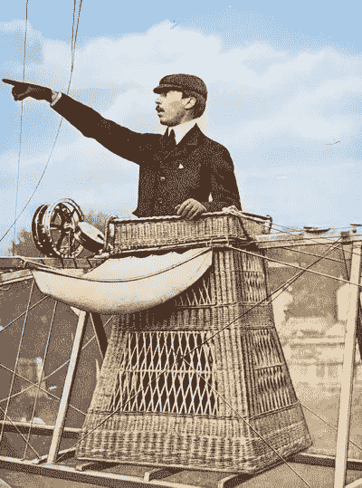

借着给旧照片和视频上色的机会，我决定向上世纪最伟大的发明家之一阿尔贝托·桑托斯-杜蒙特致敬。

桑托斯-杜蒙(1873-1932)是巴西发明家和航空先驱，是为数不多的对轻于空气和重于空气的飞机的发展做出重大贡献的人之一。

桑托斯-杜蒙是一个富裕的咖啡生产商家族的继承人，他在巴黎致力于航空研究和实验，并在那里度过了他的大部分成年时光。在他早期的职业生涯中，他设计、制造并驾驶热气球和早期飞船，并于 1901 年 10 月 19 日因环绕埃菲尔铁塔的飞行而获得了德意志奖。然后，他转向了重于空气的机器，1906 年 10 月 23 日，他的 14-is 成为欧洲第一架动力重于空气的飞机，获得了法国航空俱乐部和国际航空联合会的认证。他坚信航空将开创一个世界和平与繁荣的时代，这让他自由地发表自己的设计，并放弃了各种创新的专利。

桑托斯-杜蒙确实是开放科学的早期专家，他的目标是为人类造福。一个例子是，他的 *Demoiselle* 飞机的所有计划都公开发表在 1909 年 12 月版的《大众力学》杂志上，其中写道:*为了鼓励航空业，任何人都可以利用他的计划建造类似的机器。*

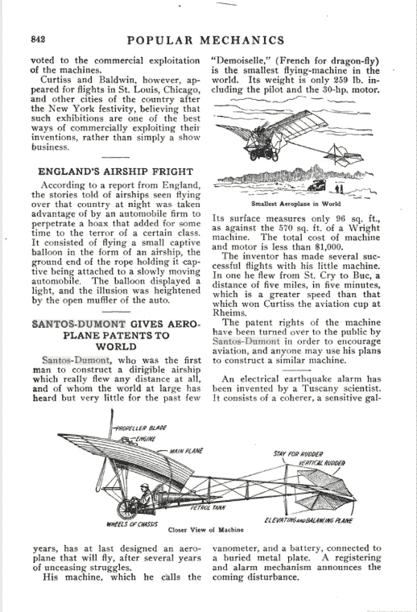

这项工作的所有照片都是从第一个十年的 XX 世纪，并完全彩色的电脑，使用技术描述在这篇文章中，包括下面的视频。我希望你能欣赏它。

# 7.结论

一如既往，我希望这个项目可以帮助其他人找到进入令人兴奋的数据科学世界的方法！

详情和最终代码请访问我的 GitHub 资源库:[*mj robot-python 4 ds*](https://github.com/Mjrovai/Python4DS/tree/master/Photo_Video_Colorization)

来自世界南部的 Saludos！

我的下一篇文章再见！

谢谢你，

马塞洛