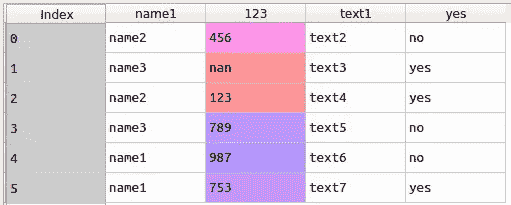

# 在机器学习中使用 SciKit 中的 ColumnTransformer 代替 LabelEncoding 和 OneHotEncoding 进行数据预处理

> 原文：<https://towardsdatascience.com/columntransformer-in-scikit-for-labelencoding-and-onehotencoding-in-machine-learning-c6255952731b?source=collection_archive---------1----------------------->

在一篇非常老的帖子中，我展示了如何使用标签编码和一个热编码将分类文本数据分成数字和不同的列。但是自从我写了那篇文章之后，SciKit 库已经有了很大的进步，它让生活变得更加容易。

库的开发者可能已经意识到人们非常频繁地使用标签编码和一个酒店编码。所以他们决定开发一个名为 ColumnTransformer 的新库，它将 LabelEncoding 和 OneHotEncoding 合并成一行代码。结果是完全一样的。在这篇文章中，我们将快速地看一下我们如何用一些代码片段做到这一点。


# 代码

首先，像往常一样，我们需要导入所需的库。我们将按照惯例处理混叠:

```
import numpy as np
import pandas as pd
```

接下来，让我们将一些数据放入一个变量，看看我们在处理什么:

```
dataset = pd.read_csv("/home/sunny/code/machine_learning/samples/sample.csv")
```

您可以使用 Spyder 中的“变量浏览器”视图来查看数据。在我的例子中，大概是这样的:



正如你可以清楚地看出，这些数据毫无意义，显然只是为了这个演示。无论如何，这里的第一列是一个文本字段，在某种意义上是分类的。因此，我们将不得不标记编码，这也是一个热编码，以确保我们不会与任何层次结构。为此，我们仍然需要在代码中导入 OneHotEncoder 库。但是我们将使用新的 **ColumnTransformer** ，而不是 LabelEncoder 库。所以我们先导入这两个:

```
from sklearn.preprocessing import OneHotEncoder
from sklearn.compose import ColumnTransformer
```

接下来，我们必须创建一个 ColumnTransformer 类的对象。但是在我们这样做之前，我们需要理解类的构造函数签名。ColumnTransformer 构造函数接受相当多的参数，但是我们只对两个感兴趣。第一个参数是一个名为 **transformers** 的数组，它是一个元组列表。该数组以相同的顺序包含以下元素:

*   **名称**:柱形变压器的名称，便于设置参数和查找变压器。
*   **transformer** :这里我们应该提供一个估计器。如果我们愿意，我们也可以只“通过”或“丢弃”。但是由于我们在这个例子中对数据进行编码，我们将在这里使用 OneHotEncoder。请记住，您在这里使用的估计器需要支持拟合和变换。
*   **列**:要转换的列的列表。在这种情况下，我们将只转换第一列。

我们感兴趣的第二个参数是余数。这将告诉转换器如何处理数据集中的其他列。默认情况下，转换器将只返回被转换的列。所有其他列都将被删除。但是我们可以选择告诉转换器如何处理其他列。我们可以丢弃它们，不加修改地传递它们，或者指定另一个估计器，如果我们想做更多的处理。

现在我们(多少)理解了构造函数的签名，让我们继续创建一个对象:

```
columnTransformer = ColumnTransformer([('encoder', OneHotEncoder(), [0])], remainder='passthrough')
```

正如您在上面的片段中看到的，我们将把转换器简单地命名为“编码器”我们使用 OneHotEncoder()构造函数来提供一个新的实例作为估计器。然后我们指定只有第一列需要转换。我们还确保剩余的列没有任何变化地通过。

一旦我们构建了这个 columnTransformer 对象，我们就必须将数据集调整并转换为标签编码和热编码列。为此，我们将使用以下简单的命令:

```
dataset = np.array(columnTransformer.fit_transform(dataset), dtype = np.str)
```

如果您现在在变量资源管理器视图中检查您的数据集，您应该会看到类似如下的内容:


如您所见，我们仅使用 ColumnTransformer 类就轻松地对数据集中的一列进行了标签编码和热编码。这比同时使用 LabelEncoder 和 OneHotEncoder 类要简单和干净得多。

> 在[推特](https://twitter.com/contactsunny)上关注我，了解更多[数据科学](https://blog.contactsunny.com/tag/data-science)、[机器学习](https://blog.contactsunny.com/tag/machine-learning)，以及通用[技术更新](https://blog.contactsunny.com/category/tech)。此外，你可以[关注我的个人博客](https://blog.contactsunny.com/),因为我在 Medium 之前发布了许多我的教程、操作方法帖子和机器学习的优点。

如果你喜欢我在 Medium 或我的个人博客上的帖子，并希望我继续做这项工作，请考虑在 Patreon 上支持我。