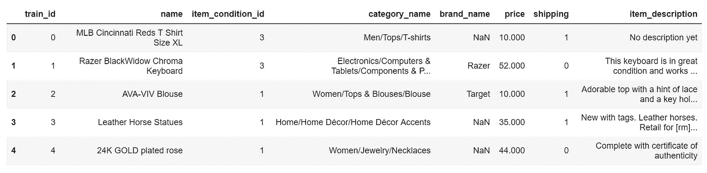

# ColumnTransformer 符合自然语言处理

> 原文：<https://towardsdatascience.com/columntransformer-meets-natural-language-processing-da1f116dd69f?source=collection_archive---------11----------------------->


Photo credit: Pixabay

## 如何在 scikit-learn 管道中将几个特征提取机制或转换组合成单个转换器

自从发表了几篇关于文本分类的文章后，我就收到了关于如何处理混合输入特征类型的询问，例如，如何在分类或回归模型中组合数字、分类和文本特征。

因此，我决定用一个例子来回答这个问题。

有几种不同的方法来追加或组合不同的特征类型。一种方法是使用`[scipy.sparse.hstack](https://docs.scipy.org/doc/scipy/reference/generated/scipy.sparse.hstack.html)`水平堆叠稀疏矩阵。

不过我就介绍一个方法，新上线的热门宝贝: [ColumnTransformer](https://scikit-learn.org/stable/modules/generated/sklearn.compose.ColumnTransformer.html) 函数来自 [sklearn](https://scikit-learn.org/stable/) 。如果你想尝试一下，你需要将你的 [sklearn](https://scikit-learn.org/stable/) 升级到 0.20。

# 数据

这个演示的一个优秀数据集是 [Mercari 价格建议挑战赛](https://www.kaggle.com/saitosean/mercari)，它建立了一个机器学习模型来自动建议正确的产品价格。数据可以在[这里](https://www.kaggle.com/saitosean/mercari)找到。

load_data.py



Table 1

我们的数据包含异构数据类型，它们是数字、分类和文本数据。我们希望对这些不同类型的列使用不同的预处理步骤和转换。

例如:我们可能希望对分类特征进行一次性编码，并对文本特征进行 tfidf 矢量化。

“价格”是我们将要预测的目标特征。

# 数据预处理

## **目标特性—价格**

```
df.price.describe()
```


Figure 1

*   去除价格= 0，探究其分布。

price_dist.py


Figure 2

目标功能价格向右倾斜。由于线性模型喜欢正态分布的数据，我们将转换价格，使其更正态分布。

log1p(price)_dist.py


Figure 3

```
df["price"] = np.log1p(df["price"])
```

## **特征工程**

*   用“其他”填充缺少的“类别名称”，并将“类别名称”转换为类别数据类型。
*   用“未知”填写缺失的“品牌名称”。
*   确定热门品牌，其余设置为“其他”。
*   用“无”填充缺少的“项目描述”。
*   将“项目描述标识”转换为类别数据类型。
*   将“brand_name”转换为类别数据类型。

mercari_feature_engineering.py

我们的特点和目标:

```
target = df.price.values
features = df[['name', 'item_condition_id', 'category_name', 'brand_name', 'shipping', 'item_description']].copy()
```

拆分训练集和测试集中的数据:

```
X_train, X_test, y_train, y_test = train_test_split(features, target, test_size = 0.2, random_state=0)
```

下面是如何应用 [ColumnTransformer](https://scikit-learn.org/stable/modules/generated/sklearn.compose.ColumnTransformer.html) 。令人惊讶的是，它非常简单。

*   对“项目条件标识”和“品牌名称”进行编码。
*   计数矢量器“类别名称”和“名称”。
*   tfidf 矢量器“item_description”。
*   我们可以通过设置`remainder='passthrough'`来保留剩余的“shipping”特性。这些值被附加到转换的末尾:

columntransformer.py

# 模型和评估

我们将基于 [ColumnTransformer](https://scikit-learn.org/stable/modules/compose.html#column-transformer) 的预处理步骤与管道中的回归相结合来预测价格。

model_eval.py


[Jupyter 笔记本](https://github.com/susanli2016/NLP-with-Python/blob/master/ColumnTransformer%20Meets%20NLP.ipynb)可以在 [Github](https://github.com/susanli2016/NLP-with-Python/blob/master/ColumnTransformer%20Meets%20NLP.ipynb) 上找到。享受这周剩下的时光吧！

参考资料:

[](https://scikit-learn.org/stable/modules/compose.html#column-transformer) [## 4.1.管道和复合估算器-sci kit-了解 0.20.3 文档

### 转换器通常与分类器、回归器或其他估计器结合，以构建复合估计器。的…

scikit-learn.org](https://scikit-learn.org/stable/modules/compose.html#column-transformer)  [## 介绍 ColumnTransformer:将不同的转换应用到

### 真实世界的数据通常包含不同的数据类型。在应用最终预测之前处理数据时…

jorisvandenbossche.github.io](https://jorisvandenbossche.github.io/blog/2018/05/28/scikit-learn-columntransformer/)