# 组合学:排列、组合和处置

> 原文：<https://towardsdatascience.com/combinatorics-permutations-combinations-and-dispositions-46604da34882?source=collection_archive---------15----------------------->

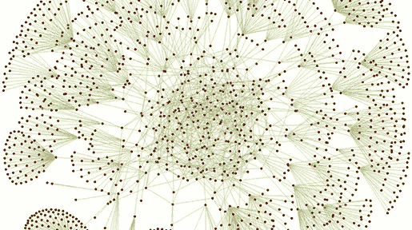

组合学是数学的一个领域，主要研究对一个或多个集合中的元素进行计数。它可以帮助我们统计可能发生的*订单*的数量。

在本文中，我将详细介绍三种不同类型的技术:

*   排列
*   性情
*   组合

# 排列

这些是最容易计算的。想象我们有 n 个物体，彼此不同。排列是这些物体的任何可能的排列。

考虑下面的例子。我们有一个盒子，里面有一些球(每个球有不同的颜色)，我们想计算排列这些球的方式。我们可以用两种不同的方法做到这一点:重复(每个球在被捡起后都被放回盒子里)或者不重复。

*   **重复**:这个想法是，在每一个球被提取后，我们可以根据自己的需要任意多次再次选择它。让我们简单地开始，考虑盒子={g，b}，其中 g= '绿色球'，b= '蓝色球':嗯，在这种情况下，我们可以排列那些球的可能方式是' gg '，' bg '，' gb '，' bb '。我们也可以用 Python 来计算:

```
box_1=['g','b']
perm=[]
for p in itertools.product(listA, repeat=2):
     perm.append(p)

perm

Output:
[('g', 'g'), ('g', 'b'), ('b', 'g'), ('b', 'b')]
```

让我们用 3 个球来代替:

```
box_2 = ['g','b','y']
perm=[]
for p in itertools.product(box_2, repeat=3):
     perm.append(p)

perm
Output:
[('g', 'g', 'g'),
 ('g', 'g', 'b'),
 ('g', 'g', 'y'),
 ('g', 'b', 'g'),
 ('g', 'b', 'b'),
 ('g', 'b', 'y'),
 ('g', 'y', 'g'),
 ('g', 'y', 'b'),
 ('g', 'y', 'y'),
 ('b', 'g', 'g'),
 ('b', 'g', 'b'),
 ('b', 'g', 'y'),
 ('b', 'b', 'g'),
 ('b', 'b', 'b'),
 ('b', 'b', 'y'),
 ('b', 'y', 'g'),
 ('b', 'y', 'b'),
 ('b', 'y', 'y'),
 ('y', 'g', 'g'),
 ('y', 'g', 'b'),
 ('y', 'g', 'y'),
 ('y', 'b', 'g'),
 ('y', 'b', 'b'),
 ('y', 'b', 'y'),
 ('y', 'y', 'g'),
 ('y', 'y', 'b'),
 ('y', 'y', 'y')]
```

现在我们的实验有 27 种可能的结果。如果我们想概括，当我们有 n 个对象，我们想看看我们可以用多少种方式排列它们，我们有:

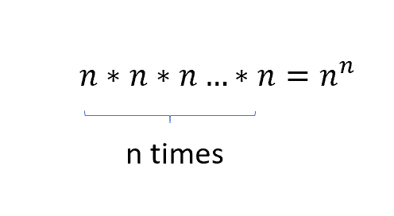

*   **没有重复:**在这种情况下，一旦你选择了一个球，它就不能再使用了。所以球的每种排列都有独特的值。在这种情况下，回到我们的 box={g，b}，两种可能的排列是“gb”和“bg”:

```
import itertools 

box_1 = ['g','b']
perm = itertools.permutations(box_1) 

for i in list(perm): 
    print(i)

Output:
('g', 'b')
('b', 'g')
```

同样，让我们考虑一个更大的盒子={g，b，y}，其中 y= '黄色球':

```
box_2 = ['g','b','y']
perm = itertools.permutations(box_2) 

for i in list(perm): 
    print(i)

Output:

('g', 'b', 'y')
('g', 'y', 'b')
('b', 'g', 'y')
('b', 'y', 'g')
('y', 'g', 'b')
('y', 'b', 'g')
```

在这种情况下，我们必须考虑，在每次提取之后，可用元素的数量都要少一个。因此，如果我们的集合中有 n 个元素，排列将是:

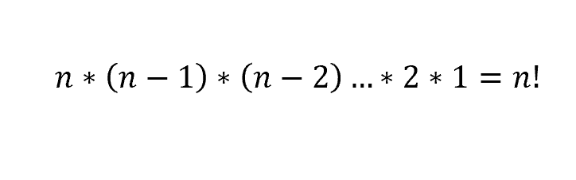

为了让您判断有重复和无重复排列之间的差异，让我们想象一下上面的例子。我们有一个盒子，里面有 4 个不同颜色的球:

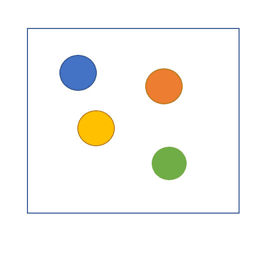

我们想计算这些球可能排列的数量，这意味着:我可以用多少种方式排列这些球，每次从盒子里挑选一个球？

如果每次提取后都没有替换，那么在第一阶段，有 4 种方法可以设置第一个元素(黄色、绿色、橙色和蓝色):

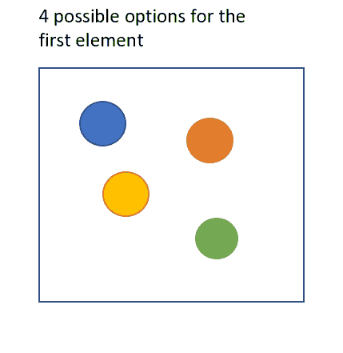

然后，我们一个接一个地挑选其他的球，在每个阶段，我们排列剩余球的方式都在减少:

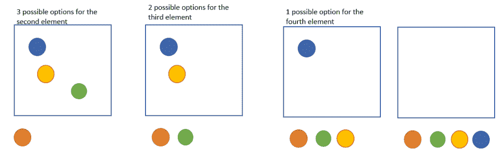

因此，最终，我们有 24 种可能的方法来排列这些对象，因为:

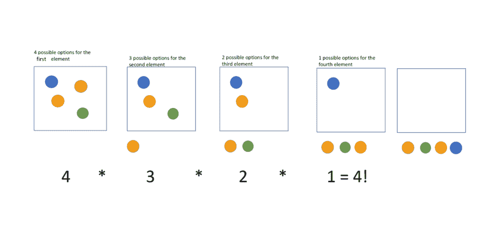

另一方面，如果在第二阶段(以及接下来的阶段),我们重新插入取出的球:

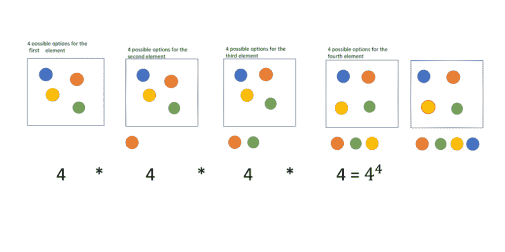

等于 256。

# 性情

部署只不过是排列，其中我们要挑选的对象的数量小于对象的总数 n。让我们简单地检索上面的示例，假设在三个球中，我们只想排列第一和第二个位置。让我们使用 box={g，b，y}并且让我们从重复的情况开始:

*   **重复**:我们要从三个球(n=3)中选择两个球(k=2)，并计算可能排列的数量:

```
box_2 = ['g','b','y']
perm=[]
for p in itertools.product(box_2, repeat=2):
     perm.append(p)

perm

Output:
[('g', 'g'),
 ('g', 'b'),
 ('g', 'y'),
 ('b', 'g'),
 ('b', 'b'),
 ('b', 'y'),
 ('y', 'g'),
 ('y', 'b'),
 ('y', 'y')]
```

这种情况下有 9 种可能的排列，而不是 27 种。与前一种情况一样，第一种选择有 n 种可能性，然后第二种选择又有 n 种可能性，以此类推，每次都相乘。但是这一次，这些将不是针对对象的总数(n)而是针对我们感兴趣的对象的数量(k)而被相乘。所以我们有:

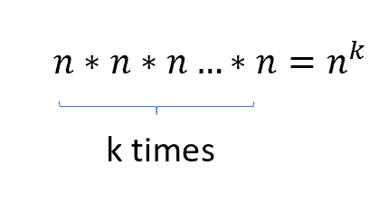

*   **没有重复**:如果没有重复，同样的推理成立。事实上:

```
box_2 = ['g','b','y']
perm = itertools.permutations(box_2,2) 

for i in list(perm): 
    print(i)

Output:
('g', 'b')
('g', 'y')
('b', 'g')
('b', 'y')
('y', 'g')
('y', 'b')
```

在这种情况下，我们有:

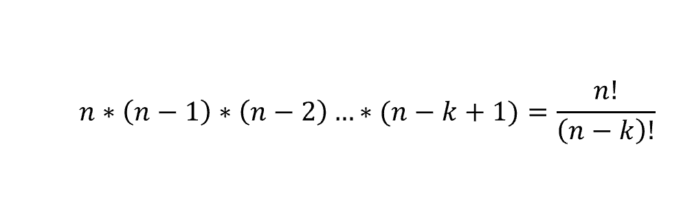

再一次，让我们想象一下，考虑一个有 4 个球的盒子，我们只需要安排其中的两个。对于重复的倾向，我们有:

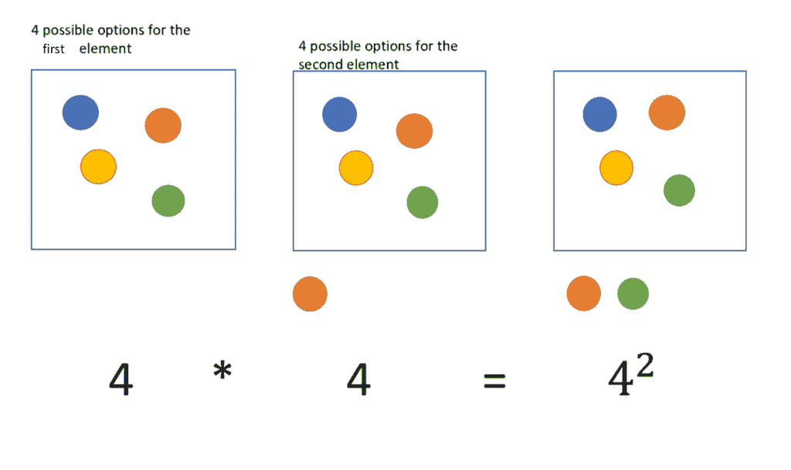

而对于没有重复的处置，我们有:

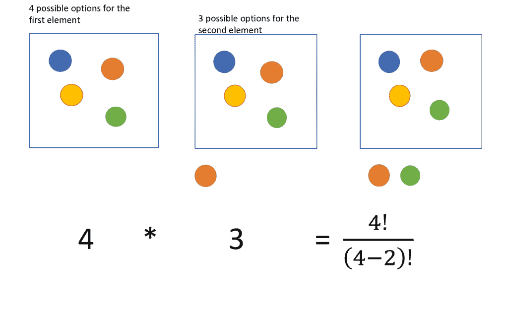

# 组合

组合是排列(或置换，如果 k=n ),其中顺序无关紧要。基本上，每当我们想计算有多少种方法时，我们就使用组合，从 n 个对象中，我们可以提取其中的 k 个，*，不管这些对象被挑选的顺序如何*。

也就是说，如果你回忆起我们在最开始检查的没有重复的排列，其输出是“gb”和“bg”，等效的组合将只有“gb”(或只有“bg”)，因为顺序无关紧要，因此它们代表相同的对象。

让我们看看 python，总是分别检查重复和不重复的两种情况:

*   **有重复:**

```
from itertools import combinations_with_replacement 

box_1=['g','b']
comb = combinations_with_replacement(box_1, 2) 

for i in list(comb): 
    print(i)

Output:

('g', 'g')
('g', 'b')
('b', 'b')
```

如您所见，第四种排列“bg”不在这些组合中，因为它等同于“gb”。

这同样适用于 3 个球(让我们只组合其中的两个):

```
from itertools import combinations_with_replacement 

box_2=['g','b','y']
comb = combinations_with_replacement(box_2, 2) 

for i in list(comb): 
    print(i)

Output:

('g', 'g')
('g', 'b')
('g', 'y')
('b', 'b')
('b', 'y')
('y', 'y')
```

*   **无重复:**

```
from itertools import combinations 

comb = combinations(box_1, 2) 

for i in list(comb): 
    print(i) 

Output:

('g', 'b')
```

有三个球:

```
from itertools import combinations 

comb = combinations(box_2, 2) 

for i in list(comb): 
    print(i) 

Output:
('g', 'b')
('g', 'y')
('b', 'y')
```

可能组合的数量(无重复)由下式给出:

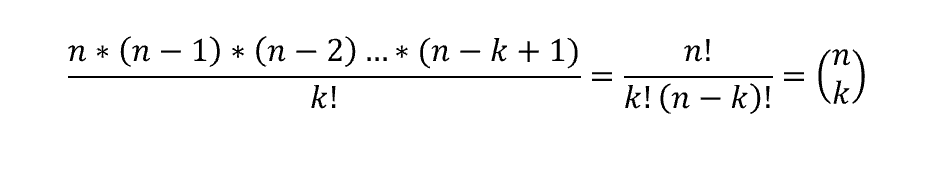

这就是所谓的二项式系数，它被用在[二项式概率分布](/understanding-bernoulli-and-binomial-distributions-a1eef4e0da8f)中，用来计算在 n 次试验中有多少种方法可以获得 k 次成功。另一方面，如果我们允许重复，二项式系数变成:

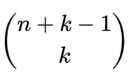

再一次，让我们用我们的球盒想象它，重复:

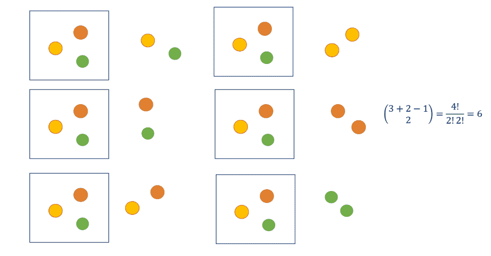

没有重复:

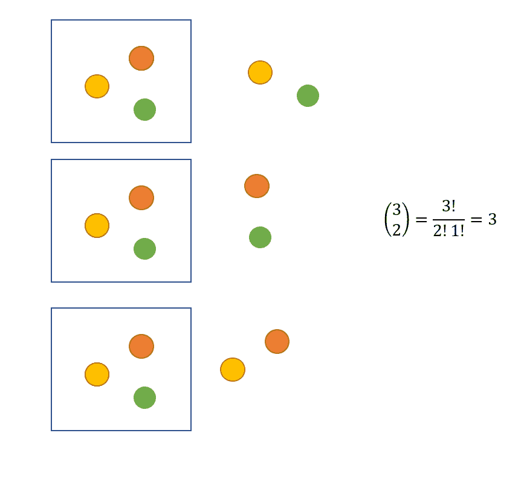

*原载于 2019 年 9 月 7 日*[*http://datasciencechalktalk.com*](https://datasciencechalktalk.com/2019/09/07/combinatorics-permutations-combinations-and-dispositions/)*。*