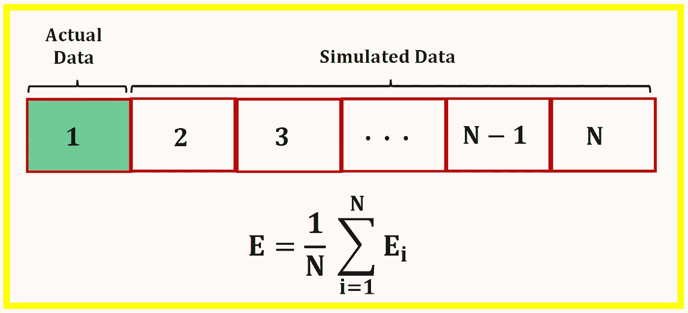
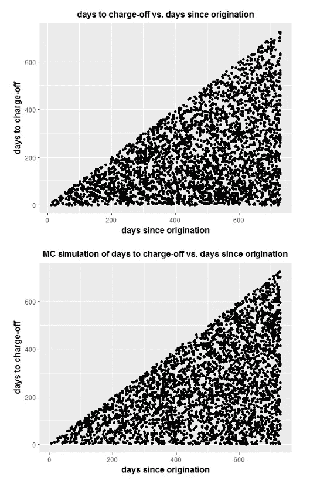
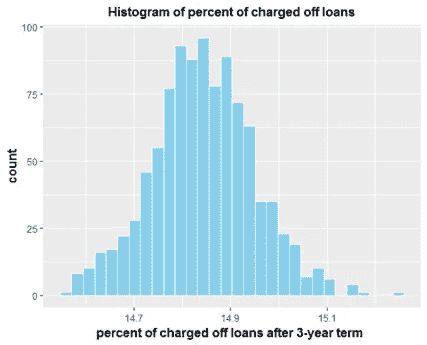

# 机器学习中实际数据与模拟数据的结合

> 原文：<https://towardsdatascience.com/combining-actual-data-with-simulated-data-in-machine-learning-fa07a68b9640?source=collection_archive---------17----------------------->

## 使用蒙特卡罗方法从给定的样本数据中模拟更多的数据



使用机器学习，你需要大量的数据，所以有时将实际数据与模拟数据相结合是有意义的，以便在数据中找到正确的模式或用于模型建立。

Central limit 表示数据集越大越好，因为当样本量变得非常大时，总体均值接近样本均值。通过生成样本数据集的复制副本，我们可以估计不同人群的样本均值，以确保均值是稳定的。我们也可以在平均值的预测中估计方差(不确定性)。

为了从给定的样本数据中模拟数据，我们需要能够识别样本数据中的模式，还需要了解一些关于特征及其分布的知识。例如，如果我有一个男性身高的小样本，并且我知道身高遵循正态分布，我可以使用以下公式生成男性身高的数据集:

```
mu = mean(male_heights)sd = sd(male_heights)N = 1000simulated_data = rnorm(N, mu,sd)
```

本文将讨论如何使用蒙特卡罗(MC)模拟来生成样本数据集的近似复制副本。然后对这些数据块中的每一个进行训练。然后，通过对包括实际和模拟数据的数据块执行整体平均，计算模型的整体性能。

**简介:**预测贷款的状况是风险评估中的一个重要问题。银行或金融机构在向客户发放贷款之前，必须能够估计所涉及的风险。数据科学和预测分析在构建可用于预测贷款违约概率的模型中发挥着重要作用。在这个项目中，我们获得了包含 50000 个数据点的 loan_timing.csv 数据集。每个数据点代表一笔贷款，提供两个特征如下:

1.  标题为“自发起以来的**天数**的列表示发起和数据收集日期之间经过的天数。
2.  对于在收集数据之前销账的贷款，标题为“**从发放到销账的天数**的列表示发放和销账之间的天数。对于所有其他贷款，此栏为空白。

**技术术语的定义**

1.  **发放:**指借款人从贷款人处收到贷款的日期。
2.  **冲销(贷款违约)状态:**借款人定期还款，直到借款人在贷款期限结束前停止还款，通常是由于财务困难。这一事件被称为冲销，然后贷款被称为已冲销或处于违约状态。
3.  **当前或活跃状态**:借款人在整个贷款期限内继续还款。至此，债务已全部还清。
4.  **贷款期限**:贷款协议生效的期限，在此期限之前或结束时，贷款应被偿还或重新协商另一期限。在这个例子中，我们考虑一笔期限为 3 年的贷款。

**项目目标:**该项目的目标是使用数据科学的技术来估计这些贷款(在 [**loan_timing.csv**](https://github.com/bot13956/Monte_Carlo_Simulation_Loan_Status) 数据集中的 50，000 条客户记录)在 3 年贷款期限内将被冲销的比例。

本文的数据集和 R 代码可以从这个资源库下载:[**https://github . com/bot 13956/Monte _ Carlo _ Simulation _ Loan _ Status**](https://github.com/bot13956/Monte_Carlo_Simulation_Loan_Status)**。**

# 使用 R 的模型实现

## 1.导入必要的库

```
library(readr)
library(tidyverse)
library(broom)
library(caret)
```

## **2。导入数据集并为分析准备数据**

```
df<-read_csv("loan_timing.csv",na="NA")names(df)=c("origination","chargeoff")**# partition data set into two: default (charged off ) and current**index<-which(!(df$chargeoff=="NA"))default<-df%>%slice(index)current<-df%>%slice(-index)
```

## **3。探索性数据分析**

**A)实际数据**

```
**# Plot of days to charge-off vs. days since origination for defaulted loans using actual data**default%>%ggplot(aes(origination,chargeoff))+geom_point()+xlab('days since origination')+ ylab('days to charge-off')+ggtitle("days to charge-off vs. days since origination")+theme(plot.title = element_text(color="black", size=12, hjust=0.5, face="bold"),axis.title.x = element_text(color="black", size=12, face="bold"),axis.title.y = element_text(color="black", size=12, face="bold"),legend.title = element_blank())
```

**B)模拟数据**

```
**# Monte Carlo Simulation of Defaulted Loans**set.seed(2)N <- 3*365 # loan duration in daysdf_MC<-data.frame(u=round(runif(15500,0,N)),v=round(runif(15500,0,N)))df_MC<-df_MC%>%filter(v<=u)df_MC<-df_MC%>%filter(u<=730 & v<=730) #select loans within first 2 yearsdf_MC[1:nrow(default),]%>%ggplot(aes(u,v))+geom_point()+xlab('days since origination')+ylab('days to charge-off')+ggtitle("MC simulation of days to charge-off vs. days since origination")+theme(plot.title = element_text(color="black", size=12, hjust=0.5, face="bold"),axis.title.x = element_text(color="black", size=12, face="bold"),axis.title.y = element_text(color="black", size=12, face="bold"),legend.title = element_blank())
```



**Actual and MC simulation of days to charge-off vs. days since origination.**

因为存在与贷款冲销相关的随机性，我们看到 MC 模拟为违约贷款的分布提供了一个很好的近似。

**预测:**由于我们已经证明，在最初 2 年(即 0 至 730 天)中，可以使用 MC 模拟来近似计算待冲销天数和自发放以来天数之间的关系，因此我们可以使用 MC 模拟来预测在所有 3 年期限结束时将被冲销的贷款比例。

我们数据集中冲销贷款的总数是 3，305。这意味着目前有 46，695 笔贷款处于活跃状态。在这些活跃的贷款中，一定比例的贷款将在 3 年内违约。为了估计违约贷款的总比例，我们模拟了涵盖整个贷款期限(即 0 至 1095 天)的违约贷款的冲销和自发放以来的天数，然后通过适当的缩放，我们计算了在 3 年期限(即 1095 天)后将冲销的贷款比例。

```
**# Predicting fraction of these loans will have charged off by the time all of their 3-year term is finished.**set.seed(2)B<-1000fraction<-replicate(B, {df2<-data.frame(u=round(runif(50000,0,N)),v=round(runif(50000,0,N)))df2<-df2%>%filter(v<=u)b2<-(df2%>%filter(u<=730 & v<=730))total<-(nrow(df2)/nrow(b2))*nrow(default)100.0*(total/50000.0)})
mean(fraction)**# Histogram of total fraction of charged off loans**fdf<-data.frame(fraction=fraction)fdf%>%ggplot(aes(fraction))+geom_histogram(color="white",fill="skyblue")+xlab('fraction of charged off loans after 3-year term')+ylab('count')+ggtitle("Histogram of total fraction of charged off loans")+theme(
plot.title = element_text(color="black", size=12, hjust=0.5, face="bold"),
axis.title.x = element_text(color="black", size=12, face="bold"),
axis.title.y = element_text(color="black", size=12, face="bold"),
legend.title = element_blank()
)**# Calculate Confidence Interval of Percentage of Defaulted Loans after 3-year term**mean<-mean(fraction)sd<-sd(fraction)confidence_interval<-c(mean-2*sd, mean+2*sd)confidence_interval
```

通过创建 N = 1000 次随机试验，我们获得了 3 年期违约贷款比例的以下分布:



**图 6:使用 N = 1000 个样本的 3 年期后冲销贷款比例直方图。**

根据我们的计算，3 年贷款期限后将被冲销的贷款部分的 95%置信区间相应地为 14.8% +/- 0.2%。因此，如果发放贷款期限为 3 年的 50，000 笔贷款，这些贷款中大约有 15%将会违约。

**结论:**我们提出了一个基于 MC 模拟的简单模型，用于预测在 3 年贷款期限结束时违约的贷款比例。蒙特卡洛模拟是一种重要的方法，可用于规定分析中，规定在数据集本质上非常随机的情况下要采取的行动过程。

本文的数据集和 R 代码可以从这个资源库下载:[https://github . com/bot 13956/Monte _ Carlo _ Simulation _ Loan _ Status](https://github.com/bot13956/Monte_Carlo_Simulation_Loan_Status)。