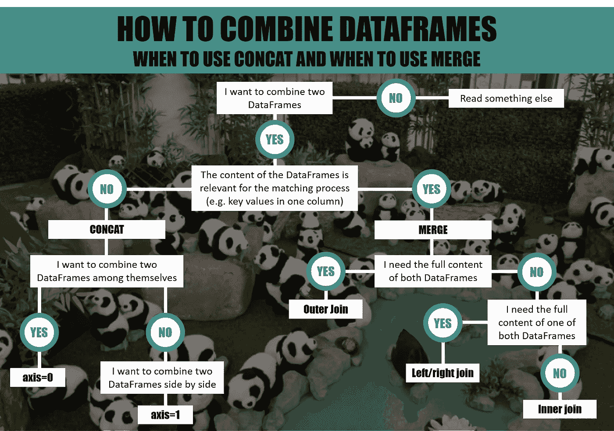
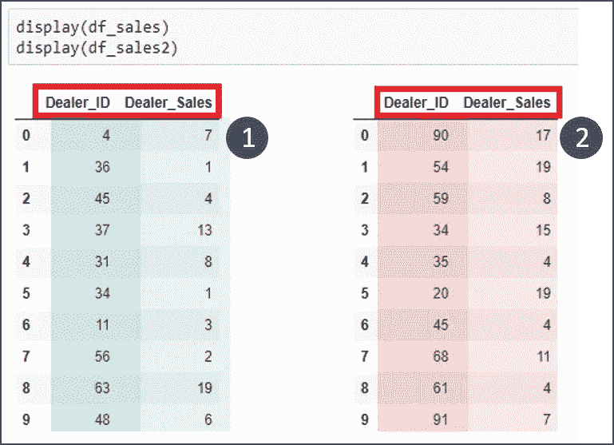
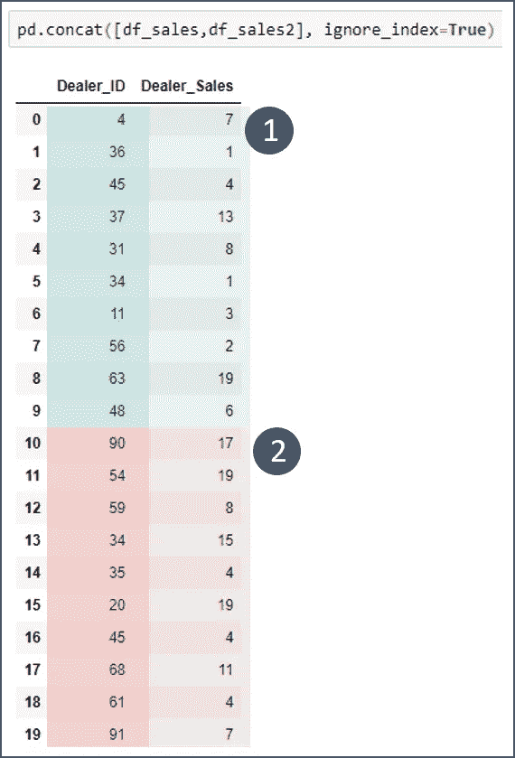
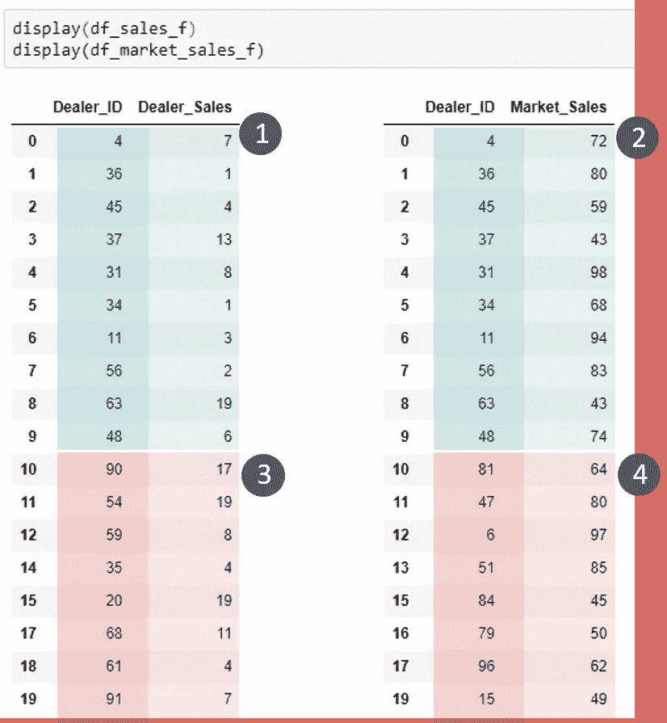
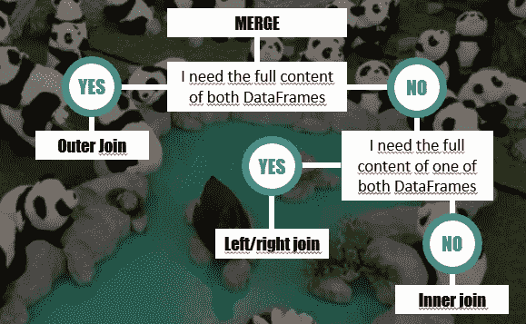
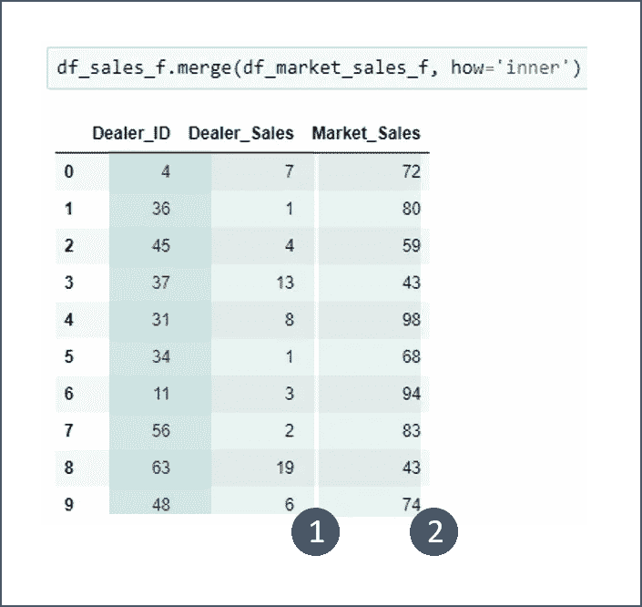
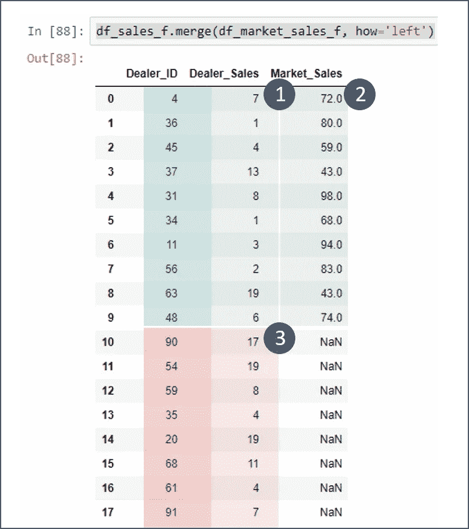
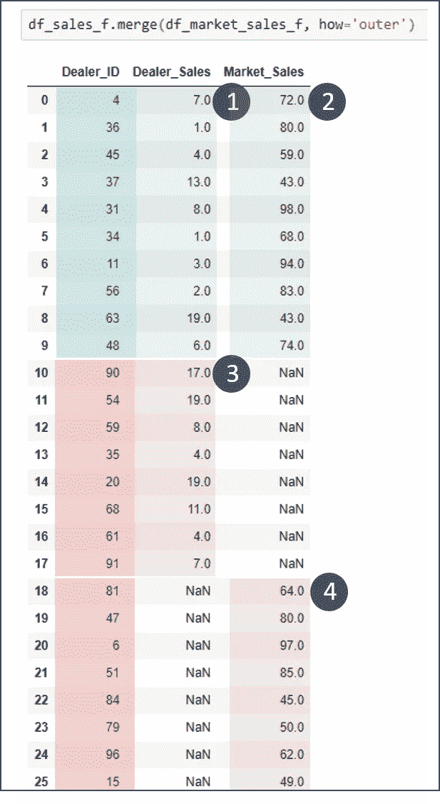

# 组合熊猫数据帧:简单的方法

> 原文：<https://towardsdatascience.com/combining-pandas-dataframes-the-easy-way-41eb0f2c1ebf?source=collection_archive---------6----------------------->

## Cheatsheet 版本:何时使用 Concat，何时使用 Merge

*当我第一次使用 Python 进行数据分析时，我真的不知道什么时候使用追加、连接、合并或连接。一开始，每当我试图合并两个数据框时，我都要用谷歌搜索。因此，我想在这里分享我的经验，并给出一个简单的结合数据框架的介绍。*

# **拼接合并就够了**

您可以使用 concat 和 merge 做任何事情，因此不需要在开始时使用 append 和 join。由于在某些情况下代码更短，所以使用追加和连接可以节省一些时间。基本上，您可以用 append 和 join 做的所有事情，也可以用 concat 和 merge 来做。这就是为什么我们将重点放在这两个命令上。

如果您尝试合并两个数据集，首先要做的是决定是使用 merge 还是 concat。找到正确答案有一个简单的规则。如果数据帧的内容与组合数据帧相关，则必须选择 merge，否则可以选择 concat:

# 让我们从 Concat 开始

你可以用上面的图片作为开始的备忘单。假设您在公司的数据科学部门工作，销售部门每月都会向您发送新的销售数据。上个月和本月的数据框架中有两列:

Fig 1: Df_sales on the left side and df_sales2 on the right side

第一列包含关于经销商的信息，第二列包含去年售出的单位数量。因此，数据集的结构每个月都是相同的，你只需将两个数据框架组合起来。在这种情况下，您需要使用 concat:

Fig 2: The first use of concat with axis=0

`Ignore_index=True`用于创建新的索引。如果您不考虑它，您将保留原始索引。

在这种情况下，我们将两个数据帧组合在一起。如果您想并排组合两个数据帧，您必须用`axis=1`指定命令:

Fig 3: Concat with axis=1

# **数据帧的内容与合并它们相关——如何使用 Merge**

在第一个例子中，我们每个月都从销售部门收到具有相同数据结构的文件。现在想象一下，市场研究部门给你发送市场数据进行比较。对于每个经销商 ID，您还会收到市场数据，其中包括竞争对手的销售额:

Fig 4: The sales data on the left side and the market data on the right side

但是正如你在上面的图片中所看到的，你没有每个经销商所需要的市场数据。因此，您有三个选项来合并上面的数据:

1.您只保留两个数据帧的交集(这意味着索引从 0 到 9 的行):

一号和二号

2.您保留左侧或右侧数据帧的所有信息，而其他数据帧仅保留匹配信息:

1 号、2 号和 3 号或者 1 号、2 号和 4 号

3.您保留两个数据帧的所有信息:

1 号，2 号，3 号和 4 号

# 选项 1-两个数据帧的交集

你所在部门的老板要求从总份额中获得经销商销售额的份额。因此，他只需要经销商和市场销售可用的经销商 id。在这种情况下，您只需保留具有相同经销商 id 的数据集部分。您必须使用内部连接来保持两个数据帧的交集:

Fig 5: The intersection of the sales and market data

注意:如果不指定“how”参数，默认选项将是内部联接。

# 选项 2 —一个数据帧的全部内容和另一个数据帧的匹配部分

您从两个不同的部门接收数据集。销售部门的一个要求可能是，他们想要回他们的原始数据框架和匹配的市场数据:

Fig 6: The full content of the sales data and the matching part from the market data

在这种情况下，您必须执行左连接。只有在市场数据集中找到销售数据中的经销商 ID 时，才需要添加市场数据。

# 选项 3 —保留两个数据帧的所有信息

最后，市场部门希望在不丢失任何信息的情况下将两种数据框架结合起来:

Fig 7: The outer join

在生成的数据帧中，两个基本数据帧中没有一个值丢失。最后，外部连接就像一个左连接和一个右连接的组合。

# 结论和进一步阅读

我希望您喜欢这篇介绍，它有助于阐明 concat 和 merge 命令背后的逻辑。从一开始就有了备忘单，你应该能够决定你必须使用哪个命令。要了解更多信息，我可以推荐以下资源:

1.  官方文件

 [## 熊猫。DataFrame.merge - pandas 0.25.0 文档

### 用数据库样式的联接合并数据框架或命名系列对象。联接是在列或索引上完成的。如果加入…

pandas.pydata.org](https://pandas.pydata.org/pandas-docs/stable/reference/api/pandas.DataFrame.merge.html) 

2.关于 concat 和 merge 区别的 stackoverflow 讨论

 [## pandas 中 merge()和 concat()的区别

### 感谢贡献一个堆栈溢出的答案！请务必回答问题。提供详细信息并分享…

stackoverflow.com](https://stackoverflow.com/questions/38256104/differences-between-merge-and-concat-in-pandas) 

3.关于归并和连接区别的讨论

 [## 熊猫里面的 join 和 merge 有什么区别？

### 假设我有两个这样的数据帧:left = pd。DataFrame({'key1': ['foo '，' bar']，' lval': [1，2]}) right =…

stackoverflow.com](https://stackoverflow.com/questions/22676081/what-is-the-difference-between-join-and-merge-in-pandas/37891437) 

[如果您喜欢中级和高级数据科学，并且还没有注册，请随时使用我的推荐链接加入社区。](https://medium.com/@droste.benedikt/membership)