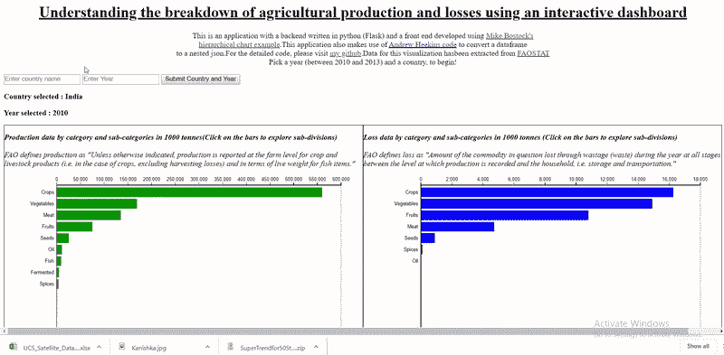
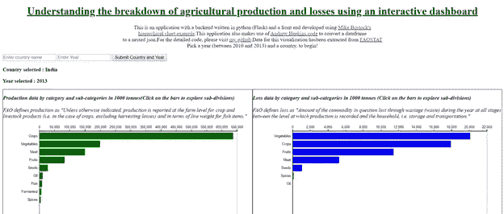
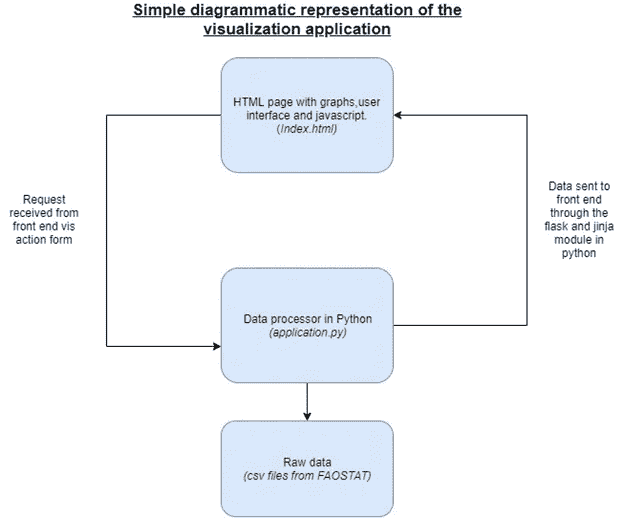
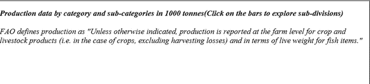

# 结合 python 和 d3.js 创建动态可视化应用程序

> 原文：<https://towardsdatascience.com/combining-python-and-d3-js-to-create-dynamic-visualization-applications-73c87a494396?source=collection_archive---------3----------------------->



视觉形式是催眠和逮捕，不像任何其他媒体。一幅画或一幅图像迫使眼睛看到整个画面，并呈现出一种不受时间限制的形式。难怪视觉在试图理解和解决复杂问题时有助于采用非线性视角。

另一方面，通过数据分析和编程来解决问题仍然在很大程度上植根于线性视角，因为它们涉及到逐步分解数据来理解和解决问题。然而，数据分析如果做得正确，可以让用户考虑到细枝末节的细节和特质，而这些细节和特质通常是在观察全局时被忽略的。将数据驱动方法与更加可视化的方法相结合，提供了一种结合线性和非线性视角的问题解决和分析的整体方法。在本文中，我通过一个详细的、可重复的例子解释了用户如何结合 python(一种强大的数据处理编程语言)和 d3.js(一种强大的生成可视化的语言)来创建一个可视化应用程序，为问题解决者提供有用的见解。

我将演示的是用户如何有效地在 python 中创建数据处理后端，同时在 d3.js 中维护可视化前端，以创建有效的应用程序。我们还将添加一些可控制的功能，以便前端和后端可以根据最终用户的输入有效地相互通信。我们将使用的 python 模块是“Flask ”,它将充当后端和前端之间的中介。我选择的 d3 可视化是 Mike Bostock 创建的[可折叠条形图](https://observablehq.com/@d3/hierarchical-bar-chart)示例。可视化结构的创建将涉及到 html、js 和一些 jinja 代码的使用。

**问题**—

我们将使用来自 FAOSTAT 数据库的农业生产数据。粮农统计数据库提供了 213 个地区不同年份的几个变量的数据，按作物类型、肉类和鱼类分类。**我们将通过一个动态可视化应用程序，尝试了解和探索 FAOSTAT 数据在不同时间、不同国家间的汇总和分解情况。**您可以在这里找到用于本例[的编辑过的数据集。我们将使用两个数据集，一个是按不同类型的作物、肉类和鱼类分列的产量，另一个是按相同类别分列的农业损失。这两个数据集都包含 213 个地区从 2010 年到 2013 年的数据。我们将创建一个应用程序，帮助用户使用可折叠的条形图可视化来比较任何类别或子类别的损失和产量。用户还应该能够选择任何国家和年份来创建这些国家的可视化。基本上，最终(编辑)的产品看起来像下面的图片和 gif，](https://github.com/kanishkan91/FAO-FBS-Data-Explorer)



See the gif below to see how the app works


This gif demonstrates the usage of the application on a local machine

**第 1 部分:定义应用程序的结构**

我们将要做的，是在一个 html 页面上创建一个前端，它将托管我们的可视化和 d3.js 脚本。我们将把包含在名为“application.py”的文件中的 python 代码中的数据发送到这个 html 页面。计算机上应用程序的结构如下。

```
#Application file structureroot/    static/
   This folder contains your supplementary JavaScript files
   /templates
   This folder contains the index.html fileapplication.py (The main python file and data are hosted in the root folder)
```

下面是该应用程序的图示



Source: Author’s conception

**第 1 部分:定义前端(html，d3.js)**

首先，让我们设计前端，这将是一个基本的 html 页面(“index.html”)，它将承载我们的 d3 可视化以及一个用户可以提交国家和年份选择的表单。最终的 html 在这里托管[。我不会走一些基本的东西，如 css 和格式等。你可以直接从 html 中获取或者根据你的喜好定制。创建基本 html 页面的步骤如下，](https://github.com/kanishkan91/FAO-FBS-Data-Explorer/blob/master/templates/index.html)

1.获取所需的所有脚本

2.创建一个用户可以更改国家和年份选择的表单。

3.创建“div”元素来承载可视化效果

4.插入 d3 代码来创建图形。我们还将使用 jinja 代码定义 python 后端和 d3 之间的链接。

您需要有基本的 d3 版本( *d3.v3.min.js)* ，您可以使用这个命令将它放入 html，

```
<script src=”https://d3js.org/d3.v3.min.js"></script>
```

让我们首先创建用户可以提交国家和年份信息的表单。这可以通过一些 html 代码来完成，这些代码将生成一个用户可以提交请求的“表单”。请注意，下面指定的名称(如“Country_field”和“Year_field ”)非常重要，因为在 python 的后端会再次引用这些名称。

```
<form method=”post” ><input name=”Country_field” placeholder=”Enter country name” > <input type=”number” name=”Year_field” placeholder=”Enter Year” > <input type=”submit” value=”Submit Country and Year” > </form>
```

现在，我们将创建两个分区，一个在左边托管生产数据图，另一个在右边托管损失数据。分部还应显示所选的国家和年份。我们必须为图表指定 id，并且必须用 jinja 编写一些代码来获取国家名称和年份。jinja 代码基本上使用花括号{{}}从 python 访问数据。将类别分配给分部有助于以后轻松添加格式。同样的代码是，

```
<div class=”left-div” id=”graphDiv” style=”border: thin solid black”>
 <p>
 <b>
 <i> 

Production data by category and sub-categories in 1000 tonnes for {{CountryName}}(Click on the bars to explore sub-divisions)</b>
 <br> <br> 
 FAO defines production as “Unless otherwise indicated, production is reported at the farm level for crop and livestock products (i.e. in the case of crops, excluding harvesting losses) and in terms of live weight for fish items.” 

</i> 
</p>
</div>
```

上面的代码产生了这个结果，



Production division in html

我们将不得不重复相同的代码来为损失数据创建另一个分部。之后，让我们定义 d3 函数来创建图表。我定义了两个函数，svg1 和 svg2 分别用于左侧和右侧的图。我使用的代码大部分来自 Mike Bostock 的例子[这里](https://observablehq.com/@d3/hierarchical-bar-chart)。我们只会做一些改动。首先，在代码中定义 svg 对象的地方，我们必须引用我们的 graph div ids，以便函数将在我们上面所做的划分中创建图形。所以，在我们的例子中，

```
var svg1 = d3.select(“**#graphDiv**”)
.append(“svg”)
.attr(“width”, width + margin.left + margin.right)
.attr(“height”, height + margin.top + margin.bottom)
.append(“g”)
.attr(“transform”, “translate(“ + margin.left + “,” + margin.top + “)”);
```

现在，如上所述，后端数据处理器将在 python 中构建。因此，我们必须使用下面的代码将数据从 python 传递到 js 脚本。“/get-data”是一个函数，我们将在稍后的 python 代码中定义它。“d3.json”将以 json 格式读入数据。

```
d3.json(“**/get-data**”, function(error, root){
partition.nodes(root);
x.domain([0, root.value]).nice();
down(root, 0);});
```

最后，我们在代码中对条形的颜色做了一点小小的调整。我们希望生产图用绿色条，损失图用蓝色条。我们将通过改变下面代码中的颜色变量来改变颜色，

```
var color = d3.scale.ordinal()
    .range([“green”, “#ccc”]);
```

**第 3 部分:用 python (flask)创建后端**

创建 python 文件的步骤要花费更多的时间。最终的申请文件可在[这里](https://github.com/kanishkan91/FAO-FBS-Data-Explorer/blob/master/application.py)获得。我们需要执行以下步骤，

1.导入必要的包，在 flask 中定义应用程序并创建一个数据存储。

2.创建代码以生成发送到主页前端的数据。

3.将数据转换为 d3 的 json 格式，并发送到前端

4.类似地，专门为产量和损失图定义函数。

好了，让我们把简单的事情解决掉。让我们获取包，定义 flask 应用程序并创建一个包含 4 个变量的数据存储函数。datastore 变量将有助于稍后在将数据传递给前端之前保存数据。我们将创建一个“CountryName”变量和一个“Year”变量，用户将通过表单将这两个变量发送到应用程序。我们将创建一个“Prod”变量来存储生产数据，并创建一个“Loss”变量来存储损失数据。

```
#1\. Import packages**from** flask **import** Flask, flash, redirect, render_template, request,   session, abort,send_from_directory,send_file,jsonify
**import** pandas **as** pd
**import** json

*#2\. Declare application*app= Flask(__name__)

*#3\. Create datastore variable***class** DataStore():
     CountryName=**None** Year=**None** Prod= **None** Loss=**None** data=DataStore()
```

现在，让我们定义应用程序的主页。我们首先必须定义到主页的路径和一个主页功能，该功能将为主页创建数据。基本上正在发生的是，当用户访问主页面时，主页功能将被调用。我们还将使用一个名为“request”的简单 flask 函数从前端“获取”数据。当请求数据时，请注意我们使用 html 中定义的 id，如“Country_field”和“Year_field”。我们还为国家/地区设置了默认值印度，并为年度设置了 2013。我们还将把这个请求的数据传递给我们的数据存储函数变量‘Year’和‘country name’(数据存储变量和其他变量之间的区别解释如下)。最后，我们将读入生产数据，并为我们的分析创建名为 CountryName 和 Year 的变量。请注意，这些是将传递给 html 的实际变量，而不是存储在 python 内部的变量。一个很好的想法是，数据存储是 python 的内部内存，它会随着时间不断更新。静态临时变量是在单个时间点创建的值，将被传递到前端。如上所述，可视化是为 1 个时间点创建的，因此使用临时变量。

```
#We are defining a route along with the relevant methods for the #route, in this case they are get and post.

@app.route(**“/”**,methods=[**“GET”**,**”POST”**])#We are defining a home page function below. We will get the #CountryName and the Year from the form we defined in the html **def** homepage():
    data.CountryName = request.form.get(**‘Country_field’**,**’India’**)
    data.Year = request.form.get(**‘Year_field’**, 2013)
    data.CountryName=CountryName

    df = pd.read_csv(**‘CropsFull.csv’**)
    CountryName = data.CountryName
    Year= data.Year
```

现在，我们将根据从表单中收到的值过滤数据(df)。这是 python 中一个简单的过滤器。我们还将只保留相关的列以供进一步处理。我将 Year 变量转换为整数，因为有时请求会返回一个字符串，这可能会导致 python 无法过滤数据。

```
*# Filter the data frame (df)* df = df[df.Country == CountryName]
df = df[df.Year == int(Year)]#Keep only relevant columns 
df = df[[**“Category”**, **“Cat”**, **“value”**]]
```

现在，我们需要将这个数据帧转换成一个分层的 json。json 根据数据中的聚合类别进行分层，因此对于可视化很有用。我已经附上了相同的代码如下。但是我使用了 Andrew Heekin 的代码来创建嵌套的 jsons。代码可以在[这里](https://github.com/andrewheekin/csv2flare.json/blob/master/csv2flare.json.py)找到。我不会在这里深入讨论代码的细节。

```
df1 = df.groupby([**‘Category’**, **‘Cat’**])[**‘value’**].sum()
df1 = df1.reset_index()*#Lets create a dict* d = {**"name"**: **"flare"**, **"children"**: []}

 **for** line **in** df1.values:
     Category = line[0]
     Cat = line[1]
     value = line[2]

     *# make a list of keys* keys_list = []
     **for** item **in** d[**'children'**]:
         keys_list.append(item[**'name'**])

*# if 'the_parent' is NOT a key in the flare.json yet, append it* **if not** Category **in** keys_list:
         d[**'children'**].append({**"name"**: Category, **"children"**:      [{**"name"**: Cat, **"size"**: value}]})

*# if 'the_parent' IS a key in the flare.json, add a new child to it* **else**:
         d[**'children'**][keys_list.index(Category)]  [**'children'**].append({**"name"**: Cat, **"size"**: value})

 flare = d
```

现在，我们必须将这些数据转储为 json 格式。每次我们给它赋值的时候，我们都可以使用 json load 函数来加载它。如上所述，让我们将这些数据保存到一个临时变量‘Prod’中以传递给前端，并保存到一个名为‘data’的 python 内存变量中。从我们的数据存储函数。

```
#Dump data to json
flare = json.dumps(flare)#Save to datastore
data.Prod = json.loads(flare)#Save to temporary variable
Prod=data.Prod
```

我们将使用上述步骤处理损失数据。我不会在这里重复完整的代码。损失代码的最后一行是，

```
#Dump data to json
flare = json.dumps(flare)#Save to datastore
data.Loss = json.loads(flare)#Save to temporary variable
Loss = data.Loss
```

最后，让我们用一个 return 语句来结束我们的函数。我们将使用 flask 'render_template '函数将数据发送到我们的前端(index.html '文件。我们还将返回所有临时变量，如国家名称、年份、产量和损失数据

```
**return** render_template(**“index.html”**,CountryName=CountryName,Year=Year,Prod=Prod,Loss=Loss)
```

上面的代码向主页面发送数据。我们还必须编写另外两个函数来将生产和损失数据发送给我们的 js 函数。假设我们有一个数据存储来记录我们的生产和损耗数据，这应该相当简单。让我们定义一个名为“/get-data”的路由，并将我们的生产数据发送给它。请注意，该函数返回数据的“jsonified”版本。

```
@app.route(**“/get-data”**,methods=[**“GET”**,**”POST”**])

**def** returnProdData():
    f=data.Prod

    **return** jsonify(f)
```

我们将在名为'/get-loss-data '的路径上为丢失数据创建一个类似的函数。

```
@app.route(**“/get-loss-data”**,methods=[**“GET”**,**”POST”**])

**def** returnLossData():
    g=data.Loss

    **return** jsonify(g)
```

最后，让我们定义运行应用程序的代码，

```
**if** __name__ == **"__main__"**:
    app.run(debug=**True**)
```

这就是了。你的申请准备好了！继续运行它！运行代码时，您应该会得到以下消息，其中包含一个指向本地驱动器上的应用程序的链接。

```
* Running on [http://127.0.0.1:5000/](http://127.0.0.1:5000/) (Press CTRL+C to quit)
```

这个应用程序很容易部署在服务器上。我已经在免费的 heroku 服务器上部署了它。同样可以在这里访问[。请注意，我使用的是 heroku 的免费版本，所以加载时间有点慢(您可能需要刷新应用程序几次)。我还添加了 requirements.txt 和。gitignore 和 procfile，以防您想将它部署到 heroku 或任何其他服务器上。这段代码显然很容易适应您喜欢的其他 d3 可视化！](https://faoexplorer-flask-d3.herokuapp.com/)

非常感谢 Mike Bostock 创造了像 d3 这样精彩的语言，感谢 Andrew Heekin 编写了生成分层 jsons 的代码。感谢 David Bohl 和 Aditya Kulkarni 的反馈和评论。

为了您的参考和方便，我在下面附上了 github 库和其他资源的链接。

1.链接到 github 项目-【https://github.com/kanishkan91/FAO-FBS-Data-Explorer 

2.链接到 heroku 服务器上部署的应用程序-【https://faoexplorer-flask-d3.herokuapp.com/ 

3.链接到 Mike Bostocks 可折叠条形图示例-[https://observablehq.com/@d3/hierarchical-bar-chart](https://observablehq.com/@d3/hierarchical-bar-chart)

4.链接到 Andrew Heekin 创建分层 json 的代码-[https://github . com/andrewheekin/cs v2 flare . JSON/blob/master/cs v2 flare . JSON . py](https://github.com/andrewheekin/csv2flare.json/blob/master/csv2flare.json.py)