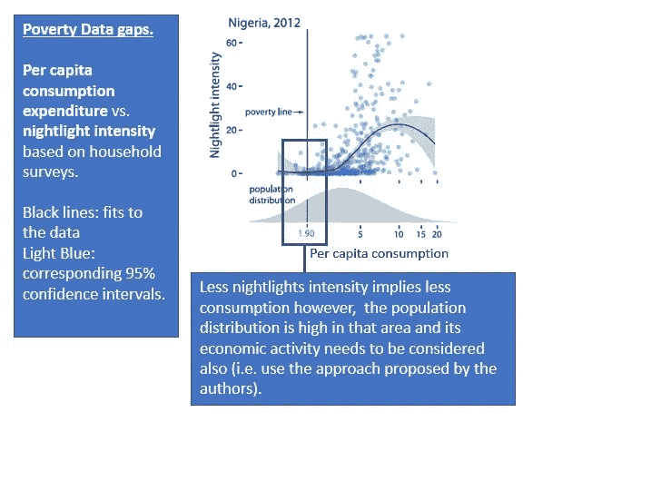
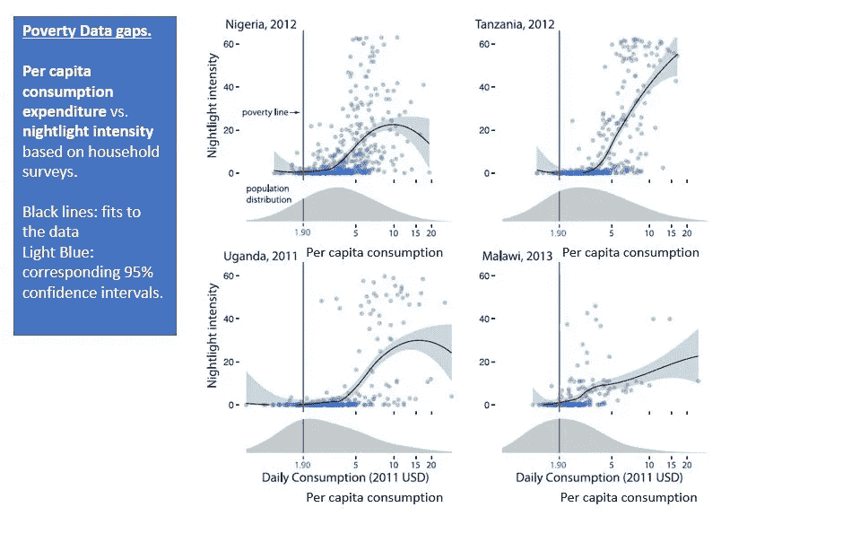
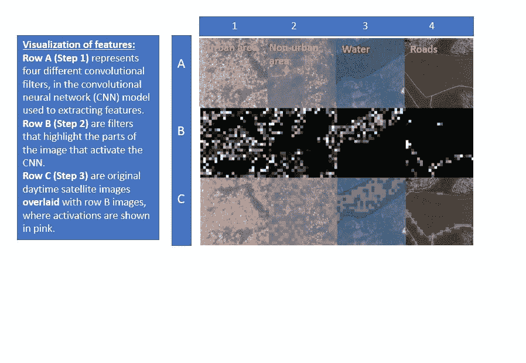
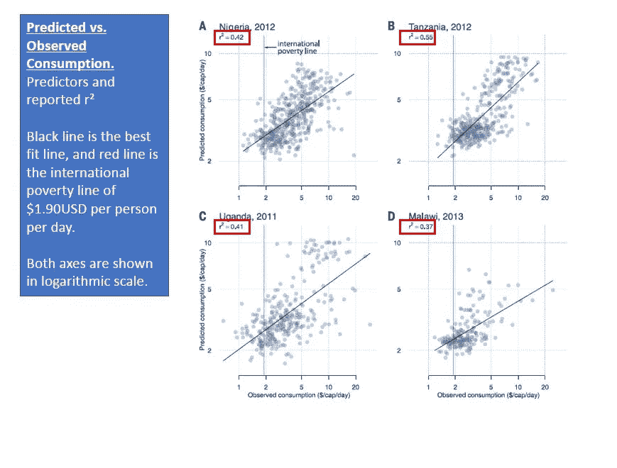
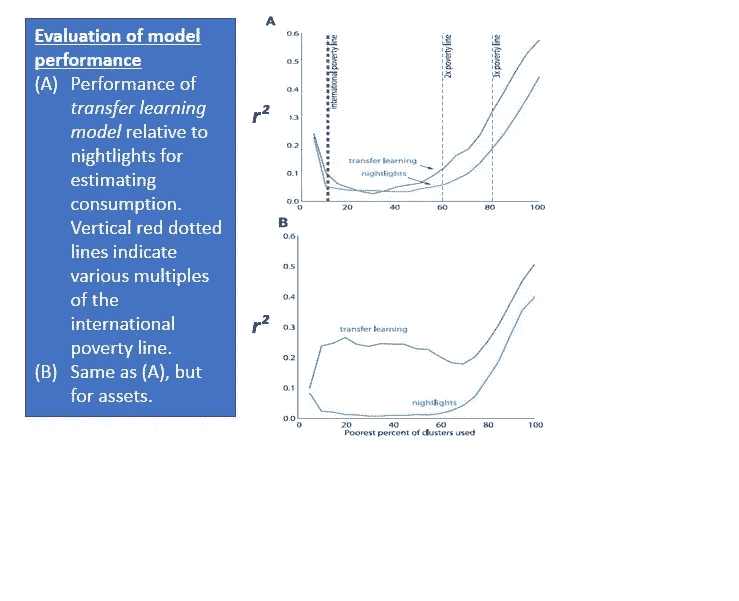

# 结合卫星图像和机器学习来预测贫困

> 原文：<https://towardsdatascience.com/combining-satellite-imagery-and-machine-learning-to-predict-poverty-884e0e200969?source=collection_archive---------16----------------------->

这是尼尔·让等人对同名论文的 5 分钟评论。这是这篇文章的视频版本:[https://youtu.be/bW_-I2qYmEQ](https://youtu.be/bW_-I2qYmEQ)。

P 发展中国家的过度评估影响着这些国家的政府如何分配有限的资源来制定政策和开展研究。

Neal Jean 等人在他们的论文中声称，他们通过使用机器学习和结合卫星图像，开发了一种检测和预测贫困的方法。

我们如何衡量广大地理区域的经济活动水平？一种可能性是观察它们的夜间发光强度。这些地区的卫星夜灯亮度图像与它们的经济活动水平之间存在关联。

然而，作者观察到，夜灯方法本身无法检测低于国际贫困线的地区的经济活动。参见图 1–2。

Figure 1

Figure 2

通常，政府依靠调查来收集经济数据并采取行动。但是应用这些调查并不简单，而且费用很高。

这就是作者提出的方法的用武之地。他们提出了一种基于“迁移学习”技术的机器学习方法，有望解决这一缺点，并提供比单独考虑亮度强度更高的预测精度。

他们声称他们预测贫困的方法是准确的、廉价的和可扩展的。他们是如何实现这种预测能力的？通过结合调查和卫星数据，可以训练卷积神经网络或 CNN 来辨别白天卫星图像上的特征。

在他们的研究中，他们考虑了 4 个非洲发展中国家，他们估计数据的粒度是在家庭层面。

他们的方法包括什么？它包括三个阶段(见图 3):

**第一阶段**他们训练 CNN 从日光卫星图像中学习特征。例如，这些特征是经济活动(或缺乏经济活动)的证据，如城市地区、非城市地区、水和道路。

**阶段 2** 利用阶段 1 中获得的知识，CNN 适于被训练以估计夜间光强度。

**第 3 阶段**涉及将经济调查数据和 CNN 从日光图像中提取的图像特征相结合，以训练回归模型，该模型能够估计他们正在考虑的贫困指标。

Figure 3

作者声称，他们的“**迁移学习模型**”可以高精度地预测他们的贫困指标。那些指标是什么？/他们处理两个问题，它们是消费支出和资产财富(他们声称已经分别实现了高达 55%和 59%的可变性解释。)参见图 4 和图 5。

Figure 4

Figure 5

在我看来，这篇论文提出了一种增强的、准确的和负担得起的技术，世界各地的政府和组织可以用它来跟踪和瞄准发展中国家的贫困，以采取缓解行动。它展示了机器学习在帮助改善人们的生活条件方面有多么强大。

我的网站是:【https://www.georgelopez-portfolio.com/ 

所有数字由尼尔·吉恩等人提供，并由 g·洛佩兹改编。

— — — — — — — — — — — — — — — — — — — — — — — — — — — — — — —

亲爱的读者:

我想知道你认为还有哪些使用 AI/ML 的人道主义应用可以实现？

你可以留下回应的评论，我会很乐意阅读。谢了。