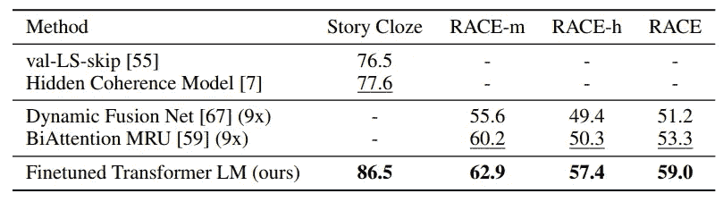

# 结合监督学习和非监督学习改进词向量

> 原文：<https://towardsdatascience.com/combining-supervised-learning-and-unsupervised-learning-to-improve-word-vectors-d4dea84ec36b?source=collection_archive---------15----------------------->

## 生成性预培训简介

Photo by [Edward Ma](https://unsplash.com/@makcedward?utm_source=medium&utm_medium=referral) on [Unsplash](https://unsplash.com?utm_source=medium&utm_medium=referral)

为了在 NLP 任务中获得最先进结果，研究人员尝试了大量方法让机器理解语言并解决下游任务，如文本蕴涵、语义分类。OpenAI 发布了一个新的模型，命名为生成式预训练(GPT)。

看完这篇文章，你会明白:

*   微调变压器 LM 设计
*   体系结构
*   实验
*   履行
*   拿走

# 微调变压器 LM 设计

这种方法包括两个步骤。首先，通过基于大量数据的无监督学习来训练模型。第二部分是使用目标数据集(领域数据)通过监督学习对上一步的模型进行微调。

## 无监督学习

不可否认，NLP 的无标签数据是无限的。拉德福德等人认为，利用无限的语料库有助于训练一个通用模型，就像 [word2vec](/3-silver-bullets-of-word-embedding-in-nlp-10fa8f50cc5a) (单词嵌入)和 [skip-thought](/transforming-text-to-sentence-embeddings-layer-via-some-thoughts-b77bed60822c) (句子嵌入)。我们不需要考虑训练数据的数量，因为我们可以很容易地获得大量的语料。

然而，仍然有一个限制。尽管我们可以尽可能多地使用语料库，但在大多数情况下，语料库与我们的领域数据是脱节的。从我以前的工作中，我注意到我的领域数据中的大部分单词并不存在于大量现成的单词嵌入模型中。

拉德福德等人没有使用 RNN 架构，而是使用变压器架构来训练第一个模型。因为他们相信变压器架构能够捕捉更远距离的信号(语言特征)。限制是高计算时间。由于拉德福德等人使用了 12 个自我注意块和高维内部状态，即使使用 GPU 也需要几周时间来训练初始模型。

## ***监督学习***

之后，目标数据集(与之前的数据集相比，在大多数情况下，它应该是一个小数据集)将被用于通过监督学习来微调模型。

# 体系结构

## ***【无监督学习模型(Transformer)】***

序列对序列(又名 RNN)模型有一个局限性，我们需要定义固定长度的上下文向量，这损害了记忆很长句子的能力。与此同时，注意力机制应运而生。该架构被称为“变压器”，是多头自我关注。在注意机制家族中，我们有许多不同的注意，拉德福德等人决定使用自我注意。

*   **多头**是指使用具有不同参数多个自我注意来计算表示。想想看，我们希望有多个专家来帮助找到一个更好的结果。多头机制并行执行具有不同参数相同计算。来自不同注意块的计算结果将被连接并转换到期望的维度。

Photo by [JOSHUA COLEMAN](https://unsplash.com/@joshstyle?utm_source=medium&utm_medium=referral) on [Unsplash](https://unsplash.com?utm_source=medium&utm_medium=referral)

*   **注意**正在利用 CNN 的优势。自注意不依赖于先前的信息，因此它可以并行运行以实现更低的计算时间。同时，单词是直接计算所有已定义的单词，而不仅仅是环境。它克服了 RNN 缺乏记忆长句子能力的缺点。**自我注意**是注意机制家族的成员之一。注意力输入是 Q(查询)、K(键)和 V(值)。与其他成员不同，所有输入(Q、K 和 V)都是相等的。

Photo by [Ari Spada](https://unsplash.com/@ari_spada?utm_source=medium&utm_medium=referral) on [Unsplash](https://unsplash.com?utm_source=medium&utm_medium=referral)

关于变压器的细节，你可以查看这张[纸](http://papers.nips.cc/paper/7181-attention-is-all-you-need.pdf)。回到架构，输入特征是文本和文本的位置来计算单词向量。文本位置是指输入的单词位置。流程是:

1.  文本和位置将被转换成一个矢量
2.  传递给多头自我关注
3.  结合步骤 1 和步骤 2 的结果并执行归一化
4.  传递到全连接的前馈网络
5.  结合步骤 3 和 4 的结果并执行归一化

最后，将多头(共 12 个自关注块)组合在一起计算向量。

Transformer architecture (Radford et al., 2018)

型号规格为:

*   总共 12 台变压器
*   自我注意中的 768 维状态
*   位置前馈网络中的 3072 维内部态。
*   使用 Adam 优化，最大学习率为 2.5e-4
*   64 个小批量的 100 个时代
*   辍学率为 0.1%

***监督学习***

在训练了上一步的模型后，这种受监督的微调过程有助于获得目标任务的向量。假设输入是带有标签的输入符号序列，我们可以从预先训练的模型中得到一个符号的向量。

Input Transformations for fine-tuning on different tasks (Radford et al., 2018)

# 实验

Experimental Result on Natural Language Inference Tasks ( Radford et al., 2018)

Experimental Result on Question Answering and Commonsense Reasoning Tasks ( Radford et al., 2018)

# 拿走

*   展示了针对特定领域数据的微调能力。
*   [BERT](/how-bert-leverage-attention-mechanism-and-transformer-to-learn-word-contextual-relations-5bbee1b6dbdb) 的设计与该模型相似，而 BERT 进一步改进了该模型的局限性。
*   作者注意到这个架构设计没有进一步的改进。(在 github 中提到)

# 关于我

我是湾区的数据科学家。专注于数据科学、人工智能，尤其是 NLP 和平台相关领域的最新发展。你可以通过[媒体博客](http://medium.com/@makcedward/)、 [LinkedIn](https://www.linkedin.com/in/edwardma1026) 或 [Github](https://github.com/makcedward) 联系我。

# 参考

拉德福德·a·纳拉辛汉·k·萨利曼斯·蒂姆，苏茨基弗一世..2018.[通过生成性预训练提高语言理解](https://s3-us-west-2.amazonaws.com/openai-assets/research-covers/language-unsupervised/language_understanding_paper.pdf)。

瓦斯瓦尼 a，沙泽尔 n，帕尔马 n，乌兹科雷特 j，琼斯 L，戈麦斯 a n，凯泽 L..2017.你所需要的只是注意力。

[tensor flow 中的微调变压器 LM](https://github.com/openai/finetune-transformer-lm)(原装)

[py torch 中的微调变压器 LM](https://github.com/huggingface/pytorch-openai-transformer-lm)