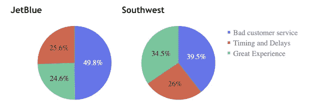

# 来和我一起飞吧！

> 原文：<https://towardsdatascience.com/come-fly-with-me-616d7242b443?source=collection_archive---------32----------------------->

## 分析航空业 twitter 数据的自然语言处理项目。人们在推特上谈论的话题和需要改进的地方！

在数据科学训练营的最后 3 周，我们接近了我们的最终项目。很难决定一个项目不仅能让科学展览会上的个人感兴趣，还能让公司案例分析感兴趣。我们需要在网上收集可用的数据，这是我努力的方向。找到涉及航空业的标记数据是一个挑战，但这一切都归功于文本和 NLP！

这个最终项目的概述包括分析国内 8 大航空公司的 twitter 数据，并使用 NLP(自然语言处理)来确定每家航空公司需要改进的地方！我总是阅读关于什么是最好的航空公司的评论，这样我就能够看到和分析人们实际上在推特上谈论什么。作为我的“最小可行项目”，我想解决两个主要问题

1.  当人们在推特上谈论一家航空公司时，他们大多是负面的吗？
2.  人们大多在谈论什么话题？

目标:

1.  使用主题建模对每家航空公司的不同兴趣领域进行分类。
2.  使用情绪分析来查看正面和负面的推文。
3.  可视化我的数据！

我的过程很简单，也很清晰。我首先使用 Twint 网络抓取工具收集数据。我收集了以下 8 家国内航空公司的数据:

***主要航空公司:***

*   *美国联合航空公司*
*   *美国航空*
*   *达美航空*
*   *阿拉斯加航空公司*

***廉价航空公司:***

*   *西南航空公司(最大的廉价航空公司)*
*   *捷蓝航空*
*   *前沿(超低价)*
*   *精神(超低价)*

然后，我使用 pandas 和 python 清理了我的数据，清除了所有标点符号和拼写错误的单词。根据推文长度评估 twitter 数据，并对数据进行情感分析。Vader 是我用来识别带有评级的正面和负面推文的工具。查看以下每条推文的{}评分。

反面例子:

*   “对联合航空公司非常不耐烦” **{'neg': 0.73，' neu': 0.27，' pos': 0.0，' compound': -0.7964}**
*   **{'neg': 0.867，' neu': 0.133，' pos': 0.0，' compound': -0.7579}**

正面例子:

*   “太棒了，我真的很爱很爱很爱那里的美丽” **{'neg': 0.0，' neu': 0.178，' pos': 0.822，' compound': 0.9753}**

## 建模

航空公司项目的下一步是使用**主题建模**来评估大多数人正面和负面谈论的内容。我使用了 LDA 模型和代表潜在狄利克雷分配的可视化。

> 在自然语言处理中， **LDA** 是一种生成统计模型，它允许通过未观察到的组来解释观察集，从而解释为什么数据的某些部分是相似的。

我做了一个连贯性分数测试来评估所学主题的质量。你可以看到我们在 3 个主题上的最高一致性分数是 0.44。

t-SNE Cluster Analysis to visualize no overlap between topics.

3D t-SNE Cluster Analysis

LDA Visualization

上面是一个 LDA 可视化，以便看到每个主题的分离。

Word Clouds

查看每个话题的每个词云。我惊讶地看到话题 0 中有一串负面词汇，话题 1 中有中性/计时词汇，话题 2 中有正面词汇。这意味着我们可以清楚地区分这些推文的不同区域。所以现在让我们看看哪个航空公司在每个话题上的优势！

*我根据权重较大的单词重命名了主题

*   主题 0 =糟糕的客户服务
*   主题 1 =时间和延迟
*   话题 2 =绝佳体验

# 分析

你可以清楚地看到，大多数人对航空公司持负面态度。所以要考虑到偏见，这并不一定意味着他们都有糟糕的客户服务…这是推特上最常被提及的。但你可以看到，超低价航空公司被评为最差的客户服务，超过 50%。联合航空公司的推文在时间和延误方面是最高的，我很震惊地看到达美航空公司的客户服务推文比美国航空公司和联合航空公司还多。

## 更多视觉效果如下:

