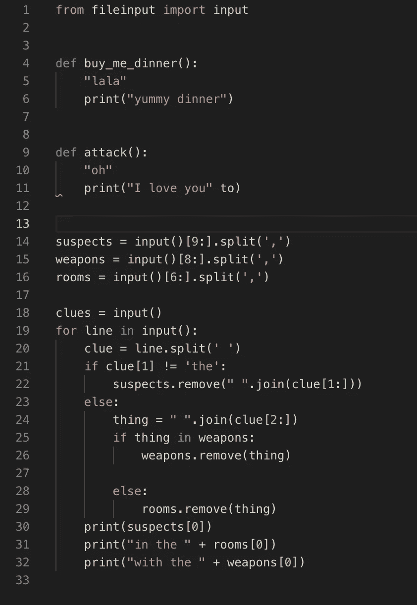

# 来吧，棉绒一点:用棉绒清理你的代码

> 原文：<https://towardsdatascience.com/come-on-lint-a-little-cleaning-up-your-code-with-linters-5d16b1bf19bd?source=collection_archive---------32----------------------->

你知道他们怎么说的，“内在才是最重要的。”虽然这可能是真的，但你仍然必须找到一种方式来表达里面的内容，以便人们能够理解它。您可能拥有您所编写过的功能最强的代码。这可能是优雅的，彻底的，万无一失的。但看起来还是这样:

```
def buy_me_dinner():
    "lala"
    print("yummy dinner")
def attack(): 
    "oh"
    print("I love you" to)from fileinput import input

     suspects = input()[9:].split(',')
 weapons = input()[8:].split(',')
        rooms = input()[6:].split(',')clues = input()   
 for line in input():  
     clue = line.split(' ')
      if clue[1] != 'the':  
          suspects.remove(" ".join(clue[1:]))  

    else:  
        thing = " ".join(clue[2:])   
           if thing in weapons:
               weapons.remove(thing)  

        else:  
            rooms.remove(thing)  
     print(suspects[0])  
       print("in the " + rooms[0])  
     print("with the " + weapons[0])
```

这就是棉绒派上用场的地方。linter 是一种分析代码以标记风格或编程错误的工具。我今天使用的 linter 是 [pycodestyle](https://pypi.org/project/pycodestyle/) ，它基于 Python 的 Pep-8 风格指南。Linter 会给你一个发现错误的列表，这样你就可以一个一个的修复它们，并且希望在将来学习如何编写更好的代码来遵循你选择的风格指南。还有其他像[布莱克](https://github.com/psf/black)这样的 linters，它会自动重新格式化你的代码，但是你不会通过这种方式学到任何东西，所以当开始使用 linters 时，最好使用一些冗长的东西。

让我们看看当我们用 pycodestyle lint 上面的代码时会发生什么。安装完成后，只需在终端上输入

```
pycodestyle <name of file to lint>
```

你会得到这样的回报:

```
messy.py:4:1: E302 expected 2 blank lines, found 0
messy.py:4:14: W291 trailing whitespace
messy.py:13:1: E303 too many blank lines (6)
messy.py:13:1: E402 module level import not at top of file
messy.py:14:1: W293 blank line contains whitespace
messy.py:15:6: E111 indentation is not a multiple of four
messy.py:15:6: E113 unexpected indentation
messy.py:16:2: E901 IndentationError: unindent does not match any outer indentation level
```

所以第 4 行的第一个字符在空行的数量上有问题，然后第 14 个字符后面有尾随空格，依此类推。在我们采纳了它的建议后，代码看起来是什么样的？有趣的是，有时修复一个错误会暴露另一个错误。但最终我们会得到这样的结果:



只要看看它，你就能知道 Pep-8 是如何格式化代码的。在导入库之后应该有 2 个空格，在声明一个函数之后应该有 2 个空格，并且在文件的末尾应该有一个新行。这些棉绒并不完美，有时你会发现他们没有发现的风格错误。此外，pycodestyle 不会发现功能错误。但是我可以用 [mypy](https://mypy.readthedocs.io/en/latest/) 检查这段代码中的某些类型的错误。mypy 的用法也一样。

```
mypy <name of file to check>
```

它会检查错误。对于上面的代码，它返回

```
messy.py:12: error: invalid syntax
```

它告诉我 print 语句中第 11 行的语法错误。使用像这样的简单工具可以使您的代码看起来有很大的不同，并减少调试时的挫败感。我听说过一些经理甚至不看没有经过测试的代码，所以养成这个习惯是个好习惯，除此之外，这也是了解你的代码应该是什么样子，以及你最常犯错误的地方的好方法。

快乐的编码冒险！