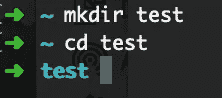
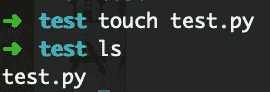
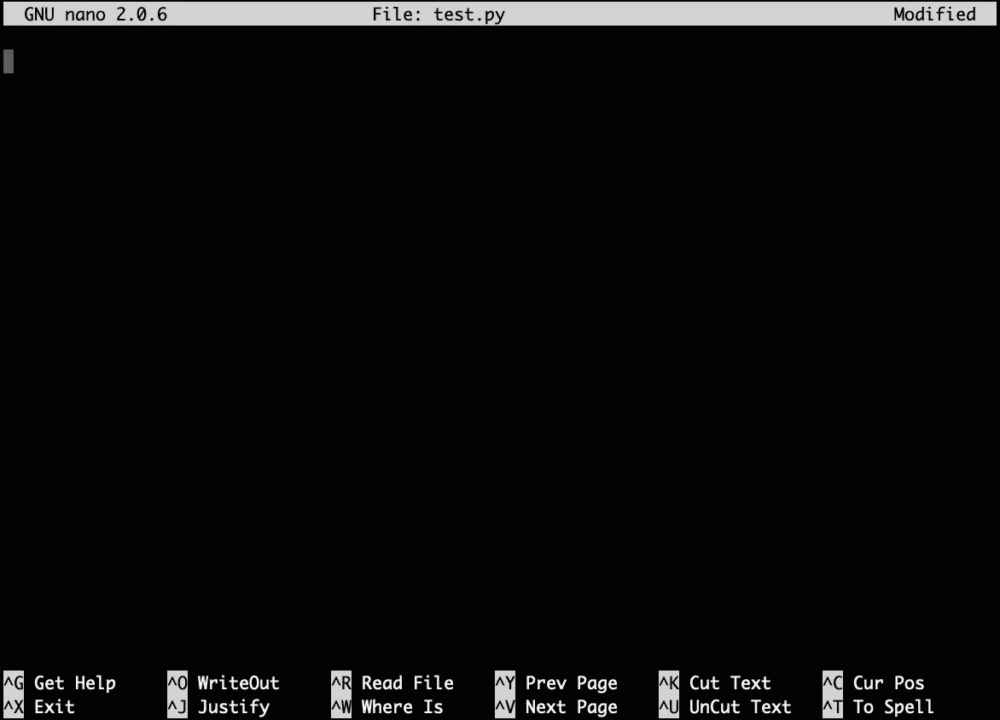
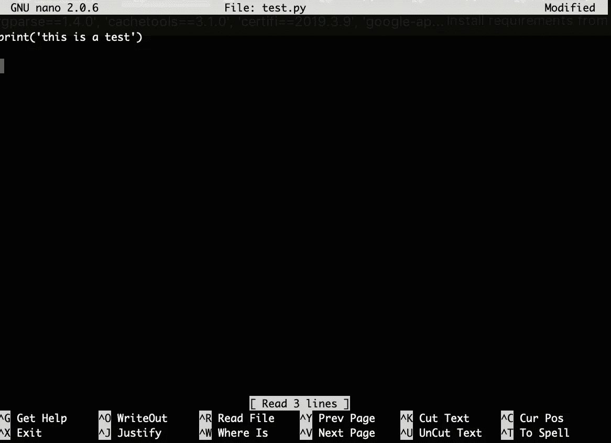
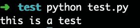

# 每个数据科学家都应该知道的命令行基础知识

> 原文：<https://towardsdatascience.com/command-line-basics-every-data-scientist-should-know-72f9b4bcd08e?source=collection_archive---------18----------------------->

## 使用命令行完成简单任务的指南

Photo by [Almos Bechtold](https://unsplash.com/@almosbech?utm_source=unsplash&utm_medium=referral&utm_content=creditCopyText) on [Unsplash](https://unsplash.com/search/photos/magic?utm_source=unsplash&utm_medium=referral&utm_content=creditCopyText)

如果您是一名数据科学家或正在学习数据科学，并且希望超越使用 jupyter 笔记本来编写生产就绪的代码，那么您可能需要使用命令行来完成一些任务。我发现生产数据科学工具和过程的文档通常假设您已经知道这些基础知识。然而，如果你没有计算机科学背景，那么你可能不知道如何从终端完成一些简单的任务。

我想写这篇简短的指南，介绍使用命令行执行简单任务的绝对基础知识。了解这些基础知识无疑会使您的工作流程更加高效，并且在使用生产系统时会有所帮助。

## 导航文件和目录

当你打开终端时，这通常是你会看到的。

`~`符号是你的主目录的简写，所以这意味着你当前在这个目录中。如果你输入命令`pwd`，它将显示你当前的工作目录，在我们的例子中看起来像这个`/Users/myname`。

如果你想创建一个新目录，你可以输入下面的`mkdir test` 这将创建一个名为 test 的新目录。你现在可以使用`cd`命令导航到这个目录。

您也可以通过键入`..`来导航目录，这将带您返回一个目录。所以在我们的例子中，我们将返回到主目录。

## 使用文件和目录

接下来，让我们在测试目录中创建新的 python 文件。要创建一个文件，你可以输入这个命令`touch test.py`。这将创建一个空白的 python 文件。`ls`命令将一个目录的内容打印到终端，因此我们可以用它来检查我们的文件是否已经创建。

我们将使用名为 [nano](https://www.nano-editor.org/dist/v2.2/nano.html) 的程序编辑该文件。要打开文件，你只需输入`nano test.py`，一个新的标签将会打开，如下所示。

对于这个例子，我们将只做一个小的改变，所以我们将输入`print('this is a test')`。要保存文件，您可以使用快捷键`Ctrl+O`并退出程序`Ctrl+X`。

现在我们已经编辑了文件，我们可以使用命令`python test.py`运行它。执行简单的 python 代码，并在终端上显示“这是一次测试”。

## 移动和删除

下面我们快速新建一个目录`mkdir new`来探究一下如何移动文件。有三种主要的方法你可以做到这一点。

正斜杠()前的【T1。/new)是父目录(test)的简写。

1.  制作一个副本并移动副本以将原始文件保留在当前位置`cp test.py ./new`
2.  移动文件而不复制`mv test.py ./new`
3.  复制文件，并在新位置`cp test.py ./new/test_new.py`重命名文件

最后，要删除一个文件，我们可以使用`rm test.py`。要删除一个空目录，您可以使用`rmdir new`。删除包含一些文件的目录`rm -rf new`。

本文涵盖了数据科学家可能需要从命令行完成的一些最基本的任务。如果你想探索一些更高级的命令行工具，我在这里写了另一个指南。

感谢阅读！