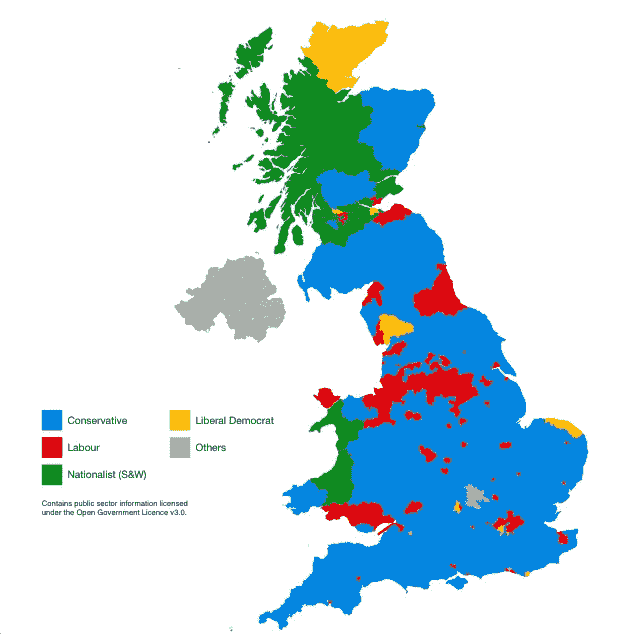
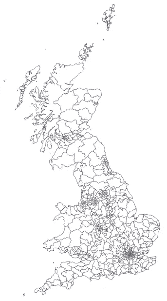
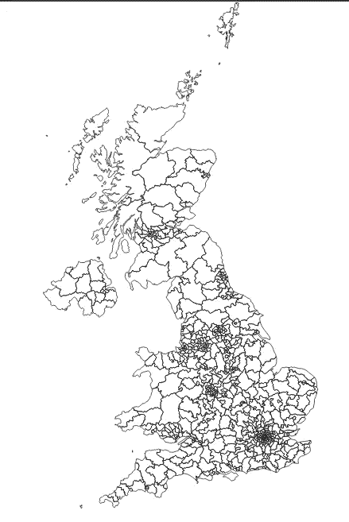
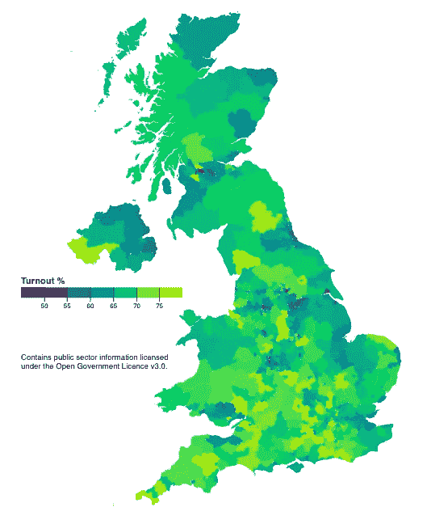
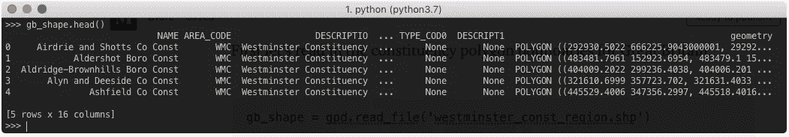
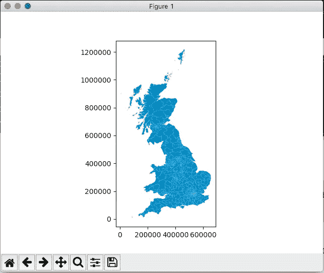
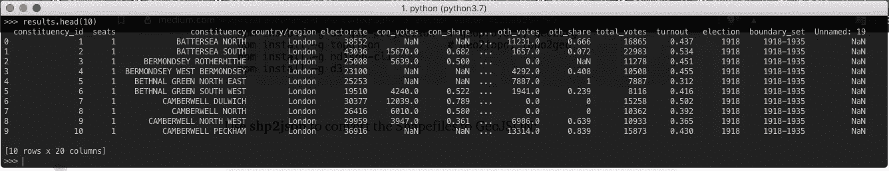
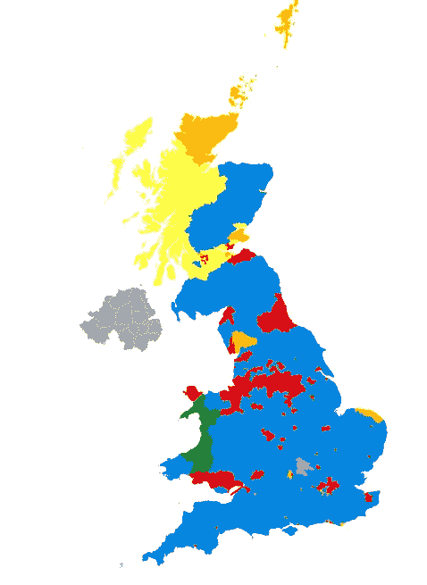

# 英国大选的命令行制图

> 原文：<https://towardsdatascience.com/command-line-cartography-uk-election-edition-4c2ba6054799?source=collection_archive---------32----------------------->

## 为选举之夜制作英国选区地图。

本教程改编自 *@mbostock 的* [*命令行制图教程*](https://medium.com/@mbostock/command-line-cartography-part-1-897aa8f8ca2c) 的步骤，展示如何使用免费开源 Javascript 工具轻松制作英国选举结果专题地图。然后，我还使用 Python/Pandas/GeoPandas 堆栈重复了数据管理部分，以比较每种方法的简便性。

这是我们将要做的观想:



UK General Election 2017 results: Winners by constituency.

这张专题地图通过根据获得最多选票的政党给每个议会选区着色，传达了上次英国选举的结果。在此过程中，我们还将按选区显示投票率。

## 获取边界几何图形

创建地图的第一步是获得一些代表英国选区边界的多边形。法令调查每年发布两次[边界线](https://www.ordnancesurvey.co.uk/business-government/products/boundaryline)产品。我在 mySociety.org 找到了一个更方便的副本——可以用命令行获取

```
curl --progress-bar http://parlvid.mysociety.org/os/bdline_gb-2019-10.zip -O bdline_gb-2019-10.zip
```

归档包含许多不同的管理边界，并且相当大(因此我添加了`--progress-bar`选项)。我们只需要为这个图表提取威斯敏斯特选区边界文件。

```
unzip -o bdline_gb-2019-10.zip Data/GB/westminster_const_region.prj Data/GB/westminster_const_region.shp Data/GB/westminster_const_region.dbf Data/GB/westminster_const_region.shxmv Data/GB/westminster_const_region.* .
```

正如@mbostock 所建议的，访问[mapshaper.org](http://mapshaper.org/)并将`westminster_const_region.shp`拖到你的浏览器中是预览我们提取的内容的好方法:



`westminster_const_region.shp on` [mapshaper.org](http://mapshaper.org/)

看起来不错，但是北爱尔兰选区不见了。原来这些可以从北爱尔兰测绘局单独得到:

```
wget http://osni-spatial-ni.opendata.arcgis.com/datasets/563dc2ec3d9943428e3fe68966d40deb_3.zipunzip [563dc2ec3d9943428e3fe68966d40deb_3.zip](http://parlvid.mysociety.org/os/osni-dec-2015.tar.gz)
```

## **进行设置**

我们将使用一系列 Javascript 命令行工具，Mike Bostock 在他的教程中有更详细的描述。如果您还没有安装它们，可以使用以下命令进行安装[*您需要安装 node 和 npm，以便下一步工作*]:

```
npm install -g shapefile          # gives us shp2json
npm install -g d3-geo-projection  # geoproject, geo2svg
npm install -g topojson           # geo2topo, topo2geo
npm install -g ndjson-cli
npm install -g d3
```

使用 **shp2json** 将 Shapefiles 转换为 GeoJSON:

```
shp2json westminster_const_region.shp -o gb.json
```

英国(GB)边界文件数据已经被投影到[英国国家网格](https://epsg.io/27700) (EPSG:27700)上。然而，北爱尔兰(NI)边界的几何数据在 [EPSG:4326](https://epsg.io/4326) (WSG 84)中定义。我试图找到一种方法来使用`d3-geo-projection`转换的镍几何 EPSG:27700，但我不得不承认，这超出了我。相反，我回过头来使用`ogr2ogr`来转换 NI shapefile。我在 MacOS 上，所以可以使用 [brew](https://brew.sh/) 安装`ogr2ogr`:

```
brew install gdal
```

然后我将 Shapefile 从 EPSG 4326 重新投影到 EPSG 27700，如下所示:

```
ogr2ogr -f "ESRI Shapefile" ni.shp OSNI_Open_Data_Largescale_Boundaries__Parliamentary_Constituencies_2008.shp -t_srs EPSG:27700 -s_srs EPSG:4326
```

然后将此 Shapefile 转换为 GeoJSON，就像我们之前处理 GB 边界一样:

```
shp2json ni.shp -o ni.json
```

## **合并 GB 和 NI 几何图形**

我们已经将二进制 shapefiles 转换为更易于人类阅读的 GeoJSON。但是我们还有两份独立的文件。将所有边界放在一个文件中会方便得多。

在他的教程的第 2 部分，Mike 介绍了`ndjson-cli`，这是他创建和操作 ndjson 的工具。我想我们可以使用这个工具将 GeoJSON 文件转换成换行符分隔的 JSON，然后简单地将它们`cat`在一起。我还需要取出选区标识符，并使用`ndjson-map`使其在每个文件中通用:

```
ndjson-split ‘d.features’ < gb.json \
| ndjson-map '{id: d.properties.CODE, properties:d.properties, type:d.type, geometry:d.geometry}' > gb_id.ndjsonndjson-split 'd.features' < ni.json \
| ndjson-map '{id: d.properties.PC_ID, properties:d.properties, type:d.type, geometry:d.geometry}' > ni_id.ndjsoncat gb_id.ndjson ni_id.ndjson > uk.ndjson
```

我试着从这一点开始用`ndjson`将几何图形导入`geoprojection`，但这并不成功。我发现在继续投影之前，有必要使用`ndjson-reduce`命令将连接的边界转换回单个 JSON 对象:

```
ndjson-reduce 'p.features.push(d), p' '{type: "FeatureCollection", features: []}' < uk.ndjson > uk.json
```

很好，我们在一个 JSON 文件中包含了所有的边界。但是，这个文件大约有 120M。很明显，这些几何图形的定义比我们基于网络的可视化所需要的更加详细。为了减小文件大小，我们可以为图表定义一个边界框(以像素为单位),然后在不明显丢失细节的情况下，适当简化该框的多边形。

使用 **geoproject** 工具和`d3.geoIdentity()`的`.fitsize()`方法将点映射到我们选择的边界框中[ *我还利用这个机会垂直翻转多边形定义，因为我们最终将渲染为 svg* :

```
geoproject 'd3.geoIdentity().reflectY(true).fitSize([960, 960], d)'\
< uk.json > uk-960.json
```

现在，我们可以通过切换到 TopoJSON，然后*简化*、*量化、*和*压缩*多边形定义来减小 GeoJSON 文件的大小。请阅读 [Mike Bostock](https://medium.com/u/c918c478bb49?source=post_page-----4c2ba6054799--------------------------------) 的教程的[第 3 部分](https://medium.com/@mbostock/command-line-cartography-part-3-1158e4c55a1e)以获得这些步骤的更详细的解释，我在下面复制了这些步骤。

我使用 [**geo2topo**](https://github.com/topojson/topojson-server/blob/master/README.md#geo2topo) 转换为 TopoJSON，然后使用[**topo simplify**](https://github.com/topojson/topojson-simplify/blob/master/README.md#toposimplify)**和 **topoquantize** 工具将文件大小从 120M 减少到 385K:**

```
geo2topo const=uk-960.json \
| toposimplify -p 1 -f \
| topoquantize 1e5 \
> uk-simpl-topo.json
```

**现在让我们快速查看一下我们的输出。要在命令行生成 svg，我们可以使用`geo2svg`工具。首先，我们使用`topo2geo`转换回 GeoJSON:**

```
topo2geo const=- < uk-simpl-topo.json \
| geo2svg -p 1 -w 960 -h 960 > uk.svg
```

**svg 文件可以拖到 web 浏览器中，让我们快速浏览。**

****

**The United Kingdom of Great Britain & Northern Ireland in SVG via TopoJSON!**

## **添加选举结果**

**所以我们准备了我们的选区边界。现在我们想根据一些选举结果给这些多边形着色。**

**我在英国议会网站上找到了一个包含 1918 年选举结果的 csv:**

```
wget [http://researchbriefings.files.parliament.uk/documents/CBP-8647/1918-2017election_results.csv](http://researchbriefings.files.parliament.uk/documents/CBP-8647/1918-2017election_results.csv) -O [1918_2017election_results.csv](http://researchbriefings.files.parliament.uk/documents/CBP-8647/1918-2017election_results.csv)
```

**我使用命令行工具`gawk`来过滤这个 csv，以获得 2017 年的结果，并用零填充空值。棘手的部分是一些选区名称包含逗号，需要忽略。**

```
gawk -F ',' -v OFS=',' '{for (i=1;i<=NF;i++) { if ($i=="") $i="0" }; print}' < 1918_2017election_results.csv | gawk 'NR==1 {print}; { if ($18 == 2017) print}' FPAT='([^,]+)|("[^"]+")' > 2017_results.csv
```

**Mike 展示了如何通过首先转换成换行符分隔的 json 来将这样的数据与几何连接起来。以他为例，我使用`csv2json`和他的`ndjson-cli`工具首先转换选举结果:**

```
csv2json < 2017_results.csv | tr -d '\n' | ndjson-split > 2017_results.ndjson
```

**类似地，我们将边界几何准备为 ndjson:**

```
topo2geo const=- < uk-simpl-topo.json | \
ndjson-split 'd.features' > uk-simpl.ndjson
```

**并将两者结合在一起:**

```
ndjson-join 'd.id' 'd.constituency_id' uk-simpl.ndjson 2017_results.ndjson \
| ndjson-map 'd[0].results = d[1], d[0]' \
> uk_2017_results.ndjson
```

**Mike 的示例是根据该区域的人口密度值给地图的多边形着色。我在选举结果中拥有的最相似的量——即连续量——是投票率。因此，为了能够效仿他的例子，我决定在继续寻找获胜者之前，利用这些投票率信息制作一个氯普勒斯图。**

**以下代码使用`ndjson-map`为 GeoJson 中的每个要素(即选区)分配一个名为`fill`的属性。当我们使用`geo2svg`来生成我们的图像时，它会选择这个属性，并用它来给多边形着色。`fill`的值需要是一个字符串，包含我们希望每个多边形颜色的十六进制代码(如`#0087dc`)。**

```
ndjson-map -r d3 'z = d3.scaleSequential(d3.interpolateViridis).domain([0.5, .8]), d.properties.fill = z(d.results["turnout "]), d' < uk_2017_results.ndjson \
| geo2svg -n --stroke none -p 1 -w 960 -h 960 > uk_2017_turnout.svg
```

**可能值得尝试将这个一行程序分解一点，以了解发生了什么。我们使用 d3 将投票率信息(一个介于 0 和 1 之间的数字，代表在该选区实际投票的选民比例)转换成一个十六进制代码。`ndjson-map`工具让我们遍历每个选区并应用某种操作。我们传递给`ndjson-map`的参数是三行 Javascript 代码。**

**第二行:**

```
d.properties.fill = z(d.results["turnout "])
```

**为每个特性创建一个名为`fill`的属性，其值是函数`z`的输出。该函数`z`获取投票率的值——我们在之前的连接中已经将其附加到该特征上——并返回一个代表颜色的 hexcode。这个`z`函数在 Javascript 的第一行中定义:**

**`z = d3.scaleSequential(d3.interpolateViridis).domain([0.5,0.8])`**

**它使用 [d3 的配色方案](https://github.com/d3/d3-scale-chromatic)将代表投票率的数字从绿色配色方案转换为适当的颜色。我检查了选举数据中的投票率值，以便设置`domain`的界限，从而尽可能多地使用色标。**

**我们可以在浏览器中打开那个`uk_2017_turnour.svg`文件:**

****

**A green and pleasant land: turnout in the 2017 UK General Election**

**图例在[可观察笔记本](https://observablehq.com/@wooduk/creating-legends-for-charts)中单独创建，并复制粘贴到“svg”文件中。**

## **将方法应用于情节赢家**

**实际上，我在本教程中的目标是创建一个显示每个选区获胜者的地图。为此，我们重做最后一步，使用 ndjson-map 查找拥有最高投票份额的政党，然后将几何体的`fill`属性设置为代表该政党的颜色。**

**我传递给`ndjson-map`的 Javascript 在这里感觉有点笨拙，因为我定义了一个对象来保存对每一方的颜色的查找。**

```
ndjson-map -r d3 's={"con_share":"#0087dc", "lib_share":"#FDBB30", "lab_share":"#d50000", "natSW_share":"#3F8428", "pld":"#3F8428", "oth_share":"#aaaaaa"}, u = ({ con_share, lab_share, lib_share, oth_share, natSW_share }) => ({ con_share, lab_share, lib_share, oth_share, natSW_share }),
d.properties.fill = s[Object.keys(u(d.results)).reduce((a, b) => d.results[a] > d.results[b] ? a : b)], d' < uk_2017_results.ndjson \
| geo2svg -n --stroke none -p 1 -w 960 -h 960 > uk_2017_winner.svg
```

**再一次，将 javascript 分解一点，第一行:**

```
s={"con_share":"#0087dc", "lib_share":"#FDBB30", "lab_share":"#d50000", "natSW_share":"#3F8428", "pld":"#3F8428", "oth_share":"#aaaaaa"}
```

**简单地定义了从当事人到颜色的查找。第二行:**

```
u = ({ con_share, lab_share, lib_share, oth_share, natSW_share }) => ({ con_share, lab_share, lib_share, oth_share, natSW_share })
```

**是一个[析构赋值](https://developer.mozilla.org/en-US/docs/Web/JavaScript/Reference/Operators/Destructuring_assignment)，我们用它从选举结果对象中提取 voteshare 数字。然后是最后一行:**

```
d.properties.fill = s[Object.keys(u(d.results)).reduce((a, b) => d.results[a] > d.results[b] ? a : b)]
```

**找到投票份额最大的一方的密钥，并在查找对象`s`中使用该密钥将所需颜色写入`fill`属性。**

**看看结果:**

****

**2017 General Election UK results constituencies coloured by winner.**

**我们有结果了。您可以就此打住，除非您想看看如何使用 Python 堆栈实现同样的功能。**

# **第 2 部分:Python 中的数据管理**

**在本教程的第一部分，我们在命令行上使用 Javascript 工具制作了一个英国选举地图，下面是迈克·博斯托克的命令行制图教程。对于数据管理，我通常倾向于 Python 环境。所以在第二部分中，我回过头来看看如何在 Python REPL 中使用熊猫和 GeoPandas 来实现同样的效果。**

**为了更接近“命令行”风格，我将使用 Python REPL 来做这件事，当然，Jupyter 笔记本/实验室会议也很好。**

```
python
```

**我们将使用 [GeoPandas](http://geopandas.org/) 库以及 Pandas 进行一些常规的数据操作:**

```
import pandas as pd
import geopandas as gpd
```

**首先，让我们将英国的选区多边形边界读入地理数据框架:**

```
gb_shape = gpd.read_file('westminster_const_region.shp')
```

****

**A quick look at the imported shapefile as a DataFrame.**

**如果您想更直观地检查几何图形，我们可以导入 matplotlib，然后只需在地理数据框架上调用`.plot()`:**

```
import matplotlib.pyplot as plt
gb_shape.plot(); plt.show()
```

****

**A quick visual check on the content of the GB shapefile.**

**我注意到在后来的图中设得兰群岛从地图上消失了，我认为这个数据中的`CODE`字段有错误:`S1400005`应该是`S14000051`。所以现在让我们快速改变这种情况。**

```
gb_shape['CODE']=gb_shape.CODE.apply(lambda s: 'S14000051' if s == 'S1400005' else s)
```

**现在加载北爱尔兰的选区边界:**

```
ni_shape = gpd.read_file(‘OSNI_Open_Data_Largescale_Boundaries__Parliamentary_Constituencies_2008.shp’)
```

**我们希望将两组边界连接成一个数据帧。为此，我首先需要调整列名，使它们匹配:**

```
ni_shape.rename(columns={'PC_NAME':'NAME','PC_ID':'CODE'},inplace=True)
```

**第二，正如我们在前面的教程中发现的，GB 和 NI 边界几何在不同的坐标系中提供。英国(GB)边界文件数据已经被投影到[英国国家网格](https://epsg.io/27700) (EPSG:27700)。然而，北爱尔兰(NI)边界的几何数据在 [EPSG:4326](https://epsg.io/4326) 中定义。我们可以使用 GeoPandas 来完成这种转换，而不是使用`ogr2ogr`:**

```
ni_shape.to_crs({‘init’:’epsg:27700'},inplace=True)
```

**现在我们应该准备好使用`pd.concat`连接两组几何图形，这将产生另一个`GeoDataFrame`。**

```
uk_boundaries = pd.concat([gb_shape[['NAME','CODE','geometry']],ni_shape[['NAME','CODE','geometry']]], sort=False)
```

# **将选举结果与几何图形合并**

**现在把我们的选举结果读入数据框:**

```
results=pd.read_csv(‘[1918_2017election_results.csv](http://researchbriefings.files.parliament.uk/documents/CBP-8647/1918-2017election_results.csv)’)
```

****

**First 10 rows of the election results csv file.**

**我想过滤此数据框架，以仅包含 2017 年选举的结果。[ *我还首先重命名了一些列，以纠正尾随空白，并着眼于以后与几何数据合并]* 。**

```
# rename a few columns
results.rename(columns={
‘turnout ‘:’turnout’,
’constituency_id’:’CODE’,
},inplace=True)# keep only the 2017 election results
results=results[results.election=='2017']# keep only the columns we need
results=results[[‘CODE’,’constituency’,’country/region’,’con_share’,’lib_share’,’lab_share’,’natSW_share’,’oth_share’,’turnout’]]uk_results = uk_boundaries.merge(results, on='CODE')
```

**`uk_results`数据框包含每个选区的几何图形和选举结果。**

**在命令行制图教程中，我们简化了几何体，使生成的文件更小。可以使用 GeoPandas 来完成这个[简化](https://shapely.readthedocs.io/en/stable/manual.html#object.simplify)(通过 Shapely):**

```
uk_results[‘geometry’] = uk_results.geometry.simplify(tolerance=500)
```

# **准备演示**

**虽然当然可以使用 Python 堆栈生成 svg，但我的第一个目标是从合并的数据中创建 GeoJSON 输出。这将允许我退回到 javascript 的命令行制图世界，或者在最终的演示文稿中制作工作。**

**为了方便起见——我仍然觉得 Javascript 中的数据管理不够直观——我现在使用 Pandas 将几何图形的填充颜色合并到数据帧中。一方面，我对这种将表示和底层数据混为一谈的做法感到有点不舒服。另一方面，这并不妨碍我或其他人忽略这种嵌入的填充颜色，并从将保留在 GeoJSON 中的底层数据中导出新的表示。**

**首先我做了一个定义派对颜色的小字典，摘自[这里](http://www.blog.richardallen.co.uk/uk-political-party-web-colours/):**

```
party_colours={
   “con”:”#0087dc”, 
   “lib”:”#FDBB30", 
   “lab”:”#d50000", 
   "snp":"#FFF95D", 
   “pld”:”#3F8428"
}
```

**然后我们算出每个选区的获胜者。和以前一样，获胜者只是拥有最高的投票份额。**

```
uk_results['winner']= uk_results[['con_share','lab_share','lib_share','natSW_share','oth_share']].fillna(0.).astype(float).idxmax(axis=1).apply(lambda s: s[:3])
```

**令人稍感不满的是，我获得的选举结果数据没有将苏格兰和威尔士的主要民族主义政党分开，而是将它们归为一类。但是，因为苏格兰民族党不在威尔士竞选候选人，而格子党在苏格兰竞选候选人，所以我们可以使用选区区域来确定每种情况下的特定民族党，从而分配适当的颜色。**

```
def sub_nat(winner, region):
   if winner=='nat':
      if region=='Wales':
         return 'pld'
      else:
         return 'snp'
   else:
      return winneruk_results['winner']=uk_results[['country/region','winner']].apply(lambda r: sub_nat(r[1],r[0]), axis=1)uk_results['winner_fill']=uk_results.winner.apply(lambda s: party_colours.get(s,”#aaaaaa”))
```

**这并没有解决北爱尔兰政党的色彩问题。我必须寻找一个更详细的选举结果数据集来提供这种分类。**

**现在我们可以写出这个数据帧:**

```
uk_results.to_file(‘gdp_uk_results.json’,driver=’GeoJSON’)
```

**此时，我们可以切换回命令行制图并生成一个 svg:**

```
geoproject 'd3.geoIdentity().reflectY(true).fitSize([960, 960], d)' < gdp_uk_results.json \
| ndjson-split 'd.features' \
| ndjson-map -r d3 'd.properties.fill = d.properties.winner_fill, d' \
| geo2svg -n --stroke none -p 1 -w 960 -h 960 > gdp_uk_winner.svg
```

****

**The rendered SVG**

**所以我们有它。我使用 Python 和 Pandas 进行数据操作的频率比使用命令行工具如`awk` Javascript 要高得多。因此，不可避免地，我发现通过本教程一起操作几何图形和选举结果比在第 1 部分中更容易和更直观。也许这只是我的熟悉偏见。**

**我仍然更喜欢可观察的笔记本和数据驱动的文档哲学，以便在网上展示结果。但是我对探索 Altair 的能力很感兴趣，特别是输出织女星的描述，这些描述很容易嵌入网页。也许在以后的文章中。**

**另一天，我们可以讨论在地理地图上显示这些数据的优点，而不是，比如说，在选区上放置相等面积的地图。**

**感谢 *@mbostock* 提供的所有工具和鼓舞人心的文章。**