# 通用分类模型评估指标。

> 原文：<https://towardsdatascience.com/common-classification-model-evaluation-metrics-2ba0a7a7436e?source=collection_archive---------7----------------------->

> *所有的模型都是错的，但有些是有用的，*乔治 E. P. Box。

# 引言。

分类模型有多准确？模型靠谱吗？

这两个问题很容易通过评估一个模型在受到看不见的观察时的表现来回答。这篇文章展示了评估模型的一些最佳方法。

你将从这篇文章中学到什么:

1.  Jaccard 索引。
2.  混淆矩阵
3.  F-1 分数
4.  原木损失

# 样本模型。

首先我将拟合一个简单的模型，并用它来说明这些方法在模型性能评估中的应用。该模型预测癌细胞是否是恶性的。

```
#quick model fit
import numpy as np
import warnings
import pandas
warnings.filterwarnings("ignore")#not recomended but i have included this for my own convenience.
from sklearn.datasets import load_breast_cancer
data = load_breast_cancer()
X = pandas.DataFrame(data = data.data,columns=data.feature_names)
y = data.target
#train test split
from sklearn import model_selection
np.random.seed(2) #to enable you replicate the same thing i am doing here.
X_train, X_test, y_train, y_test = model_selection.train_test_split(X,y,test_size=0.30)
# I will use logistic reg
from sklearn.linear_model import LogisticRegression
reg = LogisticRegression()
reg.fit(X_train,y_train)
preds = reg.predict(X_test)
predsprob = reg.predict_proba(X_test)
```

# Jaccard 索引

假设预测值为(y hat ),实际值为 y，Jaccard 指数可定义为:

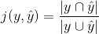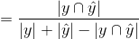

假设你有下面一组预测值和实际值。

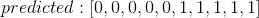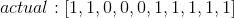

Jaccard 指数将为:

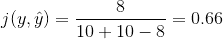

该指数背后的思想是这两个组的相似性越高，指数越高。

# 将此应用于上面的模型。

```
from sklearn.metrics import jaccard_similarity_score
j_index = jaccard_similarity_score(y_true=y_test,y_pred=preds)
round(j_index,2)0.94
```

# 混淆矩阵

混淆矩阵用于描述分类模型对一组真实值已知的测试数据的性能。


confusion matrix

从混淆矩阵中可以提取以下信息:

1.  **真阳性**。这表明一个模型*正确地*预测到*阳性*病例为*阳性*。疾病被诊断为存在，并且确实存在。
2.  **假阳性(FP)** :这表明一个模型*错误地将*阴性*病例预测为*阳性*。一种疾病被诊断为存在，但并不存在。(第一类错误)*
3.  **假阴性:(FN)** 这表明一个*模型错误地将*阳性*病例预测为*阴性*。一种疾病被诊断为不存在，但却存在。(第二类错误)*
4.  **真阴性(TN):** 这表明一个模型*正确地预测了*阴性*病例为*阳性*。一种疾病被诊断为不存在，并且确实不存在。*

# 将此应用于上面的模型。

```
from sklearn.metrics import confusion_matrix
print(confusion_matrix(y_test,preds,labels=[1,0]))
import seaborn as sns
import matplotlib.pyplot as plt
sns.heatmap(confusion_matrix(y_test,preds),annot=True,lw =2,cbar=False)
plt.ylabel("True Values")
plt.xlabel("Predicted Values")
plt.title("CONFUSSION MATRIX VISUALIZATION")
plt.show()
```

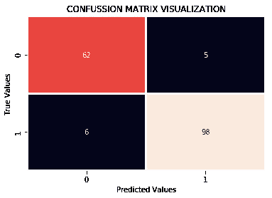

在这种情况下，对于乳腺癌数据，模型正确预测 62 例为良性，98 例为恶性。相比之下，它总共错误预测了 11 个案例。

# f1-得分。

这来自于混淆矩阵。基于上面的混淆矩阵，我们可以计算精确度和召回分数。

精度分数:这是精度的度量，前提是已经预测了类别标签。简单地说，它回答了下面的问题，在所有的类中，有多少是正确预测的？这个问题的答案应该是越高越好。

它可以计算如下:

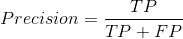

回忆分数(敏感度):这是真正的阳性率，如果它预测阳性，那么它发生的频率是多少？

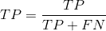

F1 分数是根据每个类的精确度和召回率计算的。它是精确度和召回分数的加权平均值。F1 分数在 1 时达到完美值，在 0 时最差。这是一个很好的方法来表明一个分类器有很好的召回率和精确度值。

我们可以用这个公式来计算:

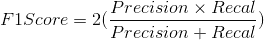

# 应用于上面的模型。

```
from sklearn.metrics import f1_score
f1_score(y_test,preds)0.9468599033816425
```

可以计算所有类别的 F1 分数，因此可以使用实际分数的平均值，如下面的分类报告所示。

```
from sklearn.metrics import classification_report
print(classification_report(y_test,preds))precision    recall  f1-score   support 0       0.91      0.93      0.92        67
           1       0.95      0.94      0.95       104 micro avg       0.94      0.94      0.94       171
   macro avg       0.93      0.93      0.93       171
weighted avg       0.94      0.94      0.94       171
```

# 日志损失。

在分类器的结果是类别概率而不是类别标签的情况下，我们可以使用对数损失，就像逻辑回归模型的情况一样。

对数损失衡量模型的性能，其中预测结果是介于 0 和 1 之间的概率值。

在现实生活中，当预测 0.101 的概率时，真实标签应该是 1，这将导致高对数损失。可以使用对数损失公式计算数据集中每一行的对数损失。

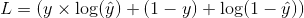

该方程简单地测量了每个预测概率与实际标签的距离。所有行的日志损失的平均值给出了日志损失的理想值。

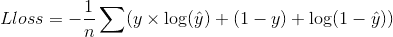

好的和模型应该具有较小的对数损失值。

# 在上述模型中应用。

```
from sklearn.metrics import log_loss
log_loss(y_test,predsprob)0.13710589473837184
```

这里我们有一个 0.14 的对数损失，相当不错！

# 结论。

1.  基于所应用的模型，应该很好地理解评估指标的选择。
2.  为了从评估指标中获得优异的结果，建议对模型进行特征工程和参数调整。

感谢阅读，欢迎任何评论和/或补充。

干杯！