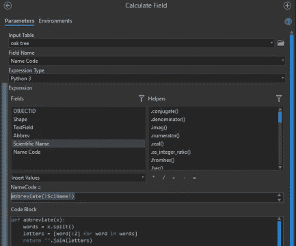

# 在 ArcGIS 中使用 Python 进行常见字段计算

> 原文：<https://towardsdatascience.com/common-field-calculations-using-python-in-arcgis-db4b8ccff8af?source=collection_archive---------13----------------------->



Field Calculator in ArcGIS Pro

如果您记得如何使用 ArcGIS field calculator，它可以节省人员的时间，并允许快速清理数据。我不知道你怎么想，但对我来说，字段计算器的布局、公式字段和代码块区域的分离以及与标准 Python 格式的微小变化足以让我直接进入谷歌搜索栏，如果我有一段时间没有使用它的话。这就是为什么我开始为哪怕是最简单的任务做笔记。我经常回去找他们，这样可以节省我的时间和减少我的挫败感。

也许有一天我会记住这些，但现在这是可行的。

下面你会发现我经常使用的一些简单的现场计算列表作为起点。当我想到它们时，我会补充这些。也许你会发现一个有用的。

**将文本改为标题大小写。**——如此简单且频繁使用。

```
!note1!.title()
```

**用一个字符替换另一个字符。** —这可能是我使用字段计算器的最常见原因。

```
!noteField!.replace("-","_")
```

**将字段连接在一起。** —对地址进行地理编码时非常常见。

```
!Address! +" "+ !Street! +", "+ !City! +", "+ !State! +" "+ !Zip!
```

**跨多个领域的简单数学计算。** —您可以使用字段计算器从字段列表中提取汇总统计数据。

**将命令连锁在一起。**在这个例子中，我从一个名为 *TextField* 的字段开始，其中有一些杂乱的数据。假设我把橡树列为*橡树、橡树、橡树和橡树*，但是我想把它们都标准化，简单地读作*橡树*。几个简单的命令可以连接在一起实现这一点。

```
!TextField!.lower().replace("tree", " ").replace("oak", "Oak Tree")
```

**使用代码块。**ArcGIS 中计算字段工具的代码块部分允许使用任何 Python 函数，您甚至可以导入模块并定义自己的函数。一旦你用过几次，这种格式就没那么复杂了。可以把代码块区域看作是定义函数的地方，以后可以从表达式框中调用这些函数。在下面的例子中，我想通过将属的前两个字母与种的前两个字母连接起来，为每个树种创建一个缩写代码。我可以像这样快速完成:

**使用数学进行单位转换。要将平方英尺转换为英亩并四舍五入到两位小数，您可以这样做:**

您可以用下面的一行代码实现相同的结果，但我个人更喜欢使用代码块，以使事情更具可重复性，并允许将来使用更复杂的函数:

`round((!Shape_Area! / 43560),2)`

**另一种换算单位的方法。**-正如这里的[所详述的](https://pro.arcgis.com/en/pro-app/tool-reference/data-management/calculate-field-examples.htm#ESRI_SECTION1_2C1A27476FD54D949723FA8DFC9306B2)，可以使用 ArcGIS Pro 内置的几何单位转换，而不是自己进行计算。查看上面的 esri 链接，了解所有内置的测量单位转换。请注意，与其他字段相比，引用几何列时字段名称的格式略有不同:

`!shape.area@hectares!`

`!shape.length@KILOMETERS!`

**使用逻辑** —这里有一个过于简化的例子，使用逻辑根据管径将公用管道分类为*主管线*或*支管*。

*最初发布于*[***geopy . dev***](https://geopy.dev/common-arcgis-field-calculations/)