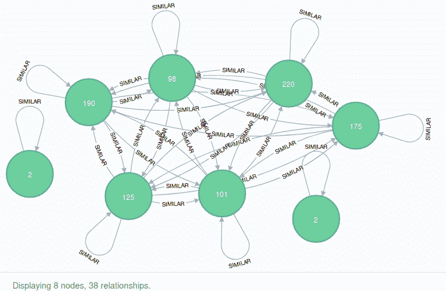
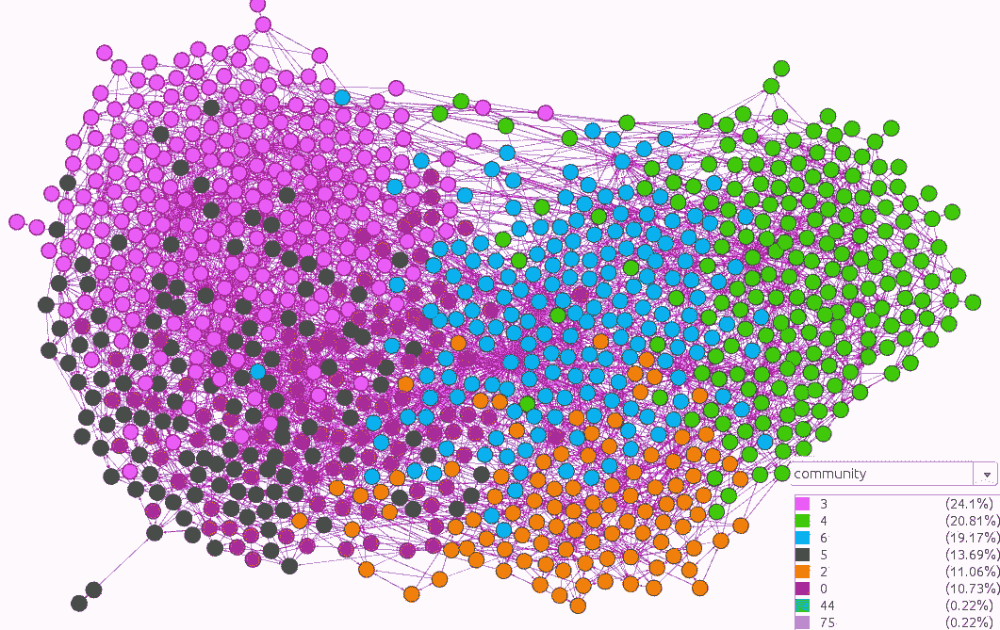
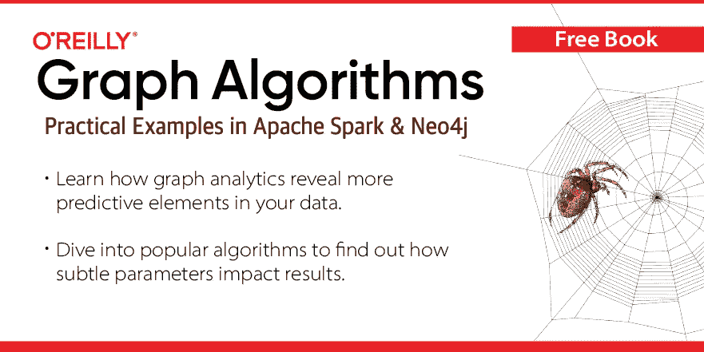

# 基于 Pearson 相关系数和 Neo4j 的调查响应社区检测

> 原文：<https://towardsdatascience.com/community-detection-of-survey-responses-based-on-pearson-correlation-coefficient-with-neo4j-a522e2264c1c?source=collection_archive---------9----------------------->

就在几天前，新版本的 [Neo4j 图形算法插件](https://github.com/neo4j-contrib/neo4j-graph-algorithms)发布了。新版本带来了新的算法，皮尔逊相关算法就是其中之一。

为了演示如何在 [Neo4j](https://neo4j.com/) 中使用皮尔逊相关算法，我们将使用由 [Miroslav Sabo](https://www.kaggle.com/miroslavsabo) 提供的来自[年轻人调查](https://www.kaggle.com/miroslavsabo/young-people-survey/home)ka ggle 数据集的数据。它包含了 1010 份填写好的调查结果，问题从音乐偏好、爱好兴趣到恐惧症。

在评分场景中使用 Pearson correlation 的好处在于，它在将每个分数与用户的平均分数进行比较时，考虑了投票者通常更倾向于给出更高或更低分数的情况。

# 导入

下载[数据集](https://www.kaggle.com/miroslavsabo/young-people-survey)并复制到`$Neo4j/import`文件夹。 **responses.csv** 文件中的每一行都代表一份填写了 150 个问题的调查。我们将它作为单个节点存储在 Neo4j 中。

```
LOAD CSV WITH HEADERS FROM "file:///responses.csv" as row
CREATE (p:Person)
SET p += row
```

# 预处理

大多数答案从一到五不等，其中五被定义为“完全同意”，一被定义为“完全不同意”。它们在 csv 文件中显示为字符串，我们必须首先将它们转换为整数。

```
MATCH (p:Person)
UNWIND keys(p) as key
WITH p,key where not key in ['Gender',
                'Left - right handed',
                'Lying','Alcohol',
                'Education','Smoking',
                'House - block of flats',
                'Village - town','Punctuality',
                'Internet usage']
CALL apoc.create.setProperty(p, key, toInteger(p[key])) YIELD node
RETURN distinct 'done'
```

# 类别属性

有些答案是绝对的。一个例子是酒精问题，可能的答案是“从不”、“社交饮酒者”和“喝很多”。

因为我们想把它们中的一些转换成向量，所以让我们检查它们所有可能的答案。

```
MATCH (p:Person)
UNWIND ['Gender',
        'Left - right handed',
        'Lying','Alcohol',
        'Education','Smoking',
        'House - block of flats',
        'Village - town','Punctuality',
        'Internet usage'] as property
RETURN property,collect(distinct(p[property])) as unique_values
```

结果

让我们对性别、网络和酒精答案进行矢量化。我们将在 1 到 5 之间进行缩放，以匹配整数答案范围。

## 性别编码

```
MATCH (p:Person)
WITH p, CASE p['Gender'] WHEN 'female' THEN 1
                         WHEN 'male' THEN 5
                         ELSE 3
                         END as gender
SET p.Gender_vec = gender
```

## 互联网编码

```
MATCH (p:Person)
WITH p, CASE p['Internet usage'] WHEN 'no time at all' THEN 1
                        WHEN 'less than an hour a day' THEN 2
                        WHEN 'few hours a day' THEN 4
                        WHEN 'most of the day' THEN 5 
                        END as internet
SET p.Internet_vec = internet
```

## 酒精编码

```
MATCH (p:Person)
WITH p, CASE p['Alcohol'] WHEN 'never' THEN 1
                          WHEN 'social drinker' THEN 3
                          WHEN 'drink a lot' THEN 5
                          ELSE 3 END as alcohol
SET p.Alcohol_vec = alcohol
```

# 降维

我们的数据集中有 150 个答案可以用作特征。这是对特征进行一些基本降维的好机会。

我看到了一篇由[普尔基特·夏尔马](https://www.analyticsvidhya.com/blog/author/pulkits/)写的关于[降维技术](https://www.analyticsvidhya.com/blog/2018/08/dimensionality-reduction-techniques-python/)的文章。它描述了 12 种降维技术，在本文中，我们将使用前两种，即**低方差滤波器**和**高相关性滤波器**。

# 低方差滤波器

> *考虑我们数据集中的一个变量，其中所有观察值都相同，比如说 1。如果我们使用这个变量，你认为它能改进我们将要建立的模型吗？答案是否定的，因为这个变量的方差为零。*

[*来源*](https://www.analyticsvidhya.com/blog/2018/08/dimensionality-reduction-techniques-python/)

我们将使用标准差度量，它就是方差的平方根。

```
MATCH (p:Person)
WITH p LIMIT 1
WITH filter(x in keys(p) where not x in ['Gender','Left - right handed','Lying','Alcohol','Education','Smoking','House - block of flats','Village - town','Punctuality','Internet usage']) as all_keys
UNWIND all_keys as key
MATCH (p:Person)
RETURN key,avg(p[key]) as average,stdev(p[key]) as std 
ORDER BY std ASC LIMIT 10
```

结果

我们可以观察到，每个人都喜欢听音乐，看电影，和朋友一起玩。

由于方差较低，我们将在进一步分析中排除以下问题:

*   “个性”
*   “音乐”
*   “梦”
*   “电影”
*   “与朋友同乐”
*   “喜剧”

# 高相关滤波器

> *两个变量之间的高度相关性意味着它们具有相似的趋势，并且可能携带相似的信息。这可能会大大降低某些模型的性能(例如，线性和逻辑回归模型)。*

[*来源*](https://www.analyticsvidhya.com/blog/2018/08/dimensionality-reduction-techniques-python/)

在这项任务中，我们将使用皮尔逊相关系数。Pearson 相关性针对不同的位置和特征比例进行调整，因此任何类型的线性缩放(归一化)都是不必要的。

找出性别特征的 10 大相关性。

```
MATCH (p:Person)
WITH p LIMIT 1
WITH filter(x in keys(p) where not x in ['Gender','Left - right handed','Lying','Alcohol','Education','Smoking','House - block of flats','Village - town','Punctuality','Internet usage','Personality','Music','Dreams','Movies','Fun with friends','Comedy']) as all_keys
MATCH (p1:Person)
UNWIND ['Gender_vec'] as key_1
UNWIND all_keys as key_2
WITH key_1,key_2, collect(coalesce(p1[key_1],0)) as vector_1,collect(coalesce(p1[key_2] ,0)) as vector_2
WHERE key_1 <> key_2
RETURN key_1,key_2, algo.similarity.pearson(vector_1, vector_2) as pearson
ORDER BY pearson DESC limit 10
```

结果

与性别最相关的特征是体重，这是有道理的。该列表还包括其他一些刻板的性别差异，如对汽车、行动和个人电脑的偏好。

现在让我们计算所有特征之间的皮尔逊相关。

```
MATCH (p:Person)
WITH p LIMIT 1
WITH filter(x in keys(p) where not x in ['Gender','Left - right handed','Lying','Alcohol','Education','Smoking','House - block of flats','Village - town','Punctuality','Internet usage','Personality','Music','Dreams','Movies','Fun with friends','Comedy']) as all_keys
MATCH (p1:Person)
UNWIND all_keys as key_1
UNWIND all_keys as key_2
WITH key_1,key_2,p1
WHERE key_1 > key_2
WITH key_1,key_2, collect(coalesce(p1[key_1],0)) as vector_1,collect(coalesce(p1[key_2],0)) as vector_2
RETURN key_1,key_2, algo.similarity.pearson(vector_1, vector_2) as pearson
ORDER BY pearson DESC limit 10
```

结果

结果显示没有什么令人惊讶的。我唯一感兴趣的是蛇和老鼠之间的关系。

由于高度相关，我们将从进一步分析中排除以下问题:

*   “医学”
*   “化学”
*   “购物中心”
*   “物理学”
*   “歌剧”
*   "动画"

# 皮尔逊相似算法

既然我们已经完成了预处理步骤，我们将基于我们没有排除的节点的特征(答案)的皮尔逊相关性来推断节点之间的相似性网络。

在这一步中，我们需要将我们在分析中使用的所有特征在 1 到 5 之间进行归一化，因为现在，我们将在单个向量中拟合节点的所有特征，并计算它们之间的相关性。

# 最小-最大归一化

其中三个特征在一到五之间没有标准化。这些是

*   '高度'
*   "兄弟姐妹的数量"
*   '重量'

将高度属性正常化到 1 到 5 之间。另外两个我们就不用了。

```
MATCH (p:Person)
//get the the max and min value
WITH max(p.`Height`) as max,min(p.`Height`) as min
MATCH (p1:Person)
//normalize
SET p1.Height_nor = 5.0 *(p1.`Height` - min) / (max - min)
```

# 相似网络

我们获取所有特征并推断相似性网络。我们总是希望使用 similarityCutoff 参数和可选的 topK 参数，以防止最终得到一个完整的图，其中所有节点都相互连接。这里我们用 **similarityCutoff: 0.75** 和 **topK: 5** 。在[文档](https://neo4j.com/docs/graph-algorithms/current/algorithms/similarity-pearson/)中找到更多信息。

```
MATCH (p:Person)
WITH p LIMIT 1
WITH filter(x in keys(p) where not x in ['Gender','Left - right handed','Lying','Alcohol','Education','Smoking','House - block of flats','Village - town','Punctuality','Internet usage','Personality','Music','Dreams','Movies','Fun with friends','Comedy','Medicine','Chemistry','Shopping centres','Physics','Opera','Animated','Height','Weight','Number of siblings']) as all_keys
MATCH (p1:Person)
UNWIND all_keys as key
WITH {item:id(p1), weights: collect(coalesce(p1[key],3))} as personData
WITH collect(personData) as data
CALL algo.similarity.pearson(data, {similarityCutoff: 0.75,topK:5,write:true})
YIELD nodes, similarityPairs
RETURN nodes, similarityPairs
```

## 结果

*   节点:1010
*   相似性比例:4254

# 社区检测

既然我们已经在我们的图中推断出了一个相似性网络，我们将尝试在[卢万算法](https://neo4j.com/docs/graph-algorithms/current/algorithms/louvain/)的帮助下找到相似人的社区。

```
CALL algo.louvain('Person','SIMILAR')
YIELD nodes,communityCount
```

结果

*   节点:1010
*   社区人数:105 人

# Apoc.group.nodes

为了快速浏览 Neo4j 浏览器中的社区检测结果，我们可以使用 **apoc.group.nodes** 。我们定义想要包含的标签，并根据某个属性进行分组。在配置部分，我们定义我们想要执行的聚合，并在可视化中返回。在[文档](https://neo4j-contrib.github.io/neo4j-apoc-procedures/#_node_grouping)中找到更多信息。

```
CALL apoc.nodes.group(['Person'],['community'], 
[{`*`:'count', Age:['avg','std'],Alcohol_vec:['avg']}, {`*`:'count'} ])
YIELD nodes, relationships
UNWIND nodes as node 
UNWIND relationships as rel
RETURN node, rel;
```

结果



# 社区偏好

为了更好地了解我们的社区，我们将检查他们的平均前 3 名和后 3 名偏好。

```
MATCH (p:Person)
WITH p LIMIT 1
WITH filter(x in keys(p) where not x in ['Gender','Left - right handed','Lying','Alcohol','Education','Smoking','House - block of flats','Village - town','Punctuality','Internet usage','Personality','Music','Dreams','Movies','Fun with friends','Height','Number of siblings','Weight','Medicine', 'Chemistry', 'Shopping centres', 'Physics', 'Opera','Age','community','Comedy','Gender_vec','Internet','Height_nor']) as all_keys
MATCH (p1:Person)
UNWIND all_keys as key
WITH p1.community as community,
     count(*) as size,
     SUM(CASE WHEN p1.Gender = 'male' THEN 1 ELSE 0 END) as males,
     key,
     avg(p1[key]) as average,
     stdev(p1[key]) as std
ORDER BY average DESC
WITH community,
     size,
     toFloat(males) / size as male_percentage,
     collect(key) as all_avg
ORDER BY size DESC limit 10
RETURN community,size,male_percentage, 
       all_avg[..3] as top_3,
       all_avg[-3..] as bottom_3
```

结果

结果相当有趣。仅从男性比例来看，可以肯定地说，这些社区几乎都是基于性别的。

最大的群体是 220 名女士，她们强烈赞同“对动物的同情”、“浪漫”和有趣的“借来的东西”，但不同意“金属”、“西方”和“写作”。第二大群体，大部分是男性，同意“学校作弊”，“行动”和“个人电脑”。他们也不同意“写作”。有道理，因为调查是由来自斯洛伐克的学生填写的。

# Gephi 可视化

让我们以 [Gephi](https://gephi.org/) 中我们的社区的一个很好的可视化来结束。您需要在 Gephi 中启用流插件，然后我们可以使用 [APOC](https://neo4j-contrib.github.io/neo4j-apoc-procedures/) 过程 **apoc.gephi.add** 从 Neo4j 中导出图形。

```
MATCH path = (:Person)-[:SIMILAR]->(:Person)
CALL apoc.gephi.add(null,'workspace1',path,'weight',['community']) yield nodes
return distinct 'done'
```

在 Gephi 中做了一点调整后，我想出了这个可视化。与 apoc.group.nodes 可视化类似，我们可以观察到，最大的社区彼此之间联系紧密。



马克·尼达姆和艾米·e·霍德勒合著的《图形算法:Apache Spark 和 Neo4j 中的实际例子》现在就注册吧。

[](https://neo4j.com/graph-algorithms-book/?utm_source=tbgraph)