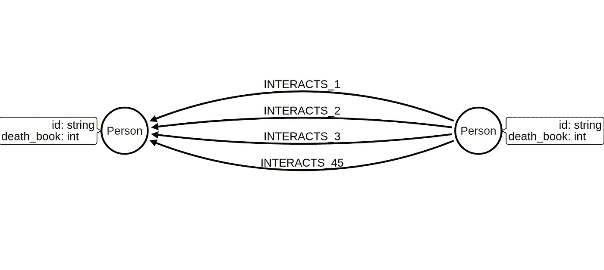
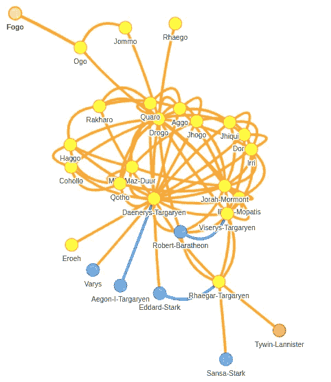
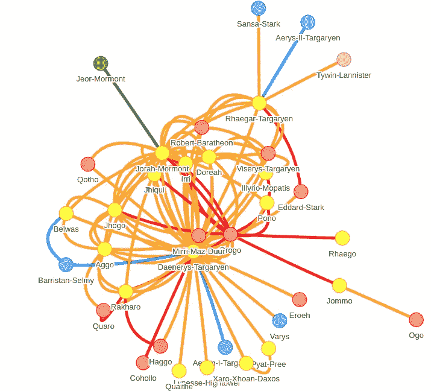
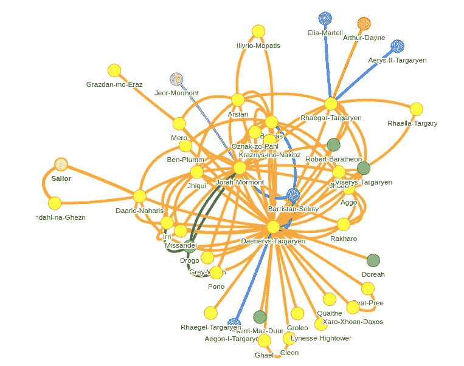
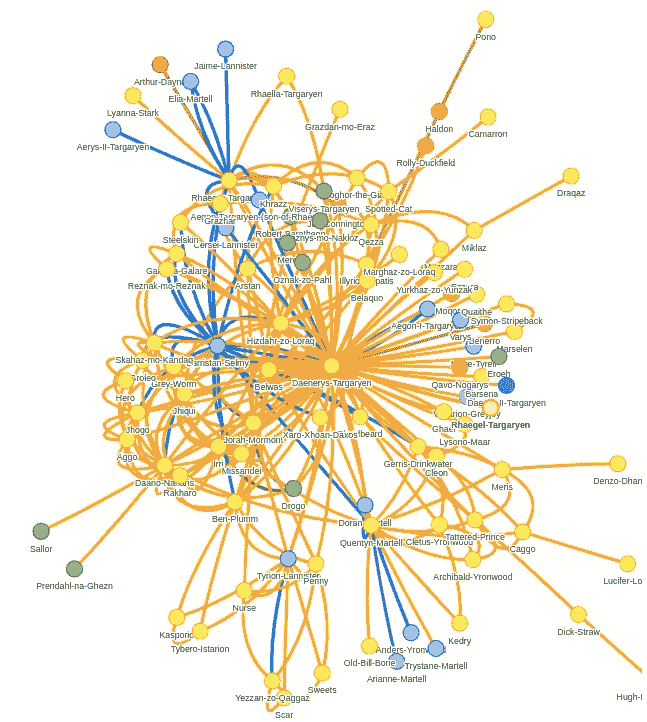

# 在《权力的游戏》数据集上使用 Neo4j 中的种子属性进行社区检测

> 原文：<https://towardsdatascience.com/community-detection-through-time-using-seed-property-in-neo4j-on-the-game-of-thrones-dataset-a2e520a6c79f?source=collection_archive---------30----------------------->

社区检测算法的作用是识别网络中密集连接的节点组。大多数社区检测算法的第一步是初始化它自己社区中的每个节点。实际上，每个节点都被分配了一个唯一的社区 id。下一步，算法使用各种技术在网络中搜索社区。

种子属性参数允许我们为每个节点定义初始社区 id。使用种子属性可以被认为是半监督社区检测，其中我们基于先验领域知识为一些节点提供初始社区 id。一个用例无疑是跟踪社区如何随时间演变。假设您正在运行一个日常批处理进程，在您的 [Neo4j](https://neo4j.com/) 图中搜索社区。您每天要做的是提供前一天的社区作为种子值。据我目前了解有两个原因。第一个是随着时间的推移跟踪特定的社区更容易，因为通过提供前一天的社区作为种子属性，我们确保社区 id 不会改变。除非一个社区瓦解。据我所知，它也应该更快，因为大多数社区已经从前一天开始计算，所以算法需要更少的迭代。最后，写回应该快一点，因为算法跳过了没有切换社区的节点的写回。

## 资料组

我们将再次探索《权力的游戏》世界，只是这一次将《T2》的《权力的网络》数据集与《T4》的《Kaggle 权力的游戏》数据集结合起来。《权力的网络》数据集包含了《GoT》书中人物之间的互动。从 Kaggle 数据集中，我们将导入角色的死亡，特别是他们死在哪本书里。

## 图形模型



Graph model

我们的图表中只有一个标签(人)。人与人之间通过 INTERACTS_X 关系联系在一起，其中 X 是《权力的游戏》系列的书序。例如，INTERACTS_1 关系意味着两个人或角色在第一本书中进行了交互。第四部和第五部被合并成一个网络，因为在《乌鸦的盛宴》(第四部)中缺少了很多主要角色。

# 导入

为节点定义唯一约束。

```
CREATE CONSTRAINT ON (p:Person) ASSERT p.id IS UNIQUE;
```

我们将从导入[权力网络](https://networkofthrones.wordpress.com/)数据集开始。没有必要下载任何东西，因为 Neo4j 已经很好地为我们取来了。

```
UNWIND ['1','2','3','45'] as book
LOAD CSV WITH HEADERS FROM 
['https://raw.githubusercontent.com/mathbeveridge/asoiaf/master/data/asoiaf-book](https://raw.githubusercontent.com/mathbeveridge/asoiaf/master/data/asoiaf-book')' + book + '-edges.csv' as value
MERGE (source:Person{id:value.Source})
MERGE (target:Person{id:value.Target})
WITH source,target,value.weight as weight,book
CALL apoc.merge.relationship(source,'INTERACTS_' + book, {}, {weight:toFloat(weight)}, target) YIELD rel
RETURN distinct 'done'
```

人物的死亡可以作为一个[得到的 Kaggle 数据集](https://www.kaggle.com/mylesoneill/game-of-thrones)得到。我们必须在运行导入查询之前下载它。两个数据集中的字符名称并不完全相同。我做了一个简单的匹配，得到了 66%的匹配率，对于这个演示来说已经足够好了。

```
LOAD CSV WITH HEADERS FROM "file:///character-deaths.csv" as row
WITH row WHERE row.`Book of Death` IS NOT NULL
MATCH (p:Person)
WHERE p.id = replace(row.Name,' ','-')
SET p.death_book = toInteger(row.`Book of Death`)
```

# Cypher 投影

如果你读过我之前的博文，你会发现图形加载器是 [Neo4j 图形算法](https://neo4j.com/docs/graph-algorithms/current/)库中的关键组件之一。它将存储的 Neo4j 图投影到内存中的投影图，这更适合运行图形算法。有两种方法可以投影内存中的图形:

*   [标签和关系型投影](https://neo4j.com/docs/graph-algorithms/current/projected-graph-model/label-relationship-type-projection/)
*   [Cypher 投影](https://neo4j.com/docs/graph-algorithms/current/projected-graph-model/cypher-projection/)

在这篇博文中，我们将使用 cypher projection 方法。它由三部分组成:

*   Node cypher 语句:cypher 查询，返回我们想要考虑的节点及其属性的 id
*   Relationship cypher 语句:返回关系的源和目标节点的 id 以及我们想要考虑的属性的 cypher 查询。属性通常用作权重
*   算法配置:要使用 cypher 投影，我们必须定义`graph:'cypher'`

```
CALL algo.louvain(
// Node cypher statement   
'MATCH (n:Node) RETURN id(n) as n, n.seedValue as seedValue',
// Relationship cypher statement
'MATCH (source:Node)-[:RELATIONSHIP]->(target:Node)
 RETURN id(source) as source, id(target) as target',
// Algorithm configuration
{graph:'cypher, seedProperty:'seedValue', writeProperty:'community'})
```

此外，请记住官方[文档](https://neo4j.com/docs/graph-algorithms/current/projected-graph-model/cypher-projection/)中的以下段落。

> 只有在 node 语句中描述了源节点和目标节点时，relationship 语句中描述的关系才会被投影，否则它们将被忽略。

我们可能选择 cypher 投影而不是标签和关系类型投影的原因是，我们获得了 cypher 查询语言的附加值，以及在描述我们想要投影的子图时它的表达能力。它还允许我们投射一个虚拟的(非存储的)图形。

*   [Neo4j 图形算法投影虚拟图形](https://tbgraph.wordpress.com/2017/11/27/neo4j-graph-algorithms-projecting-a-virtual-graph/)
*   [Neo4j 中关于世界各国图的链接图算法](https://tbgraph.wordpress.com/2018/12/09/chaining-graph-algorithms-in-neo4j-on-the-countries-of-the-world-graph/)

# 社区检测

首先，我们将在[卢万模块化算法](https://neo4j.com/docs/graph-algorithms/current/algorithms/louvain/)的帮助下，根据第一本书中的互动来搜索角色社区。

```
CALL algo.louvain(
  // Filter out only person who
  // interacted in the first book
  'MATCH (p:Person)
  WHERE (p)-[:INTERACTS_1]-()
  RETURN id(p) as id'
  ,
  'MATCH (p:Person)-[:INTERACTS_1]-(p1:Person)
   RETURN id(p) as source, id(p1) as target'
  ,{graph:'cypher', direction:'BOTH', writeProperty:'community_1'})
```

为了这个分析，我决定通过书籍来追溯丹妮莉丝·坦格利安的社区演变。

```
MATCH (p:Person{id:'Daenerys-Targaryen'})
RETURN p.id as name, p.community_1 as community
```

我们将在 [NeovisJS](https://github.com/neo4j-contrib/neovis.js/) 的帮助下可视化结果。你可以在 [GitHub](https://github.com/tomasonjo/blogs/tree/master/Game_of_thrones_community_iteration) 上找到代码。



Node color indicates community

丹妮莉丝的社区可以归类为埃索斯社区。它主要由多斯拉克人以及乔拉·莫尔蒙人和伊利里欧·莫帕蒂人组成。与维斯特洛的联系仅限于丹妮莉丝和她的哥哥韦赛里斯·坦格利安通过艾德·史塔克、劳勃·拜拉席恩和瓦里斯。第一本书还没开始，雷加·坦格利安就已经死了。有趣的是，雷加在泰温、珊莎、丹妮莉丝和艾德·史塔克等主要角色周围被提及，你们中的一些人知道这部电视剧后来发生了什么。

# 种子属性参数

在第二次迭代中，我们将使用第一本书的社区结果作为种子属性。我第一次试着从第二本书开始在网络上运行第二次迭代，但没有得到任何有见地的结果，因为很多人死了，社区变化很大。为了解决这个问题，我综合使用了第一部和第二部书中的网络，只过滤掉了第一部中死去的角色。

关于种子属性需要注意的一点是，它现在不处理空值。所有出现在第二本书，但没有出现在第一本书的新角色，从第一次迭代的社区 id 为空。在 Max de Marzi 的帮助下，我们提出了一个策略，该策略总是为具有空种子属性的节点分配一个唯一的社区 id。我们从第一次迭代中找到最高的社区 id，并添加内部节点 id，以始终保证没有种子属性的节点的唯一标识符。恰当地说，我们将把它命名为最大策略。

```
CALL algo.louvain('
    // Max strategy    
    MATCH (s:Person) WITH max(s.community_1) as max
    MATCH (p:Person)
    // Has been mentioned in book 1 or 2
    WHERE (p)-[:INTERACTS_1|:INTERACTS_2]-() AND
    // Filter our characters who die in the first book
    NOT coalesce(p.death_book,10) < 2
    RETURN id(p) as id,coalesce(p.community_1, max + id(p)) as community_1
    ','
    MATCH (p:Person)-[:INTERACTS_1|:INTERACTS_2]-(p1:Person)
    RETURN id(p) as source, id(p1) as target',    
   {graph:'cypher',direction:'BOTH',writeProperty:'community_2',
   seedProperty:'community_1'})
```

使用 [NeovisJS](https://github.com/neo4j-contrib/neovis.js/) 可视化的结果。



Node color indicates community

红色社区是第一本书中死去的角色的社区。我们可以看到丹妮莉丝的社区在第一本书中受到了相当大的打击，因为社区中的九个角色都死了。我们还可以注意到，艾德·史塔克和劳勃·拜拉席恩死了，这减少了社区与外部世界的互动，只有瓦里斯和一个新加入的 Baristan Selmy。此外，乔拉和杰奥·莫尔蒙被一起提及，即使他们从未在书中见过面，如果我没记错的话。

## 第三次迭代

下一步，我们将从第二部和第三部中寻找网络，并过滤掉前两部中死去的角色。

```
CALL algo.louvain('
    // Max strategy    
    MATCH (s:Person) WITH max(s.community_2) as max
    MATCH (p:Person)
    // Has been mentioned in book 2 or 3
   WHERE (p)-[:INTERACTS_2|:INTERACTS_3]-() AND
    // Filter our characters who die in the first or second book
    NOT coalesce(p.death_book,10) < 3
    RETURN id(p) as id,coalesce(p.community_2, max + id(p)) as community_2
    ','
    MATCH (p:Person)-[:INTERACTS_1|:INTERACTS_2]-(p1:Person)
    RETURN id(p) as source, id(p1) as target',    
   {graph:'cypher',direction:'BOTH',writeProperty:'community_3',
   seedProperty:'community_2'})
```

结果



Node color indicates community

在这个迭代中，死亡角色的群体被涂成绿色。尽管卓戈和劳勃·拜拉席恩已经死了，但他们还是在第二部和第三部中不断被提及。我们可以观察到一些有趣的角色加入到社区中，比如米桑代和达里奥·纳哈里斯。总的来说，这个社区变得更加孤立，因为丹妮莉丝除了通过巴利斯坦·赛尔弥之外，与维斯特洛没有任何交流。

## 第四次迭代

对于最后一次迭代，我们将基于第三、第四和第五本书中的互动来查看网络中的社区，并过滤掉前三本书中死去的角色。

```
CALL algo.louvain('
    // Max strategy    
    MATCH (s:Person) WITH max(s.community_3) as max
    MATCH (p:Person)
    // Has been mentioned in book 3 or 45
   WHERE (p)-[:INTERACTS_3|:INTERACTS_45]-() AND
    // Filter our characters who die in the first three books
    NOT coalesce(p.death_book,10) < 4
    RETURN id(p) as id,coalesce(p.community_3, max + id(p)) as community_3
    ','
    MATCH (p:Person)-[:INTERACTS_3|:INTERACTS_45]-(p1:Person)
    RETURN id(p) as source, id(p1) as target',    
   {graph:'cypher',direction:'BOTH',writeProperty:'community_4',
   seedProperty:'community_3'})
```

结果



Node color indicates community

我们可以观察到丹妮莉丝的社区在这次迭代中规模增加了很多。它还通过提利昂·兰尼斯特、多兰·马爹利和瑟曦·兰尼斯特等人物与外部世界建立了大量联系。

# 结论

在我们进行下一次迭代之前，我们将不得不为第六本书多等一会儿。希望，很快:)

种子属性是对社区检测算法的一个很好的补充。除了 Louvain 算法，连接组件和标签传播算法也支持种子属性。

和往常一样，所有代码都可以在 [GitHub](https://github.com/tomasonjo/blogs/tree/master/Game_of_thrones_community_iteration) 上获得: