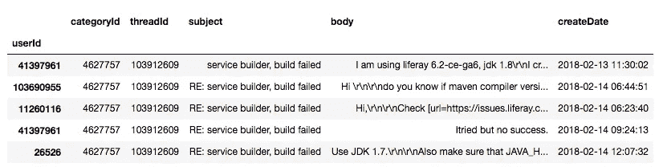
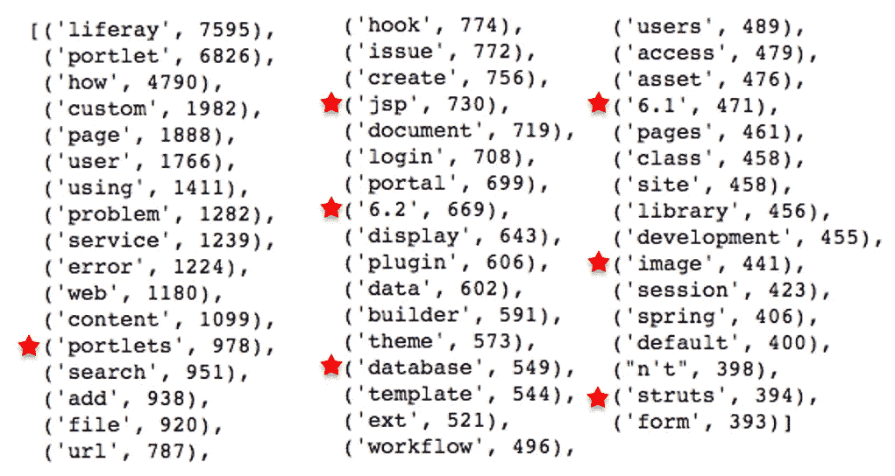

# 社区论坛与数据科学相遇

> 原文：<https://towardsdatascience.com/community-forums-meets-data-science-d76df98a291a?source=collection_archive---------15----------------------->

## 分析论坛成员的活动、帖子和行为


Photo by [Volodymyr Hryshchenko](https://unsplash.com/@lunarts?utm_source=medium&utm_medium=referral) on [Unsplash](https://unsplash.com?utm_source=medium&utm_medium=referral)

**总结** 作为一名对数据科学充满热情的社区建设者和战略家，我发现数据科学技术的使用加深了我对所管理社区的理解，使我能够做出更好的战略和运营决策。在本文中，我旨在举例说明数据科学的使用如何使社区管理者能够更好地了解他们的社区，并提高成员的参与度。

Liferay 是一家开源技术公司，也是我的客户，它主办了 [Liferay 社区论坛](https://community.liferay.com/forums/-/message_boards/message-boards-home?p_r_p_tag=)。这些都是非常活跃的公共论坛，注册会员超过 150，000 人。论坛主要是开发者之间关于 Liferay 技术的交流。在这篇文章中，我分析了 2007 年至 2017 年间论坛成员的活动、帖子和行为。本着开源精神，Liferay 允许我发表对他们过去 10 年成员活动的分析。

数据描述

为了开始我的数据分析(使用 Python)，我从所有论坛数据的原始文件开始。通过一些数据清理，我创建了一个包含每个论坛消息细节的文件。文件中的每一行都是唯一的消息，包含以下字段:

*   UserId:编写消息的用户
*   CategoryID:消息出现的论坛类别，例如“门户框架”
*   ThreadId:线程的 Id(包括最初的帖子和所有回复)
*   主题和正文:消息的内容
*   创建日期:消息的日期和时间

我使用命令 forums.tail(5)可视化了文件的最后 5 行:


让我们研究一下这些数据，以了解更多关于社区成员之旅的信息。

# 第一部分.会员之旅

使用函数和图探索数据:分析成员寿命

对于开发人员或客户的社区，了解成员随时间的变化可以让社区经理了解用户如何发展以及如何在不同阶段最好地吸引他们。

在这里，我看到了论坛中成员之间的典型互动。为了重现单个讨论线程的问题和答案，我使用了

```
forums.loc[forums.threadId==103912609].head(5)
```

通过“threadId”进行过滤会产生以下结果:



在这个讨论中，很明显，用户(41397961)正在纠结于一个技术问题:“服务构建器，构建失败”。一些有用的成员要求澄清并提供建议(在这种情况下，可能没有用)。看来有经验的会员正在努力帮助新手。事实上，论坛的一个中心目标是帮助会员在从新手到专家的旅程中前进。

正如 Liferay，Inc .的开发者倡导者 Jamie Sammons 所说:

> “大多数贡献者通常从 Liferay 社区开始，作为消费者阅读文档、论坛和 Slack。对于许多人来说，积极参与的第一步是通过询问特定于其环境的问题在论坛中获得帮助。大多数开始帮助他人的贡献者通常是这样开始的，然后当他们觉得自己正在学习诀窍时，有时甚至会觉得有义务帮助他人来回报他们所获得的支持。”

了解会员之旅的另一个方面是确定用户的寿命。典型的会员是只发一次帖子，还是长时间保持活跃？我使用 Python 中强大的“分组”功能来创建这个数据框。你可以在 [GitHub](https://github.com/azawel/online-communities) 中看到细节，下面出现了我的结果的一个例子。


利用这些数据，观察所有成员寿命的频率分布是很有趣的。与社区中的整体用户寿命相比，有多少用户的寿命只有 1 天？这就是可视化有帮助的地方。下面的图表显示，近 800 名成员的寿命为 1 天，此后频率大幅下降。


上面的图中没有显示的是 12，000 名会员——占发帖会员总数的 42%——他们的寿命为 0 天！(我将 Y 访问设置为最大 1，000，因此没有显示 12，000 成员数据点)。寿命为 0 天意味着第一条和最后一条消息在同一天；有可能这些成员只是发布了一条消息，然后就再也没有回到论坛。

利用数据:社区经理的含义

有了这些数据，社区管理者可以实现一个战略性的双重目标:增加成员的生命周期，并最小化生命周期为 0 天的成员数量。社区经理可以在一个成员写完一篇文章后发起一个特别的推广活动，并向新成员发送个性化消息，鼓励他们继续参与。或许他们甚至可以在“游戏化”系统中奖励新会员积分。

可视化数据:了解资深社区成员的寿命

我也有兴趣了解老会员的典型寿命。因此，我把上图中的时间尺度从几天改为几年，以关注退伍军人和他们在社区中的寿命。

```
lifespan_years = lifespan_days//365
freqyear = lifespan_years.value_counts()
plt.plot(freqyear,'.');
plt.axis([0, 12, 0,2000]);
plt.xlabel('period from first to last message (YEARS)')
plt.ylabel('member counts')
plt.title('Length of Active Membership')
plt.grid(True)
plt.show()
```


该图表显示，1800 名会员的论坛寿命为 1-2 年，从第 1 年到第 2 年和第 2 年到第 3 年急剧下降。2 或 4 年后见底并不奇怪，因为开发人员通常有持续 2-4 年的 Liferay 项目，之后他们会转向其他项目或公司。

正如 Liferay，Inc .的开发者倡导者 Jamie Sammons 所说:

> “大多数情况下，开发人员为一家咨询公司工作，然后转向一个新项目，或者开发人员可能会彻底跳槽。在少数情况下，开发人员为 SI 或合作伙伴公司工作，由于业务良好，他们的工作量很大，根本没有时间做出贡献。”

利用从数据中获得的洞察力:社区管理含义

当以前活跃的成员在活跃两年多后变得安静时，他可以获得特殊的个人拓展，例如:“发生了什么？我们能为你的下一个项目提供帮助吗？”此外，这些成员可以被邀请参加更高层次的讨论(例如，项目或公司的未来路线图)，而不是代码 Q &对话。

其他行为分析主题

使用会员登录信息可以收集到更多的信息。例如，可以根据 90%的注册者的登录时间戳，对他们进行分析，这些注册者根本没有发帖。这些定期登录的安静的“潜伏者”可以从真正不活跃的人中分离出来，他们的行为被分析以鼓励更高水平的参与。通过将论坛记录与其他信息源(如吉拉或 CRM 数据)相结合，可以收集到其他有趣的信息，从而实现对论坛成员跨平台相关活动的 360 度视图。分析社区中流行的发帖时间也可能很有见地，以便营销和传播团队可以确定在论坛中发帖的最佳时间(请记住，国际社区和时区可能会使这种分析变得棘手)。最后，了解计划的影响可能是有趣的。比如软件新版本发布后会员活跃度有没有提高？

分析社区成员在论坛上的活动有助于改善客户旅程和成员参与度。通过分析论坛帖子的实际内容，可以获得更高层次的洞察力。

# 第二部分。使用自然语言处理(NLP)了解社区

词汇云——理解对话主题

单个用户在一段时间内发布的实际内容可用于构建成员档案词云，组成词云的数据可用于从根本上改善成员在社区中的体验。例如，关于通过词云识别的主题的帖子可以出现在成员的活动提要中，使提要更相关和更有吸引力。

对于下面的单词云，我使用了标准的阻止列表(程序将忽略的单词列表)，它保留了诸如“登录”和“社区”之类的单词。为了降低语料库中所有常用词的重要性(“login”是 Liferay 论坛中的常用词)，我可以应用“词频-逆文档频率”(TFIDF)。

发布了 887 条消息的单个成员的 Word cloud:

```
from wordcloud import WordCloud
text = resultdef generate_wordcloud(text): 
    wordcloud = WordCloud( relative_scaling = 0.5,
                          stopwords = {'re','to', 'of','for','the','is','Liferay','in','and','on','from','with'} 
                          ).generate(text)
    plt.imshow(wordcloud)
    plt.axis("off")
    plt.show()generate_wordcloud(text)
```


字数和三元模型——确定引发讨论的主要话题

整个社区都在谈论什么，成员们是如何互动的？下面的图表包含了两个 Liferay 论坛类别(“公告”和“开发”)中每个讨论主题行的字数。

对主题中的单词进行标记后，我们可以列出每个类别中的前 10 个单词:

```
devWords = [word **for** word **in** words **if** word **not** **in** stoplist]
fdist_dev = nltk.FreqDist(devWords)
dev_common = fdist_dev.most_common(10)
```

然后，我们可以构建一个数据框架来比较不同类别的常用词:

```
dfWord = pd.DataFrame(
    {'Development': dev_common,
     'Announcements': announce_common
    })
dfWord.index += 1 
dfWord
```


“！”公告类别在庆祝成功的专业团体中更常见(例如，“祝贺销售成功！).在 Liferay 论坛的情况下，对话类似于典型的“[信息传播](http://www.leadernetworks.com/2010/06/three-models-for-online-communities.html)”社区(具有诸如“已发布”和“可用”的关键字)。

那个“？”出现在开发类别中的单词“how”对于这个社区来说是典型的，其中主要的用例是成员向其他成员询问技术或产品相关的问题。这种“问答”内容结构可以通过查看下面最常见的三元模型(3 个单词的组合)来确认。

发展类别三元模型:

```
tgs = nltk.trigrams(words)
fdistT = nltk.FreqDist(tgs)
fdistT.most_common(5)
```


关于数据和 NLP 分析的注释

*   对于这种类型的分析，请确保字符如“？”还有“！”被考虑(即不包括在禁止列表中)
*   公告类别比开发类别小得多，因此字数也少得多(但相对排名是最重要的)。
*   在 [GitHub](https://github.com/azawel/online-communities) 上，我展示了将 1000 个主题行转换成单词列表的步骤(组块、标记化等)。

关键词分析 NLP 如何提高社区管理的效率

NLP 也可以帮助日常的，但基本的，社区管理任务。例如，技术论坛中的一个常见挑战是获得社区成员提出的所有问题的良好答案(从而培养社区内的信任和参与。)

Liferay 使用的典型方法是指派专家负责每个论坛类别。然而，在 Liferay 的案例中，近 40%的 Liferay 信息属于一个类别，“开发”，指派专家来涵盖这整个包罗万象的类别是不切实际的。为了解决这个问题，我们可以在这个类别中寻找一些讨论的关键主题，这些主题可以分离出来，形成更小、更易于管理的讨论类别。关键字分析在这里非常有用，但在这种情况下，字符和短词没有帮助，所以我过滤了较长的词:

```
long_words = [word for word in words if
              len(word) > 2 and word not in stoplist]
fdistLong = nltk.FreqDist(long_words)
fdistLong.most_common(50)
```



显然，这里有一些很好的候选主题，可以从拥挤的“发展”类别中分离出来:

1.Portlet
2。JSP
3。建造者
4。主题
5。数据库ˌ资料库

二元模型(两个词的组合)揭示了其他好的潜在主题，包括“服务构建器”、“定制 portlet”和“文档库”。了解热门话题及其随时间的变化趋势也很有帮助。例如，在下面的分散图中，很明显，当“6.1”(推测是 Liferay 的一个版本)出来时，社区热烈地讨论了它——然后讨论安静了下来。随着“6.2”的发布，围绕“6.1”和“6.2”的讨论也有所重叠。“6.1”和“6.2”的代码和色散图如下所示。

```
mytext = nltk.Text(words)
mytext.dispersion_plot(["6.1","6.2"])
```


以上功能和可视化只是冰山一角；通过分析用户行为和内容，可以发现更多的东西。唉，使用最新的人工智能工具进行有意义的分析，尤其是“非结构化”分析(系统事先不知道它在寻找什么)需要大量数据。即便如此，对小数据集进行相对基本但经过深思熟虑的分析，可以显著改善社区管理。了解成员的行为及其内容可以增强社区管理者有效服务其社区的能力，增加其社区的相关性，进而增加参与度、成员数和影响力。

*注:样本数据中未出现姓名或个人详细信息。最初的论坛帖子和成员简介是公开的，所以这是一个额外的警告步骤。*