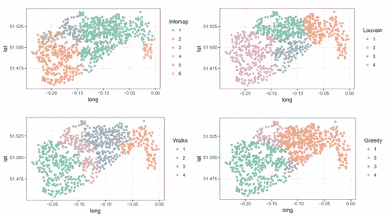
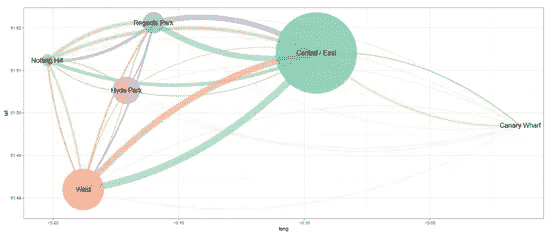
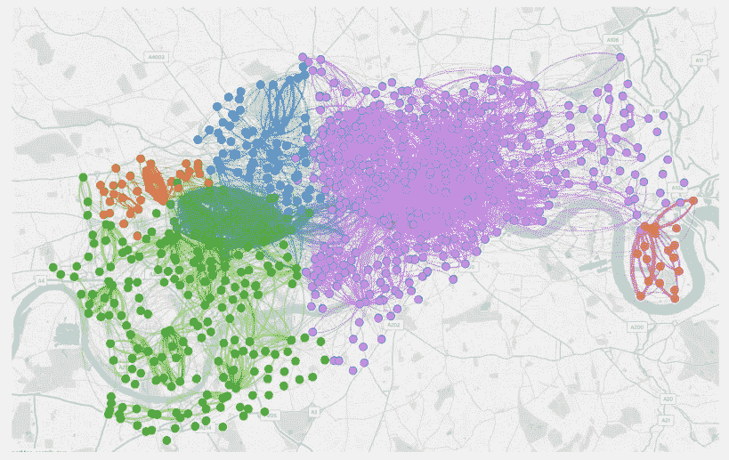
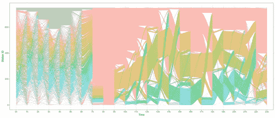

# 伦敦自行车共享网络的社区结构、互动和动态

> 原文：<https://towardsdatascience.com/community-structures-interactions-and-dynamics-in-londons-bicycle-sharing-network-using-r-8d5a575c302?source=collection_archive---------41----------------------->

## 通过无监督机器学习获得对共享自行车系统的运营洞察力

几乎每个大城市都有自行车共享计划。所有的自行车都连接在一起，产生无数的数据。大多数运营商提供的数据侧重于站点/自行车可用性。然而，伦敦运输(TfL)公司在其开放数据平台上发布他们的自行车运动(桑坦德 BSS ),使用自行车 ID，让您可以跟踪网络中每辆自行车的运动。😮

这为我们如何分析数据提供了新的可能性。在这篇文章中，我们将探讨如何使用数据挖掘技术来理解伦敦 BSS 中的社区。

## **什么是社区？**

一个社区可以有很多含义。[剑桥词典](https://dictionary.cambridge.org/dictionary/english/community)将其定义为:

> 居住在某一特定地区的人或由于共同的兴趣、社会团体或国籍而被视为一个整体的人

就运输系统而言，这与我们想要做的并不太远。也就是说，我们希望将传输网络的复杂性降低到行为相似的单元或集群中。在这里，我们将站分组，以更好地了解系统如何工作，并能够做出更好的操作决策。

使用 R 和其他工具，我们将简化来自伦敦数据存储的起点-终点数据。

## **导入和过滤我们的数据**

我们选择的[数据集已经被提取并复制到我们的工作目录中。我们选择的时间段是 2014 年 6 月至 7 月，包括 150 万次旅行。在通过我们的社区检测算法之前，我们需要采取一些步骤。](https://cycling.data.tfl.gov.uk/)

为了加载它，我使用了来自`data.table`的优秀的`fread()`函数。此外，我们需要删除缺失或等于零的自行车 id 和终点站。我们删除了仅作为目的地(维修店)和周末存在的加油站，这需要进行单独的分析。

## **社区检测算法**

有许多社区检测算法，其中大多数使用模块性的度量来检测集群。但是，在本分析中，我们将把它与最先进的社区检测算法 [*信息图*](https://www.mapequation.org/) 进行比较，后者改进了基于模块化的方法，放宽了关键假设:

*   无向信息
*   分辨率限制
*   网络形成的过程

这些将被证明是非常相关的运输集群的准确检测。

我们将比较以下方法:

*   信息图
*   勒芬
*   贪婪的
*   随机漫步

所有这些都可以在伟大的`igraph`库中运行。在分析时，Infomap 的二进制文件的最新版本还没有实现，我们决定直接使用二进制文件。

要将信息图算法作为系统命令运行，我们可以使用以下命令。注意它只在 MacOSX 上测试过，但是如果你在正确的文件夹中有 Infomap 的二进制文件，它应该可以工作。使用 v0.19.3 版本完成了*信息图*社区检测。关于如何在您的机器上运行*信息图*的说明可以在[这里](http://www.mapequation.org/code.html)找到。

## 结果

*Infomap* 在**发现伦敦网络中已知的物理结构**方面优于基于模块性的社区检测算法(如金丝雀码头和海德公园)。

这些算法都没有给出关于车站位置的信息。但是所有的结果都非常依赖于空间。

Comparison of the community clustering algorithms

鉴于中部/东部社区的规模，我们怀疑其中可能有隐藏的社区。与此同时，金丝雀码头和海德公园似乎大多自成一体。

Average cluster location and connections to the other clusters.

使用 [Gephi](https://gephi.org/) 软件创建的信息图聚类的独立可视化。它还显示了研究期间不同站点之间的行程。

Results of the Infomap algorithm using Gephi.

## 奖励回合:动态分析

作为额外的分析，我们仅使用 *Infomap 执行动态社区检测。*分析表明，社区具有时间依赖性，社区受空间、时间和位置的驱动。

Community dynamics

如果我们要扩大分析数据的时间范围，那么缺少夜间出行就不可能找到可能改变的模式。早上和下午高峰的通勤模式也可能导致极端的结果，即最佳聚类数只有一个。

## 结论

这种方法使我们能够深入了解网络的运行方式。它可以帮助决策者改善网络和物流运营商优化他们的自行车运动。我们能够找到传统方法无法找到的地理位置偏远或使用模式一致的专业社区。

## 承认

这篇文章是下一篇文章的姊妹篇

> 费尔南多·穆尼奥斯·门德斯、**康斯坦丁·克莱默**、汉克和斯蒂芬·贾维斯。2018.伦敦自行车共享网络的社区结构、互动和动态。在 2018 年 ACM 国际联合会议和 2018 年普适计算和可穿戴计算机国际研讨会(UbiComp '18)的会议录中。美国纽约州纽约市美国计算机学会，1015–1023。https://doi.org/10.1145/3267305.3274156

你可以在这里找到[预印本，在这里](https://arxiv.org/pdf/1804.05584)找到一些用于生成图和结果[的代码。](https://github.com/konstantinklemmer/bikecommclust)