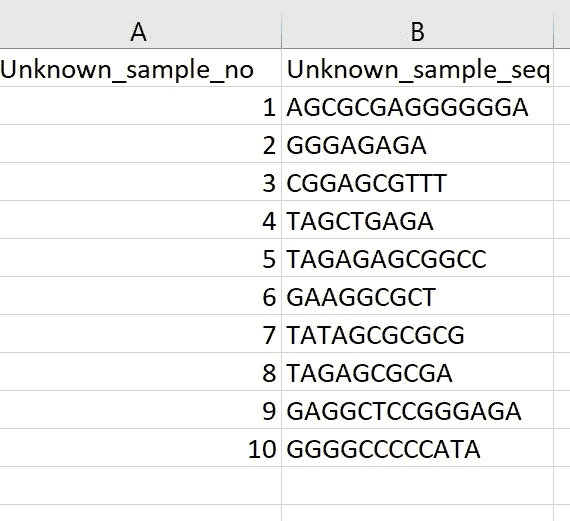
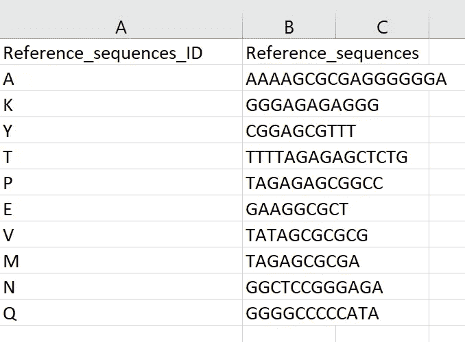
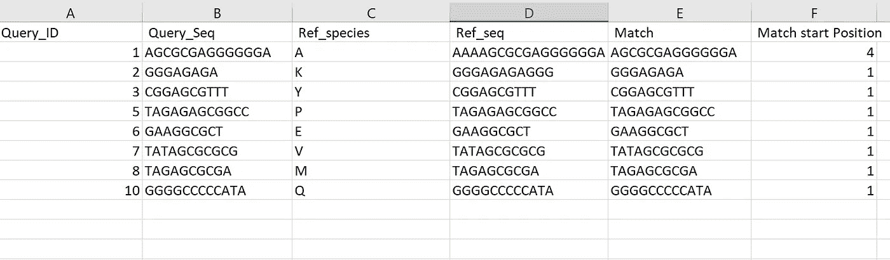

# 使用 Pandas 比较不同 Excel 文件中的列值

> 原文：<https://towardsdatascience.com/comparing-and-matching-column-values-in-different-excel-files-using-pandas-a25172f0ff4d?source=collection_archive---------4----------------------->

Image Courtesy of Joshua Hoehne via [Unsplash](https://unsplash.com/photos/7XLsFy0p3Ao)

**熊猫为列匹配**

通常，我们可能希望比较不同 Excel 文件中的列值，以搜索匹配和/或相似性。使用 Python 中的 Pandas 库，这是一个简单的任务。为了证明这是如何可能的，本教程将集中在一个简单的遗传例子。不需要遗传学知识！

考虑以下情况:我有一些未知的 DNA 序列样本(由字母 A、T、G 和 c 组成的简单字符串)。对于这些未知的 DNA 序列，我会分配一个唯一的标识符。为了简单起见，第一个未知序列将被标识为 1，第二个被标识为 2，依此类推，如下所示。

在这个有些人为的例子中，我想比较我的未知序列和已知的参考序列。

简而言之，我的问题是,‘未知 _ 样本 _ 否’中的任何一个与我的‘引用 _ 序列 _ ID’匹配吗？如果有，它们与哪个(些)序列匹配。

为了开始回答这个问题，我首先导入 pandas 模块，并将相应的文件作为 csv 文件读取。注意:我将这些文件在 Excel 中保存为逗号分隔值文件(csv 文件)，并使用 **read_csv()** 函数解析它们。严格来说，这不是*必须的，但这是我喜欢的一种工作习惯。您也可以将 Excel 文件保留在原生的**中。xlsx** 扩展名，并使用 **pandas.read_excel()** 函数在这里保存一个步骤。*

查询序列 DataFrame 被赋予了变量 A，而序列引用 DataFrame 被赋予了变量 b。

然后，我将两个数据帧中的两列都转换成 python 列表。为此，我使用了**。tolist()** 对特定数据帧的指定列执行方法。举例来说，数据帧 A 中的列“未知 _ 样本 _ 否”被转换成列表。我对分布在两个 Excel 文件中的其他三列中的每一列执行这个步骤，如下面的代码片段所示。

我想保留“未知 _ 样本 _ 编号”与其对应的“未知 _ 样本 _ 序列”之间的关联。此外，我还想保留‘Reference _ sequences _ ID’与其对应的‘Reference _ sequences’之间的关联。Python 提供了一种维护这种关联的简单方法。我把我的清单转换成两本字典。

我使用 **zip** 函数连接列表，然后使用 **dict** 函数将它们转换到适当分配的字典中。

为了确认字典已经被正确创建，我在我的终端上运行这个脚本。一个简短的验证检查告诉我一切都在按计划进行。例如，在 Ref_dict 中,“Reference_sequences_ID”键与其对应的“Reference_sequences”值正确匹配:{ ' A ':' aaaaagcgcgaggggga '，' K': 'GGGAGAGAGGG '，' Y ':' cggacgttt '…..}

我现在可以把我的两本词典互相比较了。为此，我使用一个 for 循环来遍历我的“Unknown_dict ”,并使用一个嵌套的 for 循环来遍历 Ref_dict。在每次迭代时，我想知道 Unknown_dict 中的序列是否与 Ref_dict 中的任何序列匹配(有些会*，我故意包括了 8 个* *匹配*)。为了检查匹配，我使用了来自 **re** 模块(正则表达式模块)的 **re.search()** 函数。

当有匹配时，我认为知道什么序列匹配，匹配出现在 DNA 序列中的什么位置，以及最重要的是什么‘未知 _ 样本 _ 编号’与哪个‘参考 _ 序列 _ ID’匹配将是有用的。

为了使事情更清楚，如果所有的匹配都被写到一个可以在 Excel 中打开的 csv 文件中，那将是非常理想的。理想情况下，目标是让任何想要解释数据的人都清楚，哪些序列匹配，匹配序列是什么，在哪里匹配。

为了实现这个目标，我写了一个名为“seq_match_compare.csv”的文件，当我打开 csv 文件时，所有我想要的信息都以一种可解释的方式出现了！

例如，我现在知道 Query_ID: 1 对应于 Ref_species A，这个匹配从序列中的位置 4 开始。

有多种方法可以比较两个不同 excel 文件中的列值。这里的方法将第一个文件的未知序列列中的每个序列与第二个文件的 Reference_sequences 列中的每个序列进行检查。

这种方式代表了一种简单的匹配和比较方式，如果我们想要分析任意数量的样品，这种方式提供了极大的可扩展性！

所有这些都是通过熊猫实现的！