# 比较重复测量数据的常用分析策略

> 原文：<https://towardsdatascience.com/comparing-common-analysis-strategies-for-repeated-measures-data-f58033c28329?source=collection_archive---------19----------------------->

## 处理数据中的依赖关系。

# 这是怎么回事？

我希望这篇文章能提供一个关于如何处理社会科学中常见的特定类型数据集的概念概述(在我自己的实验心理学和认知神经科学学科中也很常见)。我的目标不是提供数学形式，而是建立一些直觉，并尽可能避免术语。具体来说，我想比较一些人们可以使用的更常见的分析策略，以及它们如何因情况而异，最后是一些有望指导您未来决策的要点。但要做到这一点，我们需要从头开始…

# 重复什么？

数据集有各种不同的形状和大小。在许多介绍性教程、课程甚至真实世界的例子中，人们通常会处理被称为满足许多常见统计模型的“i.i.d .假设”的数据集。这在英语中是什么意思？它指的是每个数据点在很大程度上独立于完整数据集中的其他数据点。更具体地说，这意味着模型的*残差*(即模型无法解释的剩余部分)彼此独立，并且它们都来自于*相同的*分布，其平均值为 0，标准差为*σ*。换句话说，了解模型产生的一个错误很少会告诉你模型产生的任何其他错误，并且通过扩展，了解一个数据点的一些情况很少会告诉你任何其他数据点。

然而，许多类型的数据包含“重复”或“复制”,例如在一段时间内或在不同条件下测量相同的人。这些数据明显违反了这个假设。在这些情况下，一些数据点*比其他数据点*更相似。违反这些假设会导致模型估计不尽如人意( [Ugrinowitsch 等人，2004](https://pdfs.semanticscholar.org/fe95/9879dbf2b06f33b9ef07b67897135be57abf.pdf) )。更隐蔽的问题是，使用这些估计值做出的推断(例如，计算 t-统计量和延伸的 p 值)可能非常不准确，并产生[假阳性](https://www.wikiwand.com/en/False_positives_and_false_negatives) ( [Vasey & Thayer，1987](https://www.ncbi.nlm.nih.gov/pubmed/3615759) )。让我们通过考虑两个不同的数据集来使这一点更加具体。

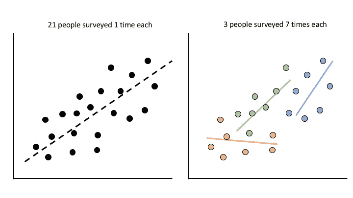

在案例 1(左)中，我们给 21 个人每人一次调查，并尝试查看他们的调查回答是否与他们的一些人口统计数据有任何关系。总共 21 个数据点，非常简单。在案例 2(右图)中，我们给 3 个人每人 7 次调查，做同样的事情。总共 21 个数据点，但是这次每个数据点不是相互独立的。在第一种情况下，每个调查答复都是相互独立的。也就是说，了解一个人的反应并不能告诉你另一个人的反应。然而，在第二种情况下，这是不正确的。在你第一次调查时了解了 A 的一些调查结果，在你第二次调查时，你会对 A 的调查结果有更多的了解，而这也必然会给你更多关于 B 的回答的信息。因此不独立。在最极端的情况下，忽略数据中的这些依赖性来估计模型可能会完全逆转最终的估计，这种现象被称为[辛普森悖论](https://www.wikiwand.com/en/Simpson%27s_paradox)。

# 分析策略。

那么我们通常会怎么做呢？有一些不同的分析“传统”以不同的方式处理这个问题。这绝不是一个详尽的列表，而是许多不同文献中相当常见的方法。

## 多层次模型

像许多其他心理学/神经科学研究人员一样，我第一次被告知重复测量 ANOVAs 是分析这类数据的唯一方法。然而，这已经有点脱离实际，而支持多级/混合效果建模的更灵活的方法( [Baayen 等人，2008](https://www.sciencedirect.com/science/article/pii/S0749596X07001398) )。我不想关注为什么多层建模通常更可取，因为这是一个不同的讨论(例如，更好地处理缺失数据，不同数量的重复，额外水平的重复，不同数量的重复等)，但足以说，一旦你开始使用这种方法，基本上没有理由再次运行重复测量的方差分析。深入研究这些模型如何工作的所有细节超出了本文的范围，但是我将链接一些参考资料。从概念上讲，多级建模同时估计描述整个数据集以及每组重复内的关系的系数。在我们上面的例子中，这相当于估计调查响应和调查应答者的整个人口统计之间的关系，以及个人偏离这些估计的程度。这具有将估计及其相关误差“汇集”在一起的净效果，并且如果你熟悉贝叶斯术语，其工作方式与使用先验知识并不完全不同，或者如果机器学习更适合你，其工作方式与使用正则化/平滑并不完全不同。以这种方式估计模型的结果意味着估计可以“相互帮助”,这样，如果我们的一些调查受访者没有在每次我们要求他们填写调查时填写调查，我们就可以估算值，或者我们可以通过假设个人的估计都来自同一人群来“清理”我们从特定个人那里获得的有噪声的估计，从而限制他们可能采取的不可靠的值。

在实践中，使用这些模型可能有点棘手。这是因为，如何设置这些模型进行评估并不是一目了然的。例如，我们是否应该假设每个回答者的调查结果和人口统计数据之间有不同的关系？或者我们应该简单地假设他们的调查结果平均起来不同，但随着人口统计数据的变化而变化？具体来说，用户对于如何指定模型的“随机效应”(偏差估计)部分有多种选择。你可能遇到过像“随机截距”或“随机斜率”这样的术语在我们的示例中，这是允许模型学习每个人的调查响应的唯一平均估计和学习每个人的调查响应和人口统计结果测量之间的关系的唯一回归估计之间的差异。在许多情况下，计算一个*可以*计算的完整系数集(截距、斜率以及每个预测值之间的相关性)([巴尔等人，2013](https://www.ncbi.nlm.nih.gov/pmc/articles/PMC3881361/) )会导致模型无法收敛，给用户留下不可靠的估计。这导致了一些建议，即保持模型相对于人们试图做出的推理相对“简单”([贝茨等人，2015](https://arxiv.org/abs/1506.04967) )，或者比较不同的模型结构，并在执行推理之前*使用模型选择标准在它们之间进行裁决( [Matuschek 等人，2017](https://www.sciencedirect.com/science/article/pii/S0749596X17300013) )。很棘手吧？尝试[这个指南](https://bbolker.github.io/mixedmodels-misc/glmmFAQ.html)来帮助你，如果你冒险沿着这条路走下去，或者查看[这个帖子](https://ourcodingclub.github.io/2017/03/15/mixed-models.html)来一个漂亮的视觉治疗。 [Brauer & Curtin，2018](https://psycnet.apa.org/record/2017-52405-001) 是一个特别好的一站式商店，提供审查、理论、实践、评估问题和代码片段。如果多层次的模型让你兴奋的话,有[吨](https://www.jaredknowles.com/journal/2013/11/25/getting-started-with-mixed-effect-models-in-r)的[资源](http://www.bodowinter.com/tutorial/bw_LME_tutorial1.pdf) [可用。](http://www.stat.columbia.edu/~gelman/arm/)*

## 稳健/校正的标准误差

在其他学术领域，有一种完全不同的传统来处理这些类型的数据。例如，在一些经济学学科中，“稳健/三明治/休伯-怀特”标准误差是为标准线性回归模型计算的。[本讲座](http://projects.iq.harvard.edu/files/gov2001/files/sesection_5.pdf)提供了这些技术的数学概述，但总的来说，这种方法需要使用普通最小二乘(OLS)回归以“典型”方式计算回归系数，但需要“校正”这些估计量的方差(即标准误差),以了解它们的异方差程度。也就是它们的方差相差多少。有几种方法可以解释异方差性，包括小样本和自相关校正等，但另一种方法是计算关于数据中“簇”或分组因子的稳健估计。在上面的例子中，聚类将包括调查回答者，并且每个调查响应将包括该聚类中的数据点*。因此，这种方法完全忽略了在计算回归系数时存在重复测量的事实，而是在通过调整其标准误差对这些系数进行*推断*时考虑重复测量数据。有关这种计算的概述，请参见本演示文稿，有关更正式的处理，请参见卡梅伦&米勒，2015 。*

## 两阶段回归/汇总统计方法

最后，我们可以使用的第三种方法是所谓的两阶段回归或汇总统计方法( [Frison & Pocock，1992](https://onlinelibrary.wiley.com/doi/pdf/10.1002/sim.4780111304)；[福尔摩斯&弗里斯顿，1998](https://www.fil.ion.ucl.ac.uk/spm/doc/papers/aph_rfx.pdf) 。这种方法是功能磁共振成像数据分析的常规方法([芒福德&尼科尔斯，2009](https://www.ncbi.nlm.nih.gov/pubmed/19463958/) )。从概念上来说，这看起来像是将一个标准的 OLS 回归模型分别拟合到每个调查对象，然后将第二个 OLS 模型拟合到每个个体对象的拟合系数。在最简单的情况下，这相当于对个人系数计算单样本 t 检验。您可能会注意到，这种方法“感觉”类似于多级方法，在通俗英语中，实际上存在多级建模。但是，请注意每个第一级模型是如何完全独立于每个其他模型进行估计的，以及它们的误差或估计值的方差是如何以任何有意义的方式进行合计的。这意味着我们失去了从上述正式的多层建模框架中获得的一些好处。然而，我们可能失去的好处在简单性中得回了:没有额外的选择要做，例如选择一个适当的“随机效应”结构。事实上， [Gelman，2005](http://www.stat.columbia.edu/~gelman/research/published/459.pdf) 指出，两阶段回归可以被视为多级建模的一种特殊情况，在这种情况下，我们假设个体/聚类级别系数的分布具有无限方差。

# 我们如何决定？

拥有所有这些工具有时会让我们很难判断哪种方法更适合什么情况，以及是否有一种方法总是比其他方法更好(剧透:没有)。为了更好地理解我们何时可以使用每种方法，让我们考虑一些我们可能遇到的最常见的情况。我将这些称为我们的数据可以变化的“维度”。

## 维度 1:我们想要做出推论的单位的样本大小

不同数据集之间最常见的差异就是它们的大小，也就是我们真正要处理的观察值的数量。在非独立数据的情况下，分析师可能最感兴趣的是对数据的特定“级别”进行推断。在我们的调查示例中，这是对“人”的概括，而不是调查的具体实例。所以这个维度根据我们采样的个体数量而变化，不管我们对任何给定的个体采样了多少次。

## 维度 2:嵌套在我们想要推断的单元中的单元的样本大小

我们的重复测量数据可能变化的另一个方面是我们要处理多少次重复。在上面的例子中，这是我们对任何给定个体的观察数量。每个人都填写了 5 次调查吗？10?100?因此，这个维度根据我们对任何给定个体的采样频率而变化，而不管我们总共采样了多少个个体。

## 维度 3:我们想要做出推论的单元之间的可变性

每种分析方法的一个关键不同之处在于它们如何处理(或不处理)不同重复组之间的可变性。在上面的例子中，这是个人之间的方差*。不同的人真的会有不同的反应吗？在一个极端，我们可以将每一个人的调查回答视为完全独立的，忽略我们多次调查个人的事实，假装每一次调查都是完全独特的。另一方面，我们可以假设调查响应和人口统计之间的关系来自更高层次的分布，并且特定人的估计是该分布的实例，保留每个人自己的响应彼此之间比他们与其他人的响应更相似的事实。我将在下面再回到这个话题。*

# 模拟可以帮助我们建立直觉。

通常在这种情况下，我们可以使用模拟数据，以特定的方式设计变化，以帮助我们获得一些洞察力，了解这些事情如何影响我们不同的分析策略。让我们看看这是什么样子。我将主要使用我编写的 [pymer4](http://eshinjolly.com/pymer4/) Python 包来模拟一些数据并比较这些不同的模型。我最初写这个包是为了减少我在工作中不断在 R 和 Python 之间来回切换的[切换成本](https://www.apa.org/research/action/multitask)。我很快意识到我对 R 的主要需求是使用奇妙的 [lme4](https://cran.r-project.org/web/packages/lme4/index.html) 包进行多层建模，因此我编写了这个 Python 包，作为一种在 Python 内部使用 lme4 的方式，同时与其他科学 Python 堆栈(例如 pandas、numpy、scipy 等)配合良好。从那时起，该软件包已经有了很大的发展( [Jolly，2018](http://joss.theoj.org/papers/10.21105/joss.00862) )，包括适应上面讨论的不同类型的模型和模拟不同类型的数据的能力。好了，我们开始吧:

```
# Import what we need 
import pandas as pd 
import numpy as np 
from pymer4.simulate import simulate_lmm, simulate_lm 
from pymer4.models import Lm, Lmer, Lm2 
import matplotlib.pyplot as plt 
import seaborn as sns 
sns.set_context('poster') 
sns.set_style("whitegrid") 
%matplotlib inline
```

## 从小处着手

让我们从单个模拟数据集开始，并拟合上面讨论的每种类型的模型。下面我正在生成多层次的数据，类似于上面的玩具例子。数据集由 50 个“人”组成，每个人有 50 个“复制品”。对于每个人，我们测量了 3 个独立变量(例如 3 个调查问题)，并希望将它们与 1 个因变量(例如 1 个人口统计结果)联系起来。

```
num_obs_grp = 50 
num_grps = 50 
num_coef = 3 
formula = 'DV ~ IV1 + IV2 + IV3' data, blups, betas = simulate_lmm(num_obs_grp, num_coef, num_grps) data.head()
```

我们可以看到，整个数据集是如上所述生成的。以这种方式模拟数据还允许我们为数据集中的每个人生成最佳线性无偏预测( [BLUPs](https://www.wikiwand.com/en/Best_linear_unbiased_prediction) )。这些是每个人的系数。


```
blups.head()
```

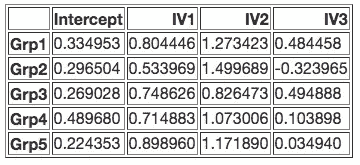

最后，我们还可以检验生成这些数据的“真实”系数。这些是我们希望我们的模型能够恢复的“正确答案”。由于这些数据是使用添加到每个人的数据中的噪声( *mu* = 0， *sigma* = 1)进行模拟的，并且个体之间存在差异(pymer4 的默认值为 *sigma* = 0.25)，因此我们不期望这些参数能够完美恢复，而是非常接近(我们将在下面对此进行更深入的探讨)。

```
# Regression coefficients for intercept, IV1, IV2, and IV3
print(f"True betas: {betas}") True betas: [0.18463772 0.78093358 0.97054762 0.45977883]
```

# 评估绩效

是时候评估一些建模策略了。对于每种模型类型，我将根据所述数据拟合模型，然后计算 3 个指标:

1.  **系数恢复的绝对误差** —这只是真实系数和估计系数之间的绝对值差之和。它给出了我们的模型相对于数据生成系数的总误差。我们可以计算平均值，而不是总和，但是由于我们的模拟数据都在相同的范围内，总和为我们提供了我们期望恢复的确切数量。
2.  **模型标准误差之和** —这个和下一个度量与我们想要对参数做出的推断更相关。SE 和相关的置信区间告诉我们在给定这种特定建模策略的情况下，估计值周围的总方差。同样，我们可以计算平均值，但是像上面一样，总和给出了所有参数的总方差。
3.  **模型 T-统计量之和** —这是我们的模型估计的 T-统计量的绝对值之和。这给了我们一种感觉，我们有多大可能带着这样的推断离开，即在我们的自变量和因变量之间有一种统计上显著的关系。在其他条件相同的情况下，较大的 t-stats 通常意味着较小的 p-值，因此我们可以建立一种直觉，了解我们的建模策略有多敏感，告诉我们“是的，这是一个统计上显著的影响。”

## 多层次模型

让我们从拟合一个多级模型开始，该模型指定了我们可以估计的所有可能参数的完整集合。这样做的效果是让每个人都有自己的一套回归估计，同时仍然将这些估计视为来自一个共同的分布。您可以在下面看到，我们可以很好地恢复参数，正如我们预期的那样，我们所有的结果都是“显著的”

```
# Fit lmer with random intercepts, slopes, and their correlations lmer = Lmer(formula + '+ (IV1 + IV2 + IV3 | Group)',data=data) lmer.fit(summarize=False) print(f"Absolute Error of Coef Recovery: {diffs(betas, lmer.coefs['Estimate'])}") print(f"Sum of Model Standard Errors: {lmer.coefs['SE'].sum()}") print(f"Sum of Model T statistics: {lmer.coefs['T-stat'].abs().sum()}")
```

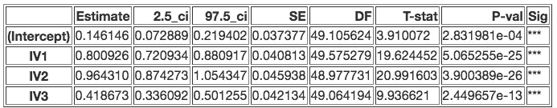

```
Absolute Error of Coef Recovery: 0.10582723675727804
Sum of Model Standard Errors: 0.16626160033359066
Sum of Model T statistics: 54.46274837271574
```

接下来，让我们看看当我们用最简单的“随机效应”结构拟合一个多级模型时会发生什么。请注意，由于不让每个人自由拥有自己的估计值(除了他们自己的均值/截距)，我们的系数恢复会下降一点，但我们的 t 统计量会显著增加。这看起来是由系数的方差估计(标准误差)非常小这一事实驱动的。在其他条件相同的情况下，我们更有可能使用更简单的，或者在这种情况下，“错误指定”的多水平模型来识别“显著”关系，因为我们知道数据是这样生成的，每个人实际上有不同的 BLUPs。

```
# Fit lmer with random-intercepts only 
lmer_mis = Lmer(formula + '+ (1 | Group)',data=data) lmer_mis.fit(summarize=False) print(f"Absolute Error of Coef Recovery: {diffs(betas,lmer_mis.coefs['Estimate'])}") print(f"Sum of Model Standard Errors: {lmer_mis.coefs['SE'].sum()}") print(f"Sum of Model T statistics: {lmer_mis.coefs['T-stat'].abs().sum()}")
```

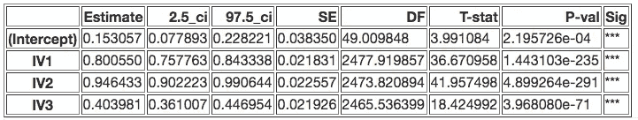

```
Absolute Error of Coef Recovery: 0.1311098578975485 
Sum of Model Standard Errors: 0.10466304433776347 
Sum of Model T statistics: 101.04453264690632
```

## 聚类稳健模型

接下来，让我们来评估聚类稳健误差建模方法。请记住，这涉及到估计一个单一的回归模型，以获得系数估计，但然后应用一个校正因子的 SEs，从而 t 统计量来调整我们的推论。看起来我们的系数恢复与上面的简单多层模型大致相同，但是由于较大的标准误差和较小的 t 统计量，我们的推断要保守得多。事实上，这些甚至比我们最初估计的完全指定的多级模型还要保守一点。

```
# Fit clustered errors LM 
lm = Lm(formula,data=data) lm.fit(robust='cluster',cluster='Group',summarize=False)print(f"Absolute Error of Coef Recovery: {diffs(betas,lm.coefs['Estimate'])}") print(f"Sum of Model Standard Errors: {lm.coefs['SE'].sum()}") print(f"Sum of Model T statistics: {lm.coefs['T-stat'].abs().sum()}")
```

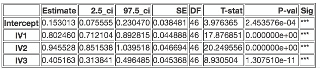

```
Absolute Error of Coef Recovery: 0.13278703905990247 
Sum of Model Standard Errors: 0.17543089877808005 
Sum of Model T statistics: 51.03327490657406
```

## 两阶段回归

最后，让我们使用两阶段回归法。我们将对 50 个人中的每个人进行单独的回归，然后对这 50 个系数进行另一次回归计算。在这个简单的例子中，我们实际上只是对这 50 个系数进行单样本 t 检验。请注意，我们的系数恢复比我们完全指定的多级模型好一点点，我们的推论(基于 T-stats 和 SEs)在很大程度上是相似的。这表明，对于这个特定的数据集，我们可以采用任何一种策略，并得出相同的结论。

```
# Fit two-stage OLS 
lm2 = Lm2(formula,data=data,group='Group') 
lm2.fit(summarize=False)print(f"Absolute Error of Coef Recovery: {diffs(betas, lm2.coefs['Estimate'])}") print(f"Sum of Model Standard Errors: {lm2.coefs['SE'].sum()}") print(f"Sum of Model T statistics: {lm2.coefs['T-stat'].abs().sum()}")
```

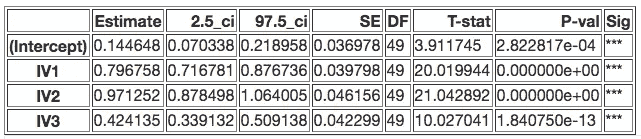

```
Absolute Error of Coef Recovery: 0.09216204521686983 
Sum of Model Standard Errors: 0.16523098907361963 
Sum of Model T statistics: 55.00162203260664
```

# 模拟一个宇宙。

现在，这只是一个特定的数据集，具有特定的大小和特定的个体差异水平。还记得上面概述的维度吗？我们想要回答的真正问题是，这些不同的建模策略在每个维度上是如何变化的。因此，让我们在这里扩展我们的模拟。让我们生成一个设置“网格”,这样我们就可以在合理的时间内模拟所有维度的组合。这是我们将尝试模拟的网格:

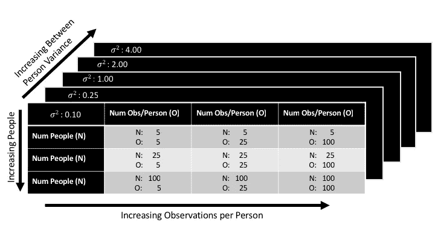

接下来，我们将从 5 到 100 改变*维度 1* 我们正在进行推理的单位的样本大小(人数)。遍历各个列，我们将改变*维度 2* ，即嵌套在我们正在进行推断的单元内的单元的样本大小(每人的观察次数)从 5 到> 100 不等。在 z 平面上，我们将改变*维度 3* 我们正在进行推理的单位之间的方差(人与人之间的可变性)从 0.10 - > 4 个标准差。

因为改变*维度 1* 和*维度 2* 应该有直观的意义(它们是我们数据样本大小的不同方面)，所以让我们探索一下改变*维度 3* 是什么样子的。这里的图表说明了改变个人之间的方差是如何影响系数的。下图描述了*人员水平系数*的分布；这些是我们上面讨论过的虚张声势。当模拟具有由截距和斜率(IV1)描述的两个参数的数据集时，请注意每个分布如何以参数的真实值为中心，但是随着组间方差的增加，分布的宽度也会增加。这些分布*是*我们的人员级别参数所来自的分布。因此，虽然它们的平均值是相同的，但它们越来越分散在这个值周围。随着这些分布变得更宽，如果数据集太小，恢复数据的真实系数变得更具挑战性，因为模型需要更多的数据来稳定它们的估计。

*为了简洁起见，我删除了下图的绘图代码，但我很乐意根据要求分享它们。*

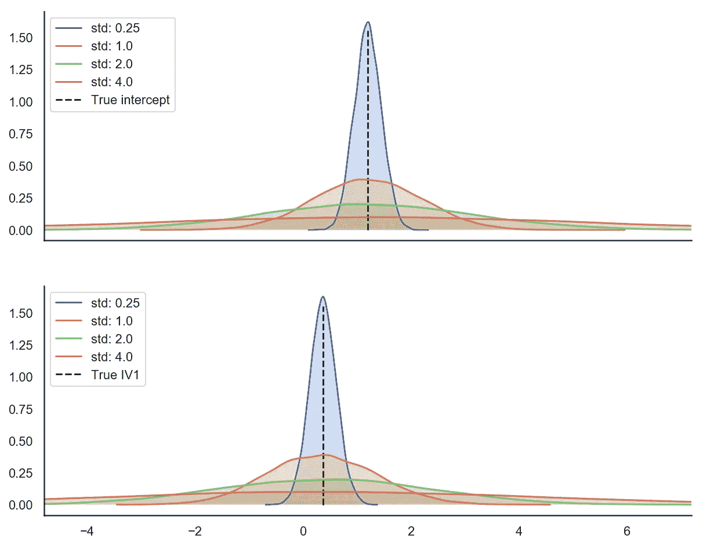

# 设置它

下一个代码块设置这个参数网格，并定义一些助手函数来计算上面定义的指标。由于这个模拟在 2015 四核 Macbook Pro 上运行大约需要 50 分钟，所以我还定义了一些函数来将每个模拟保存到 csv 文件中。

```
# Define the parameter grid 
nsim = 50 # Number of simulated datasets per parameter combination num_grps = [10, 30, 100] # Number of "clusters" (i.e. people) obs_grp = [5, 25, 100] # Number of observations per "cluster" grp_sigmas = [.1, .25, 1., 2., 4.] # Between "cluster" variance num_coef = 3 # Number of terms in the regression equation noise_params = (0, 1) # Assume each cluster has normally distributed noise seed = 0 # to repeat this simulation 
formula = 'DV ~ IV1 + IV2 + IV3' # The model formula # Define some helper functions. diffs() was used above examining each model in detail 
def diffs(a, b): 
    """Absolute error""" 
    return np.sum(np.abs(a - b)) def calc_model_err(model_type, formula, betas, data): 
    """ 
    Fit a model type to data using pymer4\. Return the absolute error     
    of the model's coefficients, the sum of the model's standard  
    errors, and the sum of the model's t-statistics. Also log if the 
    model failed to converge in the case of lme4\.     """     if model_type == 'lm': 
        model = Lm(formula, data=data)     
        model.fit(robust='cluster',cluster='Group',summarize=False) 
    elif model_type == 'lmer': 
        model = Lmer(formula + '+ (IV1 + IV2 + IV3 | Group)',data=data) 
        model.fit(summarize=False, no_warnings=True) 
    elif model_type == 'lmer_mis': 
        model = Lmer(formula + '+ (1 | Group)',data=data) 
        model.fit(summarize=False, no_warnings=True) 
    elif model_type == 'lm2': 
        model = Lm2(formula,data=data,group='Group')
        model.fit(n_jobs = 2, summarize=False) coef_diffs = diffs(betas, model.coefs['Estimate']) 
    model_ses = model.coefs['SE'].sum() 
    model_ts = model.coefs['T-stat'].abs().sum() 
    if (model.warnings is None) or (model.warnings == []): 
        model_success = True 
    else: 
        model_success = False 
    return coef_diffs, model_ses, model_ts, model_success, model.coefs def save_results(err_params, sim_params, sim, model_type, model_coefs, df, coef_df, save=True): 
    """Aggregate and save results using pandas"""     model_coefs['Sim'] = sim 
    model_coefs['Model'] = model_type 
    model_coefs['Num_grp'] = sim_params[0] 
    model_coefs['Num_obs_grp'] = sim_params[1] 
    model_coefs['Btwn_grp_sigma'] = sim_params[2] 

    coef_df = coef_df.append(model_coefs) 

    dat = pd.DataFrame({
        'Model': model_type,
        'Num_grp': sim_params[0],
        'Num_obs_grp': sim_params[1],
        'Btwn_grp_sigma': sim_params[2], 
        'Coef_abs_err': err_params[0], 
        'SE_sum': err_params[1], 
        'T_sum': err_params[2], 
        'Fit_success': err_params[3], 
        'Sim': sim
     }, index = [0]) df = df.append(dat,ignore_index=True) 
    if save: 
        df.to_csv('./sim_results.csv',index=False) 
        coef_df.to_csv('./sim_estimates.csv') 
    return df, coef_df # Run it results = pd.DataFrame() 
coef_df = pd.DataFrame() 
models = ['lm', 'lm2', 'lmer', 'lmer_mis'] 
for N in num_grps: 
    for O in obs_grp: 
        for S in grp_sigmas: 
            for I in range(nsim): 
                data, blups, betas = simulate_lmm(O, num_coef, N, grp_sigmas=S, noise_params=noise_params) 
                for M in models: 
                    c, s, t, success, coefs, = calc_model_err(M, formula, betas, data) 
                    results, coef_df = save_results([c,s,t, success], [N,O,S], I, M, coefs, results, coef_df)
```

# 结果

*为了简洁起见，我删除了下图的绘图代码，但我很乐意根据要求分享它们！*

## 系数恢复

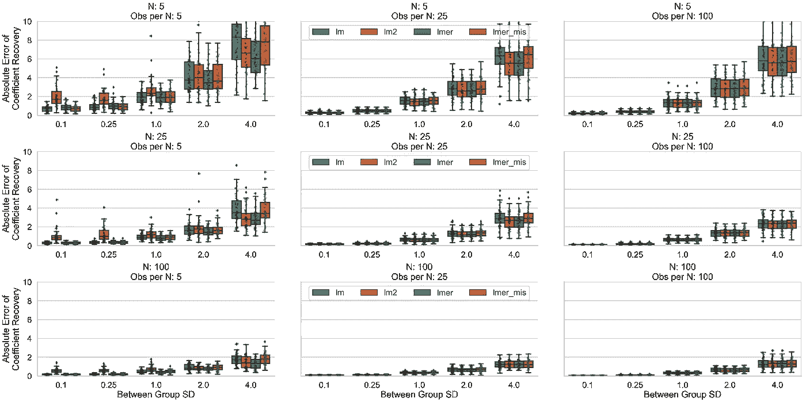

好，让我们先看看我们的系数恢复。如果我们从网格的左上往下看，首先要跳出来的是，当我们增加总体样本量(聚类数*每个聚类的观察数)时，我们的聚类间可变性为中到低，*所有的*模型类型在恢复真实数据生成系数方面做得同样好。换句话说，在良好的条件下(大量数据不太多变)，我们选择任何分析策略都不会出错。相反，从左下方到右上方，当聚类之间的可变性很高时，我们很快看到拥有*更多聚类*而不是每个聚类更多观测值的重要性；如果没有足够的聚类来观察，即使是完全指定的多级模型也不能很好地恢复真实系数。

当我们有小到中等规模的数据集和大量的聚类之间的可变性时，所有模型往往在恢复真实系数方面表现不佳。有趣的是，每个聚类(最左边的列)的观测值特别少会不成比例地影响两阶段回归估计(橙色箱线图)。这与 [Gelman，2005](http://www.stat.columbia.edu/~gelman/research/published/459.pdf) 的观点是一致的，他认为，由于每个聚类的观测值很少，第一级 OLS 估计值非常差，具有高方差，并且没有多级建模的好处来帮助抵消这种情况。这种情况似乎也最有利于完全指定的多级模型(绿色方框图)，特别是当聚类之间的可变性很高时。有趣的是，在这种情况下，集群健壮和错误指定(简单)的多级模型似乎表现相似。

在中等数据情况下(中间列),聚类稳健模型似乎在恢复系数方面表现稍差。这很可能是因为估计值完全忽略了数据的聚类性质，并且没有通过平均(在两阶段回归模型的情况下)或通过随机效应估计(在多级模型的情况下)对其进行平滑/正则化。

最后，在每个聚类的高观测值的情况下(最右边的列)，所有模型似乎表现得非常相似，这表明当我们密集地对感兴趣的单元进行采样(每个聚类的观测值增加)时，每种建模策略都与任何其他策略一样好，即使希望对聚类本身进行推断。

# 做出推论(SEs + T-stats)

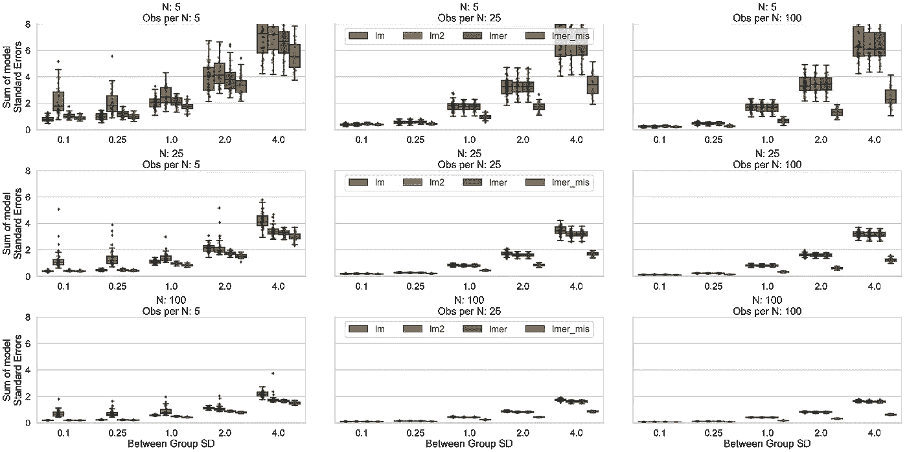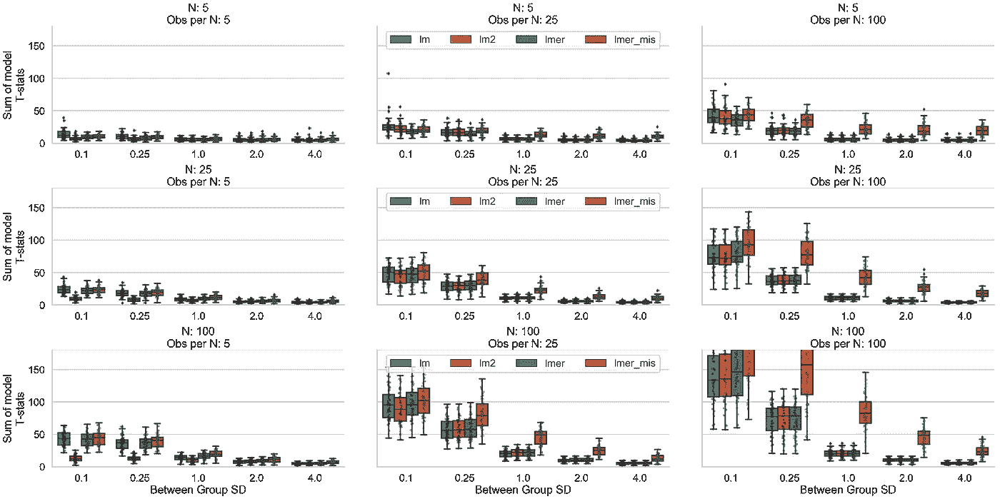

接下来，让我们看看标准误差和 t-统计量，看看我们的推断可能如何变化。组间方差的增加对 SEs 和 t-stats 值有非常显著的影响，通常使其不太可能识别统计显著性关系，无论数据大小如何。有趣的是，两阶段回归模型在每个聚类的观测值很少的情况下表现出较差的系数恢复，它们用较高的标准误差估计来弥补。我们可以看到，在这些情况下，他们的 t-统计量较低，这表明在这些情况下，这种方法可能会使天平倾向于较低的假阳性，较高的假阴性推断。然而，与其他模型类型不同，它们不一定受益于总体上*更多的集群*(左下图)，并且冒着[假阴性](https://www.wikiwand.com/en/False_positives_and_false_negatives)水平膨胀的风险。错误指定的多水平模型似乎具有相反的性质:在大多数情况下，它们具有较高的 t-stat 和较低的 SEs，具有中到高的类间可变性，并且在每个类具有大量观察值的情况下受益最多。这表明，在其他模型可能表现得更保守，但也可能在面临高簇间方差时对检测真实关系更敏感的情况下，它们可能会冒引入更多假阳性的风险。他们似乎也从星团内越来越多的*观测中获益最多。从聚类稳健和完全指定的多水平模型的推论似乎在很大程度上是可比的，这与这些模型类型在多个文献中的广泛使用是一致的。*

# 额外好处:当完全指定的多级模型失败时

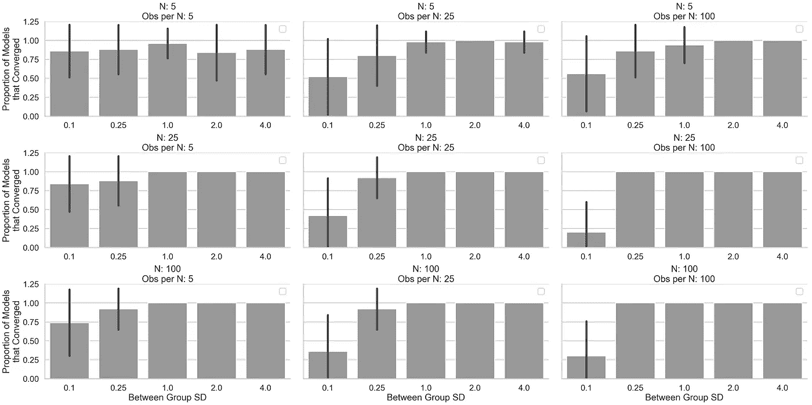

最后，我们可以简单地看一下，对于我们完全指定的多层模型，什么情况最常导致收敛失败(注意:前面检查的简单多层模型在这些模拟中从未失败过)。一般来说，这似乎发生在聚类之间的可变性较低时，或者每个聚类的观察数量很少时。这是有意义的，因为即使数据是以多级方式生成的，聚类也是非常相似的，并且通过丢弃试图以有意义的方式对数据可能不显示的方差进行建模的项来简化模型(例如，丢弃“随机斜率”)总体上实现了更好的估计。换句话说，模型可能试图拟合一个足够小的方差参数，以使其在达到适当小的误差变化之前用完优化器迭代。这就像通过比较你当前台阶的高度和前一个台阶的高度，试图[在一个坡度很小的“小山”上找到最低点](/gradient-descent-d3a58eb72404)。

# 结论

那么我们学到了什么？以下是我认为这个练习有助于充实的一些直觉:

*   当每个聚类有足够的观测值时，保留两阶段回归。这是因为在没有多级建模所施加的任何类型的平滑/正则化/先验的情况下单独对每个聚类进行建模，在这些情况下会产生较差的第一级估计。
*   小心使用错误指定/简单的多级模型。虽然它们可以消除指定模型的“随机效应”部分所涉及的一些复杂性，并且它们几乎总是收敛，但相对于其他方法(所有其他条件都相同)，它们更有可能导致具有统计意义的推论。如果您的数据没有表现出足够的集群间差异，这可能是有保证的。一般来说，最好是指定一个模型结构，该结构考虑了与感兴趣的预测值混淆的方差( [Barr 等人，2013](https://www.ncbi.nlm.nih.gov/pmc/articles/PMC3881361/) )(即，去掉随机截距和随机斜率之间的相关项，而不是去掉随机斜率)，换句话说，就是你可以得到的最“最大”的结构，这与你想要对数据做出的推断有关。
*   如果您的主要目标是进行推理，并且您可以接受比其他方法精度稍低的系数估计，那么聚类稳健模型似乎是一种有效的解决方案。如果数据中存在多个聚类级别(例如，个人内、城市内、州内等的调查回答)，或者项目级别的影响是否重要，则更难确定( [Baayen 等人，2008](http://www.sfs.uni-tuebingen.de/~hbaayen/publications/baayenDavidsonBates.pdf) )。然而，有一些技术可以合并双向或多向群集鲁棒性误差，这种方法在经济学中相当常见。[本讲座](https://www.stata.com/meeting/boston10/boston10_baum.pdf)和[本论文](https://www.nber.org/papers/t0327.pdf)将进一步讨论这些方法。本文使用的 Pymer4 只实现了单向集群。
*   考虑使用两阶段最小二乘法或聚类稳健误差，而不是错误指定的多层模型，因为您的推理可能在很大程度上类似于成功收敛的完全指定的多层模型。如果需要考虑项目级别的差异或多级别的聚类，这可能是不正确的，但对于本文中说明的相对简单的情况，它们似乎很好。
*   一般来说，模拟是建立统计直觉的有用方法，尤其是当背景数学令人畏惧的时候。这是我更深入地学习统计概念的首选方法之一，并使阅读大量数学形式的文献变得更加容易。

## 警告和注意事项

我不想在结束这篇文章时感觉我们已经想通了一切，现在是专家分析师了，而是意识到这个练习有一些限制，值得记住。虽然我们可以建立一些一般的直觉，但在某些情况下，这些直觉可能并不总是成立，意识到这些直觉非常重要:

*   在许多方面，这些模拟中生成的数据对于试验这些不同的方法来说是“理想的”。数据点都在相同的范围内，来自具有已知均值和方差的正态分布，不包含缺失的数据点，并且符合未讨论的这些统计方法的其他基本假设。
*   同样，我将“真实关系”内置到数据中，然后试图恢复它们。我在整篇文章中提到了假阳性和假阴性，但我没有正式估计这些方法的假阳性或假阴性率。同样，这是为了给你留下一些一般的直觉，但有几篇论文利用这种方法更明确地为某些推理技术的使用辩护(例如 [Luke，2017](https://www.ncbi.nlm.nih.gov/pubmed/27620283) )。
*   我们探索的参数空间(即我们数据的不同“维度”)跨越了一个范围，我认为这个范围合理地涵盖了在实证社会科学实验室研究中经常收集的各种数据集。在现实世界中，数据要混乱得多，而且越来越大。越多的数据几乎总是越好，特别是如果它是高质量的，但是基于一个人想要做出的推论，质量的构成可能是非常不同的。有时聚类之间的高可变性是可取的，其他时候密集地对一小组聚类进行采样更重要。这些因素会根据一个人试图回答的问题而变化。
*   我选择用来评估每个模型的指标只是我想知道的。当然，根据您想要建立的直觉，还有其他或多或少能提供信息的指标。比如每个模型的预测精度如何？

# 结论

我希望这对外面的一些人有用，即使没有用，它也确实帮助*我*建立了一些关于可用的不同分析策略的直觉。此外，我希望，如果没有别的事情，这可能会激励那些觉得自己在统计/机器学习方面接受的正规培训有限的人，采取一种更修补/黑客的方法来进行自己的学习。我记得当我还是个孩子的时候，打碎东西并把它们拆开是我最喜欢的了解事物工作原理的方式之一。随着像 scientific Python 和 R 这样的免费开源工具的大量出现，我看不出有什么理由统计教育不能一样。

## 附录

这是一本[不错的快速指南](https://www.reed.edu/economics/parker/s11/312/notes/Notes13.pdf)，它定义了不同领域的许多术语，并以更简洁的方式回顾了这里涉及的许多概念(还有更多)。对于感兴趣的人，使用 [lmerTest R 软件包](https://cran.r-project.org/web/packages/lmerTest/index.html)计算多级模型的 p 值，使用 Satterthwaite 近似法计算自由度；请注意，基于指定的随机效应结构，这些自由度可能会发生显著变化。其他模型类型的 p 值是使用标准 t 分布计算的，但是 [pymer4 也为其他类型的推理提供了](http://eshinjolly.com/pymer4/usage.html)非参数排列测试和可靠的置信区间。在撰写本文时，拟合两阶段回归模型仅在 github 的[开发分支中可用，但应该会在未来的新版本中包含。](https://github.com/ejolly/pymer4/tree/dev)

*注释和更正*

1.  在这篇文章的前一个版本中，这种方法被错误地称为两阶段最小二乘法(2SLS)。2SLS 是一种完全不同的技术的正式名称，属于[工具变量估计](https://www.wikiwand.com/en/Instrumental_variables_estimation#/Interpretation_as_two-stage_least_squares)的更广泛范围。这种混淆是因为上面讨论的两阶段回归方法在技术上确实采用了普通最小二乘估计的“两阶段”,然而这并不是文献中的 2SLS。感谢 [Jonas Oblesser](http://jonasobleser.com/) 指出这一点，并感谢 [Stephen John Senn](http://www.senns.demon.co.uk/home.html) 使用适当的术语，这些术语实际上在医学和 fMRI 文献中是一致的。
2.  虽然在本文中(通常在文献中),两阶段甚至多层次建模和聚类稳健推理被视为两种*不同的*可能的分析策略，但另一种可能性涉及*结合*这些方法。即，使用多级模型或两阶段回归来获得系数估计，然后在执行推断时计算最高级别系数的稳健标准误差。感谢詹姆斯·e·普斯特约夫斯基提出这个经常被忽视的选项。

Eshin Jolly 2019

*原载于 2019 年 2 月 18 日*[*【eshinjolly.com】*](http://eshinjolly.com/2019/02/18/rep_measures/)*。*