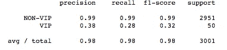

# 不平衡数据集上不同分类机器学习模型的比较

> 原文：<https://towardsdatascience.com/comparing-different-classification-machine-learning-models-for-an-imbalanced-dataset-fdae1af3677f?source=collection_archive---------1----------------------->

如果一个数据集包含来自一个类的样本比来自其余类的样本多得多，则称之为不平衡数据集。当至少一个类仅由少量训练样本(称为少数类)表示，而其他类占大多数时，数据集是不平衡的。在这种情况下，由于较大的多数类的影响，分类器可以对多数类具有良好的准确性，但对少数类的准确性非常差。这种数据集的常见示例是信用卡欺诈检测，其中欺诈= 1 的数据点通常比欺诈= 0 的数据点少得多。

数据集可能不平衡的原因有很多:第一个目标类别在人群中可能非常罕见，或者数据可能很难收集。

让我们通过处理一个这样的数据集来解决不平衡数据集的问题。

**关于数据:**我这里是一家游戏公司的数据，他们想知道哪个客户会成为 VIP 客户。这里的目标变量有两个值:0(代表非 VIP 客户)和 1(代表 VIP 客户)。在可视化该目标列时，我们可以从下面的饼图中看到，只有 1.5%的数据是 VIP 客户的，其余 98.5%的数据是非 VIP 客户的。


**Distribution of Majority and Minority Class**


**First few rows of the dataset**

如果我们使用这些数据来训练我们的预测模型，那么该模型将表现不佳，因为该模型没有在代表 VIP 客户的足够数量的数据上进行训练。为了演示如果我们使用这些数据，预测模型的结果会如何，下面是一些算法的结果:


**Results from the k-NN Algorithm**


**Results from the Gradient Boosting Algorithm**


**Results from the Logistic Regression Algorithm**

从上面的结果可以清楚地看出，机器学习算法几乎无法预测 VIP 客户(因为 VIP 客户的 f1 分数非常低)。

在监督学习中，克服类别不平衡问题的一种常见策略是对原始训练数据集进行重新采样，以降低类别不平衡的整体水平。重采样是通过对少数(正)类进行过采样和/或对多数(负)类进行欠采样来完成的，直到这些类被近似相等地表示。

在使用不同的重采样技术之前，需要记住的最重要的一点是**所有的重采样操作都必须只应用于训练数据集**。如果在将数据集分割成训练集和验证集之前进行上采样，则可能在两个数据集中得到相同的观察结果。因此，当在验证集上进行预测时，机器学习模型将能够完美地预测这些观察值，从而提高准确性和召回率。

重采样技术的类型:

**欠采样/下采样:**该方法使用多数类的子集来训练分类器。由于许多多数类示例被忽略，训练集变得更加平衡，训练过程变得更快。最常见的预处理技术是随机多数欠采样(RUS)，在 RUS，多数类的实例从数据集中随机丢弃。下面是实现缩减采样的 python 代码

```
from sklearn.utils import resampledf_majority_downsample = resample(df_majority, 
                                 replace=True,     
                                 n_samples=105,    
                                 random_state=123) 
df_train = pd.concat([df_majority_downsample, df_minority_upsampled])

# Display new class counts
print (df_train.IsVIP_500.value_counts())**Output:** 0    105
1    105
Name: IsVIP_500, dtype: int64
```

**过采样:**它通过复制少数类实例来实现更均衡的类分布。过采样不会丢失任何信息，因为少数类和多数类的所有原始实例都保留在过采样数据集中。下面是实现上采样的 python 代码。

```
df_minority_upsampled = resample(df_minority, 
                                 replace=True,     
                                 n_samples=5000,    
                                 random_state=123) 
df_train = pd.concat([df_majority, df_minority_upsampled])

# Display new class counts
print (df_train.IsVIP_500.value_counts())**Output:** 0    6895
1    5000
Name: IsVIP_500, dtype: int64
```

尽管这两种方法都解决了阶级不平衡的问题，但它们也有一些缺点。随机欠采样方法可能会删除某些重要的数据点，而随机过采样可能会导致过拟合。

**SMOTE:** 合成少数过采样技术被设计用来生成与少数类分布一致的新样本。主要思想是考虑样本之间存在的关系，并沿着连接一组邻居的线段创建新的合成点。下面是实现 SMOTE 的 python 代码。

```
**#SMOTE**
from imblearn.over_sampling import SMOTE
import numpy as np sm = SMOTE(random_state=12)
x_train_res, y_train_res = sm.fit_sample(X_train, Y_train)print (Y_train.value_counts() , np.bincount(y_train_res))**Output: 
#previous distribution of majority and minority classes**0    6895
1     105#**After SMOTE, distirbution of majority and minority classes**
0    6895
1    6895
```

现在我们的数据已经准备好了，让我们在 SMOTE 创建的数据集上应用一些机器学习算法。我尝试了以下算法:Logistic 回归，K 近邻，梯度推进分类器，决策树，随机森林，神经网络。以下是最高性能的机器学习算法的结果和解释:

**随机森林:**基本思想与 bagging 非常相似，我们引导样本，因此我们对训练数据集进行重新采样。然后我们在每个引导样本上重建分类或回归树。一个区别是，在每次拆分时，当我们在分类树中每次拆分数据时，我们也引导变量。换句话说，在每次潜在拆分时，只考虑变量的子集。这有助于建立一系列不同的潜在树木。所以我们的想法是种植大量的树木。对于预测，我们要么投票，要么对这些树进行平均，以获得对新结果的预测。下面是实现随机森林分类器的 python 代码。

```
from sklearn.ensemble import RandomForestClassifiermodel = RandomForestClassifier(n_estimators=1000)
model.fit(x_train_res , y_train_res)
y_pred = model.predict(X_test)
target_names = ['NON-VIP', 'VIP']
print(classification_report(Y_test, y_pred,target_names=target_names))
```


**The result of the Random Forest applied to dataset derived from SMOTE**

**梯度增强:**与并行构建和组合随机不同树的森林的随机森林方法不同，梯度增强决策树的关键思想是它们构建一系列树。其中每棵树都被训练，以便它试图纠正系列中前一棵树的错误。以非随机的方式构建，创建一个模型，随着树的增加，错误越来越少。模型建立后，使用梯度增强树模型进行预测速度很快，并且不会占用太多内存。下面是实现梯度增强分类器的 python 代码。

```
model_GB = GradientBoostingClassifier(n_estimators=1000)
model_GB.fit(x_train_res , y_train_res)
y_pred = model_GB.predict(X_test)
target_names = ['NON-VIP', 'VIP']
print(classification_report(Y_test, y_pred,target_names=target_names))
```


**The result of the Gradient Boosting applied to dataset derived from SMOTE**

**Ada Boost:** 这是一种迭代集成方法。AdaBoost 分类器通过组合多个性能较差的分类器来构建一个强分类器，以获得高精度的强分类器。Adaboost 背后的基本概念是设置分类器的权重，并在每次迭代中训练数据样本，以确保对异常观察值的准确预测。下面是实现 Ada Boost 分类器的 python 代码。

```
from sklearn.ensemble import AdaBoostClassifiermodel_ad = AdaBoostClassifier()
model_ad.fit(x_train_res , y_train_res)
y_pred = model_GB.predict(X_test)
target_names = ['NON-VIP', 'VIP']
print(classification_report(Y_test, y_pred,target_names=target_names))
```



**The result of the Ada Boosting applied to dataset derived from SMOTE**

**注意:**预测准确性，一种评估分类器性能的流行选择，在数据不平衡时可能不合适。不应该使用它，因为它不能提供真实的情况。例如，模型的准确度可能是 97%,并且人们可能认为该模型表现得非常好，但是实际上，该模型可能仅预测多数类，并且如果该模型的主要目的是预测少数类，则该模型是无用的。因此，应该使用召回率、精确度和 f1 分数来衡量模型的性能。

**结论:**到目前为止，我们看到，通过对不平衡数据集进行重新采样，并选择正确的机器学习算法，我们可以提高少数类的预测性能。我们性能最好的模型是 Ada，梯度增强在使用 SMOTE 合成的新数据集上运行。使用这些模型，我们为少数民族类获得了 0.32 的 f1 分数，而使用原始数据以及逻辑和 k-nn 等算法，少数民族类的 f1 分数为 0.00

**进一步改进:**为进一步改进模型，可考虑以下选项:

1.  尝试使用 SMOTE 的变体。
2.  超参数(学习率、最大深度等)的调整。)以上型号。
3.  此外，可以使用不同的机器学习模型，如堆叠或混合机器学习算法、深度学习模型。

谢谢，学习愉快:)