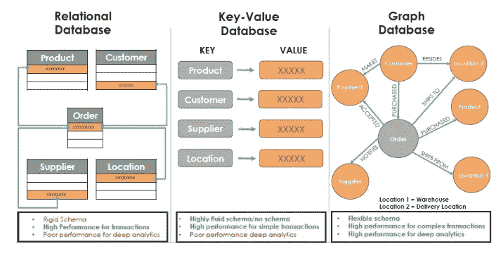
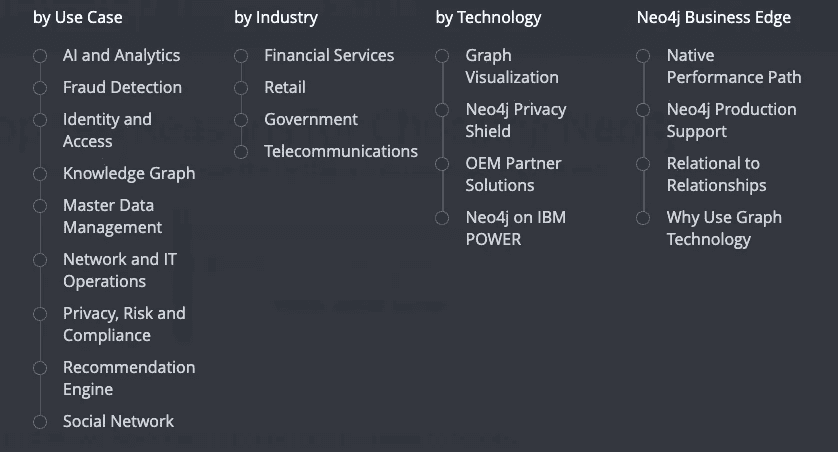

# 比较图形数据库 I

> 原文：<https://towardsdatascience.com/comparing-graph-databases-5475bdb2e65f?source=collection_archive---------1----------------------->

第 1 部分:TigerGraph，Neo4j，亚马逊 Neptune

Oooh. Aaah.

**简介**

关系数据库具有分类帐式的结构。可以通过 SQL 查询，而且是大多数人熟悉的。每个条目由表中的一行组成。表通过外键约束相关联，这是将一个表的信息与另一个表的信息连接起来的方式，就像主键一样。在查询关系数据库时，通常会涉及到缓慢的多层连接。

对于一个图形，特别是散点图，可以把元素想象成节点或点。线图的元素同样由顶点表示。每个节点都有键值对和一个标签。节点由关系或边连接。关系有类型和方向，它们可以有属性。图形数据库简单地由点和线组成。当意义在于数据之间的关系时，这种类型的数据库更简单、更强大。关系数据库可以轻松处理直接关系，但间接关系在关系数据库中更难处理。

当构建关系数据库时，它是带着问题构建的。我们想要回答什么样的问题？例如，您想知道有多少人购买了烤面包机，住在堪萨斯州，有犯罪记录，并使用优惠券购买了该烤面包机。如果数据库管理员或创建数据库的人没有预料到这样的问题，那么从关系数据库中检索信息可能会非常困难。对于图形数据库，回答意料之外的问题是可能的。有了图，你就可以回答任何问题，只要数据存在，数据之间有路径。图是用来遍历间接关系的。使用图形数据库，您甚至可以添加更多的关系，同时仍然保持性能。图形数据库不仅仅是存储数据点，而是存储数据关系。图形数据库存储关系信息。

[https://www.nextplatform.com/2018/09/19/the-graph-database-poised-to-pounce-on-the-mainstream/](https://www.nextplatform.com/2018/09/19/the-graph-database-poised-to-pounce-on-the-mainstream/)

我将简要描述**一些最流行的图数据库实现的优缺点:**

*   老虎图
*   Neo4j
*   亚马逊海王星

这是外面的一个例子。看看这里更多的选项:【https://db-engines.com/en/ranking/graph+dbms 

# TigerGraph —“一个完整的分布式并行图形计算平台，支持网络规模的实时数据分析”

 [## 家用老虎记录仪

### 通过其固有的并行图形技术，TigerGraph 成为世界上速度最快、扩展性最强的图形平台…

www.tigergraph.com](https://www.tigergraph.com/) 

一个完整的分布式并行图形计算平台，支持网络规模的实时数据分析

2017 年发布，这是一个图形数据库的商业选项。它的实现语言是 C++，但也支持 Java。它的操作系统是 Linux，查询是通过一种类似 SQL 的查询语言 GSQL 进行的。

TigerGraph 的加载时间比主要竞争对手 Neo4j 要长。考虑到预处理时间，TigerGraph 其实比 Neo4j 要快。TigerGraph 之所以高效，是因为它需要的存储空间比 Neo4j 少 19.3 倍。TigerGraph 在一跳路径查询上比 Neo4j 快 24.8 倍。在三跳路径查询上，TigerGraph 比 Neo4j 快 1，808.43 倍。TigerGraph 还能够完成六跳路径查询。这种类型的处理会在 2 小时后杀死 Neo4j，因为它耗尽了内存。

TigerGraph 在体验上所欠缺的，似乎在资源上有所弥补。就性能而言，TigerGraph 似乎在竞争中胜出，但这是有代价的。TigerGraph 的成本不取决于性能或核心或插槽的数量，而是取决于放入图形数据库的数据大小。50-100 GBS 的图形年费为数万美元，1 TB 的图形年费接近 100 万澳元。

2019 年 9 月推出的 TigerGraph Cloud 上的免费层选项可用。还有一种按小时付费的模式，每小时几美元起。它根据性能定价，虚拟 CPU 和 RAM 越大的实例成本越高，客户可以启动和停止实例，只需按小时支付所需费用。下面是关于这些定价选项的详细信息的链接。

[https://www.tigergraph.com/tigergraph-cloud-pricing](https://www.tigergraph.com/tigergraph-cloud-pricing)/

 [## 半 TB 基准测试 Neo4j 与 TigerGraph - DZone 数据库

### 图形数据库已经变得越来越流行，受到了越来越多的关注。为了了解图表如何…

dzone.com](https://dzone.com/articles/half-terabyte-benchmark-neo4j-vs-tigergraph) 

# neo4j——“开源图形数据库”

Neo4j 创建于 2007 年，被 db-engines.com 评为排名第一的图形数据库。Neo4j 是开源的，支持多种编程语言，包括:。Net、Clojure、Elixir、Go、Groovy、Haskell、Java、JavaScript、Perl、PHP、Python、Ruby、Scala。服务器操作系统有 Linux、OS X、Solaris 和 Windows。

Neo4j 拥有最受欢迎和最活跃的图形数据库社区。评论报告称，他们的产品简单易学，易于使用，有大量的资源，从培训材料到书籍。Neo4j 已经为他们的用户提供了大量的资源。Neo4j 提供了一种新的查询语言 Cypher，并正在将其引入 Spark。Neo4j 声称 Cypher 是一种与 Spark 上的图形数据进行交互的更方便的方式。Neo4j 带来了 ETL、分析和改进的性能。谈到 ETL，Neo4j 提供了一个新的工具，可以自省关系模式并自动提取 CSV。

为了跟上 TigerGraph，Neo4j 确实需要跨越一些性能障碍，但它仍然拥有所有图形数据库中最大的追随者和支持网络。

使用 Neo4j 构建的应用程序可应对互联数据挑战，包括人工智能、欺诈检测、实时推荐和主数据。

Solutions by Neo4j

Neo4j 还有一个即将到来的活动:Nodes 2019。去他们网站注册。还有一个黑客马拉松，你现在就可以参加！投稿截止时间为 2019 年 9 月 29 日。

[https://neo4j.com/](https://neo4j.com/)

# Amazon Neptune —“为云构建的快速、可靠的图形数据库”

 [## Amazon Neptune -为云构建的快速、可靠的图形数据库

### 为云构建的快速、可靠的图形数据库 Amazon Neptune 是一个快速、可靠、完全托管的图形数据库…

aws.amazon.com](https://aws.amazon.com/neptune/) 

与 TigerGraph 类似，亚马逊 Neptune Graph 数据库于 2017 年首次亮相，并已商用。服务器操作系统托管，支持的编程语言有 C#、Go、Java、JavaScript、PHP、Python、Ruby、Scala——范围比 TigerGraph 更广。Neptune 正在努力实现高可用性和耐用性。“这相当于 1000 亿个节点/边/三元组，同时跨三个可用性区域(az)自动复制六份数据拷贝，并将数据持续备份到 S3。AWS 还表示，Neptune 旨在提供超过 99.99%的可用性，并在不到 30 秒的时间内自动检测和恢复大多数数据库故障。因此经久耐用！Neptune 还提供高级安全功能，包括通过亚马逊虚拟专用云(VPC)的网络安全和使用 AWS 密钥管理服务(KMS)的静态加密

海王星因其双重性而与众不同。它能够支持[流行的图形数据库模型、RDF 和属性图](https://www.zdnet.com/article/graph-databases-and-rdf-its-a-family-affair/) (PG)。这个优势是一把双刃剑，因为你不能互换使用。AWS 的目标是统一这两种模式，但这是一个相当大的挑战，因为差异不是微不足道的。

 [## AWS Neptune going GA:图形数据库用户和供应商的好、坏、丑

### 这是官方的:AWS 有一个生产就绪的图形数据库。今天包括哪些功能，将来会包括哪些功能…

www.zdnet.com](https://www.zdnet.com/article/aws-neptune-going-ga-the-good-the-bad-and-the-ugly-for-graph-database-users-and-vendors/) 

要查看这三个数据库系统的更详细的比较，以及更多信息，请访问 db-engines.com 查看这个伟大的资源:

 [## 亚马逊 Neptune vs. Neo4j vs. TigerGraph 对比

### 亚马逊海王星和 Neo4j 和 TigerGraph 的详细并排视图

db-engines.com](https://db-engines.com/en/system/Amazon+Neptune%3BNeo4j%3BTigerGraph) 

[https://go.neo4j.com/rs/710-RRC-335/images/Neo4j_Top5_UseCases_Graph%20Databases.pdf?_ga=2.207757714.1801832360.1568339707-627908135.1568169436&_gac=1.162527566.1568339709.Cj0KCQjw2efrBRD3ARIsAEnt0ejjkZFqyPis1FZYBcFhcri-pmqOhZtG0xSlF2vdwMJhIffenZMIYBIaAqf2EALw_wcB](https://go.neo4j.com/rs/710-RRC-335/images/Neo4j_Top5_UseCases_Graph%20Databases.pdf?_ga=2.207757714.1801832360.1568339707-627908135.1568169436&_gac=1.162527566.1568339709.Cj0KCQjw2efrBRD3ARIsAEnt0ejjkZFqyPis1FZYBcFhcri-pmqOhZtG0xSlF2vdwMJhIffenZMIYBIaAqf2EALw_wcB)

# 图形数据库的应用

*   欺诈检测
*   实时推荐引擎
*   主数据管理
*   支持网络和 IT 运营
*   身份和访问管理

# 进一步阅读

下面是一个链接，你可以在那里下载一本免费的书籍《T1》，即奥赖利的《T2》图表数据库。

 [## O'Reilly 图形数据库- Neo4j 图形数据库平台

### 编辑描述

neo4j.com](https://neo4j.com/lp/book-graph-databases-rem/?utm_source=google&utm_medium=ppc&utm_campaign=*NA%20-%20Display%20-%20Remarketing%20-%20O%27Reilly%20Book%20-%20Text&utm_adgroup=*NA%20-%20Display%20-%20Remarketing%20-%20O%27Reilly%20Book%20-%20All%20Users&utm_placement=www.analyticsvidhya.com&gclid=Cj0KCQjw2efrBRD3ARIsAEnt0ejjkZFqyPis1FZYBcFhcri-pmqOhZtG0xSlF2vdwMJhIffenZMIYBIaAqf2EALw_wcB)